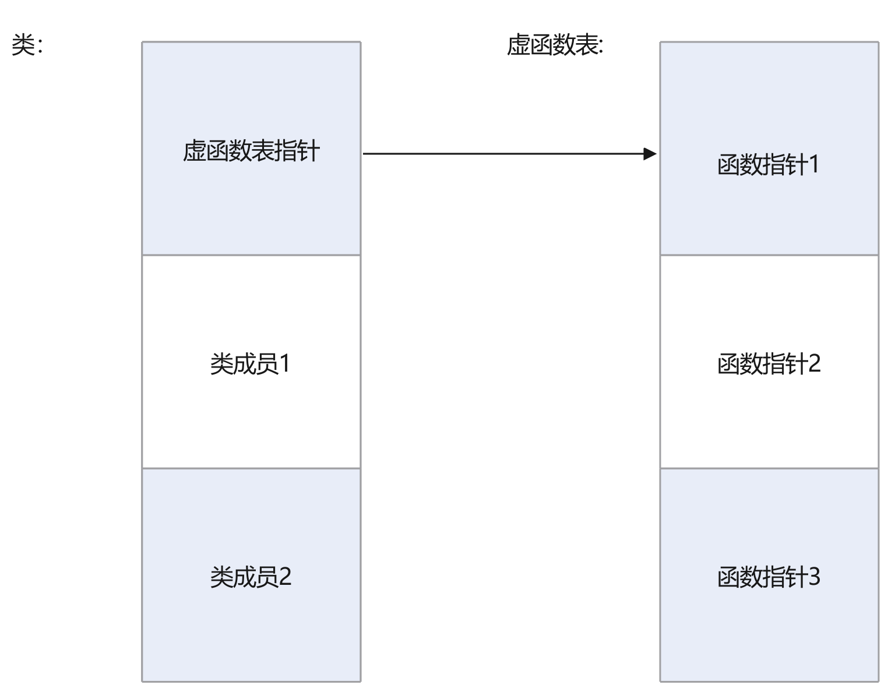

## inline

### inline适合的地方：

1. 只有几行的函数。三四十行的就不适合了
2. 频繁调用的函数。。。

成员函数也是内联函数，成员函数即：body写在类里面的函数

eg：

```C++
class Test {
	void print() {
		int num = 10;
	}
}
```

还有这种方式也可以被编译为inline，函数直接写在类下面并用inline修饰

```c++
class Test {
	void print();
}

inline void Test::print()
{
	int num = 0;
}
```

## const

C、C++这里是变量会分配内存，不是常数，但是下面这个情况是存在代码区

```
char* string = "test";
const char* string2 = "test2";
```

第二种，对对象const，const后，只允许对const类型的成员函数进行调用，这里面有一个点：

这种形式：

```
void func() const {}
```

其实等于，即this不可变：

```
void func(const class_obj* this) {}
```


```c++
#include <iostream>
#include <stdio.h>

using namespace std;

class MyClass
{
public:
	MyClass();
	~MyClass();
	int i;
	void func() {
		cout << "func()" << endl;
	}
	void func() const {
		cout << "func() const" << endl;
	}
	void func(int num) {
		i = num;
	}
private:

};

MyClass::MyClass()
{
	this->i = 10;
}

MyClass::~MyClass()
{
}

int main()
{
	const MyClass temp;
	// temp.func(10);	// 不允许，此函数非const类型
	return 0;
}
```


## 引用

### 类的成员是refrencese

没办法初始化，只能声明

必须在构造函数的initial list中进行初始化

```c++
class A
{
public:
    A(int& num) : num(num)
    {

    }
    A();
	~A();
    void change_val(int& num)
    {
        num = this->num;
    }
private:
    int& num;
};
```


## 多态

当类中出现了虚函数，那么析构函数也应该为虚函数，因为不知道子类什么override了父类，如果父类析构函数不是虚函数，那么当子类override后的函数就会没有析构掉 

### 对虚函数表的使用洛阳铲挖掘

数据结构（但是析构函数是虚函数时可能不是，虚析构函数没用裸指针验真出来）：



```c++
#include <iostream>

using namespace std;

class Base {
public:
    // 基类的虚析构函数
    ~Base() {
        std::cout << "Base Destructor\n";
    }
    virtual void test()
    {
        cout << __FUNCTION__ << endl;
    }
};

class Derived : public Base {
public:
    // 派生类的虚析构函数
    ~Derived(){
        std::cout << "Derived Destructor\n";
    }
    int num = 10;
    void test() override
    {
        cout << __FUNCTION__ << endl;
    }
};

typedef void (*p_func)();
typedef void (Derived::* p_func2)();

int main() {
    // 使用基类指针指向派生类对象
    Base* ptr = new Derived();
    cout << sizeof(Base) << endl;
    cout << sizeof(Derived) << endl;

    int* p = (int*)ptr;
    printf("%p\r\n", p);
    // 定位到虚函数表的地址
    int virtual_table_addr = *((int*)(*p));
    printf("virtual_table_addr %x\r\n", virtual_table_addr);

    p_func func_p;
    // 转化为函数指针
    func_p = (p_func)(virtual_table_addr);
    printf("func_p %p\r\n", func_p);
    printf("*func_p %x\r\n", *func_p);
    func_p();

    // 删除基类指针，会调用正确的析构函数
    delete ptr;

    return 0;
}
```

### 注意事项

1. 基类有虚函数重载的情况，子类需要将所有的函数复写，否则基类函数会被隐藏（只有c++有函数名隐藏）
2. 
