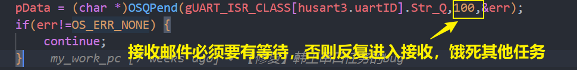
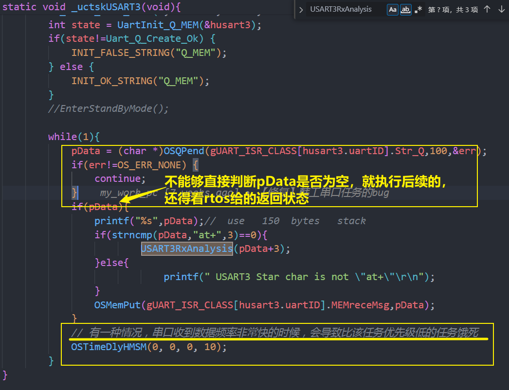

### 串口bug

术语说明：

典型：表示有很多处都是这样，所以拿出典型示例

1. 





典型源码

```
static void _uctskUSART3(void){
		char *pData;
        uint8_t err;
		MX_USART_UART_Init(2,&husart3,USART3,115200);  //  to wifi	
        int state = UartInit_Q_MEM(&husart3);
        if(state!=Uart_Q_Create_Ok) {
            INIT_FALSE_STRING("Q_MEM");
        } else {
            INIT_OK_STRING("Q_MEM");
        }
		//EnterStandByMode();

		while(1){
			pData = (char *)OSQPend(gUART_ISR_CLASS[husart3.uartID].Str_Q,100,&err);			
            if(err!=OS_ERR_NONE) {
                continue;
            }
			if(pData){				
				printf("%s",pData);//  use   150  bytes   stack
				if(strncmp(pData,"at+",3)==0){
						USART3RxAnalysis(pData+3);	
				}else{
							printf(" USART3 Star char is not \"at+\"\r\n");
				}
				OSMemPut(gUART_ISR_CLASS[husart3.uartID].MEMreceMsg,pData);			
			}
            // 有一种情况，串口收到数据频率非常快的时候，会导致比该任务优先级低的任务饿死
            OSTimeDlyHMSM(0, 0, 0, 10);
		}
}
```

