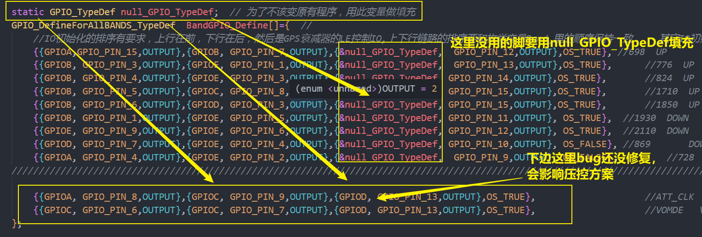

### 串口bug

术语说明：

典型：表示有很多处都是这样，所以拿出典型示例

1. 


典型源码

```
static void _uctskUSART3(void){
		char *pData;
        uint8_t err;
		MX_USART_UART_Init(2,&husart3,USART3,115200);  //  to wifi	
        int state = UartInit_Q_MEM(&husart3);
        if(state!=Uart_Q_Create_Ok) {
            INIT_FALSE_STRING("Q_MEM");
        } else {
            INIT_OK_STRING("Q_MEM");
        }
		//EnterStandByMode();

		while(1){
			pData = (char *)OSQPend(gUART_ISR_CLASS[husart3.uartID].Str_Q,100,&err);			
            if(err!=OS_ERR_NONE) {
                continue;
            }
			if(pData){				
				printf("%s",pData);//  use   150  bytes   stack
				if(strncmp(pData,"at+",3)==0){
						USART3RxAnalysis(pData+3);	
				}else{
							printf(" USART3 Star char is not \"at+\"\r\n");
				}
				OSMemPut(gUART_ISR_CLASS[husart3.uartID].MEMreceMsg,pData);			
			}
            // 有一种情况，串口收到数据频率非常快的时候，会导致比该任务优先级低的任务饿死
            OSTimeDlyHMSM(0, 0, 0, 10);
		}
}
```

2. 



源码

```
static GPIO_TypeDef null_GPIO_TypeDef;  // 为了不该变原有程序，用此变量做填充
GPIO_DefineForAllBANDS_TypeDef  BandGPIO_Define[]={  // 
	//IO初始化的排序有要求，上行在前，下行在后，然后是GPS衰减器的LE控制IO,上下行链路的排序要和枚举变量Band_里的顺序保持一致，   其它IO初始化在最后，	
    {{GPIOA,GPIO_PIN_15,OUTPUT},{GPIOB, GPIO_PIN_7,OUTPUT},{&null_GPIO_TypeDef,  GPIO_PIN_12,OUTPUT},OS_TRUE}, //698  UP		
    {{GPIOB, GPIO_PIN_3,OUTPUT},{GPIOE, GPIO_PIN_1,OUTPUT},{&null_GPIO_TypeDef,  GPIO_PIN_13,OUTPUT},OS_TRUE},		//776  UP  		
    {{GPIOB, GPIO_PIN_4,OUTPUT},{GPIOE, GPIO_PIN_3,OUTPUT},{&null_GPIO_TypeDef, GPIO_PIN_14,OUTPUT},OS_TRUE},		//824  UP
    {{GPIOB, GPIO_PIN_5,OUTPUT},{GPIOC, GPIO_PIN_8,OUTPUT},{&null_GPIO_TypeDef, GPIO_PIN_15,OUTPUT},OS_TRUE},		//1710  UP
    {{GPIOB, GPIO_PIN_6,OUTPUT},{GPIOD, GPIO_PIN_3,OUTPUT},{&null_GPIO_TypeDef, GPIO_PIN_15,OUTPUT},OS_TRUE},		//1850  UP
    {{GPIOB, GPIO_PIN_1,OUTPUT},{GPIOE, GPIO_PIN_5,OUTPUT},{&null_GPIO_TypeDef, GPIO_PIN_11,OUTPUT}, OS_TRUE},	//1930  DOWN	
    {{GPIOE, GPIO_PIN_9,OUTPUT},{GPIOE, GPIO_PIN_6,OUTPUT},{&null_GPIO_TypeDef, GPIO_PIN_12,OUTPUT}, OS_TRUE},	//2110	DOWN	
    {{GPIOD, GPIO_PIN_7,OUTPUT},{GPIOE, GPIO_PIN_4,OUTPUT},{&null_GPIO_TypeDef, GPIO_PIN_10,OUTPUT}, OS_FALSE},	//869		DOWN
    {{GPIOA, GPIO_PIN_4,OUTPUT},{GPIOE, GPIO_PIN_2,OUTPUT},{&null_GPIO_TypeDef,  GPIO_PIN_9,OUTPUT}, OS_FALSE},			//728		DOWN
/////////////////////////////////////////////////////////////////////////////////////////////////////////////////////////////////////
	
	{{GPIOA, GPIO_PIN_8,OUTPUT},{GPIOC, GPIO_PIN_9,OUTPUT},{GPIOD, GPIO_PIN_13,OUTPUT},OS_TRUE},					//ATT_CLK  ATT_DATA		WDI	
	{{GPIOC, GPIO_PIN_6,OUTPUT},{GPIOC, GPIO_PIN_7,OUTPUT},{GPIOD, GPIO_PIN_13,OUTPUT},OS_TRUE},					//VOMDE   VBP					WDI
};

```

