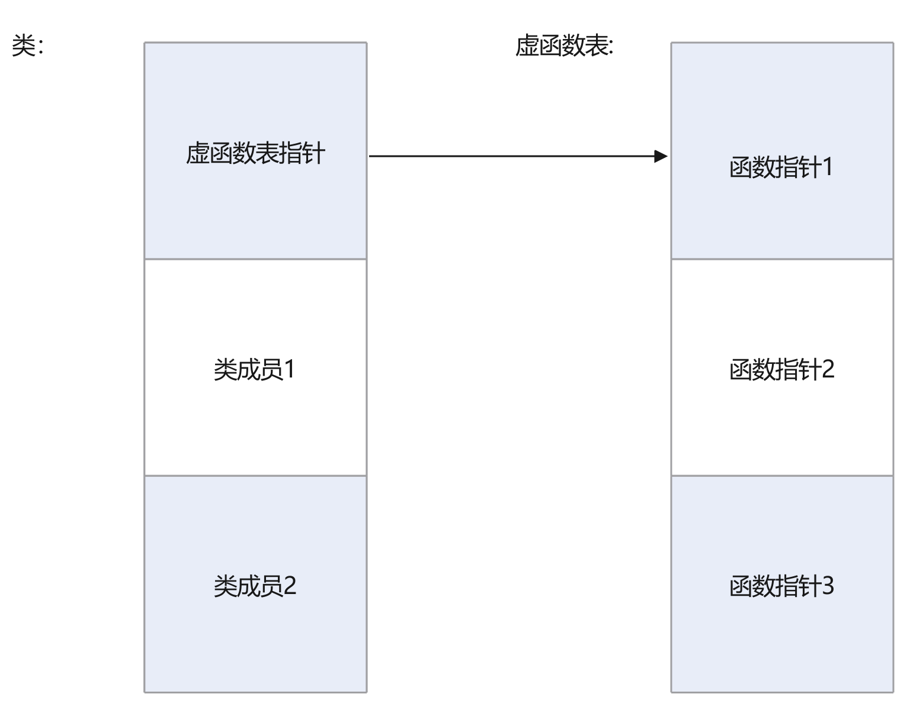

c++经过大量的版本更替，越来越现代化，应当学习现代c++

c++相比于c多了许多特性：

## 指针

现代c++提倡使用智能指针unique_ptr，智能会自动销毁

示例：

```
class LargeObject
{
public:
    void DoSomething(){}
};

void ProcessLargeObject(const LargeObject& lo){}
void SmartPointerDemo()
{    
    // Create the object and pass it to a smart pointer
    std::unique_ptr<LargeObject> pLarge(new LargeObject());

    //Call a method on the object
    pLarge->DoSomething();

    // Pass a reference to a method.
    ProcessLargeObject(*pLarge);

} //pLarge is deleted automatically when function block goes out of scope.
```

在能够精准把控的小模块中和要求高性能的地方使用原始指针

```
void UseRawPointer()
{
    // Using a raw pointer -- not recommended.
    Song* pSong = new Song(L"Nothing on You", L"Bruno Mars"); 

    // Use pSong...

    // Don't forget to delete!
    delete pSong;   
}
```


## 访问全局内容

```
#include <iostream>

int i = 7;   // i has global scope, outside all blocks
using namespace std;

int main( int argc, char *argv[] ) {
   int i = 5;   // i has block scope, hides i at global scope
   cout << "Block-scoped i has the value: " << i << "\n";
   // 使用“::”符号访问全局i
   cout << "Global-scoped i has the value: " << ::i << "\n";
}


```

## 新式c++错误处理的最佳方式

程序错误通常分为两种类别：

1. 由编程失误导致的逻辑错误，例如“索引超出范围”错误。
2. 以及超出程序员控制范围的运行时错误，例如“网络服务不可用”错误。

异常捕获和理解：

1. 异常通过throw抛出
2. 抛出异常处中断该函数运行，并直接逐层销毁
3. 销毁完毕运行catch内容

例子：

```
#include <string>
#include <iostream>
using namespace std;

class MyException{};
class Dummy
{
    public:
    Dummy(string s) : MyName(s) { PrintMsg("Created Dummy:"); }
    Dummy(const Dummy& other) : MyName(other.MyName){ PrintMsg("Copy created Dummy:"); }
    ~Dummy(){ PrintMsg("Destroyed Dummy:"); }
    void PrintMsg(string s) { cout << s  << MyName <<  endl; }
    string MyName;
    int level;
};

void C(Dummy d, int i)
{
    cout << "Entering FunctionC" << endl;
    d.MyName = " C";
    throw MyException();

    cout << "Exiting FunctionC" << endl;
}

void B(Dummy d, int i)
{
    cout << "Entering FunctionB" << endl;
    d.MyName = "B";
    C(d, i + 1);
    cout << "Exiting FunctionB" << endl;
}

void A(Dummy d, int i)
{
    cout << "Entering FunctionA" << endl;
    d.MyName = " A" ;
  //  Dummy* pd = new Dummy("new Dummy"); //Not exception safe!!!
    B(d, i + 1);
 //   delete pd;
    cout << "Exiting FunctionA" << endl;
}

int main()
{
    cout << "Entering main" << endl;
    try
    {
        Dummy d(" M");
        A(d,1);
    }
    catch (MyException& e)
    {
        cout << "Caught an exception of type: " << typeid(e).name() << endl;
    }

    cout << "Exiting main." << endl;
    char c;
    cin >> c;
}

/* Output:
    Entering main
    Created Dummy: M
    Copy created Dummy: M
    Entering FunctionA
    Copy created Dummy: A
    Entering FunctionB
    Copy created Dummy: B
    Entering FunctionC
    Destroyed Dummy: C
    Destroyed Dummy: B
    Destroyed Dummy: A
    Destroyed Dummy: M
    Caught an exception of type: class MyException
    Exiting main.

*/
```

其中可以在函数申明中使用noexcept关键字（C++11标准，表示该函数是否会抛出异常）

```
void func_not_throw() noexcept; // 保证不抛出异常
void func_not_throw() noexcept(true); // 和上式一个意思

void func_throw() noexcept(false); // 可能会抛出异常
void func_throw(); // 和上式一个意思，若不显示说明，默认是会抛出异常（除了析构函数，详见下面）
```

## operator关键字

通过operator可以重载运算符，如+、-、==、=等等

使用方式：

```
class OperatorTestClass
{
public:
    OperatorTestClass(int val)
    {
        this->val = val;
    }
    // 把<运算符重载为==
	bool operator<(const OperatorTestClass& arg)
	{
		cout<<"重载运算符测试"<<endl;
		return this->val == arg.val;
	}
private:
    int val;
};

int main()
{
    OperatorTestClass temp1(10);
    OperatorTestClass temp2(10);
	// 这里把temp1<看成函数，temp2看成参数，得到类似：temp.1operator(temp2)效果
    if(temp1<temp2) {
        cout << "运算符重载成功" << endl;
    }
    return 0;
}
```


## 临时对象

c++中会产生几种临时对象：

1. ```
   void Func()
   {
   	// 产生一个临时对象
   	Class_Exemple temp();
   }
   ```

2. ```
   Class_Exemple Func(Class_Exemple temp)
   {
   	// 产生一个临时对象
   	return  temp;
   }
   
   void main()
   {
   	Class_Exemple main_temp;
   	// 产生2个临时对象，main_temp作为参数传给Fun的形参temp时，会生成temp临时对象，
   	// temp返回时，会进行生成一个对象复制temp，在覆盖掉main_temp
   	main_temp = Func(main_temp);
   	return 0;
   }
   ```

## inline

### inline适合的地方：

1. 只有几行的函数。三四十行的就不适合了
2. 频繁调用的函数。。。

成员函数也是内联函数，成员函数即：body写在类里面的函数

eg：

```C++
class Test {
	void print() {
		int num = 10;
	}
}
```

还有这种方式也可以被编译为inline，函数直接写在类下面并用inline修饰

```c++
class Test {
	void print();
}

inline void Test::print()
{
	int num = 0;
}
```

## const关键字

## const成员函数

声明带 **`const`** 关键字的成员函数将指定该函数是一个“只读”函数，它不会修改为其调用该函数的对象。 常量成员函数不能修改任何非静态数据成员或调用不是常量的任何成员函数。 若要声明常量成员函数，请在参数列表的右括号后放置 **`const`** 关键字。 声明和定义中都需要 **`const`** 关键字。C、C++这里是变量会分配内存，不是常数，但是下面这个情况是存在代码区

```
char* string = "test";
const char* string2 = "test2";
```

注解：这里就是说，const出现在函数声明后，形如这样：

```
void func() const {}
```

表明函数体内的东西都是不可变更的，其实等于，即this不可变：

```
void func(const class_obj* this) {}
```


```cpp
// constant_member_function.cpp
class Date
{
public:
   Date( int mn, int dy, int yr );
   int getMonth() const;     // A read-only function
   void setMonth( int mn );   // A write function; can't be const
private:
   int month;
};

int Date::getMonth() const
{
   return month;        // Doesn't modify anything
}
void Date::setMonth( int mn )
{
   month = mn;          // Modifies data member
}
int main()
{
   Date MyDate( 7, 4, 1998 );
   const Date BirthDate( 1, 18, 1953 );
   MyDate.setMonth( 4 );    // Okay
   BirthDate.getMonth();    // Okay
   BirthDate.setMonth( 4 ); // C2662 Error
}
```


### typename 

**`typename`** 向编译器提供未知标识符为类型的提示。 在模板参数列表中，它用于指定类型参数

## 引用

### 引用不能干的事情

引用不能等于引用，这种实际上是两个被引用者的赋值

```c++
int x = 10;
int y = 20;

int& num1 = x;
int& num2 = y;

num1 = num2; // 实际上是x = y;
```

### 引用和指针的关系

1. 引用本身是不可见的，也就是引用不可以被取地址。

   ```
   int& *p; // 非法的
   int* &p; // 合法， 这个可以理解为，从做到右依次修饰，修饰一次，就将修饰完的当成整体再被后续修饰修饰，最后用一个名称表示，照这个解读就是：int类型的指针是引用，用符号表示就是((int*)&)p
   ```


### 类的成员是refrencese

没办法初始化，只能声明

必须在构造函数的initial list中进行初始化

```c++
class A
{
public:
    A(int& num) : num(num)
    {

    }
    A();
	~A();
    void change_val(int& num)
    {
        num = this->num;
    }
private:
    int& num;
};
```

### 引用+const

### 表示不可以通过引用修改它的值

```
int a;
const int& b = a;
// b = 10; // 非法，不能修改const 引用
```

还有一种形式，这种写不写无所谓，因为引用本身就不可变更，这里是等效

```
int a;
int& const b = a; // == int& b = a;
```

### 在函数参数列表中做运算

```c++
#include <iostream>

using namespace std;

class B
{
public:
	B();
	~B();
	void func()
	{
		cout << __FUNCTION__ << endl;
	}
	void func2()
	{
		cout << __FUNCTION__ << endl;
	}
	const int& func(const int& num)
	{
		cout << __FUNCTION__ << "const int& num" << endl;
		cout << num << endl;
		return num;
	}
	void func(int& num)
	{
		cout << __FUNCTION__ << "int& num" << endl;
		cout << num << endl;
	}
private:

};

B::B()
{
}

B::~B()
{
}

int main()
{
	B b;

	int num = 20;
	
	b.func(num);
    // num*3后的值交给了匿名的变量，匿名变量是临时的变量
    // 返回时返回的也是匿名临时变量，这里做返回会有风险
	const int& test = b.func(num * 3);
	cout << "return ref" << test << endl;
	cout << "num val:" << num << endl;
	/* = cout << "return ref:" << b.func(num * 3) << endl;*/
	return 0;
}

```


## 向上\下造型

从这里得到了新的东西，就是对象里没有函数，只有成员变量，这说明这会比c更省内存？

相当于C语言中的不同结构体copy，不是类型转换，因为原有的数据类型没丢（数据结构没变）

这里还有一点，当b引用为A类后，再访问相同的函数时，A类的printf就不再隐藏了，这a2调用的就是A类的printf了

```c++
class A
{
public:
	A();
	~A();
	int num;
	void printf() {
		cout << "A" << endl;
	}
private:

};

class B : public A
{
public:
	B();
	~B();
	void print() {
		cout << "B" << endl;
	}
private:

};

A a;
B b;
A& a2 = b;
a2.printf();
```

## 多态性

在c++中多态性由虚函数实现，形如：

```c++
#include <iostream>

using namespace std;

class A
{
public:
	A();
	virtual ~A();
	virtual void func()
	{
		cout << __FUNCTION__ << endl;
	}
	void func2()
	{
		cout << __FUNCTION__ << endl;
	}
private:

};

class B : public A
{
public:
	B();
	~B();
	void func()	override	// override（复写）关键字用来给编译器严格检查
	{
		cout << __FUNCTION__ << endl;
	}
	void func2()
	{
		cout << __FUNCTION__ << endl;
	}
private:

};

B::B()
{
}

B::~B()
{
}

A::A()
{
}

A::~A()
{
}


int main()
{
	A a;
	B b;
	A& c = b;
	c.func();	// 调用B::func
	c.func2();	// 调用A::func2
	return 0;
}

```


当类中出现了虚函数，那 么析构函数也应该为虚函数，因为不知道子类什么override了父类，如果父类析构函数不是虚函数，那么当子类override后的函数就会没有析构掉 

### 对虚函数表的使用洛阳铲挖掘

数据结构（但是析构函数是虚函数时可能不是，虚析构函数没用裸指针验真出来）：



```c++
#include <iostream>

using namespace std;

class Base {
public:
    // 基类的虚析构函数
    ~Base() {
        std::cout << "Base Destructor\n";
    }
    virtual void test()
    {
        cout << __FUNCTION__ << endl;
    }
};

class Derived : public Base {
public:
    // 派生类的虚析构函数
    ~Derived(){
        std::cout << "Derived Destructor\n";
    }
    int num = 10;
    void test() override
    {
        cout << __FUNCTION__ << endl;
    }
};

typedef void (*p_func)();
typedef void (Derived::* p_func2)();

int main() {
    // 使用基类指针指向派生类对象
    Base* ptr = new Derived();
    cout << sizeof(Base) << endl;
    cout << sizeof(Derived) << endl;

    int* p = (int*)ptr;
    printf("%p\r\n", p);
    // 定位到虚函数表的地址
    int virtual_table_addr = *((int*)(*p));
    printf("virtual_table_addr %x\r\n", virtual_table_addr);

    p_func func_p;
    // 转化为函数指针
    func_p = (p_func)(virtual_table_addr);
    printf("func_p %p\r\n", func_p);
    printf("*func_p %x\r\n", *func_p);
    func_p();

    // 删除基类指针，会调用正确的析构函数
    delete ptr;

    return 0;
}
```

### 注意事项

1. 基类有虚函数重载的情况，子类需要将所有的函数复写，否则基类函数会被隐藏（只有c++有函数名隐藏）

## lamabda表达式

形如：

```
[]() {

}
```

其中[]中存放的表示捕获列表，捕获的是位于该作用域内的临时变量，他有以下形式

```
// 以值的形式捕获本作用域下所有的变量
[=]() {

}
// 以引用的形式捕获本作用域下所有的变量
[&]() {

}

int i = 10;
// 只对i的值进行捕获
[=, i]() {
	int j = i;
}
```


## 模板

形如：

```
template <typename T>
T minimum(const T& lhs, const T& rhs)
{
    return lhs < rhs ? lhs : rhs;
}
```

在编译中，编译器会推导T类型，然后再把模板中的t替换掉
