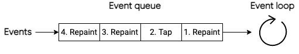
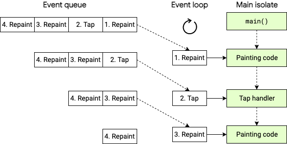
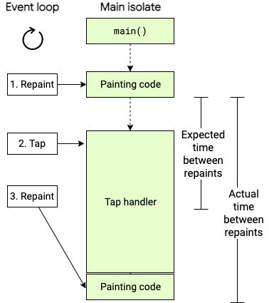
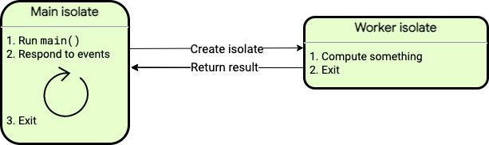
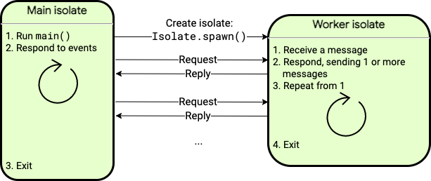

# 语法部分

## 运算符号

### ??

在 Dart 编程语言中，`??` 被称为空合并运算符（null-coalescing operator）。它的作用是：如果左侧的表达式不为 `null`，则返回左侧的值；否则，返回右侧的值。

**用法示例：**

```
dart复制代码void main() {
  String? username;
  String displayName = username ?? '默认用户名';
  print(displayName); // 输出：默认用户名
}
```

在上述代码中，`username` 可能为 `null`。使用 `??` 运算符，可以为 `displayName` 提供一个默认值，防止出现 `null` 值导致的错误。

### as

```
class Test{
  void func()
  {
    print("object");
  }
}

void main()
{
  var test;
  test = "";
  test = Test();
  // 此时这个不可以用
  // test.func();
  // 强制类型转换
  (test as Test).func();
}
```

### ..

```
class Test{
  var num = 10;
  var name = "sdfsdf";
  void func()
  {
    print("${num}, $name");
  }
}

void main()
{
  var test = Test();
  // 练级操作
  test..num = 30..name = "zhangsan"..func();
}
```


## **Map**：

示例：

```
final Map<String, dynamic> params = <String, dynamic>
```

解释：

在Dart中，这行代码声明了一个名为 `params` 的变量，它是一个 `Map` 类型的对象，键（Key）是 `String` 类型，值（Value）是 `dynamic` 类型。

- `final`: 这表示 `params` 是一个只读的（不可变的）变量，一旦赋值后就不能再修改。
- `Map<String, dynamic>`: 这部分指定了 `params` 是一个 `Map` 类型的变量，并指定了键的类型为 `String`，值的类型为 `dynamic`。
- `= <String, dynamic>{}`: 这是一个赋值语句，将一个空的 `Map` 对象赋值给 `params` 变量。`<String, dynamic>{}` 表示一个空的 `Map`，其中 `<String, dynamic>` 是类型参数，用于指定键值对的类型。

综合起来，这行代码声明了一个只读的 `Map` 类型的变量 `params`，其键为 `String` 类型，值为 `dynamic` 类型，并将一个空的 `Map` 对象赋值给它。在后续代码中，可以使用 `params` 变量来存储和访问键值对数据，但不能修改 `params` 的引用或内容。

## dynamic

在Dart中，`dynamic` 是一种特殊的数据类型，它表示一个可以存储任意类型的值的变量。当一个变量被声明为 `dynamic` 类型，Dart 编译器将不会对其类型进行静态检查，也就是说，你可以给这个变量赋予任何类型的值，并且编译器不会报错。

使用 `dynamic` 类型可以在一些特定情况下更灵活地处理数据，但也需要注意潜在的类型错误。因为 `dynamic` 变量不受类型约束，如果在运行时给它赋值了错误的类型，可能会导致运行时错误。

比如，在使用 `dynamic` 类型时，你可以这样做：

```
dartCopy codedynamic myVariable = 42;
print(myVariable); // Output: 42

myVariable = "Hello";
print(myVariable); // Output: Hello

myVariable = [1, 2, 3];
print(myVariable); // Output: [1, 2, 3]
```

在上面的例子中，`myVariable` 是一个 `dynamic` 类型的变量，它先后存储了一个整数、一个字符串和一个列表。这样的灵活性可以在一些特定场景下派上用场，但同时也要小心潜在的类型错误，因为在编译时不会有类型检查的帮助。在大多数情况下，建议使用更具体的类型来声明变量，以便在编译时能够发现潜在的类型错误。

## late

1）显式声明一个非空的变量，但不初始化

如下，_temperature如果不加late关键字，类实例化时此值是不确定的，无法通过静态检查，加上late关键字可以通过静态检查，但由此会带来运行时风险。

```
// Using null safety:
class Coffee {
  late String _temperature;

  void heat() { _temperature = 'hot'; }
  void chill() { _temperature = 'iced'; }

  String serve() => _temperature + ' coffee';
}

main() {
  var coffee = Coffee();
  coffee.heat();
  coffee.serve();
}
```

2）延迟初始化变量

这个作用看起来和第一点矛盾，实际上是同一个意思。看下面的例子，temperature变量看起来是在声明时就被初始化了，但因为late关键字的存在，如果temperature这个变量没有被使用的话，_readThermometer()这个函数不会被调用，temperature也就不会被初始化了。

```
late String temperature = _readThermometer(); // Lazily initialized.
```


## 函数

### 可选参数

参数使用“{}”包括:

```
// required表示必须填参，否则要初始化
int func(int num, {required int num2, required int num3})
{
	return 10;
}
```

### 参数为函数：

```
void fun_print()
{
  print("hello");
}

void func(pfunc)
{
  pfunc();
}

void main()
{
  func(fun_print);
}
```

### 闭包

```
void main() {
  func(){
    var num = 10;
    return (){
      num++;
      print(num);
    };
  }
  var f = func();
  f();
  f();
  f();
}

```

作用：（闭包其实就是缩小版的类）在var f定义时，实例化产生，func函数中的num一并实例化，后续f变量都没有被释放，所以，num也没有释放，这里达到了和c里面的静态变量的作用，f释放后，num函数一并被释放。

### 常量构造函数

zq总结：两个作用

1. 编译器初始化好对象在rom中
2. 内存共享

 在Dart语言中，常量构造函数（`const` constructor）用于创建编译时常量。这种机制的目的是在编译期间分配和初始化对象，从而在运行时提高效率和减少内存占用。这里是一些关于常量构造函数和它们在内存中的处理方式的关键点：

1. **编译时常量**：当使用常量构造函数创建对象时，该对象在编译时被创建并存储在内存中的常量区域。这意味着每个常量表达式都会在编译时求值，结果存储在程序的常量池中。
2. **内存共享**：如果多个地方引用相同的常量构造函数生成的对象（带有完全相同的参数），Dart会确保所有引用都指向内存中的同一个对象实例。这样做减少了内存的使用，因为不会为相同的常量数据创建多个副本。
3. **不可变性**：通过常量构造函数创建的对象是不可变的。这意味着对象一旦被创建，其状态就不能更改。这种不可变性进一步确保了常量对象可以安全地共享，而不需要担心数据竞争或并发修改。
4. **优化和性能**：由于常量对象在编译时就已经确定，并且存储在专门的内存区域，它们的访问速度通常比普通对象更快。这对于需要频繁访问的静态数据特别有用。

举一个简单的例子来说明常量构造函数的使用：

```
dart复制代码class ImmutablePoint {
  final int x;
  final int y;
  const ImmutablePoint(this.x, this.y);
}

void main() {
  var p1 = const ImmutablePoint(0, 0);
  var p2 = const ImmutablePoint(0, 0);
  print(identical(p1, p2));  // 输出：true
}
```

在这个例子中，`ImmutablePoint`的两个实例`p1`和`p2`都是通过相同的参数创建的。由于它们是常量构造函数创建的，Dart确保`p1`和`p2`实际上是同一个内存中的对象。`identical()`函数用于验证这一点，它检查两个引用是否指向相同的对象。

#### 在flutter中

在Flutter中，`const` 关键字用于定义编译时常量，这意味着常量的值在编译时就已经确定，并且在整个程序运行期间不会改变。使用 `const` 可以提高Flutter应用的性能，因为它帮助Flutter框架优化资源的分配和使用。以下是在Flutter中使用`const`的一些关键点和场景：

1. **构造函数中的`const`**： 当一个类具有不变的状态时，你可以创建常量构造函数。在Flutter开发中，这通常用于`Widget`的构造函数，以确保当相同参数的widget被创建时，能够复用已有的widget实例，而不是创建一个新的实例。

   ```
   dart复制代码class MyImmutableWidget extends StatelessWidget {
     final String title;
   
     const MyImmutableWidget({Key? key, required this.title}) : super(key: key);
   
     @override
     Widget build(BuildContext context) {
       return Text(title);
     }
   }
   ```

   在这个例子中，如果`MyImmutableWidget`使用相同的`title`被多次构造，Flutter会在渲染树中复用同一个widget实例。

2. **优化性能**： 使用`const`可以减少构建时间和内存使用。如果一个widget在整个应用的生命周期内保持不变，你应该使用`const`构造函数。这是因为`const`构造的widget不需要在每次构建时都重新计算，从而节省资源。

   ```
   dart复制代码@override
   Widget build(BuildContext context) {
     return const Scaffold(
       appBar: AppBar(
         title: Text('Constant AppBar'),
       ),
       body: Center(
         child: Text('Hello, world!'),
       ),
     );
   }
   ```

   在这里，`Scaffold`、`AppBar`和`Text`都使用了`const`，所以如果这些widget的构造参数没有变化，它们将不会在每次`build`调用时重新构造。

3. **`const`与`final`的区别**：

   - `const`定义的是编译时常量，必须在声明时就赋值。
   - `final`定义的变量只能赋值一次，但赋值时机可以是运行时。这意味着`final`变量的值可以是动态计算出来的。

4. **在集合中使用`const`**： 在定义不变的列表、映射或集合时，使用`const`可以确保这些集合在编译时就已经创建好，避免了运行时的修改和重新分配资源。

   ```
   dart复制代码void main() {
     const myList = [1, 2, 3];
     const myMap = {'a': 1, 'b': 2};
   }
   ```

使用`const`能有效提高Flutter应用的性能，特别是在构建大量静态或重复内容的UI时。如果你想了解更多关于`const`的细节或如何在具体项目中使用，可以随时提问！

## 类

### 构造函数

```dart

class Test{
  // 构造函数
  Test(){
    print("默认构造函数");
  }
  Test.print_info(){
    print("命名构造函数");
  }
}

void main()
{
  var test = Test.print_info();
}
```

### 变成模块

```dart
/**
 * dart的类中的私有
 * 前提：只有在单独的文件中才有效果
 */
class Test{
  // 构造函数
  Test(){
    print("默认构造函数");
  }
  Test.print_info(){
    print("命名构造函数");
  }
  void _print()
  {
      print("私有方法");
  }
}
void main()
{
  var test = Test();
  // 同一文件中还是能够使用私有方法
  test._print();
}
```

### getter和setter

相当于一个语法糖，在语法层面将本该写成函数的语句简化了，get只有返回值没有形参，set只有形参没有返回值，形如 以下：

```
class Test{
  var test_num = 10;
  // getter修饰符
  get num => test_num;
  get num2{
    return test_num;
  }
  //setter修饰符
  set set_num(var args) {
    this.test_num = args;
  }
}
void main()
{
  var test = Test();
  print(test.num);
  test.set_num = 20;
  print(test.num2);

}
```

### 初始化列表

```
class Test{
  /**初始化列表，和c++中初始化列表有点像，不同的是
   * c++的初始化列表会覆盖Test类中，比如int a = 10，后面初始化
   * 列表又初始化a，这里会被合并为一步
   * dart中是先int a = 10，再进行初始化话列表操作，是两步
   */
  int a = 10;
  Test(int num):a = 20 {
    num = 20;
    print(a);
  }
  Test.fun(){
    print(a);
  }

}
void main()
{
  var test = Test.fun();
}


```

### 静态属性和静态方法

```
class Test{
  /**静态属性和静态方法
   * 静态相当啊于c中ram里的静态区域，属于是程序启动就实例化的
   * 所以不能够访问动态分配的东西
   * 静态方法和动态方法区别就是，访问时的权限不一样而已
   * 静态方法只能通过类名直接使用，动态方法只能通过示例化类使用
   */
  static var num = 10;
  var num2 = 30;
  static void func()
  {
    print(num);
  }
  void func_2()
  {
    print(num);
  }

}
void main()
{
  Test.func();
  print(Test.num);
  var test = Test();
  // 实例化的对象访问不了静态方法
  test.func_2();
}


```

### 继承

#### super

给父类构造函数传参

```
class Test{
  var num = 10;
  var name = "sdfsdf";
  void func()
  {
    print("${num}, $name");
  }
  Test(var num, var name)
  {
    this.num = num;
    this.name = name;
  }
}

class Test2 extends Test{
  Test2(super.num, super.name);
  // Test2(var num, var name):super(num, name);
}

void main()
{
  var test = Test2(10, "ceshi");
  test.func();
}


```

#### override，以及override调用父类方法

```dart
class Test{
  var num = 10;
  var name = "sdfsdf";
  void func()
  {
    print("${num}, $name");
  }
  Test(var num, var name)
  {
    this.num = num;
    this.name = name;
  }
}

class Test2 extends Test{
  Test2(super.num, super.name);
  // Test2(var num, var name):super(num, name);
  @override // 加上这个标签，更明确的表示这是一个复写，可以不加
  void func(){
    print("sub");
    // 使用super调用父类方法
    super.func();
  }
}

void main()
{
  var test = Test2(10, "ceshi");
  test.func();
}
```

### 多态（抽象类）

```
// 抽象类约束子类必须要实现抽象类中的方法，相当于c++中的虚函数
abstract class Test1{
  fuc(var num, var name);
  void print_() {
    print("普通方法");
  }
}

class Test2 extends Test1{
  @override
  fuc(num, name) {
    print("$num, $name");
  }


}


void main()
{
  var test = Test2();
  test.fuc(10, "sdf");
  var test2 = Test2();
  test2.fuc("30", 90);
  test2.print_();
}
```

### 接口

使用implements关键词对抽象类进行实现，implements表示子类必须实现父类所有方法

```
abstract class Test1{
  fuc1(var num, var name);
  void print_() {
    print("普通方法");
  }
}

class Test2{
  fuc()
  {
    print("Test2");
  }
}
// 必须实现所有父类的所有函数
class Test3 implements Test1, Test2{
  @override
  fuc() {
    // TODO: implement fuc
    throw UnimplementedError();
  }

  @override
  fuc1(num, name) {
    // TODO: implement fuc1
    throw UnimplementedError();
  }

  @override
  void print_() {
    // TODO: implement print_
  }

}

void main()
{
  var test = Test3();
  
}
```

### 多继承


## 名词解释

### 依赖注入库

依赖注入的核心思想是将一个对象所依赖的其他对象（即依赖）传递给它，而不是让它自己去创建这些依赖。这样可以避免类之间紧耦合，提升代码的灵活性。

```
class Engine {
  void start() {
    print('Engine started');
  }
}

class Car {
  final Engine engine;

  // 通过构造函数注入依赖
  Car(this.engine);
  /* 这里相当于：
  	Car(Engine engine)
  	{
  		this.engine = engine;
  	}
  */

  void drive() {
    engine.start();
    print('Car is driving');
  }
}

void main() {
  Engine engine = Engine();
  Car car = Car(engine);
  car.drive();
}

```

## 泛型

```

// 泛型抽象类
import 'dart:async';

abstract class Test<T> {
  T get_val();
}
/**此处Test<T>的<>里的类型使用于限定Test2的<T>类型的
 * 例如为Test<String>时，Test2的T就只能为String了
 * 但是此处用的时Test2<T>表示为泛型T，不做限定，和
 * extends Test效果一样
 */
// 泛型类
class Test2<T> extends Test<T> {
  T val;
  /**以泛型初始化的变量，必须要在初始化列表中进行初始化，
   * 在函数中初始化会报错，错误示范：
   * Test2(T info) {
   *    val = info;
   * }
   */
  Test2(T info) :val = info;
  @override
  get_val() {
    return val;
  }
}

class MyBase extends Object
{
  ret()
  {
    return this.toString();
  }
}

// 限制参数化类型，这里限定了泛型T必须为Object或者Object子类
class Test3<T extends Object>{
  T val;
  Test3(this.val);
  T ret_val()
  {
    return val;
  }
}

// 泛型函数
A genericity_func_test<A>(info)
{
  return info;
}

void main()
{
  // 无校验的泛型
  var test2 = genericity_func_test("test");
  // 带校验的泛型
  var test3 = genericity_func_test<String>("test3");
  // 报错
  // var test3 = genericity_func_test<String>(10);
  print(test3);
  print(test2);
  var test4 = Test2("test4");
  print(test4.get_val());
  var test5 = MyBase();
  var test6 = Test3(test5);
  print(test6.ret_val());
} 

```

## 库的导入

```
// 重命名，防止库冲突
import "dart:ffi" as test_html;
// 只引用库中部分方法，下面表明了只能用max方法
import "dart:math" show max;
// 隐藏
import "dart:math" hide min;

void main()
{
  print(max(10, 20));
  // 报错，因为只引用了max方法
  // print(min(30, 1));
}
```

## 空安全

### ？可空类型

```
int? a = 12;
a = null;
```

### 空断言！

```
  String? temp = "sdfsdf";
  temp = null;
  print(temp!);
```


## 异步

### async/await

函数描述用async，返回了一个Future

```
import 'dart:async';

Future<String> test1(String str) async
{
  return Future.delayed(Duration(seconds: 2), ()=>str);
}

void task() async
{
  print(await test1("task1"));
}

void task2() async
{
  print(await test1("task2"));
}

void task3() async
{
  print(await test1("task3"));
  print(await test1("task3"));
}

void task4() async
{
  var future1 = test1("task4");
  var future2 = test1("task4");
  // 相比task3，实现了两个future同时执行的效果，task3中第一个await会阻塞第二个
  var results = await Future.wait([future1, future2]);
  print(results);
}

void main()
{
  task();
  task2();
  task3();
  task4();
}

```

### stream

函数使用async*修饰，返回一个Stream

#### 单订阅流

```
import 'dart:async';

bool USE_TEST_THROW = false;

// 创建一个 Stream，每隔一秒发出一个递增的整数
Stream<int> numberStream() async* {
  int number = 1;
  while (true) {
    await Future.delayed(Duration(seconds: 1));
    if(USE_TEST_THROW) {
      yield number++;
      if(number > 5) {
        var obj = Object();
        throw obj;
      }
    }
  }
}

void main() {
  var stream = numberStream();
  // 监听 Stream
  var subscription = stream.listen(
    (number) => print('Received: $number'),
    onError: (error) => print('Error: $error'),
    // 流结束或者抛出异常后都会触发onDone，但是主从退出，即cancel不会触发
    onDone: () => print('Stream completed'),
    cancelOnError: false,
  );

  // 在 10 秒后取消订阅
  Future.delayed(Duration(seconds: 10), () {
    subscription.cancel();
    print('Subscription canceled');
  });
}
```

使用await for

```
import 'dart:async';

Stream<String> logStream() async* {
  List<String> logs = ["Start", "Loading", "Complete"];
  for (var log in logs) {
    await Future.delayed(Duration(seconds: 1));
    yield log;
  }
}

Future<void> main() async {
  await for (var log in logStream()) {
    print('Log: $log');
  }
}
```


#### 广播流

```
import 'dart:async';

// 创建一个广播 Stream
Stream<int> createBroadcastStream() {
  var controller = StreamController<int>.broadcast();
  int number = 0;

  // 每秒增加一个数字，并将其添加到 Stream
  Timer.periodic(Duration(seconds: 1), (Timer t) {
    /**sink 是一个用于向 Stream 中添加数据的接口。
     * sink.add() 方法是用来将数据发送到 Stream 中，
     * 这样任何监听这个 Stream 的监听器都可以接收到这些数据。
     */
    controller.sink.add(number++);
    if (number > 10) { // 当数字大于 10 时停止添加
      controller.close();
      t.cancel();
    }
  });

  return controller.stream;
}

void main() {
  var stream = createBroadcastStream();

  // 第一个监听器
  var listen1 =  stream.listen(
    (number) => print('Listener 1: $number'),
    onDone: () => print('Listener 1 done'),
  );

  // 第二个监听器，开始于稍后时间
  var listen2;
  Future.delayed(Duration(seconds: 5), () {
    listen2 = stream.listen(
      (number) => print('Listener 2: $number'),
      onDone: () => print('Listener 2 done'),
    );
    // 此时第二个监听器才被创建出来
    print(listen2);
  });
  print(listen1);
  print(listen2);
}
```

### isolate（中译：隔离）

一般场景下，完全无需关心 isolate。通常一个 Dart 应用会在主 isolate 下执行所有代码，如下图所示：


#### 事件处理

在客户端应用中，主 isolate 的事件队列内，可能会包含重绘的请求、点击的通知或者其他界面事件。例如，下图展示了包含四个事件的事件队列，队列会按照先进先出的模式处理事件。



如下图所示，在 `main()` 方法执行完毕后，事件队列中的处理才开始，此时处理的是第一个重绘的事件。而后主 isolate 会处理点击事件，接着再处理另一个重绘事件。



如果某个同步执行的操作花费了很长的处理时间，应用看起来就像是失去了响应。在下图中，处理点击事件的代码比较耗时，导致紧随其后的事件并没有及时处理。这时应用可能会产生卡顿，所有的动画都无法流畅播放。



在一个客户端应用中，耗时过长的同步操作，通常会导致 [卡顿的动画](https://flutter.cn/docs/perf/rendering-performance)。而最糟糕的是，应用界面可能完全失去响应。

#### 后台运行对象

如果你的应用受到耗时计算的影响而出现卡顿，例如 [解析较大的 JSON 文件](https://flutter.cn/docs/cookbook/networking/background-parsing)，你可以考虑将耗时计算转移到单独工作的 isolate，通常我们称这样的 isolate 为 **后台运行对象**。下图展示了一种常用场景，你可以生成一个 isolate，它将执行耗时计算的任务，并在结束后退出。这个 isolate 工作对象退出时会把结果返回。



每个 isolate 都可以通过消息通信传递一个对象，这个对象的所有内容都需要满足可传递的条件。并非所有的对象都满足传递条件，在无法满足条件时，消息发送会失败。举个例子，如果你想发送一个 `List<Object>`，你需要确保这个列表中所有元素都是可被传递的。假设这个列表中有一个 `Socket`，由于它无法被传递，所以你无法发送整个列表。

你可以查阅 [`send()` 方法](https://api.dart.cn/stable/dart-isolate/SendPort/send.html) 的文档来确定哪些类型可以进行传递。

Isolate 工作对象可以进行 I/O 操作、设置定时器，以及其他各种行为。它会持有自己内存空间，与主 isolate 互相隔离。这个 isolate 在阻塞时也不会对其他 isolate 造成影响。

简单示例：

```
import 'dart:async';
import 'dart:convert';
import 'dart:io';
import 'dart:isolate';

const filename = 'json_01.json';

Future<void> main() async {
  // Read and parse JSON data in a new isolate,
  // then store the returned Dart representation.
  final jsonData = await Isolate.run(() => _readAndParseJson(filename));

  print('Received JSON with ${jsonData.length} keys');
}

/// Reads the contents of the file with [filename],
/// decodes the JSON, and returns the result.
Future<Map<String, dynamic>> _readAndParseJson(String filename) async {
  final fileData = await File(filename).readAsString();
  final jsonData = jsonDecode(fileData) as Map<String, dynamic>;
  return jsonData;
}
```

如果你想在 isolate 之间建立更多的通信，那么你需要使用 `SendPort` 的 [`send()` 方法](https://api.dart.cn/stable/dart-isolate/SendPort/send.html)。下图展示了一种常见的场景，主 isolate 会发送请求消息至 isolate 工作对象，然后它们之间会继续进行多次通信，进行请求和回复。



下方列举的 [isolate 示例](https://github.com/dart-lang/samples/tree/master/isolates) 包含了发送多次消息的使用方法：

- [send_and_receive.dart](https://github.com/dart-lang/samples/tree/master/isolates/bin/send_and_receive.dart) 展示了如何从主 isolate 发送消息至生成的 isolate，与前面的示例较为接近，不过没有使用 `run()` 方法；

- [long_running_isolate.dart](https://github.com/dart-lang/samples/tree/master/isolates/bin/long_running_isolate.dart) 展示了如何生成一个长期运行、且多次发送和接收消息的 isolate。

  - 示例：

  - ```
    // Copyright (c) 2021, the Dart project authors. Please see the AUTHORS file
    // for details. All rights reserved. Use of this source code is governed by a
    // BSD-style license that can be found in the LICENSE file.
    
    // Spawn an isolate, read multiple files, send their contents to the spawned
    // isolate, and wait for the parsed JSON.
    import 'dart:async';
    import 'dart:convert';
    import 'dart:ffi';
    import 'dart:io';
    import 'dart:isolate';
    
    import 'package:async/async.dart';
    
    const filenames = [
      'json_01.json',
      'json_02.json',
      'json_03.json',
    ];
    
    void main() async {
      var temp = await _sendAndReceive(filenames);
      for(var obj in temp) {
    
      }
      print(await temp.length);
      await for (final jsonData in _sendAndReceive(filenames)) {
        print('Received JSON with ${jsonData.length} keys');
      }
    }
    
    // Spawns an isolate and asynchronously sends a list of filenames for it to
    // read and decode. Waits for the response containing the decoded JSON
    // before sending the next.
    //
    // Returns a stream that emits the JSON-decoded contents of each file.
    Stream<Map<String, dynamic>> _sendAndReceive(List<String> filenames) async* {
      final p = ReceivePort();
      await Isolate.spawn(_readAndParseJsonService, p.sendPort);
    
      // Convert the ReceivePort into a StreamQueue to receive messages from the
      // spawned isolate using a pull-based interface. Events are stored in this
      // queue until they are accessed by `events.next`.
      final events = StreamQueue<dynamic>(p);
    
      // The first message from the spawned isolate is a SendPort. This port is
      // used to communicate with the spawned isolate.
      SendPort sendPort = await events.next;
    
      for (var filename in filenames) {
        // Send the next filename to be read and parsed
        sendPort.send(filename);
    
        // Receive the parsed JSON
        Map<String, dynamic> message = await events.next;
    
        // Add the result to the stream returned by this async* function.
        yield message;
      }
    
      // Send a signal to the spawned isolate indicating that it should exit.
      sendPort.send(null);
    
      // Dispose the StreamQueue.
      await events.cancel();
    }
    
    // The entrypoint that runs on the spawned isolate. Receives messages from
    // the main isolate, reads the contents of the file, decodes the JSON, and
    // sends the result back to the main isolate.
    Future<void> _readAndParseJsonService(SendPort p) async {
      print('Spawned isolate started.');
    
      // Send a SendPort to the main isolate so that it can send JSON strings to
      // this isolate.
      final commandPort = ReceivePort();
      p.send(commandPort.sendPort);
    
      // Wait for messages from the main isolate.
      await for (final message in commandPort) {
        if (message is String) {
          // Read and decode the file.
          final contents = await File(message).readAsString();
    
          // Send the result to the main isolate.
          p.send(jsonDecode(contents));
        } else if (message == null) {
          // Exit if the main isolate sends a null message, indicating there are no
          // more files to read and parse.
          break;
        }
      }
    
      print('Spawned isolate finished.');
      Isolate.exit();
      }
    ```

    

## 性能和 isolate 组

当一个 isolate 调用了 [`Isolate.spawn()`](https://api.dart.cn/stable/dart-isolate/Isolate/spawn.html)，两个 isolate 将拥有同样的执行代码，并归入同一个 **isolate 组** 中。 Isolate 组会带来性能优化，例如新的 isolate 会运行由 isolate 组持有的代码，即共享代码调用。同时，`Isolate.exit()` 仅在对应的 isolate 属于同一组时有效。

某些场景下，你可能需要使用 [`Isolate.spawnUri()`](https://api.dart.cn/stable/dart-isolate/Isolate/spawnUri.html)，使用执行的 URI 生成新的 isolate，并且包含代码的副本。然而，`spawnUri()` 会比 `spawn()` 慢很多，并且新生成的 isolate 会位于新的 isolate 组。另外，当 isolate 在不同的组中，它们之间的消息传递会变得更慢。
