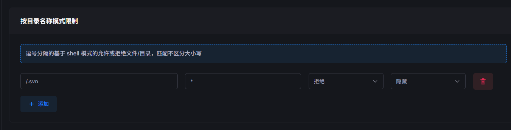

## svn基本操作

按标准工作流整理，均在终端执行（路径省略时默认作用于当前工作副本）：

**📥 同步**

- `svn checkout <URL> [路径]`：首次拉取
- `svn checkout <URL> [路径] --username 用户名 --password 密码`：首次拉取
- `svn update`：更新至服务端最新版本

**👀 状态与差异**

- `svn status`：查看变更（`M`修改, `A`新增, `D`删除, `?`未管控, `C`冲突, `!`缺失）
- `svn diff`：查看本地未提交的具体代码差异
- `svn info`：查看当前目录的仓库URL、版本、修订号

**📝 文件管理**

- `svn add <文件/目录>`：纳入版本控制
- `svn delete <文件>`：标记删除（同步删除物理文件）
- `svn revert <文件>`：撤销本地未提交的修改/操作

**📤 提交与追溯**

- `svn commit -m "说明"`：提交本地变更
  - `svn log [-l 20]`：查看提交历史（`-l`限制条数）

- `svn log -r 100:105`：查看指定版本区间

**⚠️ 冲突与清理**

- `svn resolve --accept working <文件>`：手动解决冲突后标记完成
- `svn cleanup`：修复因中断/断电导致的 `Working copy locked` 状态
- `rm -rf ~/.subversion/auth/`：清除缓存的认证信息

💡 **提示**：命令均支持 `--username` `--password` 参数免交互；批量操作可通配符匹配（如 `svn add *.py`）。


## svn配合sftpgo

1. 设置将sftpgo文件夹设置为svn的文件夹

2. sftpgo设置隐藏.svn文件夹内容和对.svn拒绝更改权限

   

3. 创建脚本文件

   ```
   sudo nano /usr/local/bin/svn_sync.py
   ```

4. 写入代码

   ```
   #!/usr/bin/env python3
   import os, logging, fcntl, subprocess
   from datetime import datetime
   
   WORK_DIR = os.path.expanduser("~/Desktop/sftpgo-storage")
   LOG_FILE = os.path.expanduser("~/Desktop/sftpgo-storage/研发共享文件/svn-sync.log")
   LOCK_FILE = "/tmp/svn-sync.lock"
   
   def load_auth(conf_path):
       auth = {}
       with open(conf_path) as f:
           for line in f:
               if "=" in line:
                   k, v = line.strip().split("=", 1)
                   auth[k.strip()] = v.strip()
       return auth
   
   AUTH = load_auth(os.path.expanduser("~/Desktop/svn_auth.conf"))
   
   
   logging.basicConfig(filename=LOG_FILE, level=logging.INFO,
                       format="%(asctime)s [%(levelname)s] %(message)s")
   
   
   def run_svn(args, cwd, check=True):
       cmd = ["svn", "--non-interactive", "--trust-server-cert"] + args
       res = subprocess.run(cmd, cwd=cwd, capture_output=True, text=True)
       if res.stdout:
           logging.debug(f"[{cwd}] {res.stdout.strip()}")
       if res.stderr:
           logging.warning(f"[{cwd}] {res.stderr.strip()}")
       if check and res.returncode != 0:
           raise RuntimeError(f"[{cwd}] SVN失败: {res.stderr.strip()}")
       return res
   
   def find_svn_dirs(base, max_depth=5):
       """查找所有包含 .svn 的目录（限制最大递归深度）"""
       svn_dirs = []
   
       base = os.path.abspath(base)
       base_depth = base.rstrip(os.sep).count(os.sep)
   
       for root, dirs, files in os.walk(base):
           current_depth = root.rstrip(os.sep).count(os.sep) - base_depth
   
           # 超过最大深度，停止向下递归
           if current_depth >= max_depth:
               dirs[:] = []
               continue
   
           if ".svn" in dirs:
               svn_dirs.append(root)
               dirs[:] = []  # 找到仓库就不再深入
   
       return svn_dirs
   
   def process_repo(repo_path):
       repo_name = os.path.basename(repo_path)
       logging.info(f"📂 处理仓库: {repo_path} ")
   
       added, modified, deleted = [], [], []
   
       status_res = run_svn(["status", "--no-ignore"], cwd=repo_path)
   
       logging.info(f"[{repo_name}] 开始拉取更新...")
       run_svn(["update", "--username", "liuxuemei", "--password", "tong680525"], cwd=repo_path)
   
       lines = [l.strip() for l in status_res.stdout.splitlines() if l.strip()]
   
       for line in lines:
           if len(line) < 2:
               continue
   
           st, path = line[0], line[2:].strip()
   
           if st in ("?", "A"):
               run_svn(["add", path], cwd=repo_path, check=False)
               added.append(path)
           elif st == "!":
               run_svn(["delete", path], cwd=repo_path, check=False)
               deleted.append(path)
           elif st in ("M", "~", "C", "R"):
               modified.append(path)
           elif st == "D":
               deleted.append(path)
   
       if not (added or modified or deleted):
           logging.info(f"[{repo_name}] ⏸ 无变更")
           return
   
       def fmt_list(lst, limit=3):
           if not lst:
               return ""
           if len(lst) <= limit:
               return ", ".join(lst)
           return ", ".join(lst[:limit]) + f" ...等{len(lst)}个"
   
       parts = []
       if added:    parts.append(f"【添加】{fmt_list(added)}")
       if modified: parts.append(f"【修改】{fmt_list(modified)}")
       if deleted:  parts.append(f"【删除】{fmt_list(deleted)}")
   
       msg = " ".join(parts) + f" | {os.path.basename(repo_path)} @ {datetime.now():%m-%d %H:%M}"
       if len(msg) > 200:
           msg = msg[:197] + "..."
   
       run_svn([
           "commit", "-m", msg,
           "--username", AUTH["username"],
           "--password", AUTH["password"]
       ], cwd=repo_path)
   
       logging.info(f"[{repo_name}] ✅ 提交成功: {msg}")
   
   def main():
       with open(LOCK_FILE, "w") as lock:
           try:
               fcntl.flock(lock, fcntl.LOCK_EX | fcntl.LOCK_NB)
           except IOError:
               logging.info("实例已运行，跳过")
               return
   
           try:
               svn_dirs = find_svn_dirs(WORK_DIR)
   
               if not svn_dirs:
                   logging.warning("⚠ 未找到任何 SVN 工作副本")
                   return
   
               logging.info(f"🔍 共发现 {len(svn_dirs)} 个 SVN 目录")
   
               for repo in svn_dirs:
                   try:
                       process_repo(repo)
                   except Exception as e:
                       logging.error(f"[{repo}] ❌ 处理失败: {e}")
   
           finally:
               fcntl.flock(lock, fcntl.LOCK_UN)
   
   if __name__ == "__main__":
       main()
   ```

5. 添加执行权限

   ```
   sudo chmod +x /usr/local/bin/svn_sync.py
   ```

6. 设置每5分钟同步一次

   ```
   (crontab -l 2>/dev/null | grep -v "svn_sync.py"; echo "*/5 * * * * /usr/local/bin/svn_sync.py") | crontab -
   ```

如果要通过修改脚本，可以先把脚本移入用户再用vscode改，此时可以保存

```
sudo chown orangepi5pro:orangepi5pro /usr/local/bin/svn_sync.py
sudo chown orangepi5pro:orangepi5pro /usr/local/bin/svn_sync.py
```

