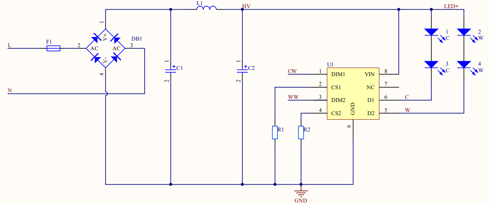
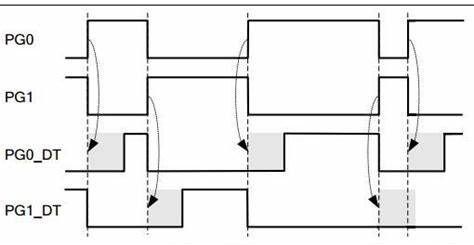
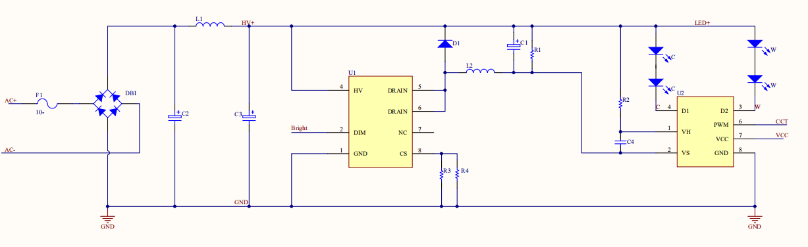
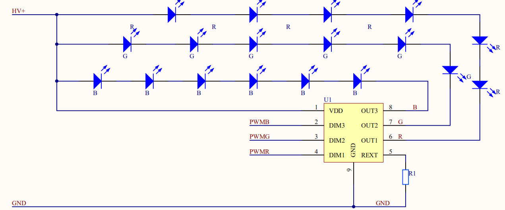

# PWM 驱动

更新时间：2024-06-25 14:34:13[下载pdf](javascript:void(0);)

## 概述

PWM 调光， 通过 PWM 波开启和关闭 LED 来改变正向电流的导通时间，以达到亮度调节的效果。该方法基于人眼对亮度闪烁不够敏感的特性，使负载 LED 时亮时暗。如果亮暗的频率超过 100 Hz，人眼看到的就是平均亮度， 而不是 LED 在闪烁。PWM 通过调节亮和暗的时间比例调节亮度，在一个 PWM 周期内，人眼感知 100 Hz 内的光闪烁，是一个累积的过程。灯光亮的时间在整个周期中所占的比例越大， 人眼感觉越亮。

## 优势

- 应用简单。只需要一个 PWM 口驱动 MOS 管等简单的外围器件就可实现调光。
- 无色偏。LED 始终工作在满幅度电流与零之间。
- 极高的调光精确度。因为脉冲波形完全可以控制到很高的精度，所以很容易实现万分之一的精度。
- 无闪烁。即使在很大范围内调光，也不会发生闪烁现象。PWM 调光不会改变恒流源的工作条件（升压比或降压比），也不会造成过热问题。

## 注意事项

- 脉冲频率的选择：因为 LED 处于快速开关状态，假如工作频率很低，人眼会感到闪烁，为了充分利用人眼的视觉残留现象，LED 工作频率应当高于 100 Hz，最好为 200 Hz。
- 消除调光引起的噪声：一般 LED 驱动器基于开关电源的原理，PWM 调光频率为 200 Hz ~ 20 kHz，则 LED 驱动器周边电感和输出端电容容易产生人耳听得见的噪声。一般来讲，可以通过以下方法进行解决：
  - 开关频率提高到 20 kHz 以上，可以跳出人耳听觉的范围。但是频率过高容易产生一些问题，因为各种寄生参数的影响，会使脉冲波形（前后沿）产生畸变，降低调光精度。
  - 找出发声器件加以处理。实际上，主要的发声器件来自输出端的陶瓷电容，因为陶瓷电容通常是由高介电常数的陶瓷做成的，这类陶瓷都具有压电特性，在 200 Hz 的脉冲作用下就会产生机械振动而发声。解决方法是采用钽电容代替，但是高压钽电容价格昂贵，会增加一些成本。

## PWM 驱动调光方案

### 两路调光

两路调光方案分为 CW 和 CCT 驱动两种方式。

#### CW 调光

CW 是两路 PWM 信号混合控制亮度和色温的一种调光调色方式。两路信号分别为 CW 和 WW，其中 CW 控制冷光（高色温），WW 控制暖光（低色温）。单路调光时使用 CW 控制信号。

- CW 互补输出
  如上图所示，PG0 和 PG1 是互补输出，在 LED 照明应用中，采用 PWM 互补输出对于电源硬件设计是有优势的。

  - 优势：PWM 控制一般都是高电平的时候 MOS 会打开。对于两路 CW 互补输出，高的时候打开，低的时候不打开，两个信号不会同时为高，不会从输入端抽电流；但如果不是互补输出，就存在同时为高的时候，这时两路同时打开，相当于同时从输入抽电流，按功率来说，一路是 9W，两路 PWM 同时为高电平的时间就是 18W 的一个总输出。虽然总体求平均是一样的，但对输入端来说不一样。
  - 注意点：
    - 最大功率设置：以每一路灯光 PWM 最大占空比为 100% 为基准，互补输出两路灯光的总输出加起来占空比最大只能为 100%，如果需要高于 100% 的功率输出，则需要配置 CW 两路为非互补输出。
    - 色温无偏差：对于 CW 两路灯光输出，如果功率输出高于 100%，仍要注意保证两路色温计算无偏差。

- 死区设置
  照明部分应用方案中，硬件上使用了 H 桥。每个桥的上半桥和下半桥是是绝对不能同时导通的，但高速的 PWM 驱动信号在达到功率元件的控制极时，往往会由于各种各样的原因产生延迟的效果，导致某个半桥元件在应该关断时没有关断，造成功率元件烧毁的后果。
  实际应用中应该在上半桥关断后，延迟一段时间再打开下半桥，或在下半桥关断后，延迟一段时间再打开上半桥，从而避免功率元件烧毁。这段延迟时间就是死区保护。
  如下图 PG0_DT 和 PG1_DT 的阴影部分，就是 PWM 输出设置的死区时间。这段时间，是为了使 H 桥或半 H 桥的上下管不会因为开关速度问题发生同时导通而设置的一个保护时段。所以在这段时间，上下管都不会有输出，死区时间一般只占百分之几的周期。

  

#### CCT 调光

CCT 为亮度和色温分别控制的一种实现方式，其中一路信号 Bright 控制亮度，一路信号 CCT 控制色温。
如下图所示， U1 选用晶丰明源的 BP1371，U2 选用 BP5926A，前级用于亮度调节，后级用于色温调节。

BP5926A 是一款内置双路 100V MOSFET 的高性能无极调色控制芯片，通过调节输入的 PWM 信号占空比，来调整两路 LED 光源的发光比例，从而达到调色目的。
两路 LED 输出电流互补，在调色过程中总电流不变，等于恒流源的电流。
CCT 驱动调光前级由于电容电感在上电期间进行充电，断电时进行放电，如果软件处理不当，那么在设备上下电过程中或者彩光及场景调节的过程中，色温脚的值变化会造成闪光的问题。

我们在对 CCT 驱动处理上始终牢记以下原则：

- CCT 驱动的两路输出是以亮度、色温的概念进行控制输出的。当调节亮度时，我们只改变 Bright 脚位的 PWM 输出；当调节色温时，只改变 CCT 脚位的 PWM 输出。在 Bright、CCT 两路参数的功能调节中，非必须调节的那一路参数，在软件设计时务必保持不变，否则可能造成闪灯等异常情况。
- 关灯的时候，不能直接发送两路值为 0 进行关灯。务必等待 2000 ms 后，电容放电完毕，再发送 Bright、CCT 两路 PWM 的值为 0。
- 手动移除配网时，CCT 驱动先将亮度值改为 0，色温维持当前值发送到驱动，等待一个延时时间（当前设定为 200 ms）后，再触发移除配网的动作。

### 三路调光

该方案中，模组输出 PWMR、PWMG、PWMB 三路 PWM 信号。线性恒流驱动可以实现 RGB 电流的恒定输出。
