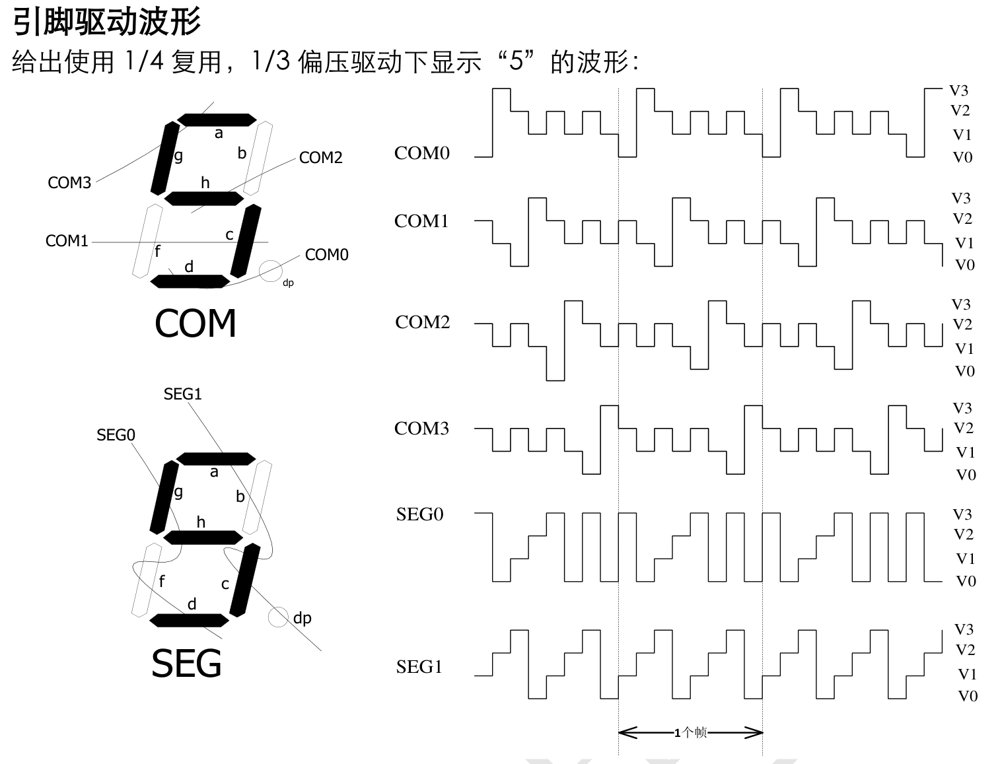
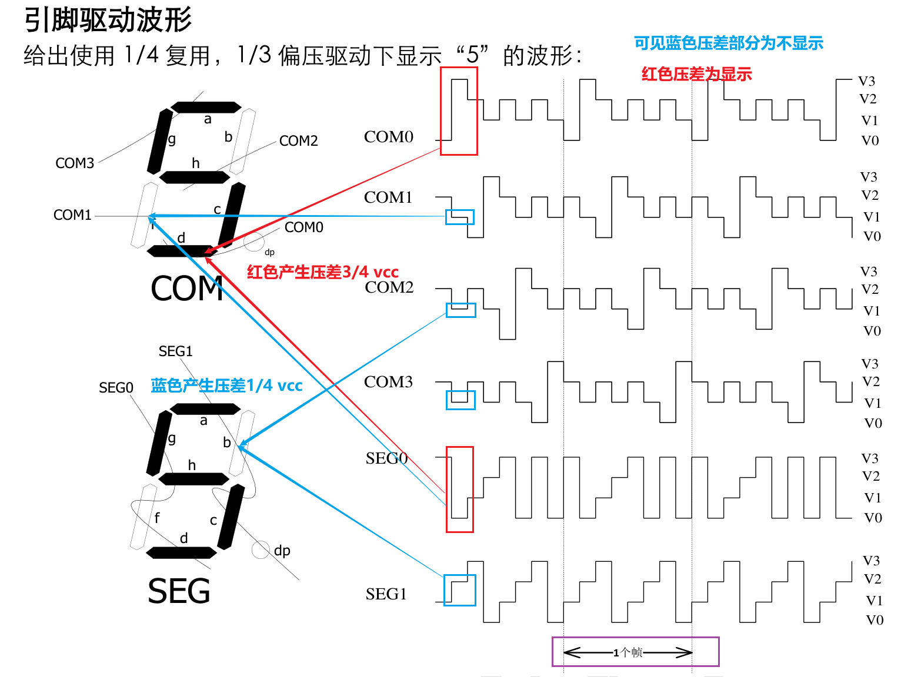

# 液晶显示技术(一)

液晶显示器泛指利用液晶技术所制作出来的显示器。而今日对液晶显示器这个名称，大多是指使用于笔记型计算机，或是桌上型计算机应用方面的显示器。也就是薄膜晶体管液晶显示器。其英文名称为 Thin-film transistor liquid  crystal display, 简称之TFT LCD。从它的英文名称中我们可以知道，这一种显示器它的构成主要有两个特征，一个是薄膜晶体管，另一个就是液晶本身。


从上图的LCD基本构造图中，我们可以看到LCD液晶显示器是在两片平行的玻璃当中放置液态的晶体，两片玻璃中间有许多垂直和水平的细小电线，透过通电与否来控制杆状水晶分子改变方向，将光线折射出来产生画面。我们日常电脑上用的液晶显示器通过TFT来控制每一个像素的通光量从而显示图形。正因为如此，我们也把它称作主动矩阵薄膜晶体管液晶显示器(Active Matrix TFT LCD)。

所以说液晶显示器的关键技术和主要构成材料为液晶就是液晶。那么，到底液晶是个什么物质呢，我们先来做一个简单的了解。所谓液晶其实就是一种介乎于液体和晶体之间的物质，是指在某一温度范围内，从外观看属于具有流动性的液体，同时又具有光学双折射性的晶体。它的奇妙之处是可以通过电流来改变他的分子结构。液晶物质在熔融温度首先变为不透明的浑浊液体，此后通过进一步的升温继续转变为透明液体。因此液晶包括两种含义：一是指处于固体相和液体相中间状态的液晶相；二是指具有上述液晶相的物质。

正因为如此，我们可以为液晶加上不同的工作电压，让他控制光线的通过量。从而显示变化万千的图像。液晶本身并不会发光，因此所有的液晶显示器都需要背光照明。一般来说背光源就是多个冷阴极灯管。背光灯管在液晶显示器打开的同时就一直被点亮的。而为了控制透光率，人们把液晶单元放在了两片偏振玻璃片之间。这样，当液晶单元没有被加上电压的时候，处于初始状态，这样背光在通过时就会被被液晶单元的特殊分子结构所极化，光线被扭曲90度，从而通过前面的偏振玻璃被人们所感知。同理，当液晶单元被加上电压之后，他的分子结构会被改变，这样光线的角度并不会被扭曲。于是光被显示器前面的偏振玻璃所阻隔，无法被人们所感知。

我们一般都认为物质像水一样都有三态, 分别是固态，液态和气态。其实，对于不同的物质，可能有其它不同的状态存在。人们熟悉的物质状态（又称相），除了上述气、液、固态，较为生疏的是电浆和液晶。液晶相要具有特殊形状分子组合才会产生，它们可以流动，又拥有结晶的光学性质。它是介于固体跟液体之间的一种状态，其实这种状态仅是材料的一种相变化的过程，只要材料具有上述的过程，即在固态及液态间有此一状态存在，物理学家便称之为液态晶体。


这种液态晶体的首次发现，可追溯到19世纪末。在公元1888年，被奥地利的植物学家Friedrich Reinitzer在作加热胆甾醇的苯甲酸脂实验时发现。他其在观察从植物中分离精制出的安息香酸胆固醇(cholesteryl benzoate) 的融解行为时发现，此化合物加热至145.5度℃时，固体会熔化，但溶化后不是透明的液体，而是一种呈混浊态的粘稠液体，并发出多彩而美丽的珍珠光泽。这是一种介于固相和液相间的半熔融流动的白浊状液体。这种状况会一直维持温度升高到178.5度℃，才形成清澈的等方性液态(isotropic liquid)。这种混浊态粘稠的液体是什么呢？

隔年，在1889年，研究相转移及热力学平衡的德国物理学家O.Lehmann，对此化合物作更详细的分析。他在偏光显微镜下发现，此黏稠的半流动性白浊液体化合物，具有异方性结晶所特有的双折射率(birefringence)之光学性质，即光学异相性(optical anisotropic)。故将这种似晶体的液体命名为液晶。此后，科学家将此一新发现的性质，称为物质的第四态-液晶(liquid crystal)。它在某一特定温度的范围内，会具有同时液体及固体的特性。

液晶分为两大类：溶致液晶和热致液晶。前者要溶解在水或有机溶剂中才显示出液晶态，后者则要在一定的温度范围内才呈现出液晶状态。而作为显示技术应用的液晶都是热致液晶。

一般以水而言，固体中的晶格因为加热，开始吸热而破坏晶格，当温度超过熔点时便会溶解变成液体。而热致型液晶则不一样，如下图所示，当其固态受热后，并不会直接变成液态，会先溶解形成液晶态。当您持续加热时，才会再溶解成液态(等方性液态)。这就是所谓二次溶解的现象。而液晶态顾名思义，它会有固态的晶格，及液态的流动性。


下图是热致型液晶分布的温度范围：


当液态晶体刚发现时，因为种类很多，所以不同研究领域的人对液晶会有不同的分类方法。在1922年由G. Friedel利用偏光显微镜所观察到的结果，将液晶大致分为Nematic，Smectic及Cholesteric三类。但是如果是依分子排列的有序性来分，则可以分成以下四类：层状晶体，线状晶体，胆固醇晶体，碟状（柱状）晶体，见下图：


1、层状液晶(Smectic)，又称近晶相液晶

其结构是由液晶棒状分子聚集一起，形成一层一层的结构。其每一层的分子的长轴方向相互平行。且此长轴的方向对于每一层平面是垂直或有一倾斜角。由于其结构非常近似于晶体，所以又称做近晶相。


其秩序参数S(order parameter)趋近于：在层状型液晶层与层间的键结会因为温度而断裂，所以层与层间较易滑动。但是每一层内的分子键结较强，所以不易被打断。因此就单层来看，其排列不仅有序且黏性较大。如果我们利用巨观的现象来描述液晶的物理特性的话，我们可以把一群区域性液晶分子的平均指向定为指向矢(director)，这就是这一群区域性的液晶分子平均方向。而以层状液晶来说，由于其液晶分子会形成层状的结构，因此又可就其指向矢的不同再分类出不同的层状液晶。当其液晶分子的长轴都是垂直站立的话，就称之为"Sematic A phase"。如果液晶分子的长轴站立方向有某种的倾斜(tilt)角度，就称之为"Sematic C phase"。


近晶相液晶按层状排列，由棒状或条状分子呈二维有序排列组成。层内分子长轴相互平行，其方向可以垂直于层面或与层面成倾斜排列。层与层之间的作用较弱，容易滑动，因此具有二维的流动特性。近晶相液晶的粘度与表面张力都较大，用手摸有似肥皂的滑涩感，对外界的电、磁、温度变化都不敏感。这种液晶光学上显示正的双折射性。

2、线状液晶(Nematic)，又称向列相液晶（Nematic）或者丝状液晶

Nematic这个字是希腊字，代表的意思与英文的thread是一样的。主要是因为用肉眼观察这种液晶时，看起来会有像丝线一般的图样。这种液晶分子在空间上具有一维的规则性排列，所有棒状液晶分子长轴会选择某一特定方向(也就是指向矢)作为主轴并相互平行排列，而且不像层状液晶一样具有分层结构。


与层状液晶比较其排列比较无秩序，也就是其秩序参数S较层状型液晶较小。另外其黏度较小，所以较易流动(它的流动性主要来自对于分子长轴方向较易自由运动)。线状液晶就是现在的TFT液晶显示器常用的TN(Twisted nematic)型液晶。下图是线状液晶在偏光显微镜下看到的图示：


3、胆固醇液晶(cholesteric)，也称螺旋状液晶

这个名字的来源，是因为它们大部份是由胆固醇的衍生物所生成的。

但有些没有胆固醇结构的液晶也会具有此液晶相。这种液晶，和层状液晶一样具有层状结构，如果把它的一层一层分开来看，会很像线状液晶。但是在Z轴方向来看，会发现它的指向矢会随着一层一层的不同而像螺旋状一样分布，而当其指向矢旋转360度所需的分子层厚度就称为pitch。正因为它每一层跟线状液晶很像，所以也叫做Chiral Nematic phase。分子长轴在层内是相互平行的，而在垂直这个平面上，每层分子都会旋转一个角度。液晶整体呈螺旋结构。螺距的长度是可见光波长的数量级。以胆固醇液晶而言，与指向矢的垂直方向分布的液晶分子，由于其指向矢的不同，就会有不同的光学或是电学的差异，也因此造就了不同的特性。由于胆固醇液晶的分子排列旋转方向可以是左旋，也可以是右旋，当螺距与某一波长接近时，会引起这个波长光的布拉格散射，呈某一种色彩。胆固醇液晶具有负的双折射性质。一定强度的电场、磁场也可使胆甾相液晶转变为向列相液晶。胆固醇液晶易受外力的影响，特别对温度敏感，由于温度主要引起螺距的改变，因此胆甾相液晶随温度改变颜色。


4、碟状液晶(disk)，也称为柱状液晶

碟状液晶以一个个的液晶来说，它是长的像碟状(disk)，但是其排列就像是柱状(discoid)。1977年，印度S.Chandrasekhar等合成了碟形分子液晶。这些分子均具有一个扁平的圆形或椭圆形刚性中心部分，周围有长而柔软的脂肪族链。盘形分子液晶具有向列相、胆甾相和柱状相3类结构。盘形分子的向列相和胆甾相与上述长形分子相似，只需把长形分子的长棒轴用盘形分子的法向轴代替即可。柱状相是盘形分子所特有的结构，盘形分子在柱状相中堆积成柱，在同一柱中分子间隔可以是规则有序的，当然，柱状相也可以是不规则无序的，不同柱内的分子质心位置无相关性。各分子柱可以排列成六角形或长方形。

如果我们是依分子量的高低来分的话则可以分成高分子液晶(polymer  liquid crystal，聚合许多液晶分子而成)与低分子液晶两种。此种分类来说，TFT液晶显示器是属于低分子液晶的应用。

如上文所述，倘若就液晶态的形成原因，则可以分成因为温度形成液晶态的热致型液晶(thermotropic)，和因为浓度而形成液晶态的溶致型液晶(lyotropic)。以前面所提过的分类来说，层状液晶与线状液晶一般多为热致型的液晶，是随着温度变化而形成液晶态。而对于溶致型的液晶，需要考虑分子溶于溶剂中的情形。当浓度很低时，分子便杂乱的分布于溶剂中而形成等方性的溶液，不过当浓度升高大于某一临界浓度时，由于分子已没有足够的空间来形成杂乱的分布，部份分子开始聚集形成较规则的排列，以减少空间的阻碍。因此形成异方性(anisotropic)之溶液。所以溶致型液晶的产生就是液晶分子在适当溶剂中达到某一临界浓度时，便会形成液晶态。溶致型的液晶有一个最好的例子，就是肥皂。当肥皂泡在水中并不会立刻便成液态，而其在水中泡久了之后，所形成的乳白状物质，就是它的液晶态。

总结一下，热致液晶——当液晶物质加热时，在某温度范围内呈现出各向异性的熔体；此类液晶与显示器件关系密切，液晶显示器所用的大多是热致液晶物质。溶致液晶——是溶解于水或有机溶剂，具有和液体一样可以流动，又类似于晶体各向异性性质的有机物质。

热致液晶的形成有两种方式，既能从固相加热得到，也能从液相冷却而得到，称之为相变。而相变有两种情况：一种称为互变相变型。当相变温度为T1和T2时，会产生可逆相变。即


另一种称为单变相变型。在相变中只有液体冷却时才能形成液晶相。另外，有一种液晶物质能够呈现出两种以上不同类型的液晶相，或若干近晶相。即


# 液晶显示技术(二)

前面介绍了液晶的基本定义和概念，以及它的常见分类。目前己发现的液晶有近万种。下面简单介绍一下液晶的各种物理性质。由于液晶分子的结构为异方性(Anisotropic)，所以所引起的光电效应就会因为方向不同而有所差异，简单的说也就是液晶分子在介电系数及折射系数等等光电特性都具有异方性，因而我们可以利用这些性质来改变入射光的强度，以便形成灰阶，来应用于显示器组件上。以下我们要讨论的，是液晶属于光学跟电学相关的特性，大约有以下几项：

物理性质的各向异性，如下图，分子的轴向∥和垂直于分子长轴的方向⊥有不同的物理性质：即

折射率n： n∥≠n⊥，

介电常数ε：ε∥≠ε⊥、

磁化率χ：χ∥≠χ⊥

电导率σ：σ∥≠σ⊥，

粘度系数η：η∥≠η⊥


1、介电常数ε(dielectric permittivity)各向异性：

有两种情况：Δε=（ε∥-ε⊥）＞0或＜0 

当Δε＞0时（Δε为10～20）为P型液晶，用NP表示---正介电各向异性液晶，可以用在平行配位，施加强电场时E＞Ec（Ec为液晶分子的初始排列开始产生改变时的阈值电场)，分子长轴就会沿着与电场平行方向排列。

当Δε＜0时（Δε为-1～ -2）为N型液晶，用NN表示----负介电各向异性液晶，只可用在垂直配位才能有所需要的光电效应。施加强电场时分子长轴就会沿着与电场E成垂直方向排列。因为处于这种排列时液晶的电势能We变得最小。


液晶分子会因介电系数异方性为正或是负值，来决定液晶分子的转向是平行或是垂直于电场，来决定光的穿透与否。另外，介电各向异性与液晶分子的极化度有关，在可见光范围内液晶常常是ε∥＞ε⊥。现在TFT LCD上常用的TN型液晶大多是属于介电系数正型的液晶。当介电系数异方性Δε(=ε//-ε⊥)越大的时候, 则液晶的临界电压(threshold voltage)就会越小。这样一来液晶便可以在较低的电压操作。


式中参数S称为有序参数S：

液晶分子沿一定方向的平行排列虽有序，有序排列的程度的定量描述即S：图若一个液晶分子的长轴方向与分子群长轴方向指向矢有一定夹角θ时取向有序参数用θ角的平均值(cosθ)表示，故有序参数S定义为：


对各向同性液体，分子长轴的取向完全紊乱时，S＝0。当液晶分子群处于完全平行取向的理想状态时，S＝1。S＝l 的液晶分子排列时温度条件必须是0K。一般向列型液晶在N—I相变点附近的S=0.3，在非常低的温度时S＝0.8。S值一般不受强电场或强磁场的影响。

2、折射系数n(refractive index) ，又称折射系数：

由于液晶分子大多由棒状或是碟状分子所形成，因此跟分子长轴平行或垂直方向上的物理特性会有一些差异，所以液晶分子也被称作是异方性晶体。与介电系数一样，液晶分子的指向矢方向相当于单轴晶体的光轴，折射系数也依照与指向矢垂直或平行振动的入射光方向就会产生两个方向的向量，分别为n∥、n⊥折射率。

折射率（折射系数）的定义：光在其它介质中的传播速度与光在真空中的速度（c）的比值。n=C/V，就可以得到光在其它介质中的传播速度：V=C/n；

光在液晶中传播时会发生双折射；折射率的各向异性，显示出双折射性。对单光轴(uniaxial)的晶体来说，就有两个不同折射系数的定义no和ne。

no——它是指对于光电矢量振动方向与晶体光轴相垂直的寻常光的折射系数，也即指对于ordinary ray的折射系数，所以才简写成no。而ordinary ray是就是指其光波的电场分量（光电矢量振动方向）是垂直于晶体光轴的称法，称为寻常光。

ne——它是指对于光电矢量振动方向与晶体光轴相平行的非寻常光的折射系数。也即指对于extraordinary ray的折射系数，所以才简写成ne。而 extraordinary ray是指其光波的电场分量（光电矢量振动方向）是平行于晶体光轴的，称为非寻常光。

依照上面所述，对层状液晶、线状液晶(向列型液晶和近晶型液晶)而言，由于其液晶分子的长的像棒状,所以其指向矢的方向与分子长轴平行。再参照单光轴晶体的折射系数定义，它会有两个折射率，分别为光的行进方向垂直于液晶长轴方向n⊥(=no)及光的行进方向平行液晶长轴方向n// (= ne)两种，所以当光入射液晶时，便会受到两个折射率的影响，造成在垂直液晶长轴与平行液晶长轴方向上的光速会有所不同。由此，我们就定义了双折射率(birefrigence)，Δn = ne-no，为上述的两个折射率的差值。


通常情况下，对层状液晶、线状液晶(向列型液晶和近晶型液晶)而言，光的行进方向与分子长轴平行时的速度Ve，小于垂直于分子长轴方向的速度Vo。这意味着平行分子长轴方向的折射率大于垂直方向的折射率(因为折射率与光速成反比，n//＞n⊥)，即非寻常光的折射率ne大于寻常光的折射率no (ne= n//, no= n⊥)，也就是ne-no > 0 。所以双折射率Δn> 0，我们把它称做是光学正型的液晶。


上图中，寻常光表现为球面，非寻常光表现为旋转的椭圆体。且折射率no远远小于ne，只有在指向矢的方向上才是一致的。通常n//＞n⊥，所以Δn 为正值，具有正光性。因此，层状液晶与线状液晶几乎都是属于光学正型的液晶。

对于胆固醇液晶，因为与指向矢垂直的螺旋轴相当于光轴，所以，当光的波长比螺距大很多时，主折射率n0和ne为：


其中，n//＞n⊥关系仍然成立，Δn= ne-no＜0，所以双折射率Δn< 0。我们称它做是光学负型的液晶，因此胆固醇液晶具有负光性，多为光学负型的液晶。


由于液晶具有单轴晶体的光学各向异性，所以具有以下光学特性， 液晶器件基本就是根据这三种光学特设计制造的。

能使入射光沿液晶分子偶极矩的方向偏转；使入射的偏光状态，及偏光轴方向发生变化；使入射的左旋及右旋偏光产生对应的透过或反射。

由于液晶折射率各向异性，使入射光沿分子长轴方向偏转或使偏振光状态和振动方向发生改变，以致产生光反射、透射等，这就是液晶显示器件的重要工作原理。

3、电导率σ各向异性：

用σ表示：向列型的（离子沿分子轴相较容易）大于1，近晶型的（离子在层间隙易移动）小于1。温度增加，电导σ增加。

4、粘度系数η：

会影响器件的响应时间τr和下降时间τf，会影响液晶分子的转动速度与反应时间(response time), 其值越小越好。但是此特性受温度的影响最大。粘度系数η越大，τr和τf两个时间延长；而温度增加，η下降。分子链越长，η越大；极性越强η越大。

5、磁化率c (magnetic susceptibility)

磁各向异性，也因为液晶的异方性关系，分成c// 与c⊥，而磁化率异方性则定义成Δc= c // -c⊥。

6、弹性常数(elastic constant :κ11 , κ22 , κ33 )

液晶受扰动时，分子取向有恢复平行排列的能力，称为曲率弹性，弹性常数一般很小。分子排列很容易受到电场、磁场和应力等作用而变形，在应力作用下，会产生三种变形：扩展状态的展曲、扭曲状态的扭曲和弯曲状态的弯曲弹性。所以它包含了三个主要的常数，分别是,κ11指的是展曲(splay)的弹性常数，κ22 指的是扭曲(twist)的弹性常数，κ33 指的是弯曲(bend)的弹性常数，常数各向异性。对于近晶型液晶，展曲κ11＝0；向列型液晶，固有扭曲κ22＝0。

# 液晶显示技术(三)

前面介绍了液晶的各种物理性质，即由于液晶分子的结构为异方性 (Anisotropic)，所以所引起的光电效应就会因为方向不同而有所差异，简单的说也就是液晶分子在介电系数及折射系数等等光电特性都具有异方性。

由上文知道液晶特性中最重要的就是液晶的介电系数与折射系数。介电系数是液晶受电场的影响决定液晶分子转向的特性，而折射系数则是光线穿透液晶时影响光线行进路线的重要参数.而液晶显示器就是利用液晶本身的这些特性，适当的利用电压，来控制液晶分子的转动，进而影响光线的行进方向，来形成不同的灰阶，作为显示影像的工具。

1、液晶的双折射现象：液晶会像晶体那样，因折射率的各向异性而发生双折射现象，从而呈现出许多有用的光学性质：能使入射光的前进方向偏于分子长轴方向；能够改变入射光的偏振状态或方向；能使入射偏振光以左旋光或右旋光进行反射或透射。这些光学性质，都是液晶能作为显示材料应用的重要原因。

双折射: 光束入射到各向异性的晶体，分解为两束光而沿不同方向折射的现象。它们为振动方向互相垂直的线偏振光。在光的传播方向上，光矢量只沿一个固定的方向振动，这种光称为平面偏振光引，由于光矢量端点的轨迹为一直线，又叫做线偏振光。旋光现象，当线偏振光通过某些物质时，其振动面将以光的传播方向为轴发生旋转，这称为旋光现象。

2、电控双折射效应：对液晶施加电场，使液晶的排列方向发生变化，因为排列方向的改变，按照一定的偏振方向入射的光，将在液晶中发生双折射现象。这一效应说明，液晶的光轴可以由外电场改变，光轴的倾斜随电场的变化而变化，因而两双折射光束间的相位差也随之变化，当入射光为复色光时，出射光的颜色也随之变化。因此液晶具有比晶体灵活多变的电旋光性质。

3、动态散射：当在液晶两极加电压驱动时，由于电光效应，液晶将产生不稳定性，透明的液晶会出现一排排均匀的黑条纹，这些平行条纹彼此间隔数10µm，可以用作光栅。进一步提高电压，液晶不稳定性加强，出现湍流，从而产生强烈的光散射，透明的液晶变得混浊不透明。断电后液晶又恢复了透明状态，这就是液晶的动态散射（dynamic scattering）。液晶材料的动态散射是制造显示器件的重要依据。

4、旋光效应：在液晶盒中充入向列型液晶，把两玻璃片绕着与它们互相垂直的轴相扭转90°，向列型液晶的内部就发生了扭曲，这样就形成了一个具有扭曲排列的向列型液晶的液晶盒。在这样的液晶盒前、后放置起偏振片和检偏器，并使其偏振化方向平行，在不施加电场时，让一束白光射入，液晶盒会使入射光的偏振光轴顺从液晶分子的扭曲而旋转90°。电控双折射、旋光效应都可以应用于彩色显示的实现。

5、宾主效应：将二向色性染料掺入液晶中，并均匀混合起来，处在液晶分子中的染料分子将顺着液晶指向矢量方向排列。在电压为零时，染料分子与液晶分子都平行于基片排列，对可见光有一个吸收峰，当电压达到某一值时，吸收峰值大为降低，使透射光的光谱发生变化。可见，加外电场就能改变液晶盒的颜色，从而实现彩色显示。由于染料少，且以液晶方向为准，所以染料为“宾”，液晶则为“主”，因此得名“宾主（guest-host，G-H）”效应。二色向性是指物质对光的吸收系数依赖于光的偏振状态。

当然啦，单靠液晶本身是无法当作显示器的, 还需要其它的材料来帮忙，以下我们要来介绍有关液晶显示器的各项材料组成与其操作原理。

**偏光板(polarizer)**

记得在高中时的物理课，当教到跟光有关的物理特性时，做了好多的物理实验，目的是为了要证明光也是一种波动。而光波的行进方向，是与电场及磁场互相垂直的。同时光波本身的电场与磁场分量，彼此也是互相垂直的。也就是说行进方向与电场及磁场分量，彼此是两两互相平行的。见下图：


而偏光板的作用就像是栅栏一般， 会阻隔掉与栅栏垂直的分量，只准许与栅栏平行的分量通过。所以如果我们拿起一片偏光板对着光源看，会感觉像是戴了太阳眼镜一般，光线变得较暗。但是如果把两片偏光板迭在一起，那就不一样了。当您旋转两片的偏光板的相对角度，会发现随着相对角度的不同，光线的亮度会越来越暗。当两片偏光板的栅栏角度互相垂直时，光线就完全无法通过了(见下图)。


而液晶显示器就是利用这个特性来完成的。利用上下两片栅栏互相垂直的偏光板之间，充满液晶。给两侧的液晶板极加上电压后，分子的极性方向会发生变化，旋转90度，这样会使透过阿光的偏振方向发生改变。所以可以利用电场控制液晶转动，来改变光的行进方向。如此一来，不同的电场大小，就会形成不同灰阶亮度了。请见下图，为TN（Twist Nematic）型LCD的结构。


液晶材料在施加电场（电流）时，液晶分子由某种排列方式转变成另一种排列状态，引起其光学性质会发生变化，所产生的这种现象叫电光调制现象，这种效应则称为液晶的电光效应。液晶显示器正是利用液晶的电光效应，实现光被电信号的调制。液晶的电光效应在液晶显示器的设计中被广泛采用。目前发现的电光效应种类很多，产生电光效应的机理也较为复杂，但就其本质来讲都是液晶分子在电场作用下改变其分子排列或造成分子变形的结果。由于液晶的介电常数各向异性，具有特定的初始分子排列的液晶在外电场作用下，排列发生改变导致光学性质的变化的现象——称做弗雷德利克斯(Freedericksz)过渡。


液晶的电场型效应主要有下面这些--- ECB效应、TN效应、GH效应、PC效应等，都是根据介电常数的各向异性所产生的介电矩的作用而产生的效应。是指液晶在外电场下产生的效应。

热效应则根据使根用液晶材料的不同分为：热光效应(近晶型效应)和电热光效应(胆甾型效应)。热效应---是指随着温度变化而产生的效应。

下面是液晶的电光效应和热光效应分类汇总：


液晶的电光和热光效应通常使用制作的液晶盒来进行观察。液晶盒——是由蒸镀了透明电极的两块玻璃板之间注入厚度约为10μm的液晶层组成，同时要对玻璃基板与液晶的接触面施行一种表面处理，使液晶分子形成一种均一的排列方式。它属于受光型(非发光型)显示器件。液晶分子的晶体结构在电场、磁场、温度、应力等影响下，由原始的特定排列状态再排列成另一种状态，使其光学性质（液晶盒的双折射性、旋光性、偏振光二色性、光散射性、旋光分散性等）发生变化，变换成视觉的变化

# 液晶显示技术(四)

前面介绍了液晶的各种物理性质，液晶的电光效应和热光效应。


液晶的电光和热光效应通常使用制作的液晶盒来进行观察。液晶盒——是由蒸镀了透明电极的两块玻璃板之间注入厚度约为10μm的液晶层组成，同时要对玻璃基板与液晶的接触面施行一种表面处理，使液晶分子形成一种均一的排列方式。它属于受光型(非发光型)显示器件。液晶分子的晶体结构在电场、磁场、温度、应力等影响下，由原始的特定排列状态再排列成另一种状态，使其光学性质（液晶盒的双折射性、旋光性、偏振光二色性、光散射性、旋光分散性等）发生变化，变换成视觉的变化。

下面先简单介绍几种早期的液晶显示器类型：

1、动态散射（DS-LCD）型液晶显示器件（1968年～1972年）


DS效应——是由于电导率的各向异性所产生的电导矩的作用而产生的效应称为电流型效应。当这种效应产生时，将要伴随着电荷的流动。用溶解了的有机电介质等导电物质、配成电阻率为5×1010Ω·cm以下的N N型液晶，置于两块透明电极基板间，做成沿面排列的液晶盒。NN型液晶的偶极矩与长轴有一定夹角。加电场使偶极矩沿电场方向，其长轴与电场产生一定夹角，液晶中掺杂带电粒子受电场作用向两极移动，碰撞液晶分子使其混乱，同时电场又使偶极矩恢复原有取向，分子就不断处于摇摆状态，甚至紊乱。液晶中不同区域有不同的折射率，光经过时发生散射变为乳白色。

在不通电的情况下，液晶盒呈透明状态。当通过低频交流电时，如果不超过阈值电压Uth时，入射光通过液晶，液晶盒保持透明状态。当电压超过阈值电压Uth时，在液晶层内形成一种因离子运动而产生的“威廉畴(Williams)”，实际会产生分子团运动，引起紊流。继续增加电压，当U》Uth 时，最终会使液晶层内形成紊流和扰动，便产生了与周围排列不同的无数微小的双折射区。由于在这个区域上存在不规则的折射率梯度，并对光产生强烈的散射，称为动态散射(DS)效应。DS液晶显示器件是无偏振片结构，电流较大，一般在背面衬以黑色衬底。

2、电控双折射(ECB)效应型液晶显示器件

是通过外加电场来控制液晶盒的双折射率。作为多色、彩色液晶显示方式非常重要。根据液晶盒分子排列的不同，ECB效应可分为三种方式：

垂直排列相畸变(DAP)方式

沿面排列方式

混合排列(HAN)

i.NN型垂直排列向列型液晶的ECB效应

将Δε＜0的NN型向列型液晶镶嵌在两块透明电极玻璃基板间，使所有液晶分子的长轴与基板平面垂直排列相畸变(DAP)液晶盒如下图：


上图分别为无外加电压U=0和有外加电压U＞Uth时ECB型电光效应(DAP方式)的原理图。把液晶盒放置在相互垂直的两偏振片间，则如果在无外加电压时，当光线垂直入射到液晶盒上时，入射偏振光的方向与DAP排列液晶盒的光轴方向平行，且向列型液晶的光轴与液晶分子的长轴一致，所以入射偏振光通过液晶盒时不发生双折射，光线不能通过第二个偏振片(检偏振片)，就不透明。

如果当施加外加电压时，除处于电极表面附近的分子外，其余分子长轴偏离电场方向、倾斜角度Ф随着电压的增加而增大，这时入射光的偏振方向和分子的光轴不一致，导致线偏振光发生双折射而变为椭圆偏振光，使一部分光线能够透过检偏振片而着色。透射光的强度与施加电压大小和入射光的波长有关。

当入射光为白色光时，透过检偏振片所产生的干涉色，将随外加电压的变化而显示出不同色调的光色。当厚20μm液晶盒、用正交偏振片时所观察到各种透射光的干涉颜色。若用平行偏振片时，透射光的干涉颜色与正交偏振片时成为互补色的色调。

ii. NP型向列型液晶的电控双折射(ECB)效应

在沿面排列方式下,若在液晶盒中使用NP型液晶分子长轴与两基板面成平行排列方式时，Uth可降至1-2V。与NN型液晶相比，NP型液晶的介电常数各向异性比较大，色调变化非常清晰。由外加电压产生的干涉色的色调变化顺序相反；

iii. HAN(Hybrid ALigned Nematic)混合排列方式 

HAN是是利用电场来改变双折射率的。

HAN方式：分子在液晶盒中一侧基板表面上作垂直排列，而在另一侧基板表面上作平行排列。使用NP型和NN型两种类型的液晶，不存在明显的Uth，用非常低的电压来驱动的优点。

3、扭曲向列型液晶显示器件（TN-LCD）（1971年～1984年）

扭曲向列型液晶盒的基本结构如下图所示，在两块带有氧化铟锡In2O3-SnO2（简称ITO）透明导电电极的玻璃基板上涂有称为取向层的聚酰亚胺聚合物薄膜，用摩擦的方法在表面形成方向一致的微细沟槽，在保证两块基板上沟槽方向正交的条件下，将两块基板密封成间隙为几个微米的液晶盒，用真空压注法灌入正性向列相液晶并加以密封，由于上下基板上取向槽方向正交，无电场作用时液晶分子从上到下扭曲90。


上下两层玻璃与配向膜(alignment film)。这上下两层玻璃主要是来夹住液晶用的。在下面的那层玻璃长有薄膜晶体管(Thin film transistor, TFT), 而上面的那层玻璃则贴有彩色滤光片(Color filter)。这两片玻璃在接触液晶的那一面，并不是光滑的，而是有锯齿状的沟槽。这个沟槽的主要目的是希望长棒状的液晶分子，会沿着沟槽排列。如此一来，液晶分子的排列才会整齐。因为如果是光滑的平面，液晶分子的排列便会不整齐，造成光线的散射，形成漏光的现象。其实这只是理论的说明，告诉我们需要把玻璃与液晶的接触面，做好处理，以便让液晶的排列有一定的顺序。但在实际的制造过程中，并无法将玻璃作成有如此的槽状的分布，一般会在玻璃的表面上涂布一层PI(polyimide)，然后再用布去做磨擦(rubbing)的动作，好让PI的表面分子不再是杂散分布，会依照固定而均一的方向排列。而这一层PI就叫做配向膜，它的功用就像玻璃的凹槽一样，提供液晶分子呈均匀排列的接口条件，让液晶依照预定的顺序排列。

在液晶盒玻璃基板外表面粘贴上线偏振片，使起偏振片的偏振轴与该基片上的摩擦方向一致或垂直，并使检偏振片与起偏振片的偏振轴相互正交或平行，就构成了最简单的扭曲向列液晶盒。

入射光通过偏振片后成为线偏振光，根据线偏振光在扭曲向列液晶中的旋光特性，当上下两块玻璃之间没有施加电压时，液晶的排列会依照上下两块玻璃的配向膜而定。对于TN型的液晶来说，上下的配向膜的角度差恰为90度（见下图) ，所以液晶分子的排列由上而下会自动旋转90度，当入射的光线经过上面的偏光板时，会只剩下单方向极化的光波。通过液晶分子时，由于液晶分子总共旋转了90度，所以当光波到达下层偏光板时，光波的极化方向恰好转了90度。而下层的偏光板与上层偏光板，角度也是恰好差异90度。所以光线便可以顺利的通过，因此，有光输出而呈亮态。


但是如果我们对上下两块玻璃之间施加电压时，由于TN型液晶多为介电系数异方性为正型的液晶(ε// >ε⊥ ，代表着平行方向的介电系数比垂直方向的介电系数大，因此当如果电场大于阈值场强，液晶分子受电场影响时，其排列方向会倾向平行于电场方向.)，所以我们从下图中便可以看到，液晶分子的排列都变成站立着的。此时通过液晶层的偏振光偏振方向不变，经过液晶分子时便不会改变极化方向，因而不能通过检偏振片而呈暗态，即实现了白底上的黑字显示，称为正显示。


同样，加果将起偏振片和检偏振片的偏振轴相互平行粘贴，则可实现黑底白字显示，称为负显示。


扭曲向列液晶产生旋光特性必须满足以下条件：

d×△n>>λ/2 

其中，Δn是液晶材料的折射率各向异性，d是液晶盒的间距，λ为人射光波长，一般的TN-LCD液晶盒取d＝10um。

单纯的TN-LCD本身只有明暗两种情形（或称黑白），可实现白底黑象或者黑底白象的显示，即所谓的NW(Normally white)和NB(Normally Black)。NW(Normally white)，是指当我们对液晶面板不施加电压时，我们所看到的面板是透光的画面，也就是亮的画面，所以才叫做normally white。而反过来，当我们对液晶面板不施加电压时，如果面板无法透光，看起来是黑色的话，就称之为 NB (Normally black)。我们刚才所提到的前面两种图示液晶盒都是属于NW的配置。另外从下图我们可以知道，对TN型的LCD而言, 位于上下玻璃的配向膜都是互相垂直的，而NB与NW的差别就只在于偏光板的相对位置不同而已。对NB来说，其上下偏光板的极性是互相平行的。所以当NB不施加电压时, 光线会因为液晶将之旋转90度的极性而无法透光。为什么会有NW与NB这两种不同的偏光板配置呢? 主要是为了不同的应用环境。一般应用于桌上型计算机或是笔记型计算机，大多为NW的配置。那是因为， 如果你注意到一般计算机软件的使用环境，你会发现整个屏幕大多是亮点，也就是说计算机软件多为白底黑字的应用。既然亮着的点占大多数，用NW当然比较方便. 也因为NW的亮点不需要加电压，平均起来也会比较省电。反过来说，NB的应用环境就大多是属于显示屏为黑底的应用了。


扭曲向列液晶显示器件对外加电压的瞬态响应曲线如下图所示，液晶的电光响应通常滞后几十毫秒，透光率并不和外电压同时增加，而要经过几个脉冲序列后才行始增加，并在经历一定序列脉冲后，达到最大值。停止施加外电压后，透光率也并行立即下降到零而是经过一定时间才达到较小值。


液晶器件电光效应的瞬态响应特性通常用三个常数表征：延迟时间τd，定义为加上电压后透光率达到最大值10%时的时间；上升时间τr，定义为透光率从10％增加到90％所用的时间；下降时间τf，定义为透光率从90％下降到10％所用的时间。三个常数与液晶材料弹性系数、粘滞系数、液晶盒温度和外加电压有关。室温时，TN型器件的τd为数毫秒，τr在10ms~100ms之间，τf在20ms~200ms之间，由于液晶材料的粘滞系数随温度上升而减小，因此τr和τf随环境温度上升而减小。目前普通TN-LCD的响应时间在80ms左右。

TN-LCD主要有静态驱动和矩阵寻址驱动两种驱动方式。所谓静态驱动，是指在需要显示的时间里分别同时给所需显示的段电极加上驱动电压，直到不需要显示的时刻为止。静态驱动的对比度较高，但使用的驱动元器件较多，因此只用于电极数量不多的段式显示。

TN-LCD的矩阵寻址驱动实际上是一种简单矩阵（或无源矩阵）驱动方式，即把TN-LCD的上下基板上的ITO电极做成条状图形，并互相正交，行、列电极交叉点为显示单元，称为像素。按时间顺序逐一给各行电极施加选通电压，即扫描电压，选到某一行时各列电极同时施加相应于该行的信号电压，行电极选通一遍，就显示出一帧信息，若行电极数为N，每一行选通的时间只有一帧时间的1/N，称1/N为该矩阵寻址的占空比，占空比越小，每行在一帧时间内实际显示的时间所占的比例越小。

矩阵寻址法可实现大信息容量的显示，但同时也带来了不可忽视的交叉效应问题。交叉效应的主要原因是由于液晶像素的双向导通特性，外加电压只根据阻抗大小来分配电压，这样，即使只对一个像素加电压，矩阵上的所有像素都会由于矩阵网格的交叉耦合被分摊到一定数值的电压，交叉效应随矩阵行、列数目的增大而加剧，它使图像对比度降低，图像质量变差。采用偏压法可以在一定程度上减小交叉效应的影响，即不让非选的行电极悬浮，而是让它加上V0/b的电压，其中V0是被选电极所加电压，b是偏压比。理论分析表明，当b=N1/2+1时，其中N为矩阵的行数，则相应的交叉效应最小，称此时的b为最佳偏压比。

1971年瑞士人发明了扭曲向列型(TN)液晶显示器，日本厂家使TN-LCD技术逐步成熟，又因制造成本和价格低廉，使其在七八十年代得以大量生产，从而成为主流产品。在1979年～1984年间，其产量年均增长38%，成本年递减18%，销售额年增长12%，这使LCD在显示器件领域的地位仅次于CRT。LCD的高速发展引起了世界电子业界的极大关注，对LCD[技术研究](https://xueqiu.com/S/TRCI?from=status_stock_match)投入的力量和资金与日俱增。TN-LCD的信息容量小，只能用于笔段式数字显示及低路数（16线以下）驱动的简单字符显示。TN-LCD液晶显示的电极可以分为三类：

段型电极，用于显示数字和拼音字母；

固定图形电极，用于显示固定符号、图形；

矩阵型电极，用于显示数字、曲线、图形及视频图像。

下图是一个用TN-LCD制作的常用液晶显示器件。


# 液晶显示技术(五)

前面介绍了三种早期的液晶显示器类型：动态散射（DS-LCD）型液晶显示器件，电控双折射(ECB)效应型液晶显示器件和扭曲向列型液晶显示器件(TN-LCD )，下面继续介绍其他类型的的液晶显示器。

4、超扭曲向列液晶显示器件（Super TN, STN-LCD）（1985～1990年）

80年代初，人们经过理论分析和实验发现，只要将分子的扭曲角增加到180°~270°时，就可大大提高电光特性的响应速度。随着扭曲角的增大，曲线的斜率增加，当扭角达到270°时，斜率达到无穷大。曲线斜率的提高可以允许多路驱动，且可获得敏锐的锐度和宽的视角。 1985年～1990年，LCD销售额年均增长率达32%。此阶段发展最快的是STN-LCD，它从发明到批量生产仅用了五年时间。

STN LCD与TN型LCD在结构上是很相似的，其主要的差别在于TN型的LCD，其液晶分子的排列，由上到下旋转的角度总共为90度。而STN型LCD的液晶分子排列，其旋转的角度会大于180度，一般为270度(请见下图)。


正因为其旋转的角度不一样，其特性也就跟着不一样。我们从下图图中TN型与STN型LCD的电压对穿透率曲线可以知道，当电压比较低时，光线的穿透率很高。电压很高时，光线的穿透率很低。所以它们是属于Normal White的偏光板配置。而电压在中间位置的时候，TN型LCD的变化曲线比较平缓，而STN型LCD的变化曲线则较为陡峭。因此在TN型的LCD中，当穿透率由90%变化到10%时， 相对应的电压差就比STN型的LCD来的较大。我们前面曾提到，在液晶显示器中，是利用电压来控制灰阶的变化。而在此TN与STN的不同特性，便造成TN型的LCD，先天上它的灰阶变化就比STN型的LCD来的多。 所以一般TN型的LCD多为6~8bits的变化，也就是64~256个灰阶的变化。而STN型的LCD最多为4bits的变化也就只有16阶的灰阶变化。除此之外STN与TN型的LCD还有一个不一样的地方就是反应时间(response time) ，一般STN型的LCD其反应时间多在100ms以上，而TN型的LCD其反应时间多为30~50ms。当所显示的影像变动快速时，对STN型的LCD而言，就容易会有残影的现象发生。


两束光波通过液晶后，产生光程差，从而在通过检偏器时产生干涉，呈现一定颜色，加电压后，由干两偏振片正交，光不能通过呈现黑色。根据液晶层厚度的不同和起偏振片、检偏振片相对取向的不同，常有黄绿色背景上写黑字，称为黄模式、和在蓝色背景上写灰字，称为蓝模式两种。为了对STN-LCD的有色背景进行补偿，实现黑白显示，常采用两种方法：双盒补偿法（DSTN）和补偿膜法（FSTN）。双盒补偿法是在原有STN-LCD的基础上加一只结构参数完全一致但扭曲方向相反的另一只液晶盒，这种方法补偿效果好，但重量加重，成本较高。目前广泛采用的是补偿膜法，用一层或二层特制的薄膜代替补偿盒，这层膜可与偏振片贴在一起。实现黑白显示后，再加上彩色滤色器，就可以得到彩色STN-LCD，如下图所示。


TN型液晶显示器件缺点：

电光响应前沿不够陡峭，反应速度慢，阈值效应不明显。使得大量显示和[视频显示](https://xueqiu.com/S/VIDE?from=status_stock_match)等受到了限制。

5、有源矩阵液晶显示器件（AM-LCD）属于第4代液晶显示器

STN-LCD采用简单矩阵驱动，没有从根本上克服交叉效应，也没有解决因扫描行数增加，占空比下降所带来的显示质量劣化问题。因此，人们在每一个像素上设计一个非线性的有源器件，使每个像素可以被独立驱动，克服交叉效应。依靠存储电容的帮助，液晶像素两端的电压可以在一帧时间内保持不变，使占空比提高到接近１，从原理上消除了扫描行数增加时对比度降低的矛盾，获得高质量的显示图像。

普通简单矩阵液晶显示器TN型及STN型的电光特性，对多路、视频运动图像的显示很难满足要求。有所谓的“交叉效应”。由于每个像素相当于一个电容，必产生串扰。当一个像素被先通时，相邻行，列像素将处于半选通状态。人们在第一个像素上设计一个非线性的有源器件，使每个像素可以被独立驱动，克服了“交叉效应”。


有源矩阵液晶显示采用了像质最优的扭曲向列型液晶显示材料，有源矩阵液晶显示根据有源器件的种类分为二端型和三端型两种。二端型以MIM（金属-绝缘体-金属）二极管阵列为主，三端型以薄膜晶体管（TFT）为主。

a.二端有源矩阵液晶显示，二端有源矩阵液晶显示的电极排列结构如上图所示。下图则为MIM矩阵等效电路，MIM与液晶单元呈串联电路。二端有源器件是双向性二极管，正、反方向都具有开关特性。


在两种导电膜之间夹一层氧化物绝缘层，其结构为Ta-Ta2O3-Cr，通电后两导电膜之间电压-电流必呈非线性，二端有源器件相当于一个双向性二极管，正、反向都具有开关特性。由于MIM面积相对于液晶单元面积小得多，故其等效电容CMIM<<CLC。其等效电阻RMIM是非线性的。

当扫描电压和信号电压同时作用于像素单元时，MIM器件处于断态，RMIM很大，且CMIM<<CLC，电压主要降在CMIM上；当此电压大于MIM器件的阈值电压时，MIM进入导通状态，RMIM迅速减小，通态电流对CLC充电；当充电电压均方值Vrms达到液晶的阈值电压Vth时，液晶单元显示。当扫描电压和信号电压同时作用于像素单元时，MIM器件处于断态，RMIM很大，且CMIM<<CLC，电压主要降在CMIM上；当此电压大于MIM器件的阈值电压时，MIM进入导通状态，RMIM迅速减小，通态电流对CLC充电；当充电电压均方值Vrms达到液晶的阈值电压Vth时，液晶单元显示。

b.三端有源矩阵液晶显示，三端有源矩阵液晶显示的结构和等效电路如下图所示，每个像素上都串入一个薄膜晶体管（TFT）。它的栅极Ｇ接扫描电压，漏极D接信号电压，源极S接TTO像素电极，与液晶像素串联。液晶像素可以等效为一个电阻RLC和一个电容CLC的并联。


三端有源液晶显示中的TFT目前以a-Si和p-Si为主流。a-Si，即非晶硅方式制作，其特点是用低温CVD方式即可成膜，容易大面积制作，它工艺简单，玻璃基板成本低，导通比大，可靠性高，容易大面积化。p-Si，即多晶硅方式制作，其内部迁移率高，可以将周边驱动电路集成在液晶层上，降低引线密度，可以实现a-Si TFT LCD难于达到的轻、薄等要求，同时可以缩小TFT的面积，在达到高解析度的同时，保持或实现更高的开口率，满足提高亮度、降低功耗的要求。

TFT LCD的液晶盒工艺和TN-LCD类似，只是面积大，精度高，环境要求严，因此设备体系与TN-LCD完全不同，自动化程度要高几个量级。TFT矩阵的制作工艺是玻璃基板上大面积成膜技术（如溅射、CVD和真空蒸发等）和类似于制造大规模集成电路的微米级光刻技术的结合，TFT的图形虽然没有IC那样复杂，但要求在大面积上均匀一致，而且只允许极少的缺陷率，从而导致了一个新的技术概念：巨微电子学（Giant Microelectronics）。

TFT LCD的中文翻译名称就叫做薄膜晶体管液晶显示器, 我们从一开始就提到液晶显示器需要电压控制来产生灰阶。而利用薄膜晶体管来产生电压,以控制液晶转向的显示器，就叫做TFT LCD。从下图的切面结构图来看，在上下两层玻璃间，夹着液晶，便会形成平行板电容器，我们称之为 CLC  (capacitor of liquid crystal)。它的大小约为0.1pF, 但是实际应用上, 这个电容并无法将电压保持到下一次再更新画面数据的时候. 也就是说当TFT对这个电容充好电时，它并无法将电压保持住，直到下一次TFT再对此点充电的时候。(以一般60Hz的画面更新频率，需要保持约16ms的时间。) 这样一来，电压有了变化，所显示的灰阶就会不正确。因此一般在面板的设计上，会再加一个储存电容CS(storage capacitor 大约为0.5pF)，以便让充好电的电压能保持到下一次更新画面的时候。不过正确的来说，长在玻璃上的TFT本身，只是一个使用晶体管制作的开关。它主要的工作是决定LCD source driver上的电压是不是要充到这个点来。至于这个点要充到多高的电压，以便显示出怎样的灰阶。都是由外面的LCD source driver来决定的。


一般最常见的储存电容架构有两种，分别是Cs on gate与Cs on common这两种。这两种顾名思义就可以知道，它的主要差别就在于储存电容是利用gate走线或是common走线来完成的。前文曾提到，储存电容主要是为了让充好电的电压，能保持到下一次更新画面的时候之用。所以我们就必须像在CMOS的制程之中，利用不同层的走线，来形成平行板电容。而在TFT LCD的制程之中，则是利用显示电极与gate走线或是common走线，所形成的平行板电容，来制作出储存电容Cs。


上图就是这两种储存电容架构，从图中我们可以很明显的知道，Cs on gate由于不必像Cs on common一样，需要增加一条额外的common走线, 所以它的开口率(Aperture ratio)会比较大。而开口率的大小，是影响面板的亮度与设计的重要因素。所以现今面板的设计大多使用Cs on gate的方式。但是由于Cs on gate的方式，它的储存电容是由下一条的gate走线与显示电极之间形成的(请见下图的Cs on gate与Cs on common的等效电路)。而gate走线，顾名思义就是接到每一个TFT的gate端的走线，主要就是作为gate driver送出信号，来打开TFT，好让TFT对显示电极作充放电的动作。所以当下一条gate走线，送出电压要打开下一个TFT时,便会影响到储存电容上储存电压的大小。不过由于下一条gate走线打开到关闭的时间很短，(以1024*768分辨率, 60Hz更新频率的面板来说. 一条gate走线打开的时间约为20us, 而显示画面更新的时间约为16ms, 所以相对而言, 影响有限.) 所以当下一条gate走线关闭，回复到原先的电压，则Cs储存电容的电压，也会随之恢复到正常。这也是为什么，大多数的储存电容设计都是采用Cs on gate的方式的原因。


至于common走线，我们在这边也可以顺便介绍一下。从上图中我们可以发现，不管您采用怎样的储存电容架构，CLC 的两端都是分别接到显示电极与common。既然液晶是充满在上下两片玻璃之间，而显示电极与TFT都是位在同一片玻璃上，则common电极很明显的就是位在另一片玻璃之上。如此一来，由液晶所形成的平行板电容CLC，便是由上下两片玻璃的显示电极与common电极所形成。而位于CS储存电容上的common电极，则是另外利用位于与显示电极同一片玻璃上的走线，这跟CLC上的common电极是不一样的，只不过它们最后都是接到相同的电压就是了。


从上图中我们可以看到整片面板的等效电路，其中每一个TFT与CLC跟CS所并联的电容，代表一个显示的点。而一个基本的显示单元pixel，则需要三个这样显示的点，分别来代表RGB三原色。以一个1024*768分辨率的TFT LCD来说，共需要1024*768*3个这样的点组合而成。整片面板的大致结构就是这样，然后再藉由如上图中的gate driver所送出的波形，依序将每一行的TFT打开，好让整排的source driver同时将一整行的显示点，充电到各自所需的电压，显示不同的灰阶。当这一行充好电时，gate driver便将电压关闭，然后下一行的gate driver便将电压打开，再由相同的一排source driver对下一行的显示点进行充放电。如此依序下去，当充好了最后一行的显示点，便又回过来从头从第一行再开始充电。以一个1024*768 SVGA分辨率的液晶显示器来说，总共会有768行的gate走线，而source走线则共需要1024*3=3072条。以一般的液晶显示器多为60Hz的更新频率来说，每一个画面的显示时间约为1/60=16.67ms。由于画面的组成为768行的gate走线，所以分配给每一条gate走线的开关时间约为16.67ms/768=21.7us。所以在上图gate driver送出的波形中，我们就可以看到，这些波形为一个接着一个宽度为21.7us的脉波，依序打开每一行的TFT。而source driver 则在这21.7us的时间内，经由source走线，将显示电极充放电到所需的电压，好显示出相对应的灰阶


# 液晶显示技术(六)

前面已经介绍了TFT LCD显示器的基本结构，下文简单介绍它的其他组成部分。

TFT LCD，在玻璃基板上要放置扫描线和寻址线（行、列线），在交点上再制作上TFT有源器件和像素电极。上玻璃板是一共用电极，如果是彩色显示，则还要在上面用微细加工方式（染色法，或印刷法）制作上与下面矩阵对应的R、G、B滤色膜。TFT的栅极G接扫描电压主，漏极D接信号电压，源极S接ITO像素电极，与液晶像素串联，液晶像素可以等效成一个电阻RLC和一电容CLC的并联。当扫描脉冲加到栅极G时，使D-S导通，内阻变小，信号电压产生大的通态电流ION，并使CLC很快充电到信号电压。当CLC充电电压均方根值Vrms大于液晶像素的阈值电压Vth时，该像素显示，并通过RLC缓慢放电；由这样的“存储效应”使一个帧周期内Vrms≥Vth，即显示占空比为1:1。由于三端器件的通态电流更大，开路电阻更高，开关特性更陡，因此比二端器件的显示性能也更好。

彩色滤色器（上述的R、G、B滤色膜）是LCD实现彩色显示的关键部件，其基本原理同彩色CCD中所用的彩色滤色器相似，也就是在每个液晶像素单元中的液晶盒与前检偏器之间加一块彩色滤光片。在彩色LCD面板中，每一个像素都是由3个液晶单元格构成，其中每一个单元格前面都分别有红色、绿色或蓝色的过滤器。这样，通过不同单元格的光线就可以在屏幕上显示出不同的颜色。主体是由制作在玻璃基板上的红(Ｒ)、绿(G)、蓝(B)三基色点阵织成，其间镶嵌有黑色矩阵，以增加对比度。三基色点阵的排列方式常用的有品字形、田字形或条形结构，一般显示字符和图形的办公用机都选用条形排列，显示动态图像和电视图像的多选用品字形或田字形排列。


如果你有机会，拿着放大镜，靠近液晶显示器的话，你会发现如下图中所显示的样子。我们知道红色，蓝色以及绿色，是所谓的三原色。也就是说利用这三种颜色，便可以混合出各种不同的颜色。很多平面显示器就是利用这个原理来显示出色彩。我们把RGB三种颜色，分成独立的三个点，各自拥有不同的灰阶变化，然后把邻近的三个RGB显示的点， 当作一个显示的基本单位，也就是pixel。那这一个pixel，就可以拥有不同的色彩变化了。彩色滤光片其实是一片很多电晶体的玻璃，具有红绿蓝三种颜色的彩色滤光，这R、G、B三种颜色分成独立的三个点，各自拥有不同的灰度变化，然后把邻近的三个R、G、B显示的点当作一个像素的基本单位，通过空间相加混合，这个像素就可以拥有不同的彩色变化。比如，对于一个需要分辨率为1024*768的显示画面，我们只要让这个平面显示器的组成有1024*768个pixel，便可以正确的显示这一个画面。在下图中，每一个RGB的点之间的黑色部分，就叫做Black matrix。我们回过头来看前面TFTLCD的切面图，就可以发现， black matrix主要是用来遮住不打算透光的部分。比如像是一些ITO的走线，或是Cr/Al的走线， 或者是TFT的部分。这也就是为什么我们在下图中，每一个RGB的亮点看起来，并不是矩形，在其左上角也有一块被black matrix遮住的部分，这一块黑色缺角的部份就是TFT的所在位置。


下图是常见的彩色滤光片的排列方式。条状排列(stripe)最常使用于OA的产品，也就是我们常见的笔记型计算机，或是桌上型计算机等等。为什么这种应用要用条状排列的方式呢？原因是现在的软件，多半都是窗口化的接口，也就是说，我们所看到的屏幕内容，就是一大堆大小不等的方框所组成的。而条状排列，恰好可以使这些方框边缘，看起来更笔直，而不会有一条直线，看起来会有毛边或是锯齿状的感觉。但是如果是应用在AV产品上， 就不一样了。 因为电视信号多半是人物，人物的线条不是笔直的，其轮廓大部分是不规则的曲线。因此一开始，用于AV产品都是使用马赛克排列(mosaic，或是称为对角形排列)。不过最近的AV产品，多已改进到使用三角形排列(triangle,或是称为delta排列)。除了上述的排列方式之外，还有一种排列，叫做正方形排列。它跟前面几个不一样的地方在于，它并不是以三个点来当作一个pixel，而是以四个点来当作一个pixel，四个点组合起来刚好形成一个正方形。


在一般的CRT屏幕，是利用高速的电子枪发射出电子，打击在银光幕上的荧光粉，藉以产生亮光，来显示出画面。然而液晶显示器本身，仅能控制光线通过的亮度，本身并无发光的功能。因此,液晶显示器就必须加上一个背光板，来提供一个高亮度，而且亮度分布均匀的光源。也就是说液晶显示器是被动显示器件，本身不会发光，往往工作在透光模式下。因此，为了了获得高对比度与全色显示，需要采用背照明光源。LCD的背光源 LCD可以在反射、透射或者透反射模式下工作，但为了实现高对比度的全色显示，往往选择在透射模式下工作，这就需要外照光源。这种光源一般置于液晶盒背后，称为LCD的背光源。为使显示不受环境光亮度影响，从背面均匀照射显示面。背光源的色温、发光效率、驱动电路等对LCD的色彩、亮度和功耗有直接影响，它消耗的功率是整个LCD模块的90％以上，因此对便携机的背光源，薄形和低功耗是两个首先要考虑的问题。目前采用的背照光源主要有：

热电致发光板EL

平板荧光灯（VFD）

冷阴极荧光灯（CCF）

平板场发射（FED）

有机电致发光（OEL）等。

其照明方式又分为边光式(侧光式)与背光式（背照式）两种。边光式，在显示面的侧面装配荧光灯式的线光源、或带有曲率的反射体和漫散射板，设计成透明度良好的导光体的反射曲面，使显示面亮度均匀。背光源结构图：


为了减小厚度，大多数厂家都采用如下图所示的侧光照明方式（边光式），厚约2.5um~5um的聚丙乙烯导光板将灯光导人液晶盒背面并经镜面反射投向它。


背光式(背照式)，是在显示面的正下方装配一支或几支光源。一般而言，背照式比侧光式照明效率约高40％。在液晶显示面积较大时，为提高背照光亮度的均匀性，常采用两只直管灯，或采用Ｕ形、Ｍ形灯。

常用白炽灯球、白卤素灯等点光源，荧光灯(热阴极、冷阴极)等线光源，电致发光屏(EL灯)、点阵式发光二极管(LED)组成的面光源，面光源基本上可以直接成为背光源。下图是液晶显示器冷光源灯管：


平板荧光灯（VFD）是一种热阴级、低压、平板型荧光灯，如果将阳极和荧光粉制作成像素状，就是平板荧光显示器件，可用于电子秤，DVD等显示用，做为背光源可以将阳极连成一片，全部涂覆一层荧光粉，其亮度大于150lm，寿命大于5000小时。

冷阴极荧光灯（CCF）是一种依靠冷阴极气体放电，激发荧光粉的光源。掺有少量水银的衡薄蒸气在高电压下会产生电离，被电离的气体二次电子发射，轰击水银蒸气，使水银蒸气被激发，发射出紫外线，紫外线激发荧光粉发光。亮度大于150lm，其特点是寿命达20000小时，功耗在1~4W，有U形、M形和直管形。

电致发光（EL）是一种冷光源，它是靠荧光粉在交变电场作用下的本征发光，但亮度低，寿命仅有5000小时。

LED灯又称发光二极管，单个LED灯的功耗是最小的。从蓝到红，LED灯有很多种颜色。在各种颜色里，可大致分为高亮和低亮的两种。由于白色是混合色，无可标识的波长值，因此，以其在色度图上的坐标值来表示。我们自定义为“冷白色”和“暖白色”两种。在各种颜色里，都存在颜色偏差的问题，尤其是白色，LED的供应商也无法对其进行有效的控制。而常用LED点阵组成面光源，可以直接成为背光源。优点是亮度好，均匀性好。为讲求光均性，每颗LED的发光亮度特性，在挑选上也要求一致性。此外，若有某颗LED的寿命先行告终，就会影响光均性，所以必须确保所有的LED都具备长寿功能。如此严格的挑选，便使得LED背光的成本攀升。

我们在下图中可以看到，组成背光板的主要零件有灯管(冷阴极管)，反射板，导光板，prism sheet，扩散板等等。灯管是主要的发光零件，藉由导光板，将光线分布到各处。而反射板则将光线限制住都只往TFT LCD的方向前进。最后藉由prism sheet及扩散板的帮忙，将光线均匀的分布到各个区域去，提供给TFT LCD一个明亮的光源。而TFTLCD则藉由电压控制液晶的转动，控制通过光线的亮度，藉以形成不同的灰阶。


在上图中另外还有框胶与spacer两种结构成分。其中框胶的用途，就是要让液晶面板中的上下两层玻璃，能够紧密黏住，并且提供面板中的液晶分子与外界的阻隔，所以框胶正如其名，是围绕于面板四周，将液晶分子框限于面板之内。而spacer主要是提供上下两层玻璃的支撑，它必须均匀的分布在玻璃基板上，不然的话，一旦分布不均，会造成部分spacer聚集在一起，反而会阻碍光线通过，也无法维持上下两片玻璃的适当间隙(gap)，会成电场分布不均的现象，进而影响液晶的灰阶表现。

液晶显示器中有一个很重要的规格就是亮度，而决定亮度最重要的因素就是开口率。开口率是什么呢？简单的来说就是光线能透过的有效区域比例。我们来看看下图，图中的左边是一个液晶显示器从正上方或是正下方看过去的结构图。当光线经由背光板发射出来时，并不是所有的光线都能穿过面板，像是给LCD source驱动芯片及gate驱动芯片用的信号走线，以及TFT本身，还有储存电压用的储存电容等等。这些地方除了不完全透光外，也由于经过这些地方的光线并不受到电压的控制，而无法显示正确的灰阶，所以都需利用black matrix加以遮蔽，以免干扰到其它透光区域的正确亮度。所以有效的透光区域。就只剩下如下图中右边所显示的区域而已。这一块有效的透光区域。与全部面积的比例就称之为开口率。


当光线从背光板发射出来，会依序穿过偏光板，玻璃，液晶，彩色滤光片等等。假设各个零件的穿透率如以下所示:

​    偏光板: 50% (因为其只准许单方向的极化光波通过)

​    玻璃: 95% (需要计算上下两片)

​    液晶: 95%

​    开口率: 50% (有效透光区域只有一半)

​    彩色滤光片: 27% (假设材质本身的穿透率为80%，但由于滤光片本身涂有色彩，只能容许该色彩的光波通过。以RGB三原色来说， 只能容许三种其中一种通过。所以仅剩下三分之一的亮度。所以总共只能通过80%*33%=27%。)

以上述的穿透率来计算，从背光板出发的光线只会剩下6%，实在是少的可怜。这也是为什么在TFT LCD的设计中，要尽量提高开口率的原因。只要提高开口率，便可以增加亮度，而同时背光板的亮度也不用那么高，可以节省耗电及花费。下图是液晶显示器的光效率示意图：


从理论上讲显示器的亮度越高越好，亮度越高则画面显示的层次越丰富，然而LCD透光式的成像原理限制了其亮度不可能无限增大，同时亮度过高人眼会感觉不舒服，而且亮度越高功耗也越大，因此普通使用者没有必要追求高亮度，能满足良好使用要求的液晶显示器的最大亮度不应低于300cd/m2，这个亮度已经能够满足大多数用户的使用要求


# 液晶显示技术(七)

下面讲一下液晶显示器件的驱动电路。

LCD驱动方式有静态、动态（多路或简单矩阵）、有源矩阵方式以及光束扫描4种方式。其中，驱动方式也可分为刷新方式和存储方式。前者是用小于人眼暂留像时间的帧周期一个接一个地转换图像信息，以进行显示；而后者则利用LCD所具有的存储作用，以一次性的帧扫描，即可进行静态图像显示。

1）静态驱动

静态驱动是把所有段电极逐个分别或同时驱动的方式。每个段电极有独立的驱动电路元件，所有段电极和公共电极间只是在需要显示时间内才施加电压。段电极和公共电极的驱动是同极性的方波脉冲，在显示(ON)状态时相位差为π，液晶上实际所加的电压成为交流波形(液晶是无极性的)，防止由于直流电压引起液晶的老化。如下图所示的数字显示屏驱动：


具体的实现一般通过门电路。门电路的输出随着施加于门电路另一侧输入端的控制信号而变化。施加于液晶的电压在导通期间为±（VDD－VSS）的交流电压，而断开期间则为0V。


电路是被称为异或门（Exclusive OR）的CMOS集成电路。将脉冲占空比为0.5的方波电压施加于LCD组件C电极和门电路一侧输入端，门电路的输出施加于S电极。异或门（英语：Exclusive-OR gate，简称XOR gate，又称EOR gate、ExOR gate）是数字逻辑中实现逻辑异或的逻辑门，有2个输入端、1个输出端。若两个输入的电平相异，则输出为高电平1；若两个输入的电平相同，则输出为低电平0。

LCD是双向性的。由于一般响应于电压的有效值，在导通期间LCD的脉冲占空比为1。即在导通期间液晶处于正常激励状态，这就是静态驱动。

相对于这种静态驱动，还有在导通期间以间歇式（时分多路等）施加电压的简单矩阵驱动或有源矩阵驱动。在有源矩阵驱动中，虽然外部施加电压为间歇式的，但液晶则被正常激励。

2）简单矩阵驱动

在静态驱动中，任意文字和图形、图像的显示都要增加必要数目的驱动电路，在成本上不太现实。而简单矩阵驱动方式是由垂直与水平方向的电极所构成，选择要驱动的部份由水平方向电压来控制，垂直方向的电极则负责驱动液晶分子。在TN与STN型的液晶显示器中，所使用单纯驱动电极的方式，都是采用X、Y轴的交叉方式来驱动。


简单矩阵驱动方式如下图所示，是由m+n个至少一侧为透明的条状行电极和列电极组成，将m×n个交点构成的像素以m+n个电路实施驱动。因为在一个电极上有多个像素相连接，所以施加电压就成为时间分割脉冲，即各像素承受一定周期的间歇式电压激励。一般以30Hz以上的帧频对行电极进行逐行扫描（一次一行），对列电极同步施加亮和不亮的信号。将这种驱动方式叫做多路（时间分割）驱动，也叫做无源矩阵驱动。


以上是将电极一个一个扫描的方式。也有被称为“有源寻址（active addressing）”和“多行寻址（Multi-Line Addressing）”的方式。这是对多个或全部行电极同时施加互有垂直函数关系的波形电压，而对列电极施加把垂直函数和显示信息信号运算的电压，以实施驱动的方式。这种方式对提高高速响应的STN模式液晶的对比度非常有效。


\3) 有源矩阵驱动

为了改善此一情形，后来液晶显示技术采用了主动式矩阵（active-matrix addressing）的方式来驱动，这是目前达到高密度液晶显示效果的理想装置，且分辨率极高。主动式矩阵驱动（有源矩阵驱动）也叫做开关矩阵驱动。这是一种在显示面板的各像素设置开关组件和信号存储电容，以实现驱动的方式，其目的是提高显示性能。这种方式能够获得优异的显示性能，因而，作为直观式或投影式，广泛用于个人计算机等OA设备及电视等视频机。

有源矩阵型LCD的结构，以TFT阵列方式为例。a-Si TFT阵列是精密加工技术成形的，即利用甲硅烷的辉光放电分解法在玻璃基板上形成a-Si半导体有源层；利用绝缘膜以及金属层进行和半导体集成电路一样的光刻。方法是利用薄膜技术所做成的硅晶体管电极，利用扫描法来选择任意一个显示点（pixel）的开与关。这其实是利用薄膜式晶体管的非线性功能来取代不易控制的液晶非线性功能。主动式矩阵的驱动方式是让每个画素都对应一个组电极，它的构造有点像DRAM的回路方式，电压以扫描的（或称作一定时间充电）方式，来表示每个画素的状态。

在TFT型液晶显器中，导电玻璃上画上网状的细小线路，电极则由是薄膜式晶体管所排列而成的矩阵开关，在每个线路相交的地方则有着一弄控制匣，虽然驱动讯号快速地在各显示点扫瞄而过，但只有电极上晶体管矩阵中被选择的显示点得到足以驱动液晶分子的电压，使液晶分子轴转向而成「亮」的对比，不被选择的显示点自然就是「暗」的对比，也因此避免了显示功能对液晶电场效应能力的依靠。色彩的实现和STN型液晶显器相类似，但是更丰富。

有源矩阵驱动是在每一条扫描电极x和信号电极y的矩阵像素点上附加开关元件和必要的电容元件矩阵，直接由开关驱动液晶的方法。开关元件和电容器可防止交叉效应和存储信号电荷，使扫描电极条数不受限制。理论上能实现占空比100％的静态驱动液晶显示。


TFT-LCD像素的驱动方式：


下图表示了以TFT为开关组件时的工作原理。利用一次一行方式依次扫描栅极，将一个栅极线上所有TFT一下子处于导通状态，从取样保持电路，通过漏极总线将信号提供给各信号存储电容。各像素的液晶被存储的信号激励至下一个帧扫描时为止。


有源矩阵驱动方式的分类：二端型、三端型。


TFT-LCD属于主动式矩阵驱动，用TFT激活液晶层中的单元格。为了克服TN、STN等单纯矩阵驱动显示器的像素间“立体电路效应”、“交叉效应”等，在每个像素配置一个开关FET，其导通、截止接近理想开关，其液晶各像素间的寻址完全独立，消除了像素间的交叉串扰，大大改善显示图像的对比度、清晰度、亮度。

TFT-LCD有以下特点：

a.从原理上没有像简单矩阵那样的扫描电极数的限制，可以实现多像素化。

b.可以控制交调失真，对比度高。

c.由于液晶激励时间可以很长，亮度高，响应时间也很快。

d.由于在透明玻璃基板上利用溅射、化学气相沉积（chemicalvapor deposition，CVD）等方法成膜，可以实现大型化和彩色化。

e.可以同时在显示区域外部形成驱动电路，由于接口数骤减，有利于实现高可靠性和低成本

\4) 热寻址型驱动

热寻址型驱动利用近晶或胆甾型液晶的热光效应。用红外、激光照射或电极加热对液晶盒加热、偏压，使液晶转为I相(各向同性液体)后，再恢复到液晶相，此过程中强制改变液晶分子排列，得到光学上透明部分和不透明部分，从而显示出写入的图像。根据加热偏压方法不同，将热寻址驱动分为两种：激光束热寻址型、电极加热寻址型。

 a. 激光束型热寻址驱动

是用激光束直接扫描方式而写入图像。此寻址型LCD可实现高分辨率显示，并具有存储功能。其工作原理：激光束照射将液晶转变为I相后，急速冷却在液晶层内形成混浊状焦锥排列组织(光散射状态)。若缓慢冷却则恢复为透明的s相(近晶相)。当液晶从N相(向列相)向I相的相变温度TNI低，则写入图像必须使液晶盒处于冷却状态；TNI很高时在常温下就可写入图像。若要消除写入图像时，先将液晶盒加热，再缓慢冷却即可消除或部分消除所形成的图像。  

 b. 电极加热寻址驱动

用于矩阵电极结构的LCD。其特是将扫描电极作为加热电极使用。原理：扫描电极进行逐行扫描，使近晶相液晶转变为I相，在冷却过程经过N相(向列相)时，若信号电极上施加电压，则液晶层形成垂直排列组织(透明状态)；若信号电极上无外加电压，则液晶层形成混浊状的焦锥组织(光散射状态)，可以写入图像。

可见，原理上热寻址驱动没有交叉效应，且不受扫描电极条数多少的限制。有可能实现多路寻址驱动方式所不能实现的大容量显示，但是它的写入速度慢。

\5) 光束扫描驱动（光寻址驱动显示）

在电极层和液晶层间设置光导电层（如CdSe）构成液晶盒。利用在光导电层上形成光象，光象对光导电层进行光激发而写入图像。通常把写入的图像投影到屏幕上进行放大显示。这种工作方式的特点是，在面板上并没有被分割的像素电极，光束点相当于一个像素，通过光束的扫描以形成像素


# 液晶显示器中的交叉效应与偏压比

液晶显示器中的“交叉效应”（Cross Talk）是指在某些情况下，液晶显示器的像素之间出现干扰，导致图像显示不准确或失真的现象。交叉效应可能会导致相邻像素的内容泄漏到彼此之间，影响图像的清晰度和对比度。

交叉效应通常发生在液晶分子的响应速度较慢或电场分布不均匀的情况下。以下是交叉效应可能出现的情况：

1. **响应速度不均匀：** 液晶分子响应电场的速度可能因液晶材料、温度等因素而有所不同。如果液晶分子在一个像素的状态变化过程中尚未完全响应，同时切换到另一个像素，那么可能会导致前一个像素的内容部分泄漏到后一个像素中，造成交叉效应。
2. **电场干扰：** 有时电场可能在像素之间出现不均匀分布，这可能会导致电场对相邻像素产生干扰，从而影响像素的状态。
3. **毛玻璃效应：** 在某些液晶显示器中，像素之间可能会有微小的物理隔离，类似于毛玻璃效应。这些隔离可能不完全，导致电场在像素之间泄漏，从而产生交叉效应。

交叉效应会降低图像的质量，尤其在需要高对比度和细节的应用中更为明显。为了减少交叉效应，制造商会采取各种措施，包括优化液晶材料、调整驱动电压和波形，以及改善像素布局等。此外，调整偏压比也是一种可以减少交叉效应的方法，如前面的讨论所述。

总之，交叉效应是液晶显示器中的一个技术挑战，需要通过合适的设计和驱动策略来最小化其影响。

## zq：总结

为了消除交叉效应，用了偏压，这个偏压就是在让非选中区域的液晶的电场非悬空，这样就不易受到相邻液晶电场的干扰，比如5v供电，1/4的偏压，这个非悬空电场压差就是5/4，点亮电场压差还是5v。

以TM1621驱动波形为例子：



点亮“5”是对应的引脚为

```
com3		seg1
com1		seg1
com0		seg0
com3		seg0
com2		seg0
```

