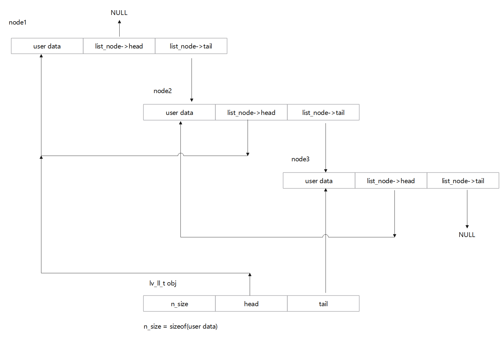
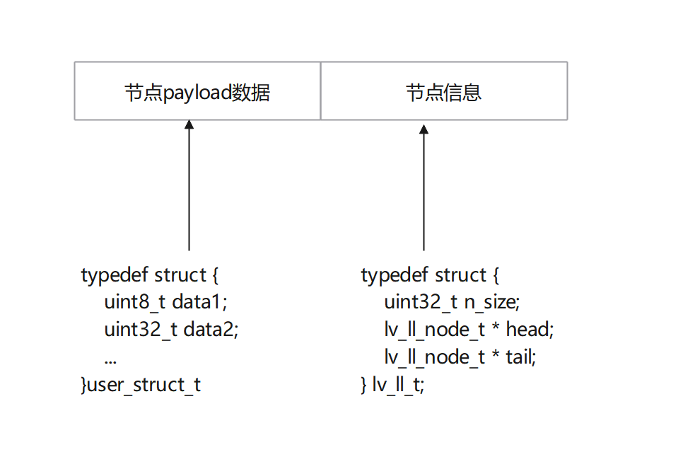

## 基于lvgl8.3


## lvgl链表（lv_ll.c，lv_ll.h）

### 源码

```c
// 节点对象
typedef struct {
    uint32_t n_size;
    lv_ll_node_t * head;
    lv_ll_node_t * tail;
} lv_ll_t;
```


### 设计原理、使用方法概述

链表结构图示：



### 基本使用步骤

1. 初始化节点信息
2. 实例化节点，即：向节点插入数据
3. 使用节点，即：读写节点payload的数据

例子：

```c
#define _LV_LL_READ(list, i) for(i = _lv_ll_get_head(list); i != NULL; i = _lv_ll_get_next(list, i))
// 要一个用来记录链表头的对象
static lv_ll_t src_mgmt_ll_base;
// 链表的userdata
static scr_mgmt_t* src_mgmt_now;
// 初始化节点记录对象，lvgl的链表需要有一个东西记录
_lv_ll_init(&src_mgmt_ll_base, sizeof(scr_mgmt_t));
// 读取链表
scr_mgmt_t* diabel_load_scr = NULL;
// 挂进链表
LV_ASSERT_NULL(data);
_LV_LL_READ(&src_mgmt_now->ll_disabel_load_scr, diabel_load_scr) {
	// 这里diabel_load_scr就是从链表里从head到tail拿出来的指针
}
```


### 原理解析

1. 初始化节点信息

   ```c
   /**
    * Initialize linked list
    * @param ll_p pointer to lv_ll_t variable
    * @param node_size the size of 1 node in bytes
    */
   void _lv_ll_init(lv_ll_t * ll_p, uint32_t node_size)
   {
       ll_p->head = NULL;
       ll_p->tail = NULL;
   #ifdef LV_ARCH_64
       /*Round the size up to 8*/
       node_size = (node_size + 7) & (~0x7);
   #else
       /*Round the size up to 4*/
       node_size = (node_size + 3) & (~0x3);
   #endif
   
       ll_p->n_size = node_size;
   }   
   ```

   **此处，初始化双链表指针、获取节点payload大小（uint32_t node_size）并对该大小内存对齐处理，64位处理器8字节对齐，其他的4字节对齐**

2. 实例化节点

   链表通过节点对象记录节点信息，每添加一个新节点，对新节点实例化时，会产生以下数据结构：



这种结构的好处是，链表的节点信息是隐式的，在构成链表时，不需要

这里使用**_lv_ll_ins_tail**将新节点插入到链表尾，对**_lv_ll_ins_tail**解析如下：

```c
#define LL_NODE_META_SIZE (sizeof(lv_ll_node_t *) + sizeof(lv_ll_node_t *))
#define LL_PREV_P_OFFSET(ll_p) (ll_p->n_size)
#define LL_NEXT_P_OFFSET(ll_p) (ll_p->n_size + sizeof(lv_ll_node_t *))

static void node_set_prev(lv_ll_t * ll_p, lv_ll_node_t * act, lv_ll_node_t * prev)
{
    if(act == NULL) return; /*Can't set the prev node of `NULL`*/

    uint8_t * act8 = (uint8_t *)act;

    act8 += LL_PREV_P_OFFSET(ll_p);

    lv_ll_node_t ** act_node_p = (lv_ll_node_t **) act8;
    lv_ll_node_t ** prev_node_p = (lv_ll_node_t **) &prev;

    *act_node_p = *prev_node_p;
}

/**
 * Set the 'next node pointer' of a node
 * @param ll_p pointer to linked list
 * @param act pointer to a node which next node pointer should be set
 * @param next pointer to a node which should be the next node before 'act'
 */
static void node_set_next(lv_ll_t * ll_p, lv_ll_node_t * act, lv_ll_node_t * next)
{
    if(act == NULL) return; /*Can't set the next node of `NULL`*/
    uint8_t * act8 = (uint8_t *)act;

    act8 += LL_NEXT_P_OFFSET(ll_p);
    /*下方等效于：
    uint32_t* p = (uint32_t*)act8;
    *p = next;
    由于种写法有位数限制，这样写64位下这样就不行，下面这种写法，就能让编译器自己匹配
    */
    lv_ll_node_t ** act_node_p = (lv_ll_node_t **) act8;
    lv_ll_node_t ** next_node_p = (lv_ll_node_t **) &next;

    *act_node_p = *next_node_p;
}

/**
 * Add a new tail to a linked list
 * @param ll_p pointer to linked list
 * @return pointer to the new tail
 */
void * _lv_ll_ins_tail(lv_ll_t * ll_p)
{
    lv_ll_node_t * n_new;
	// new的大小为payload+双链表两个节点的大小，不过这里数据结构没有形成，不能体现出上示意图
    n_new = lv_mem_alloc(ll_p->n_size + LL_NODE_META_SIZE);
	
    if(n_new != NULL) {
        // 链表链接，从这里可以看出，链表节点数据是挂在payload后的，是侵入式的链表，不影响payload数据结构
        // 后一个挂NULL，前一个挂
        node_set_next(ll_p, n_new, NULL);       /*No next after the new tail*/
        node_set_prev(ll_p, n_new, ll_p->tail); /*The prev. before new is the old tail*/
        if(ll_p->tail != NULL) {                /*老链表尾挂了东西，就把这个东西的->tail更新*/
            // 上一个的->tail更新为n_new地址
            // 这里展开其实是(*(ll_p->tail))再偏移到内存中节点信息部分的->tail，并写入n_new
            node_set_next(ll_p, ll_p->tail, n_new);
        }
        // 刷新链表记录者，这个链表记录者，遍历的时候会用到，这个东西记录了链表头
        ll_p->tail = n_new;      /*Set the new tail in the dsc.*/
        if(ll_p->head == NULL) { /*If there is no head (1. node) set the head too*/
            ll_p->head = n_new;
        }
    }
	// 返回生成的由于payload数据在前，可以直接使用该指针
    return n_new;
}
```
