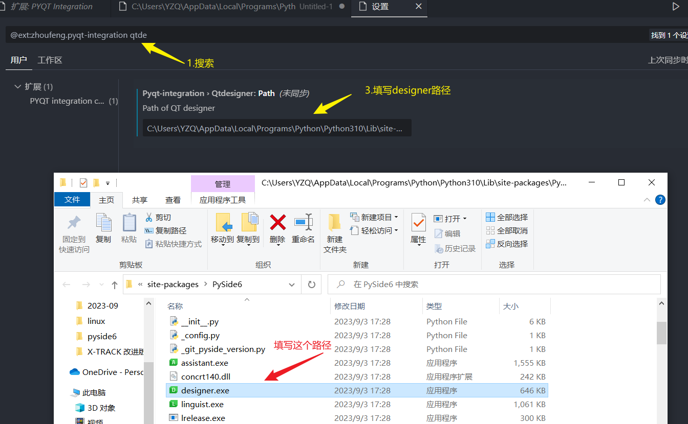
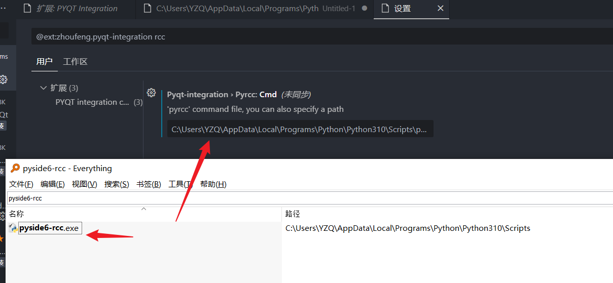
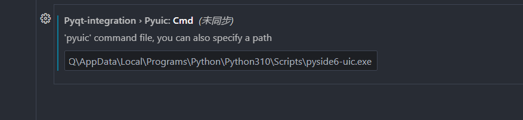

## 一些备注

pyside6和pyfqt大部分是兼容的，两者互相变更起来非常的快


## 换进搭建

1. 安装

   ```
   pip install pyside3
   ```

   

2. vscode插件PYQT integration安装和配置

   3个比较重要的配置

   ```
   pyside6-uic.exe
   pyside6-rcc.exe
   designer.exe
   ```

   配置Qtdesigner: Path

   

​		配置pyside6
​		

配置


