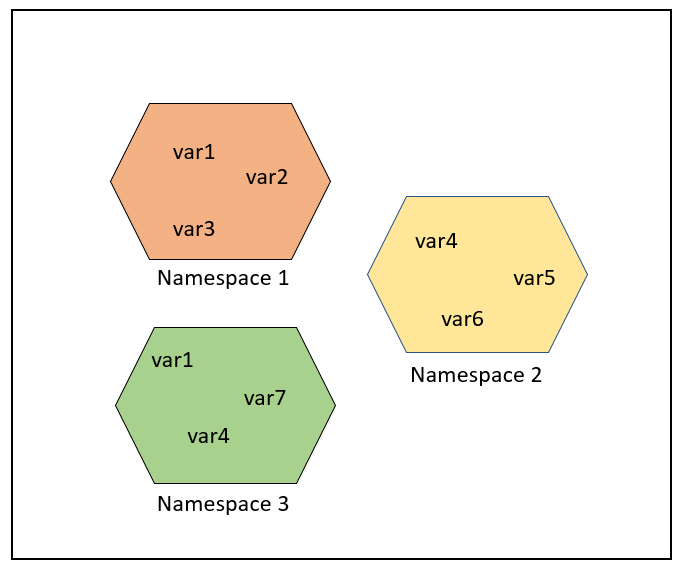
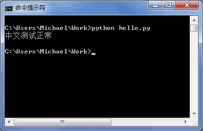

# 语法和杂七杂八

## _xx、xx__ 区别

```
_xx、__xx、__xx__ 区别
_xx：表示变量波保护，不希望外部访问，但可以访问到
__xx：表示变量私有，只有内部能访问到
__xx__：
类似 __xx__ 或 __xx__() 这种前后都有 2 个下划线的变量或方法，通常是Python中内置的特殊变量属性或方法的标识，我们应尽量避免使用该方式来自定义变量或方法
一般情况下，Python代码执行时会自动调用到这些内置属性或方法，比如当一个类对象实例化时，就会自动调用 __new__() 和 __init__() 来完成构造和初始化。
```


## 空语句

**pass**


## 中文

加u，例如：

```
print(u"=======当前路径：" + os.getcwd())
```


# pip遇到的问题

## 出现：  ERROR: Failed building wheel for pysilk-mod

前提说明：

```
  Stored in directory: /home/orangepi/.cache/pip/wheels/de/bd/bd/4aca667b1b66ffdc66ec328ca3510b1d7470ed5c1da4e1ce85
  Building wheel for pysilk-mod (PEP 517) ... error
  ERROR: Command errored out with exit status 1:
   command: /usr/bin/python3 /tmp/tmphi0rgjds build_wheel /tmp/tmp55zglwv3
       cwd: /tmp/pip-install-7is1l2di/pysilk-mod
  Complete output (31 lines):
  running bdist_wheel
  running build
  running build_py
  creating build
  creating build/lib.linux-aarch64-cpython-38
  creating build/lib.linux-aarch64-cpython-38/pysilk
  copying src/pysilk/wav.py -> build/lib.linux-aarch64-cpython-38/pysilk
  copying src/pysilk/utils.py -> build/lib.linux-aarch64-cpython-38/pysilk
  copying src/pysilk/pysilk.py -> build/lib.linux-aarch64-cpython-38/pysilk
  copying src/pysilk/__main__.py -> build/lib.linux-aarch64-cpython-38/pysilk
  copying src/pysilk/__init__.py -> build/lib.linux-aarch64-cpython-38/pysilk
  running egg_info
  writing src/pysilk_mod.egg-info/PKG-INFO
  writing dependency_links to src/pysilk_mod.egg-info/dependency_links.txt
  writing top-level names to src/pysilk_mod.egg-info/top_level.txt
  reading manifest file 'src/pysilk_mod.egg-info/SOURCES.txt'
  adding license file 'LICENSE'
  writing manifest file 'src/pysilk_mod.egg-info/SOURCES.txt'
  running build_ext
  aarch64-linux-gnu-gcc -pthread -Wno-unused-result -Wsign-compare -DNDEBUG -g -fwrapv -O2 -Wall -g -fstack-protector-strong -Wformat -Werror=format-security -g -fwrapv -O2 -fPIC -I/usr/include/python3.8 -c flagcheck.cpp -o flagcheck.o -std=c++17
  building 'pysilk.coder' extension
  creating build/temp.linux-aarch64-cpython-38
  creating build/temp.linux-aarch64-cpython-38/src
  creating build/temp.linux-aarch64-cpython-38/src/silk
  creating build/temp.linux-aarch64-cpython-38/src/silk/src
  aarch64-linux-gnu-gcc -pthread -Wno-unused-result -Wsign-compare -DNDEBUG -g -fwrapv -O2 -Wall -g -fstack-protector-strong -Wformat -Werror=format-security -g -fwrapv -O2 -fPIC -DVERSION_INFO=1.6.2 -Isrc/silk/interface -I/tmp/pip-build-env-qqgovn4b/overlay/lib/python3.8/site-packages/pybind11/include -I/usr/include/python3.8 -c src/silk/src/SKP_Silk_warped_autocorrelation_FIX.c -o build/temp.linux-aarch64-cpython-38/src/silk/src/SKP_Silk_warped_autocorrelation_FIX.o -fvisibility=hidden -g0
  src/silk/src/SKP_Silk_warped_autocorrelation_FIX.c:28:10: fatal error: SKP_Silk_main_FIX.h: No such file or directory
     28 | #include "SKP_Silk_main_FIX.h"
        |          ^~~~~~~~~~~~~~~~~~~~~
  compilation terminated.
  error: command '/usr/bin/aarch64-linux-gnu-gcc' failed with exit code 1
  ----------------------------------------
  ERROR: Failed building wheel for pysilk-mod

```

很显然，他是在构建时发现没有SKP_Silk_main_FIX.h这个文件然后停下的。

试去是来没作用，然后在lssues下网友提议，使用：

```
pip uninstall silk-python && pip install git+https://github.com/DCZYewen/Python-Silk-Module
```

这句命令表示执行以下操作：

1. 首先，使用`pip uninstall`命令卸载名为`silk-python`的软件包。
2. 然后，使用`pip install`命令从GitHub上安装一个名为`Python-Silk-Module`的软件包。它是从指定的GitHub仓库（https://github.com/DCZYewen/Python-Silk-Module）中安装的。

完美解决这个包构建问题


# 教程学习

## python基础

## 数据类型和变量

最后更新: 2019/4/25 14:43 / 阅读: 2115633303

计算机顾名思义就是可以做数学计算的机器，因此，计算机程序理所当然地可以处理各种数值。但是，计算机能处理的远不止数值，还可以处理文本、图形、音频、视频、网页等各种各样的数据，不同的数据，需要定义不同的数据类型。在Python中，能够直接处理的数据类型有以下几种：

#### 整数

Python可以处理任意大小的整数，当然包括负整数，在程序中的表示方法和数学上的写法一模一样，例如：`1`，`100`，`-8080`，`0`，等等。

计算机由于使用二进制，所以，有时候用十六进制表示整数比较方便，十六进制用`0x`前缀和0-9，a-f表示，例如：`0xff00`，`0xa5b4c3d2`，等等。

对于很大的数，例如`10000000000`，很难数清楚0的个数。**Python允许在数字中间以`_`分隔**，因此，写成`10_000_000_000`和`10000000000`是完全一样的。十六进制数也可以写成`0xa1b2_c3d4`。

#### 浮点数

浮点数也就是小数，之所以称为浮点数，是因为按照科学记数法表示时，一个浮点数的小数点位置是可变的，比如，1.23x109和12.3x108是完全相等的。浮点数可以用数学写法，如`1.23`，`3.14`，`-9.01`，等等。但是对于很大或很小的浮点数，就必须用科学计数法表示，把10用e替代，1.23x109就是`1.23e9`，或者`12.3e8`，0.000012可以写成`1.2e-5`，等等。

整数和浮点数在计算机内部存储的方式是不同的，整数运算永远是精确的（除法难道也是精确的？是的！注：整数除整数得整数），而浮点数运算则可能会有四舍五入的误差。

#### 字符串

字符串是以单引号`'`或双引号`"`括起来的任意文本，比如`'abc'`，`"xyz"`等等。请注意，`''`或`""`本身只是一种表示方式，不是字符串的一部分，因此，字符串`'abc'`只有`a`，`b`，`c`这3个字符。如果`'`本身也是一个字符，那就可以用`""`括起来，比如`"I'm OK"`包含的字符是`I`，`'`，`m`，空格，`O`，`K`这6个字符。

如果字符串内部既包含`'`又包含`"`怎么办？可以用转义字符`\`来标识，比如：

```
'I\'m \"OK\"!'
```

表示的字符串内容是：

```
I'm "OK"!
```

转义字符`\`可以转义很多字符，比如`\n`表示换行，`\t`表示制表符，字符`\`本身也要转义，所以`\\`表示的字符就是`\`，可以在Python的交互式命令行用`print()`打印字符串看看：

```
>>> print('I\'m ok.')
I'm ok.
>>> print('I\'m learning\nPython.')
I'm learning
Python.
>>> print('\\\n\\')
\
\
```

如果字符串里面有很多字符都需要转义，就需要加很多`\`，为了简化，Python还允许用`r''`表示`''`内部的字符串默认不转义，可以自己试试：

```
>>> print('\\\t\\')
\       \
>>> print(r'\\\t\\')
\\\t\\
```

如果字符串内部有很多换行，用`\n`写在一行里不好阅读，为了简化，Python允许用`'''...'''`的格式表示多行内容，可以自己试试：

```
>>> print('''line1
... line2
... line3''')
line1
line2
line3
```

上面是在交互式命令行内输入，注意在输入多行内容时，提示符由`>>>`变为`...`，提示你可以接着上一行输入，注意`...`是提示符，不是代码的一部分：

```ascii
┌────────────────────────────────────────────────────────┐
│Command Prompt - python                           _ □ x │
├────────────────────────────────────────────────────────┤
│>>> print('''line1                                      │
│... line2                                               │
│... line3''')                                           │
│line1                                                   │
│line2                                                   │
│line3                                                   │
│                                                        │
│>>> _                                                   │
│                                                        │
│                                                        │
│                                                        │
└────────────────────────────────────────────────────────┘
```

当输入完结束符`````和括号`)`后，执行该语句并打印结果。

如果写成程序并存为`.py`文件，就是：

```
print('''line1
line2
line3''')
```

多行字符串`'''...'''`还可以在前面加上`r`使用，请自行测试：

```
# -*- coding: utf-8 -*-
```

 Run

#### 布尔值

布尔值和布尔代数的表示完全一致，一个布尔值只有`True`、`False`两种值，要么是`True`，要么是`False`，在Python中，可以直接用`True`、`False`表示布尔值（请注意大小写），也可以通过布尔运算计算出来：

```
>>> True
True
>>> False
False
>>> 3 > 2
True
>>> 3 > 5
False
```

布尔值可以用`and`、`or`和`not`运算。

`and`运算是与运算，只有所有都为`True`，`and`运算结果才是`True`：

```
>>> True and True
True
>>> True and False
False
>>> False and False
False
>>> 5 > 3 and 3 > 1
True
```

`or`运算是或运算，只要其中有一个为`True`，`or`运算结果就是`True`：

```
>>> True or True
True
>>> True or False
True
>>> False or False
False
>>> 5 > 3 or 1 > 3
True
```

`not`运算是非运算，它是一个单目运算符，把`True`变成`False`，`False`变成`True`：

```
>>> not True
False
>>> not False
True
>>> not 1 > 2
True
```

布尔值经常用在条件判断中，比如：

```
if age >= 18:
    print('adult')
else:
    print('teenager')
```

#### 空值

空值是Python里一个特殊的值，用`None`表示。`None`不能理解为`0`，因为`0`是有意义的，而`None`是一个特殊的空值。

此外，Python还提供了列表、字典等多种数据类型，还允许创建自定义数据类型，我们后面会继续讲到。

### 变量

变量的概念基本上和初中代数的方程变量是一致的，只是在计算机程序中，变量不仅可以是数字，还可以是任意数据类型。

变量在程序中就是用一个变量名表示了，变量名必须是大小写英文、数字和`_`的组合，且不能用数字开头，比如：

```
a = 1
```

变量`a`是一个整数。

```
t_007 = 'T007'
```

变量`t_007`是一个字符串。

```
Answer = True
```

变量`Answer`是一个布尔值`True`。

在Python中，等号`=`是赋值语句，可以把任意数据类型赋值给变量，同一个变量可以反复赋值，而且可以是不同类型的变量，例如：

```
# -*- coding: utf-8 -*-
```

 Run

这种变量本身类型不固定的语言称之为*动态语言*，与之对应的是*静态语言*。静态语言在定义变量时必须指定变量类型，如果赋值的时候类型不匹配，就会报错。例如Java是静态语言，赋值语句如下（// 表示注释）：

```
int a = 123; // a是整数类型变量
a = "ABC"; // 错误：不能把字符串赋给整型变量
```

和静态语言相比，动态语言更灵活，就是这个原因。

请不要把赋值语句的等号等同于数学的等号。比如下面的代码：

```
x = 10
x = x + 2
```

如果从数学上理解`x = x + 2`那无论如何是不成立的，在程序中，赋值语句先计算右侧的表达式`x + 2`，得到结果`12`，再赋给变量`x`。由于`x`之前的值是`10`，重新赋值后，`x`的值变成`12`。

最后，理解变量在计算机内存中的表示也非常重要。当我们写：

```
a = 'ABC'
```

时，Python解释器干了两件事情：

1. 在内存中创建了一个`'ABC'`的字符串；
2. 在内存中创建了一个名为`a`的变量，并把它指向`'ABC'`。

也可以把一个变量`a`赋值给另一个变量`b`，这个操作实际上是把变量`b`指向变量`a`所指向的数据，例如下面的代码：

```
# -*- coding: utf-8 -*-
```

 Run

最后一行打印出变量`b`的内容到底是`'ABC'`呢还是`'XYZ'`？如果从数学意义上理解，就会错误地得出`b`和`a`相同，也应该是`'XYZ'`，但实际上`b`的值是`'ABC'`，让我们一行一行地执行代码，就可以看到到底发生了什么事：

执行`a = 'ABC'`，解释器创建了字符串`'ABC'`和变量`a`，并把`a`指向`'ABC'`：


执行`b = a`，解释器创建了变量`b`，并把`b`指向`a`指向的字符串`'ABC'`：


执行`a = 'XYZ'`，解释器创建了字符串'XYZ'，并把`a`的指向改为`'XYZ'`，但`b`并没有更改：


所以，最后打印变量`b`的结果自然是`'ABC'`了。

### 常量

所谓常量就是不能变的变量，比如常用的数学常数π就是一个常量。在Python中，**通常用全部大写的变量名表示常量**：

```
PI = 3.14159265359
```

但事实上`PI`仍然是一个变量，Python根本没有任何机制保证`PI`不会被改变，所以，用全部大写的变量名表示常量只是一个习惯上的用法，如果你一定要改变变量`PI`的值，也没人能拦住你。

最后解释一下整数的除法为什么也是精确的。在Python中，有两种除法，一种除法是`/`：

```
>>> 10 / 3
3.3333333333333335
```

`/`除法计算结果是浮点数，即使是两个整数恰好整除，结果也是浮点数：

```
>>> 9 / 3
3.0
```

还有一种除法是`//`，称为地板除，两个整数的除法仍然是整数：

```
>>> 10 // 3
3
```

你没有看错，整数的地板除`//`永远是整数，即使除不尽。要做精确的除法，使用`/`就可以。

因为`//`除法只取结果的整数部分，所以Python还提供一个余数运算，可以得到两个整数相除的余数：

```
>>> 10 % 3
1
```

无论整数做`//`除法还是取余数，结果永远是整数，所以，整数运算结果永远是精确的。

### 练习

请打印出以下变量的值：

```
# -*- coding: utf-8 -*-
n = 123
f = 456.789
s1 = 'Hello, world'
s2 = 'Hello, \'Adam\''
s3 = r'Hello, "Bart"'
s4 = r'''Hello,
Lisa!'''
```

 Run

### 小结

Python支持多种数据类型，在计算机内部，可以把任何数据都看成一个“对象”，而变量就是在程序中用来指向这些数据对象的，对变量赋值就是把数据和变量给关联起来。

对变量赋值`x = y`是把变量`x`指向真正的对象，该对象是变量`y`所指向的。随后对变量`y`的赋值*不影响*变量`x`的指向。

注意：Python的整数没有大小限制，而某些语言的整数根据其存储长度是有大小限制的，例如Java对32位整数的范围限制在`-2147483648`-`2147483647`。

Python的浮点数也没有大小限制，但是超出一定范围就直接表示为`inf`（无限大）。


## python3命名空间和作用域

一般有三种命名空间：

- **内置名称（built-in names**）， Python 语言内置的名称，比如函数名 abs、char 和异常名称 BaseException、Exception 等等。
- **全局名称（global names）**，模块中定义的名称，记录了模块的变量，包括函数、类、其它导入的模块、模块级的变量和常量。
- **局部名称（local names）**，函数中定义的名称，记录了函数的变量，包括函数的参数和局部定义的变量。（类中定义的也是）


则 Python 的查找顺序为：**局部的命名空间 -> 全局命名空间 -> 内置命名空间**。

### 命名空间的生命周期

命名空间的生命周期取决于对象的作用域，如果对象执行完成，则该命名空间的生命周期就结束。

因此，我们无法从外部命名空间访问内部命名空间的对象。

```
# var1 是全局名称
var1 = 5
def some_func(): 
  
    # var2 是局部名称
    var2 = 6
    def some_inner_func(): 
  
        # var3 是内嵌的局部名称
        var3 = 7
```

如下图所示，相同的对象名称可以存在于多个命名空间中。



## 作用域

作用域就是一个 Python 程序可以直接访问命名空间的正文区域。

在一个 python 程序中，直接访问一个变量，会从内到外依次访问所有的作用域直到找到，否则会报未定义的错误。

Python 中，程序的变量并不是在哪个位置都可以访问的，访问权限决定于这个变量是在哪里赋值的。

变量的作用域决定了在哪一部分程序可以访问哪个特定的变量名称。Python 的作用域一共有4种，分别是：

有四种作用域：

- **L（Local）**：最内层，包含局部变量，比如一个函数/方法内部。
- **E（Enclosing）**：包含了非局部(non-local)也非全局(non-global)的变量。比如两个嵌套函数，一个函数（或类） A 里面又包含了一个函数 B ，那么对于 B 中的名称来说 A 中的作用域就为 nonlocal。
- **G（Global）**：当前脚本的最外层，比如当前模块的全局变量。
- **B（Built-in）**： 包含了内建的变量/关键字等，最后被搜索。

规则顺序： **L –> E –> G –> B**。

在局部找不到，便会去局部外的局部找（例如闭包），再找不到就会去全局找，再者去内置中找。


```
g_count = 0  # 全局作用域
def outer():
    o_count = 1  # 闭包函数外的函数中
    def inner():
        i_count = 2  # 局部作用域
```

内置作用域是通过一个名为 builtin 的标准模块来实现的，但是这个变量名自身并没有放入内置作用域内，所以必须导入这个文件才能够使用它。在Python3.0中，可以使用以下的代码来查看到底预定义了哪些变量（这里的”变量“，函数也有）:

```
>>> import builtins
>>> dir(builtins)
```

Python 中只有模块（module），类（class）以及函数（def、lambda）才会引入新的作用域，其它的代码块（如 if/elif/else/、try/except、for/while等）是不会引入新的作用域的，也就是说这些语句内定义的变量，外部也可以访问，如下代码：

```
>>> if True:
...  msg = 'I am from Runoob'
... 
>>> msg
'I am from Runoob'
>>> 
```


## 字符串和编码

最后更新: 2019/4/2 10:33 / 阅读: 1240215209

------

### 字符编码

我们已经讲过了，字符串也是一种数据类型，但是，字符串比较特殊的是还有一个编码问题。

因为计算机只能处理数字，如果要处理文本，就必须先把文本转换为数字才能处理。最早的计算机在设计时采用8个比特（bit）作为一个字节（byte），所以，一个字节能表示的最大的整数就是255（二进制11111111=十进制255），如果要表示更大的整数，就必须用更多的字节。比如两个字节可以表示的最大整数是`65535`，4个字节可以表示的最大整数是`4294967295`。

由于计算机是美国人发明的，因此，最早只有127个字符被编码到计算机里，也就是大小写英文字母、数字和一些符号，这个编码表被称为`ASCII`编码，比如大写字母`A`的编码是`65`，小写字母`z`的编码是`122`。

但是要处理中文显然一个字节是不够的，至少需要两个字节，而且还不能和ASCII编码冲突，所以，中国制定了`GB2312`编码，用来把中文编进去。

你可以想得到的是，全世界有上百种语言，日本把日文编到`Shift_JIS`里，韩国把韩文编到`Euc-kr`里，各国有各国的标准，就会不可避免地出现冲突，结果就是，在多语言混合的文本中，显示出来会有乱码。


因此，Unicode字符集应运而生。Unicode把所有语言都统一到一套编码里，这样就不会再有乱码问题了。

Unicode标准也在不断发展，但最常用的是UCS-16编码，用两个字节表示一个字符（如果要用到非常偏僻的字符，就需要4个字节）。现代操作系统和大多数编程语言都直接支持Unicode。

现在，捋一捋ASCII编码和Unicode编码的区别：ASCII编码是1个字节，而Unicode编码通常是2个字节。

字母`A`用ASCII编码是十进制的`65`，二进制的`01000001`；

字符`0`用ASCII编码是十进制的`48`，二进制的`00110000`，注意字符`'0'`和整数`0`是不同的；

汉字`中`已经超出了ASCII编码的范围，用Unicode编码是十进制的`20013`，二进制的`01001110 00101101`。

你可以猜测，如果把ASCII编码的`A`用Unicode编码，只需要在前面补0就可以，因此，`A`的Unicode编码是`00000000 01000001`。

新的问题又出现了：如果统一成Unicode编码，乱码问题从此消失了。但是，如果你写的文本基本上全部是英文的话，用Unicode编码比ASCII编码需要多一倍的存储空间，在存储和传输上就十分不划算。

所以，本着节约的精神，又出现了把Unicode编码转化为“可变长编码”的`UTF-8`编码。UTF-8编码把一个Unicode字符根据不同的数字大小编码成1-6个字节，常用的英文字母被编码成1个字节，汉字通常是3个字节，只有很生僻的字符才会被编码成4-6个字节。如果你要传输的文本包含大量英文字符，用UTF-8编码就能节省空间：

| 字符 | ASCII    | Unicode           | UTF-8                      |
| :--- | :------- | :---------------- | :------------------------- |
| A    | 01000001 | 00000000 01000001 | 01000001                   |
| 中   | x        | 01001110 00101101 | 11100100 10111000 10101101 |

从上面的表格还可以发现，UTF-8编码有一个额外的好处，就是ASCII编码实际上可以被看成是UTF-8编码的一部分，所以，大量只支持ASCII编码的历史遗留软件可以在UTF-8编码下继续工作。

搞清楚了ASCII、Unicode和UTF-8的关系，我们就可以总结一下现在计算机系统通用的字符编码工作方式：

在计算机内存中，统一使用Unicode编码，当需要保存到硬盘或者需要传输的时候，就转换为UTF-8编码。

用记事本编辑的时候，从文件读取的UTF-8字符被转换为Unicode字符到内存里，编辑完成后，保存的时候再把Unicode转换为UTF-8保存到文件：


浏览网页的时候，服务器会把动态生成的Unicode内容转换为UTF-8再传输到浏览器：


所以你看到很多网页的源码上会有类似`<meta charset="UTF-8" />`的信息，表示该网页正是用的UTF-8编码。

### Python的字符串

搞清楚了令人头疼的字符编码问题后，我们再来研究Python的字符串。

在最新的Python 3版本中，字符串是以Unicode编码的，也就是说，Python的字符串支持多语言，例如：

```
>>> print('包含中文的str')
包含中文的str
```

对于单个字符的编码，Python提供了`ord()`函数获取字符的整数表示，`chr()`函数把编码转换为对应的字符：

```
>>> ord('A')
65
>>> ord('中')
20013
>>> chr(66)
'B'
>>> chr(25991)
'文'
```

如果知道字符的整数编码，还可以用十六进制这么写`str`：

```
>>> '\u4e2d\u6587'
'中文'
```

两种写法完全是等价的。

由于Python的字符串类型是`str`，在内存中以Unicode表示，一个字符对应若干个字节。如果要在网络上传输，或者保存到磁盘上，就需要把`str`变为以字节为单位的`bytes`。

Python对`bytes`类型的数据用带`b`前缀的单引号或双引号表示：

```
x = b'ABC'
```

要注意区分`'ABC'`和`b'ABC'`，前者是`str`，后者虽然内容显示得和前者一样，但`bytes`的每个字符都只占用一个字节。

以Unicode表示的`str`通过`encode()`方法可以编码为指定的`bytes`，例如：

```
>>> 'ABC'.encode('ascii')
b'ABC'
>>> '中文'.encode('utf-8')
b'\xe4\xb8\xad\xe6\x96\x87'
>>> '中文'.encode('ascii')
Traceback (most recent call last):
  File "<stdin>", line 1, in <module>
UnicodeEncodeError: 'ascii' codec can't encode characters in position 0-1: ordinal not in range(128)
```

纯英文的`str`可以用`ASCII`编码为`bytes`，内容是一样的，含有中文的`str`可以用`UTF-8`编码为`bytes`。含有中文的`str`无法用`ASCII`编码，因为中文编码的范围超过了`ASCII`编码的范围，Python会报错。

在`bytes`中，无法显示为ASCII字符的字节，用`\x##`显示。

反过来，如果我们从网络或磁盘上读取了字节流，那么读到的数据就是`bytes`。要把`bytes`变为`str`，就需要用`decode()`方法：

```
>>> b'ABC'.decode('ascii')
'ABC'
>>> b'\xe4\xb8\xad\xe6\x96\x87'.decode('utf-8')
'中文'
```

如果`bytes`中包含无法解码的字节，`decode()`方法会报错：

```
>>> b'\xe4\xb8\xad\xff'.decode('utf-8')
Traceback (most recent call last):
  ...
UnicodeDecodeError: 'utf-8' codec can't decode byte 0xff in position 3: invalid start byte
```

如果`bytes`中只有一小部分无效的字节，可以传入`errors='ignore'`忽略错误的字节：

```
>>> b'\xe4\xb8\xad\xff'.decode('utf-8', errors='ignore')
'中'
```

要计算`str`包含多少个字符，可以用`len()`函数：

```
>>> len('ABC')
3
>>> len('中文')
2
```

`len()`函数计算的是`str`的字符数，如果换成`bytes`，`len()`函数就计算字节数：

```
>>> len(b'ABC')
3
>>> len(b'\xe4\xb8\xad\xe6\x96\x87')
6
>>> len('中文'.encode('utf-8'))
6
```

可见，1个中文字符经过UTF-8编码后通常会占用3个字节，而1个英文字符只占用1个字节。

在操作字符串时，我们经常遇到`str`和`bytes`的互相转换。为了避免乱码问题，应当始终坚持使用UTF-8编码对`str`和`bytes`进行转换。

由于Python源代码也是一个文本文件，所以，当你的源代码中包含中文的时候，在保存源代码时，就需要务必指定保存为UTF-8编码。当Python解释器读取源代码时，为了让它按UTF-8编码读取，我们通常在文件开头写上这两行：

```
#!/usr/bin/env python3
# -*- coding: utf-8 -*-
```

第一行注释是为了告诉Linux/OS X系统，这是一个Python可执行程序，Windows系统会忽略这个注释；

第二行注释是为了告诉Python解释器，按照UTF-8编码读取源代码，否则，你在源代码中写的中文输出可能会有乱码。

申明了UTF-8编码并不意味着你的`.py`文件就是UTF-8编码的，必须并且要确保文本编辑器正在使用UTF-8 without BOM编码：


如果`.py`文件本身使用UTF-8编码，并且也申明了`# -*- coding: utf-8 -*-`，打开命令提示符测试就可以正常显示中文：



### 格式化

最后一个常见的问题是如何输出格式化的字符串。我们经常会输出类似`'亲爱的xxx你好！你xx月的话费是xx，余额是xx'`之类的字符串，而xxx的内容都是根据变量变化的，所以，需要一种简便的格式化字符串的方式。


在Python中，采用的格式化方式和C语言是一致的，用`%`实现，举例如下：

```
>>> 'Hello, %s' % 'world'
'Hello, world'
>>> 'Hi, %s, you have $%d.' % ('Michael', 1000000)
'Hi, Michael, you have $1000000.'
```

你可能猜到了，`%`运算符就是用来格式化字符串的。在字符串内部，`%s`表示用字符串替换，`%d`表示用整数替换，有几个`%?`占位符，后面就跟几个变量或者值，顺序要对应好。如果只有一个`%?`，括号可以省略。

常见的占位符有：

| 占位符 | 替换内容     |
| :----- | :----------- |
| %d     | 整数         |
| %f     | 浮点数       |
| %s     | 字符串       |
| %x     | 十六进制整数 |

其中，格式化整数和浮点数还可以指定是否补0和整数与小数的位数：

```
# -*- coding: utf-8 -*-
```

 Run

如果你不太确定应该用什么，`%s`永远起作用，它会把任何数据类型转换为字符串：

```
>>> 'Age: %s. Gender: %s' % (25, True)
'Age: 25. Gender: True'
```

有些时候，字符串里面的`%`是一个普通字符怎么办？这个时候就需要转义，用`%%`来表示一个`%`：

```
>>> 'growth rate: %d %%' % 7
'growth rate: 7 %'
```

### format()

另一种格式化字符串的方法是使用字符串的`format()`方法，它会用传入的参数依次替换字符串内的占位符`{0}`、`{1}`……，不过这种方式写起来比%要麻烦得多：

```
>>> 'Hello, {0}, 成绩提升了 {1:.1f}%'.format('小明', 17.125)
'Hello, 小明, 成绩提升了 17.1%'
```

### f-string

最后一种格式化字符串的方法是使用以`f`开头的字符串，称之为`f-string`，它和普通字符串不同之处在于，字符串如果包含`{xxx}`，就会以对应的变量替换：

```
>>> r = 2.5
>>> s = 3.14 * r ** 2
>>> print(f'The area of a circle with radius {r} is {s:.2f}')
The area of a circle with radius 2.5 is 19.62
```

上述代码中，`{r}`被变量`r`的值替换，`{s:.2f}`被变量`s`的值替换，并且`:`后面的`.2f`指定了格式化参数（即保留两位小数），因此，`{s:.2f}`的替换结果是`19.62`。

### 练习

小明的成绩从去年的72分提升到了今年的85分，请计算小明成绩提升的百分点，并用字符串格式化显示出`'xx.x%'`，只保留小数点后1位：

```
# -*- coding: utf-8 -*-

s1 = 72
s2 = 85
```

 Run

### 小结

Python 3的字符串使用Unicode，直接支持多语言。

当`str`和`bytes`互相转换时，需要指定编码。最常用的编码是`UTF-8`。Python当然也支持其他编码方式，比如把Unicode编码成`GB2312`：

```
>>> '中文'.encode('gb2312')
b'\xd6\xd0\xce\xc4'
```

但这种方式纯属自找麻烦，如果没有特殊业务要求，请牢记仅使用`UTF-8`编码。

格式化字符串的时候，可以用Python的交互式环境测试，方便快捷。

### 参考源码

[the_string.py](https://github.com/michaelliao/learn-python3/blob/master/samples/basic/the_string.py)

## list和tuple

```
# 列表
list = ["list1", "list2", "list3"]
# 元组，初始化后元素就不可更改，单元素指向的数据可以改，只有一个元素时要注意加","
tuple = ("tuple", )
tuple2 = ("tuple2", ["list1", "list2"])
tuple2[1][1] = "list3"
```

#### 使用list和tuple

最后更新: 2019/4/14 09:59 / 阅读: 1106450676

------

### list

Python内置的一种数据类型是列表：list。list是一种有序的集合，可以随时添加和删除其中的元素。

比如，列出班里所有同学的名字，就可以用一个list表示：

```
>>> classmates = ['Michael', 'Bob', 'Tracy']
>>> classmates
['Michael', 'Bob', 'Tracy']
```

变量`classmates`就是一个list。用`len()`函数可以获得list元素的个数：

```
>>> len(classmates)
3
```

用索引来访问list中每一个位置的元素，记得索引是从`0`开始的：

```
>>> classmates[0]
'Michael'
>>> classmates[1]
'Bob'
>>> classmates[2]
'Tracy'
>>> classmates[3]
Traceback (most recent call last):
  File "<stdin>", line 1, in <module>
IndexError: list index out of range
```

当索引超出了范围时，Python会报一个`IndexError`错误，所以，要确保索引不要越界，记得最后一个元素的索引是`len(classmates) - 1`。

如果要取最后一个元素，除了计算索引位置外，还可以用`-1`做索引，直接获取最后一个元素：

```
>>> classmates[-1]
'Tracy'
```

以此类推，可以获取倒数第2个、倒数第3个：

```
>>> classmates[-2]
'Bob'
>>> classmates[-3]
'Michael'
>>> classmates[-4]
Traceback (most recent call last):
  File "<stdin>", line 1, in <module>
IndexError: list index out of range
```

当然，倒数第4个就越界了。

list是一个可变的有序表，所以，可以往list中追加元素到末尾：

```
>>> classmates.append('Adam')
>>> classmates
['Michael', 'Bob', 'Tracy', 'Adam']
```

也可以把元素插入到指定的位置，比如索引号为`1`的位置：

```
>>> classmates.insert(1, 'Jack')
>>> classmates
['Michael', 'Jack', 'Bob', 'Tracy', 'Adam']
```

要删除list末尾的元素，用`pop()`方法：

```
>>> classmates.pop()
'Adam'
>>> classmates
['Michael', 'Jack', 'Bob', 'Tracy']
```

要删除指定位置的元素，用`pop(i)`方法，其中`i`是索引位置：

```
>>> classmates.pop(1)
'Jack'
>>> classmates
['Michael', 'Bob', 'Tracy']
```

要把某个元素替换成别的元素，可以直接赋值给对应的索引位置：

```
>>> classmates[1] = 'Sarah'
>>> classmates
['Michael', 'Sarah', 'Tracy']
```

list里面的元素的数据类型也可以不同，比如：

```
>>> L = ['Apple', 123, True]
```

list元素也可以是另一个list，比如：

```
>>> s = ['python', 'java', ['asp', 'php'], 'scheme']
>>> len(s)
4
```

要注意`s`只有4个元素，其中`s[2]`又是一个list，如果拆开写就更容易理解了：

```
>>> p = ['asp', 'php']
>>> s = ['python', 'java', p, 'scheme']
```

要拿到`'php'`可以写`p[1]`或者`s[2][1]`，因此`s`可以看成是一个二维数组，类似的还有三维、四维……数组，不过很少用到。

如果一个list中一个元素也没有，就是一个空的list，它的长度为0：

```
>>> L = []
>>> len(L)
0
```

### tuple

另一种有序列表叫元组：tuple。tuple和list非常类似，但是tuple一旦初始化就不能修改，比如同样是列出同学的名字：

```
>>> classmates = ('Michael', 'Bob', 'Tracy')
```

现在，classmates这个tuple不能变了，它也没有append()，insert()这样的方法。其他获取元素的方法和list是一样的，你可以正常地使用`classmates[0]`，`classmates[-1]`，但不能赋值成另外的元素。

不可变的tuple有什么意义？因为tuple不可变，所以代码更安全。如果可能，能用tuple代替list就尽量用tuple。

tuple的陷阱：当你定义一个tuple时，在定义的时候，tuple的元素就必须被确定下来，比如：

```
>>> t = (1, 2)
>>> t
(1, 2)
```

如果要定义一个空的tuple，可以写成`()`：

```
>>> t = ()
>>> t
()
```

但是，要定义一个只有1个元素的tuple，如果你这么定义：

```
>>> t = (1)
>>> t
1
```

定义的不是tuple，是`1`这个数！这是因为括号`()`既可以表示tuple，又可以表示数学公式中的小括号，这就产生了歧义，因此，Python规定，这种情况下，按小括号进行计算，计算结果自然是`1`。

所以，只有1个元素的tuple定义时必须加一个逗号`,`，来消除歧义：

```
>>> t = (1,)
>>> t
(1,)
```

Python在显示只有1个元素的tuple时，也会加一个逗号`,`，以免你误解成数学计算意义上的括号。

最后来看一个“可变的”tuple：

```
>>> t = ('a', 'b', ['A', 'B'])
>>> t[2][0] = 'X'
>>> t[2][1] = 'Y'
>>> t
('a', 'b', ['X', 'Y'])
```

这个tuple定义的时候有3个元素，分别是`'a'`，`'b'`和一个list。不是说tuple一旦定义后就不可变了吗？怎么后来又变了？

别急，我们先看看定义的时候tuple包含的3个元素：


当我们把list的元素`'A'`和`'B'`修改为`'X'`和`'Y'`后，tuple变为：


表面上看，tuple的元素确实变了，但其实变的不是tuple的元素，而是list的元素。tuple一开始指向的list并没有改成别的list，所以，tuple所谓的“不变”是说，tuple的每个元素，指向永远不变。即指向`'a'`，就不能改成指向`'b'`，指向一个list，就不能改成指向其他对象，但指向的这个list本身是可变的！

理解了“指向不变”后，要创建一个内容也不变的tuple怎么做？那就必须保证tuple的每一个元素本身也不能变。

#### 模式匹配

最后更新: 2023/10/3 13:35 / 阅读: 563246

------

当我们用`if ... elif ... elif ... else ...`判断时，会写很长一串代码，可读性较差。

如果要针对某个变量匹配若干种情况，可以使用`match`语句。

例如，某个学生的成绩只能是`A`、`B`、`C`，用`if`语句编写如下：

```
score = 'B'
if score == 'A':
    print('score is A.')
elif score == 'B':
    print('score is B.')
elif score == 'C':
    print('score is C.')
else:
    print('invalid score.')
```

如果用`match`语句改写，则改写如下：

```
# -*- coding: utf-8 -*-
```

 Run

使用`match`语句时，我们依次用`case xxx`匹配，并且可以在最后（且仅能在最后）加一个`case _`表示“任意值”，代码较`if ... elif ... else ...`更易读。

### 复杂匹配

`match`语句除了可以匹配简单的单个值外，还可以匹配多个值、匹配一定范围，并且把匹配后的值绑定到变量：

```
# -*- coding: utf-8 -*-
```

 Run

在上面这个示例中，第一个`case x if x < 10`表示当`age < 10`成立时匹配，且赋值给变量`x`，第二个`case 10`仅匹配单个值，第三个`case 11|12|...|18`能匹配多个值，用`|`分隔。

可见，`match`语句的`case`匹配非常灵活。

### 匹配列表

`match`语句还可以匹配列表，功能非常强大。

我们假设用户输入了一个命令，用`args = ['gcc', 'hello.c']`存储，下面的代码演示了如何用`match`匹配来解析这个列表：

```
# -*- coding: utf-8 -*-
```

 Run

第一个`case ['gcc']`表示列表仅有`'gcc'`一个字符串，没有指定文件名，报错；

第二个`case ['gcc', file1, *files]`表示列表第一个字符串是`'gcc'`，第二个字符串绑定到变量`file1`，后面的任意个字符串绑定到`*files`（符号`*`的作用将在[函数的参数](https://www.liaoxuefeng.com/wiki/1016959663602400/1017261630425888)中讲解），它实际上表示至少指定一个文件；

第三个`case ['clean']`表示列表仅有`'clean'`一个字符串；

最后一个`case _`表示其他所有情况。

可见，`match`语句的匹配规则非常灵活，可以写出非常简洁的代码。

## dict

```
# dict（map），查找键对应值，这是一种高效的方法，以空间换时间，不会随着列表变长而变长
map = {"xiaoming":"daxia", "xiaohong":"caiji"}
# 直接提取时，当没有该键，就会报错
print(map["xiaoming"])
# 使用get方法，返回none，或指定为-1
print(map.get("caiji"))
print(map.get("caiji")==None)
print(map.get("caiji", -1))
```

## 函数

```
# ******函数
# 定义了一个函数，在函数定义时，默认参数L会实例化
def add_end(L=[]):
    L.append('END')
    return L

# 有一个list
func_list = [1, 2, 3]
# 添加进去，但是，函数add_end中的L指向了func_list
add_end(func_list)
print(func_list)

# 空参数，L就是定义时的L
func_list2 = add_end()

add_end(func_list)
print(func_list)

# L再次被添加'END'
func_list3 = add_end()
# func_list3填充为：['END', 'END']
print(func_list3)
```

注意：**默认参数**

```
# 用不变对象None，再返回，就不会产生
def add_end(L=None):
    if L==None:
        L = []
    L.append('END')
    return L

func_list2 = add_end()
func_list3 = add_end()
print(func_list2)
print(func_list3)
```


## 高级特性

简化代码数量，相当于语法糖

### 切片：":"

场景：取一个list或tuple的部分元素是非常常见的操作。这时，就可以使用切片。

例子：有一个list，对其切片

```
list_list = []
for num in range(0, 10):
    list_list.append(num)
print(list_list)
# 头一个到倒数第二个
print(list_list[:-1])
# 第三个到倒数第二个
print(list_list[2:-1])
```

输出得到

```
[0, 1, 2, 3, 4, 5, 6, 7, 8, 9]
[0, 1, 2, 3, 4, 5, 6, 7, 8]
[2, 3, 4, 5, 6, 7, 8]
```

## 生成器


在Python中，生成器（Generator）是一种特殊的迭代器，它允许你按需产生值，而不是一次性生成所有值并将它们存储在内存中。生成器使用 `yield` 关键字来产生值，而不是使用 `return`，这使得生成器的状态在每次调用时都会被保留。

以下是关于Python生成器的基本信息和使用方法：

1. **生成器的创建：**

   - 使用函数定义生成器，其中包含 `yield` 语句。当生成器函数被调用时，它返回一个生成器对象，但不执行函数体。

   - 例如：

     ```
     pythonCopy codedef my_generator():
         yield 1
         yield 2
         yield 3
     
     gen = my_generator()
     ```

2. **生成器的调用：**

   - 生成器对象可以通过调用 `next()` 函数来逐步获取生成器的值。每次调用 `next()`，生成器函数将执行到下一个 `yield` 语句，并返回其值。

   - 例如：

     ```
     pythonCopy codeprint(next(gen))  # 输出: 1
     print(next(gen))  # 输出: 2
     print(next(gen))  # 输出: 3
     ```

3. **生成器表达式：**

   - 类似于列表推导式，Python也支持生成器表达式，但是使用圆括号而不是方括号。生成器表达式的语法更加简洁。

   - 例如：

     ```
     pythonCopy code
     gen_expr = (x for x in range(5))
     ```

4. **使用生成器进行循环：**

   - 生成器适用于处理大量数据时，可以节省内存。通过生成器，你可以逐个处理数据而无需一次性将它们全部加载到内存中。

   - 例如：

     ```
     pythonCopy codedef read_large_file(file_path):
         with open(file_path, 'r') as file:
             for line in file:
                 yield line
     ```

5. **生成器的状态保存：**

   - 生成器可以保持其局部变量的状态，使得每次调用 `next()` 时可以从上一次暂停的位置继续执行。

   - 例如：

     ```
     pythonCopy codedef counter():
         i = 0
         while True:
             yield i
             i += 1
     
     count = counter()
     print(next(count))  # 输出: 0
     print(next(count))  # 输出: 1
     ```

生成器是一种强大的工具，特别适用于需要按需处理大量数据或需要保存状态的情况。在实际编程中，生成器可以帮助提高性能和降低内存消耗。

### 总结

当一个函数里头包含**yield**关键字的时候，这个函数就成了一个生成器类一样的东西，此时

```
obj = func() #创建了一个生成器对象
# 下面创建了两个不同的生成器对象
print(next(obj))
print(next(obj))
```

函数变成对象，调用next也是返回对象比如 数字1、字符串“sdf”

## 迭代器

我们已经知道，可以直接作用于`for`循环的数据类型有以下几种：

一类是集合数据类型，如`list`、`tuple`、`dict`、`set`、`str`等；

一类是`generator`，包括生成器和带`yield`的generator function。

这些可以直接作用于`for`循环的对象统称为可迭代对象：`Iterable`。

可以使用`isinstance()`判断一个对象是否是`Iterable`对象：

```
>>> from collections.abc import Iterable
>>> isinstance([], Iterable)
True
>>> isinstance({}, Iterable)
True
>>> isinstance('abc', Iterable)
True
>>> isinstance((x for x in range(10)), Iterable)
True
>>> isinstance(100, Iterable)
False
```

而生成器不但可以作用于`for`循环，还可以被`next()`函数不断调用并返回下一个值，直到最后抛出`StopIteration`错误表示无法继续返回下一个值了。

可以被`next()`函数调用并不断返回下一个值的对象称为迭代器：`Iterator`。

可以使用`isinstance()`判断一个对象是否是`Iterator`对象：

```
>>> from collections.abc import Iterator
>>> isinstance((x for x in range(10)), Iterator)
True
>>> isinstance([], Iterator)
False
>>> isinstance({}, Iterator)
False
>>> isinstance('abc', Iterator)
False
```

生成器都是`Iterator`对象，但`list`、`dict`、`str`虽然是`Iterable`，却不是`Iterator`。

把`list`、`dict`、`str`等`Iterable`变成`Iterator`可以使用`iter()`函数：

```
>>> isinstance(iter([]), Iterator)
True
>>> isinstance(iter('abc'), Iterator)
True
```

你可能会问，为什么`list`、`dict`、`str`等数据类型不是`Iterator`？

这是因为Python的`Iterator`对象表示的是一个数据流，Iterator对象可以被`next()`函数调用并不断返回下一个数据，直到没有数据时抛出`StopIteration`错误。可以把这个数据流看做是一个有序序列，但我们却不能提前知道序列的长度，只能不断通过`next()`函数实现按需计算下一个数据，所以`Iterator`的计算是惰性的，只有在需要返回下一个数据时它才会计算。

`Iterator`甚至可以表示一个无限大的数据流，例如全体自然数。而使用list是永远不可能存储全体自然数的。

### 小结

凡是可作用于`for`循环的对象都是`Iterable`类型；

凡是可作用于`next()`函数的对象都是`Iterator`类型，它们表示一个惰性计算的序列；

集合数据类型如`list`、`dict`、`str`等是`Iterable`但不是`Iterator`，不过可以通过`iter()`函数获得一个`Iterator`对象。

Python的`for`循环本质上就是通过不断调用`next()`函数实现的，例如：

```
for x in [1, 2, 3, 4, 5]:
    pass
```

实际上完全等价于：

```
# 首先获得Iterator对象:
it = iter([1, 2, 3, 4, 5])
# 循环:
while True:
    try:
        # 获得下一个值:
        x = next(it)
    except StopIteration:
        # 遇到StopIteration就退出循环
        break
```

## 内建函数

### open

用于打开文件：一般使用方式为：

```
open(file_name, "r")
```

后面跟的字符串"r"，表示打开方式，常用打开方式有：

| r    | 以只读方式打开文件。文件的指针将会放在文件的开头。这是默认模式。 |
| ---- | ------------------------------------------------------------ |
| w    | 打开一个文件只用于写入。如果该文件已存在则打开文件，并从开头开始编辑，即原有内容会被删除。如果该文件不存在，创建新文件。 |
| a    | 追加写入，打开一个文件用于追加。如果该文件已存在，文件指针将会放在文件的结尾。也就是说，新的内容将会被写入到已有内容之后。如果该文件不存在，创建新文件进行写入。 |

详细可见：

[菜鸟教程]: https://www.runoob.com/python/python-func-open.html

#### 补充读写文件注意项

读写文件时，open文件后要记得关闭，在python中提供了相应的语法糖：**with**，一般使用方法为：

```python
# 打开一个文件，遍历文件每行，并输出
with open(file_new_name, "r+") as file:
    for line_file in file:
        print(line_file)
```

上述方式，在遇到文件比较大时，可能导致爆内存，大文件推荐使用临时文件读取

```py
input_filename = "file_name"
output_filename = "out_" + input_filename
with open(input_filename, "r") as input_file, open(output_filename, "a") as output_file:
    for line in input_file:
        # 在每一行前添加 "=="
        modified_line = "==\n" + line
        output_file.write(modified_line)
```

上述方式不仅读了大文件，还对大文件每行进行了写操作。

直接在原文件上遍历写的话，可能比较复杂，chatgpt没有给出完美的解决方案，可能干的人少，理由是：源文件直接写，中途的错误，可能会直接导致源文件数据的丢失和损坏。

以下有一种每行读并写入文本的错误操作方式：

```py
with open(file_new_name, "r+") as file:
    for line_file in file:
        print(line_file)
        # file.flush()
        file.write("test===")
        file.write("test2===")
```

运行后得到文件：

```
asdfsdf
asdfsdf
asdfsdfsdf
test===test2===
```

而且控制台输出只有第一行：asdfsdf，后面就直接运行结束了，出现这个想想的可能原因，chatgpt回答：

```
在Python中，您的代码片段试图在使用'r+'模式打开文件时，一边读取文件内容一边进行写入操作。然而，这种方法可能会导致问题，因为'r+'模式的文件操作并不是严格的“读取再写入”操作，它涉及了文件指针的位置和缓冲区的管理，这可能会导致意外的结果。

特别是在处理大文件时，同时进行读写操作可能会导致文件指针位置混乱，内容被覆盖，甚至文件损坏。此外，缓冲区的管理也可能会导致一些数据在写入之前仍然在内存中，而不会立即写入到文件中。
```


## 异步

我：在python中异步是基于事件循环去实现的，**每个线程都有且只有一个事件循环**，比如通过网络获取一张图片，先请求但不阻塞等待，图片得到后，会发出事件告诉请求者就行

注意如果等待事件，会导致线程阻塞，通常是创建另外一个线程去跑事件循环，这样就不会阻塞主线程

在python3.5之后，异步关注两个关键字就够了：

```
async 
await
```

async表示这是一个异步函数

await只能在异步函数中使用，表示等待一个事件的结果，有两个功能：

1. 该线程的首个await用来启动该线程的事件循环，注意这里启动不是说运行到这里才启动，是解释器发现有await关键字后，在asyncio.create_task就已经启动事件循环了

2. 获取异步产生的结果

测试事件循环启动时机：

```python
import asyncio
import time
from threading import Thread

async def say_after(delay, what):
    # print(what)
    await asyncio.sleep(delay)
    print(what)
    return "hi"

async def printf():
    print("================")
    await asyncio.sleep(1)
async def main(need_await):
    task1 = asyncio.create_task(
        say_after(5, 'hello'))

    task2 = asyncio.create_task(
        say_after(2, 'world'))
    
    print(f"started at {time.strftime('%X')}")

    time.sleep(1.5)
    print(f"await task1 time:{time.strftime('%X')}")

    print("await task1")
    if(need_await):
        # 启动事件循环
        print(await task1)
    print("await task2")
    await task2
    print(f"finished at {time.strftime('%X')}")

def run_loop():
    asyncio.run(main(True))


thread = Thread(target=run_loop)
thread.start()
# 测试不同线程的事件循环
time.sleep(2)
print("main thread:run_loop, now time:" + time.strftime('%X'))
# 不启动事件循环
asyncio.run(main(False))
```

测试简单的异步机制

```
import asyncio
import time

async def say_after(delay, what):
    # print(what)
    await asyncio.sleep(delay)
    print(what, f"run at {time.strftime('%X')}")
    return "hi"

async def main():
    task1 = asyncio.create_task(
        say_after(5, 'hello'))

    task2 = asyncio.create_task(
        say_after(2, 'world'))
    
    print(f"started at {time.strftime('%X')}")

    # 启动事件循环
    print(await task1)
    print(await task2)
    print(f"finished at {time.strftime('%X')}")

asyncio.run(main())
```


# 高级编程部分

## 模块

### 作用域

在一个模块中，我们可能会定义很多函数和变量，但有的函数和变量我们希望给别人使用，有的函数和变量我们希望仅仅在模块内部使用。在Python中，是通过`_`前缀来实现的。

正常的函数和变量名是公开的（public），可以被直接引用，比如：`abc`，`x123`，`PI`等；

类似`__xxx__`这样的变量是特殊变量，可以被直接引用，但是有特殊用途，比如上面的`__author__`，`__name__`就是特殊变量，`hello`模块定义的文档注释也可以用特殊变量`__doc__`访问，我们自己的变量一般不要用这种变量名；

类似`_xxx`和`__xxx`这样的函数或变量就是非公开的（private），不应该被直接引用，比如`_abc`，`__abc`等；

之所以我们说，private函数和变量**“不应该”**被直接引用，而不是**“不能”**被直接引用，是因为Python并没有一种方法可以完全限制访问private函数或变量，但是，从**编程习惯上不应该**引用private函数或变量。

private函数或变量不应该被别人引用，那它们有什么用呢？请看例子：

```
def _private_1(name):
    return 'Hello, %s' % name

def _private_2(name):
    return 'Hi, %s' % name

def greeting(name):
    if len(name) > 3:
        return _private_1(name)
    else:
        return _private_2(name)
```

我们在模块里公开`greeting()`函数，而把内部逻辑用private函数隐藏起来了，这样，调用`greeting()`函数不用关心内部的private函数细节，这也是一种非常有用的代码封装和抽象的方法，即：

外部不需要引用的函数全部定义成private，只有外部需要引用的函数才定义为public。


### 安装第三方模块

最后更新: 2017/12/12 08:06 / 阅读: 80264077

------

在Python中，安装第三方模块，是通过包管理工具pip完成的。

如果你正在使用Mac或Linux，安装pip本身这个步骤就可以跳过了。

如果你正在使用Windows，请参考[安装Python](https://www.liaoxuefeng.com/wiki/1016959663602400/1016959856222624)一节的内容，确保安装时勾选了`pip`和`Add python.exe to Path`。

在命令提示符窗口下尝试运行`pip`，如果Windows提示未找到命令，可以重新运行安装程序添加`pip`。

注意：Mac或Linux上有可能并存Python 3.x和Python 2.x，因此对应的pip命令是`pip3`。

例如，我们要安装一个第三方库——Python Imaging Library，这是Python下非常强大的处理图像的工具库。不过，PIL目前只支持到Python 2.7，并且有年头没有更新了，因此，基于PIL的Pillow项目开发非常活跃，并且支持最新的Python 3。

一般来说，第三方库都会在Python官方的[pypi.python.org](https://pypi.python.org/)网站注册，要安装一个第三方库，必须先知道该库的名称，可以在官网或者pypi上搜索，比如Pillow的名称叫[Pillow](https://pypi.python.org/pypi/Pillow/)，因此，安装Pillow的命令就是：

```
pip install Pillow
```

耐心等待下载并安装后，就可以使用Pillow了。


### 安装常用模块

在使用Python时，我们经常需要用到很多第三方库，例如，上面提到的Pillow，以及MySQL驱动程序，Web框架Flask，科学计算Numpy等。用pip一个一个安装费时费力，还需要考虑兼容性。我们推荐直接使用[Anaconda](https://www.anaconda.com/)，这是一个基于Python的数据处理和科学计算平台，它已经内置了许多非常有用的第三方库，我们装上Anaconda，就相当于把数十个第三方模块自动安装好了，非常简单易用。

可以从[Anaconda官网](https://www.anaconda.com/download/)下载GUI安装包，安装包有500~600M，所以需要耐心等待下载。下载后直接安装，Anaconda会把系统Path中的python指向自己自带的Python，并且，Anaconda安装的第三方模块会安装在Anaconda自己的路径下，不影响系统已安装的Python目录。

安装好Anaconda后，重新打开命令行窗口，输入python，可以看到Anaconda的信息：

```ascii
┌────────────────────────────────────────────────────────┐
│Command Prompt - python                           - □ x │
├────────────────────────────────────────────────────────┤
│Microsoft Windows [Version 10.0.0]                      │
│(c) 2015 Microsoft Corporation. All rights reserved.    │
│                                                        │
│C:\> python                                             │
│Python 3.6.3 |Anaconda, Inc.| ... on win32              │
│Type "help", ... for more information.                  │
│>>> import numpy                                        │
│>>> _                                                   │
│                                                        │
│                                                        │
│                                                        │
└────────────────────────────────────────────────────────┘
```

可以尝试直接`import numpy`等已安装的第三方模块。

### 模块搜索路径

当我们试图加载一个模块时，Python会在指定的路径下搜索对应的.py文件，如果找不到，就会报错：

```
>>> import mymodule
Traceback (most recent call last):
  File "<stdin>", line 1, in <module>
ImportError: No module named mymodule
```

默认情况下，Python解释器会搜索当前目录、所有已安装的内置模块和第三方模块，搜索路径存放在`sys`模块的`path`变量中：

```
>>> import sys
>>> sys.path
['', '/Library/Frameworks/Python.framework/Versions/3.6/lib/python36.zip', '/Library/Frameworks/Python.framework/Versions/3.6/lib/python3.6', ..., '/Library/Frameworks/Python.framework/Versions/3.6/lib/python3.6/site-packages']
```

如果我们要添加自己的搜索目录，有两种方法：

一是直接修改`sys.path`，添加要搜索的目录：

```
>>> import sys
>>> sys.path.append('/Users/michael/my_py_scripts')
```

这种方法是在运行时修改，运行结束后失效。

第二种方法是设置环境变量`PYTHONPATH`，该环境变量的内容会被自动添加到模块搜索路径中。设置方式与设置Path环境变量类似。注意只需要添加你自己的搜索路径，Python自己本身的搜索路径不受影响。


## 类和实例

最后更新: 2018/12/26 17:10 / 阅读: 300661002

------

面向对象最重要的概念就是类（Class）和实例（Instance），必须牢记类是抽象的模板，比如Student类，而实例是根据类创建出来的一个个具体的“对象”，每个对象都拥有相同的方法，但各自的数据可能不同。

仍以Student类为例，在Python中，定义类是通过`class`关键字：

```
class Student(object):
    pass
```

`class`后面紧接着是类名，即`Student`，类名通常是大写开头的单词，紧接着是`(object)`，表示该类是从哪个类继承下来的，继承的概念我们后面再讲，通常，如果没有合适的继承类，就使用`object`类，这是所有类最终都会继承的类。

定义好了`Student`类，就可以根据`Student`类创建出`Student`的实例，创建实例是通过类名+()实现的：

```
>>> bart = Student()
>>> bart
<__main__.Student object at 0x10a67a590>
>>> Student
<class '__main__.Student'>
```

可以看到，变量`bart`指向的就是一个`Student`的实例，后面的`0x10a67a590`是内存地址，每个object的地址都不一样，而`Student`本身则是一个类。

可以自由地给一个实例变量绑定属性，比如，给实例`bart`绑定一个`name`属性：

```
>>> bart.name = 'Bart Simpson'
>>> bart.name
'Bart Simpson'
```

由于类可以起到模板的作用，因此，可以在创建实例的时候，把一些我们认为必须绑定的属性强制填写进去。通过定义一个特殊的`__init__`方法，在创建实例的时候，就把`name`，`score`等属性绑上去：

```
class Student(object):

    def __init__(self, name, score):
        self.name = name
        self.score = score
```

 注意：特殊方法“__init__”前后分别有两个下划线！！！

注意到`__init__`方法的第一个参数永远是`self`，表示创建的实例本身，因此，在`__init__`方法内部，就可以把各种属性绑定到`self`，因为`self`就指向创建的实例本身。

有了`__init__`方法，在创建实例的时候，就不能传入空的参数了，必须传入与`__init__`方法匹配的参数，但`self`不需要传，Python解释器自己会把实例变量传进去：

```
>>> bart = Student('Bart Simpson', 59)
>>> bart.name
'Bart Simpson'
>>> bart.score
59
```

和普通的函数相比，在类中定义的函数只有一点不同，就是第一个参数永远是实例变量`self`，并且，调用时，不用传递该参数。除此之外，类的方法和普通函数没有什么区别，所以，你仍然可以用默认参数、可变参数、关键字参数和命名关键字参数。

### 数据封装

面向对象编程的一个重要特点就是数据封装。在上面的`Student`类中，每个实例就拥有各自的`name`和`score`这些数据。我们可以通过函数来访问这些数据，比如打印一个学生的成绩：

```
>>> def print_score(std):
...     print('%s: %s' % (std.name, std.score))
...
>>> print_score(bart)
Bart Simpson: 59
```

但是，既然`Student`实例本身就拥有这些数据，要访问这些数据，就没有必要从外面的函数去访问，可以直接在`Student`类的内部定义访问数据的函数，这样，就把“数据”给封装起来了。这些封装数据的函数是和`Student`类本身是关联起来的，我们称之为类的方法：

```
class Student(object):

    def __init__(self, name, score):
        self.name = name
        self.score = score

    def print_score(self):
        print('%s: %s' % (self.name, self.score))
```

要定义一个方法，除了第一个参数是`self`外，其他和普通函数一样。要调用一个方法，只需要在实例变量上直接调用，除了`self`不用传递，其他参数正常传入：

```
>>> bart.print_score()
Bart Simpson: 59
```

这样一来，我们从外部看`Student`类，就只需要知道，创建实例需要给出`name`和`score`，而如何打印，都是在`Student`类的内部定义的，这些数据和逻辑被“封装”起来了，调用很容易，但却不用知道内部实现的细节。

封装的另一个好处是可以给`Student`类增加新的方法，比如`get_grade`：

```
class Student(object):
    ...

    def get_grade(self):
        if self.score >= 90:
            return 'A'
        elif self.score >= 60:
            return 'B'
        else:
            return 'C'
```

同样的，`get_grade`方法可以直接在实例变量上调用，不需要知道内部实现细节：

```
# -*- coding: utf-8 -*-
lisa = Student('Lisa', 99)
bart = Student('Bart', 59)
print(lisa.name, lisa.get_grade())
print(bart.name, bart.get_grade())
```

 Run

### 小结

类是创建实例的模板，而实例则是一个一个具体的对象，各个实例拥有的数据都互相独立，互不影响；

方法就是与实例绑定的函数，和普通函数不同，方法可以直接访问实例的数据；

通过在实例上调用方法，我们就直接操作了对象内部的数据，但无需知道方法内部的实现细节。

和静态语言不同，Python允许对实例变量绑定任何数据，也就是说，对于两个实例变量，虽然它们都是同一个类的不同实例，但拥有的变量名称都可能不同：

```
>>> bart = Student('Bart Simpson', 59)
>>> lisa = Student('Lisa Simpson', 87)
>>> bart.age = 8
>>> bart.age
8
>>> lisa.age
Traceback (most recent call last):
  File "<stdin>", line 1, in <module>
AttributeError: 'Student' object has no attribute 'age'
```

### 参考源码

[student.py](https://github.com/michaelliao/learn-python3/blob/master/samples/oop_basic/student.py)

## 访问限制

最后更新: 2017/11/16 18:54 / 阅读: 98045742

------

在Class内部，可以有属性和方法，而外部代码可以通过直接调用实例变量的方法来操作数据，这样，就隐藏了内部的复杂逻辑。

但是，从前面Student类的定义来看，外部代码还是可以自由地修改一个实例的`name`、`score`属性：

```
>>> bart = Student('Bart Simpson', 59)
>>> bart.score
59
>>> bart.score = 99
>>> bart.score
99
```

如果要让内部属性不被外部访问，可以把属性的名称前加上两个下划线`__`，在Python中，实例的变量名如果以`__`开头，就变成了一个私有变量（private），只有内部可以访问，外部不能访问，所以，我们把Student类改一改：

```
class Student(object):

    def __init__(self, name, score):
        self.__name = name
        self.__score = score

    def print_score(self):
        print('%s: %s' % (self.__name, self.__score))
```

改完后，对于外部代码来说，没什么变动，但是已经无法从外部访问`实例变量.__name`和`实例变量.__score`了：

```
>>> bart = Student('Bart Simpson', 59)
>>> bart.__name
Traceback (most recent call last):
  File "<stdin>", line 1, in <module>
AttributeError: 'Student' object has no attribute '__name'
```

这样就确保了外部代码不能随意修改对象内部的状态，这样通过访问限制的保护，代码更加健壮。

但是如果外部代码要获取name和score怎么办？可以给Student类增加`get_name`和`get_score`这样的方法：


```
class Student(object):
    ...

    def get_name(self):
        return self.__name

    def get_score(self):
        return self.__score
```

如果又要允许外部代码修改score怎么办？可以再给Student类增加`set_score`方法：

```
class Student(object):
    ...
```

## 继承和多态

最后更新: 2017/11/16 19:04 / 阅读: 95300310

------

在OOP程序设计中，当我们定义一个class的时候，可以从某个现有的class继承，新的class称为子类（Subclass），而被继承的class称为基类、父类或超类（Base class、Super class）。

比如，我们已经编写了一个名为`Animal`的class，有一个`run()`方法可以直接打印：

```
class Animal(object):
    def run(self):
        print('Animal is running...')
```

当我们需要编写`Dog`和`Cat`类时，就可以直接从`Animal`类继承：

```
class Dog(Animal):
    pass

class Cat(Animal):
    pass
```

对于`Dog`来说，`Animal`就是它的父类，对于`Animal`来说，`Dog`就是它的子类。`Cat`和`Dog`类似。

继承有什么好处？最大的好处是子类获得了父类的全部功能。由于`Animial`实现了`run()`方法，因此，`Dog`和`Cat`作为它的子类，什么事也没干，就自动拥有了`run()`方法：

```
dog = Dog()
dog.run()

cat = Cat()
cat.run()
```

运行结果如下：

```
Animal is running...
Animal is running...
```

当然，也可以对子类增加一些方法，比如Dog类：

```
class Dog(Animal):

    def run(self):
        print('Dog is running...')

    def eat(self):
        print('Eating meat...')
```

继承的第二个好处需要我们对代码做一点改进。你看到了，无论是`Dog`还是`Cat`，它们`run()`的时候，显示的都是`Animal is running...`，符合逻辑的做法是分别显示`Dog is running...`和`Cat is running...`，因此，对`Dog`和`Cat`类改进如下：

```
class Dog(Animal):

    def run(self):
        print('Dog is running...')

class Cat(Animal):

    def run(self):
        print('Cat is running...')
```

再次运行，结果如下：

```
Dog is running...
Cat is running...
```

当子类和父类都存在相同的`run()`方法时，我们说，子类的`run()`覆盖了父类的`run()`，在代码运行的时候，总是会调用子类的`run()`。这样，我们就获得了继承的另一个好处：多态。

要理解什么是多态，我们首先要对数据类型再作一点说明。当我们定义一个class的时候，我们实际上就定义了一种数据类型。我们定义的数据类型和Python自带的数据类型，比如str、list、dict没什么两样：

```
a = list() # a是list类型
b = Animal() # b是Animal类型
c = Dog() # c是Dog类型
```

判断一个变量是否是某个类型可以用`isinstance()`判断：

```
>>> isinstance(a, list)
True
>>> isinstance(b, Animal)
True
>>> isinstance(c, Dog)
True
```

看来`a`、`b`、`c`确实对应着`list`、`Animal`、`Dog`这3种类型。

但是等等，试试：

```
>>> isinstance(c, Animal)
True
```

看来`c`不仅仅是`Dog`，`c`还是`Animal`！

不过仔细想想，这是有道理的，因为`Dog`是从`Animal`继承下来的，当我们创建了一个`Dog`的实例`c`时，我们认为`c`的数据类型是`Dog`没错，但`c`同时也是`Animal`也没错，`Dog`本来就是`Animal`的一种！

所以，在继承关系中，如果一个实例的数据类型是某个子类，那它的数据类型也可以被看做是父类。但是，反过来就不行：

```
>>> b = Animal()
>>> isinstance(b, Dog)
False
```

`Dog`可以看成`Animal`，但`Animal`不可以看成`Dog`。

要理解多态的好处，我们还需要再编写一个函数，这个函数接受一个`Animal`类型的变量：

```
def run_twice(animal):
    animal.run()
    animal.run()
```

当我们传入`Animal`的实例时，`run_twice()`就打印出：

```
>>> run_twice(Animal())
Animal is running...
Animal is running...
```

当我们传入`Dog`的实例时，`run_twice()`就打印出：

```
>>> run_twice(Dog())
Dog is running...
Dog is running...
```

当我们传入`Cat`的实例时，`run_twice()`就打印出：

```
>>> run_twice(Cat())
Cat is running...
Cat is running...
```

看上去没啥意思，但是仔细想想，现在，如果我们再定义一个`Tortoise`类型，也从`Animal`派生：

```
class Tortoise(Animal):
    def run(self):
        print('Tortoise is running slowly...')
```

当我们调用`run_twice()`时，传入`Tortoise`的实例：

```
>>> run_twice(Tortoise())
Tortoise is running slowly...
Tortoise is running slowly...
```

你会发现，新增一个`Animal`的子类，不必对`run_twice()`做任何修改，实际上，任何依赖`Animal`作为参数的函数或者方法都可以不加修改地正常运行，原因就在于多态。

多态的好处就是，当我们需要传入`Dog`、`Cat`、`Tortoise`……时，我们只需要接收`Animal`类型就可以了，因为`Dog`、`Cat`、`Tortoise`……都是`Animal`类型，然后，按照`Animal`类型进行操作即可。由于`Animal`类型有`run()`方法，因此，传入的任意类型，只要是`Animal`类或者子类，就会自动调用实际类型的`run()`方法，这就是多态的意思：

对于一个变量，我们只需要知道它是`Animal`类型，无需确切地知道它的子类型，就可以放心地调用`run()`方法，而具体调用的`run()`方法是作用在`Animal`、`Dog`、`Cat`还是`Tortoise`对象上，由运行时该对象的确切类型决定，这就是多态真正的威力：调用方只管调用，不管细节，而当我们新增一种`Animal`的子类时，只要确保`run()`方法编写正确，不用管原来的代码是如何调用的。这就是著名的“开闭”原则：

对扩展开放：允许新增`Animal`子类；

对修改封闭：不需要修改依赖`Animal`类型的`run_twice()`等函数。

继承还可以一级一级地继承下来，就好比从爷爷到爸爸、再到儿子这样的关系。而任何类，最终都可以追溯到根类object，这些继承关系看上去就像一颗倒着的树。比如如下的继承树：

```ascii
                ┌───────────────┐
                │    object     │
                └───────────────┘
                        │
           ┌────────────┴────────────┐
           │                         │
           ▼                         ▼
    ┌─────────────┐           ┌─────────────┐
    │   Animal    │           │    Plant    │
    └─────────────┘           └─────────────┘
           │                         │
     ┌─────┴──────┐            ┌─────┴──────┐
     │            │            │            │
     ▼            ▼            ▼            ▼
┌─────────┐  ┌─────────┐  ┌─────────┐  ┌─────────┐
│   Dog   │  │   Cat   │  │  Tree   │  │ Flower  │
└─────────┘  └─────────┘  └─────────┘  └─────────┘
```

### 静态语言 vs 动态语言

对于静态语言（例如Java）来说，如果需要传入`Animal`类型，则传入的对象必须是`Animal`类型或者它的子类，否则，将无法调用`run()`方法。

对于Python这样的动态语言来说，则不一定需要传入`Animal`类型。我们只需要保证传入的对象有一个`run()`方法就可以了：

```
class Timer(object):
    def run(self):
        print('Start...')
```

这就是动态语言的“鸭子类型”，它并不要求严格的继承体系，一个对象只要“看起来像鸭子，走起路来像鸭子”，那它就可以被看做是鸭子。

Python的“file-like object“就是一种鸭子类型。对真正的文件对象，它有一个`read()`方法，返回其内容。但是，许多对象，只要有`read()`方法，都被视为“file-like object“。许多函数接收的参数就是“file-like object“，你不一定要传入真正的文件对象，完全可以传入任何实现了`read()`方法的对象。

### 小结

继承可以把父类的所有功能都直接拿过来，这样就不必重零做起，子类只需要新增自己特有的方法，也可以把父类不适合的方法覆盖重写。

动态语言的鸭子类型特点决定了继承不像静态语言那样是必须的。

### 参考源码

[animals.py](https://github.com/michaelliao/learn-python3/blob/master/samples/oop_basic/animals.py)

## 获取对象信息

最后更新: 2017/11/16 19:08 / 阅读: 64578895

------

当我们拿到一个对象的引用时，如何知道这个对象是什么类型、有哪些方法呢？

### 使用type()

首先，我们来判断对象类型，使用`type()`函数：

基本类型都可以用`type()`判断：

```
>>> type(123)
<class 'int'>
>>> type('str')
<class 'str'>
>>> type(None)
<type(None) 'NoneType'>
```

如果一个变量指向函数或者类，也可以用`type()`判断：

```
>>> type(abs)
<class 'builtin_function_or_method'>
>>> type(a)
<class '__main__.Animal'>
```

但是`type()`函数返回的是什么类型呢？它返回对应的Class类型。如果我们要在`if`语句中判断，就需要比较两个变量的type类型是否相同：

```
>>> type(123)==type(456)
True
>>> type(123)==int
True
>>> type('abc')==type('123')
True
>>> type('abc')==str
True
>>> type('abc')==type(123)
False
```

判断基本数据类型可以直接写`int`，`str`等，但如果要判断一个对象是否是函数怎么办？可以使用`types`模块中定义的常量：


```
>>> import types
>>> def fn():
...     pass
...
>>> type(fn)==types.FunctionType
True
>>> type(abs)==types.BuiltinFunctionType
True
>>> type(lambda x: x)==types.LambdaType
True
>>> type((x for x in range(10)))==types.GeneratorType
True
```

### 使用isinstance()

对于class的继承关系来说，使用`type()`就很不方便。我们要判断class的类型，可以使用`isinstance()`函数。

我们回顾上次的例子，如果继承关系是：

```
object -> Animal -> Dog -> Husky
```


那么，`isinstance()`就可以告诉我们，一个对象是否是某种类型。先创建3种类型的对象：

```
>>> a = Animal()
>>> d = Dog()
>>> h = Husky()
```

然后，判断：

```
>>> isinstance(h, Husky)
True
```

没有问题，因为`h`变量指向的就是Husky对象。

再判断：

```
>>> isinstance(h, Dog)
True
```

`h`虽然自身是Husky类型，但由于Husky是从Dog继承下来的，所以，`h`也还是Dog类型。换句话说，`isinstance()`判断的是一个对象是否是该类型本身，或者位于该类型的父继承链上。

因此，我们可以确信，`h`还是Animal类型：


```
>>> isinstance(h, Animal)
True
```

同理，实际类型是Dog的`d`也是Animal类型：

```
>>> isinstance(d, Dog) and isinstance(d, Animal)
True
```

但是，`d`不是Husky类型：

```
>>> isinstance(d, Husky)
False
```

能用`type()`判断的基本类型也可以用`isinstance()`判断：

```
>>> isinstance('a', str)
True
>>> isinstance(123, int)
True
>>> isinstance(b'a', bytes)
True
```

并且还可以判断一个变量是否是某些类型中的一种，比如下面的代码就可以判断是否是list或者tuple：

```
>>> isinstance([1, 2, 3], (list, tuple))
True
>>> isinstance((1, 2, 3), (list, tuple))
True
```

 总是优先使用isinstance()判断类型，可以将指定类型及其子类“一网打尽”。

### 使用dir()

如果要获得一个对象的所有属性和方法，可以使用`dir()`函数，它返回一个包含字符串的list，比如，获得一个str对象的所有属性和方法：

```
>>> dir('ABC')
['__add__', '__class__',..., '__subclasshook__', 'capitalize', 'casefold',..., 'zfill']
```

类似`__xxx__`的属性和方法在Python中都是有特殊用途的，比如`__len__`方法返回长度。在Python中，如果你调用`len()`函数试图获取一个对象的长度，实际上，在`len()`函数内部，它自动去调用该对象的`__len__()`方法，所以，下面的代码是等价的：

```
>>> len('ABC')
3
>>> 'ABC'.__len__()
3
```

我们自己写的类，如果也想用`len(myObj)`的话，就自己写一个`__len__()`方法：

```
>>> class MyDog(object):
...     def __len__(self):
...         return 100
...
>>> dog = MyDog()
>>> len(dog)
100
```

剩下的都是普通属性或方法，比如`lower()`返回小写的字符串：

```
>>> 'ABC'.lower()
'abc'
```

仅仅把属性和方法列出来是不够的，配合`getattr()`、`setattr()`以及`hasattr()`，我们可以直接操作一个对象的状态：

```
>>> class MyObject(object):
...     def __init__(self):
...         self.x = 9
...     def power(self):
...         return self.x * self.x
...
>>> obj = MyObject()
```

紧接着，可以测试该对象的属性：

```
>>> hasattr(obj, 'x') # 有属性'x'吗？
True
>>> obj.x
9
>>> hasattr(obj, 'y') # 有属性'y'吗？
False
>>> setattr(obj, 'y', 19) # 设置一个属性'y'
>>> hasattr(obj, 'y') # 有属性'y'吗？
True
>>> getattr(obj, 'y') # 获取属性'y'
19
>>> obj.y # 获取属性'y'
19
```

如果试图获取不存在的属性，会抛出AttributeError的错误：

```
>>> getattr(obj, 'z') # 获取属性'z'
Traceback (most recent call last):
  File "<stdin>", line 1, in <module>
AttributeError: 'MyObject' object has no attribute 'z'
```

可以传入一个default参数，如果属性不存在，就返回默认值：

```
>>> getattr(obj, 'z', 404) # 获取属性'z'，如果不存在，返回默认值404
404
```

也可以获得对象的方法：

```
>>> hasattr(obj, 'power') # 有属性'power'吗？
True
>>> getattr(obj, 'power') # 获取属性'power'
<bound method MyObject.power of <__main__.MyObject object at 0x10077a6a0>>
>>> fn = getattr(obj, 'power') # 获取属性'power'并赋值到变量fn
>>> fn # fn指向obj.power
<bound method MyObject.power of <__main__.MyObject object at 0x10077a6a0>>
>>> fn() # 调用fn()与调用obj.power()是一样的
81
```

### 小结

通过内置的一系列函数，我们可以对任意一个Python对象进行剖析，拿到其内部的数据。要注意的是，只有在不知道对象信息的时候，我们才会去获取对象信息。如果可以直接写：

```
sum = obj.x + obj.y
```

就不要写：

```
sum = getattr(obj, 'x') + getattr(obj, 'y')
```

一个正确的用法的例子如下：

```
def readImage(fp):
    if hasattr(fp, 'read'):
        return readData(fp)
    return None
```

假设我们希望从文件流fp中读取图像，我们首先要判断该fp对象是否存在read方法，如果存在，则该对象是一个流，如果不存在，则无法读取。`hasattr()`就派上了用场。

请注意，在Python这类动态语言中，根据鸭子类型，有`read()`方法，不代表该fp对象就是一个文件流，它也可能是网络流，也可能是内存中的一个字节流，但只要`read()`方法返回的是有效的图像数据，就不影响读取图像的功能。

### 参考源码

[get_type.py](https://github.com/michaelliao/learn-python3/blob/master/samples/oop_basic/get_type.py)

[attrs.py](https://github.com/michaelliao/learn-python3/blob/master/samples/oop_basic/attrs.py)

## 实例属性和类属性

最后更新: 2017/11/16 19:15 / 阅读: 62512727

------

由于Python是动态语言，根据类创建的实例可以任意绑定属性。

给实例绑定属性的方法是通过实例变量，或者通过`self`变量：

```
class Student(object):
    def __init__(self, name):
        self.name = name

s = Student('Bob')
s.score = 90
```

但是，如果`Student`类本身需要绑定一个属性呢？可以直接在class中定义属性，这种属性是类属性，归`Student`类所有：

```
class Student(object):
    name = 'Student'
```

当我们定义了一个类属性后，这个**属性**虽然归类所有，但类的所有实例都可以访问到。来测试一下：

```
>>> class Student(object):
...     name = 'Student' #这种就是属性
...
>>> s = Student() # 创建实例s
>>> print(s.name) # 打印name属性，因为实例并没有name属性，所以会继续查找class的name属性
Student
>>> print(Student.name) # 打印类的name属性
Student
>>> s.name = 'Michael' # 给实例绑定name属性
>>> print(s.name) # 由于实例属性优先级比类属性高，因此，它会屏蔽掉类的name属性
Michael
>>> print(Student.name) # 但是类属性并未消失，用Student.name仍然可以访问
Student
>>> del s.name # 如果删除实例的name属性
>>> print(s.name) # 再次调用s.name，由于实例的name属性没有找到，类的name属性就显示出来了
Student
```

从上面的例子可以看出，在编写程序的时候，千万不要对实例属性和类属性使用相同的名字，因为相同名称的实例属性将屏蔽掉类属性，但是当你删除实例属性后，再使用相同的名称，访问到的将是类属性。


### 练习

为了统计学生人数，可以给Student类增加一个类属性，每创建一个实例，该属性自动增加：

```
# -*- coding: utf-8 -*-
# 测试:
if Student.count != 0:
    print('测试失败!')
else:
    bart = Student('Bart')
    if Student.count != 1:
        print('测试失败!')
    else:
        lisa = Student('Bart')
        if Student.count != 2:
            print('测试失败!')
        else:
            print('Students:', Student.count)
            print('测试通过!')
```

# 面向对象高级编程

## 使用__slots__

最后更新: 2019/5/1 09:59 / 阅读: 72348278

------

正常情况下，当我们定义了一个class，创建了一个class的实例后，我们可以给该实例绑定任何属性和方法，这就是动态语言的灵活性。先定义class：

```
class Student(object):
    pass
```

然后，尝试给实例绑定一个属性：

```
>>> s = Student()
>>> s.name = 'Michael' # 动态给实例绑定一个属性
>>> print(s.name)
Michael
```

还可以尝试给实例绑定一个方法：

```
>>> def set_age(self, age): # 定义一个函数作为实例方法
...     self.age = age
...
>>> from types import MethodType
>>> s.set_age = MethodType(set_age, s) # 给实例绑定一个方法
>>> s.set_age(25) # 调用实例方法
>>> s.age # 测试结果
25
```

但是，给一个实例绑定的方法，对另一个实例是不起作用的：

```
>>> s2 = Student() # 创建新的实例
>>> s2.set_age(25) # 尝试调用方法
Traceback (most recent call last):
  File "<stdin>", line 1, in <module>
AttributeError: 'Student' object has no attribute 'set_age'
```

为了给所有实例都绑定方法，可以给class绑定方法：

```
>>> def set_score(self, score):
...     self.score = score
...
>>> Student.set_score = set_score
```

给class绑定方法后，所有实例均可调用：

```
>>> s.set_score(100)
>>> s.score
100
>>> s2.set_score(99)
>>> s2.score
99
```

通常情况下，上面的`set_score`方法可以直接定义在class中，但动态绑定允许我们在程序运行的过程中动态给class加上功能，这在静态语言中很难实现。

### 使用__slots__

但是，如果我们想要限制实例的属性怎么办？比如，只允许对Student实例添加`name`和`age`属性。

为了达到限制的目的，Python允许在定义class的时候，定义一个特殊的`__slots__`变量，来限制该class实例能添加的属性：

```
class Student(object):
    __slots__ = ('name', 'age') # 用tuple定义允许绑定的属性名称
```

在python10里面有变化应该为：

```
class Student(object):
    __slots__ = (name, age )去掉了引号
```

然后，我们试试：

```
>>> s = Student() # 创建新的实例
>>> s.name = 'Michael' # 绑定属性'name'
>>> s.age = 25 # 绑定属性'age'
>>> s.score = 99 # 绑定属性'score'
Traceback (most recent call last):
  File "<stdin>", line 1, in <module>
AttributeError: 'Student' object has no attribute 'score'
```

由于`'score'`没有被放到`__slots__`中，所以不能绑定`score`属性，试图绑定`score`将得到`AttributeError`的错误。

使用`__slots__`要注意，`__slots__`定义的属性仅对当前类实例起作用，对继承的子类是不起作用的：

```
>>> class GraduateStudent(Student):
...     pass
...
>>> g = GraduateStudent()
>>> g.score = 9999
```

除非在子类中也定义`__slots__`，这样，子类实例允许定义的属性就是自身的`__slots__`加上父类的`__slots__`。

### 参考源码

[use_slots.py](https://github.com/michaelliao/learn-python3/blob/master/samples/oop_advance/use_slots.py)

## python @property的介绍与使用

python的@property是python的一种装饰器，是用来修饰方法的。

### 作用：

我们可以使用@property装饰器来创建**只读属性**，@property装饰器会将**方法**转换为相同名称的**只读属性**,可以与所定义的属性配合使用，这样可以防止属性被修改。

### 使用场景：

#### 1.修饰方法，是方法可以像属性一样访问。

```python
class DataSet(object):
  @property
  def method_with_property(self): ##含有@property
      return 15
  def method_without_property(self): ##不含@property
      return 15

l = DataSet()
print(l.method_with_property) # 加了@property后，可以用调用属性的形式来调用方法,后面不需要加（）。
print(l.method_without_property())  #没有加@property , 必须使用正常的调用方法的形式，即在后面加()
```

两个都输出为15。

```python
class DataSet(object):
  @property
  def method_with_property(self): ##含有@property
      return 15
l = DataSet()
print(l.method_with_property（）) # 加了@property后，可以用调用属性的形式来调用方法,后面不需要加（）。
```

如果使用property进行修饰后，又在调用的时候，方法后面添加了()， 那么就会显示错误信息：TypeError: 'int' object is not callable，也就是说添加@property 后，这个方法就变成了一个属性，如果后面加入了()，那么就是当作函数来调用，而它却不是callable（可调用）的。

```python
class DataSet(object):
  def method_without_property(self): ##不含@property
      return 15
l = DataSet()
print(l.method_without_property） #没有加@property , 必须使用正常的调用方法的形式，即在后面加()
```

没有使用property修饰，它是一种方法，如果把括号去掉，不会报错输出的就会是方法存放的地址。

#### 2.与所定义的属性配合使用，这样可以防止属性被修改。

 由于python进行属性的定义时，没办法设置私有属性，因此要通过@property的方法来进行设置。这样可以隐藏属性名，让用户进行使用的时候无法随意修改。

```python
class DataSet(object):
    def __init__(self):
        self._images = 1
        self._labels = 2 #定义属性的名称
    @property
    def images(self): #方法加入@property后，这个方法相当于一个属性，这个属性可以让用户进行使用，而且用户有没办法随意修改。
        return self._images 
    @property
    def labels(self):
        return self._labels
l = DataSet()
#用户进行属性调用的时候，直接调用images即可，而不用知道属性名_images，因此用户无法更改属性，从而保护了类的属性。
print(l.images) # 加了@property后，可以用调用属性的形式来调用方法,后面不需要加（）。
```

编辑于 2022-07-06 15:57

我：python中函数名更像函数指针，外部能够改函数指针指向的函数，但是加入**@property**后就不能被修改了，而且访问函数时，不能通过fun()的形式进行访问（使用func()的形式相当于把他的返回值当成函数进行调用了），会提示xxx object is not callabel，正确的调用方式应该是：fun。

## 多重继承

最后更新: 2017/11/16 19:26 / 阅读: 29429716

------

继承是面向对象编程的一个重要的方式，因为通过继承，子类就可以扩展父类的功能。

回忆一下`Animal`类层次的设计，假设我们要实现以下4种动物：

- Dog - 狗狗；
- Bat - 蝙蝠；
- Parrot - 鹦鹉；
- Ostrich - 鸵鸟。

如果按照哺乳动物和鸟类归类，我们可以设计出这样的类的层次：

```ascii
                ┌───────────────┐
                │    Animal     │
                └───────────────┘
                        │
           ┌────────────┴────────────┐
           │                         │
           ▼                         ▼
    ┌─────────────┐           ┌─────────────┐
    │   Mammal    │           │    Bird     │
    └─────────────┘           └─────────────┘
           │                         │
     ┌─────┴──────┐            ┌─────┴──────┐
     │            │            │            │
     ▼            ▼            ▼            ▼
┌─────────┐  ┌─────────┐  ┌─────────┐  ┌─────────┐
│   Dog   │  │   Bat   │  │ Parrot  │  │ Ostrich │
└─────────┘  └─────────┘  └─────────┘  └─────────┘
```

但是如果按照“能跑”和“能飞”来归类，我们就应该设计出这样的类的层次：

```ascii
                ┌───────────────┐
                │    Animal     │
                └───────────────┘
                        │
           ┌────────────┴────────────┐
           │                         │
           ▼                         ▼
    ┌─────────────┐           ┌─────────────┐
    │  Runnable   │           │   Flyable   │
    └─────────────┘           └─────────────┘
           │                         │
     ┌─────┴──────┐            ┌─────┴──────┐
     │            │            │            │
     ▼            ▼            ▼            ▼
┌─────────┐  ┌─────────┐  ┌─────────┐  ┌─────────┐
│   Dog   │  │ Ostrich │  │ Parrot  │  │   Bat   │
└─────────┘  └─────────┘  └─────────┘  └─────────┘
```

如果要把上面的两种分类都包含进来，我们就得设计更多的层次：

- 哺乳类：能跑的哺乳类，能飞的哺乳类；
- 鸟类：能跑的鸟类，能飞的鸟类。

这么一来，类的层次就复杂了：

```ascii
                ┌───────────────┐
                │    Animal     │
                └───────────────┘
                        │
           ┌────────────┴────────────┐
           │                         │
           ▼                         ▼
    ┌─────────────┐           ┌─────────────┐
    │   Mammal    │           │    Bird     │
    └─────────────┘           └─────────────┘
           │                         │
     ┌─────┴──────┐            ┌─────┴──────┐
     │            │            │            │
     ▼            ▼            ▼            ▼
┌─────────┐  ┌─────────┐  ┌─────────┐  ┌─────────┐
│  MRun   │  │  MFly   │  │  BRun   │  │  BFly   │
└─────────┘  └─────────┘  └─────────┘  └─────────┘
     │            │            │            │
     │            │            │            │
     ▼            ▼            ▼            ▼
┌─────────┐  ┌─────────┐  ┌─────────┐  ┌─────────┐
│   Dog   │  │   Bat   │  │ Ostrich │  │ Parrot  │
└─────────┘  └─────────┘  └─────────┘  └─────────┘
```

如果要再增加“宠物类”和“非宠物类”，这么搞下去，类的数量会呈指数增长，很明显这样设计是不行的。

正确的做法是采用多重继承。首先，主要的类层次仍按照哺乳类和鸟类设计：

```
class Animal(object):
    pass

# 大类:
class Mammal(Animal):
    pass

class Bird(Animal):
    pass

# 各种动物:
class Dog(Mammal):
    pass

class Bat(Mammal):
    pass

class Parrot(Bird):
    pass

class Ostrich(Bird):
    pass
```

现在，我们要给动物再加上`Runnable`和`Flyable`的功能，只需要先定义好`Runnable`和`Flyable`的类：

```
class Runnable(object):
    def run(self):
        print('Running...')

class Flyable(object):
    def fly(self):
        print('Flying...')
```

对于需要`Runnable`功能的动物，就多继承一个`Runnable`，例如`Dog`：

```
class Dog(Mammal, Runnable):
    pass
```

对于需要`Flyable`功能的动物，就多继承一个`Flyable`，例如`Bat`：

```
class Bat(Mammal, Flyable):
    pass
```

通过多重继承，一个子类就可以同时获得多个父类的所有功能。

### MixIn

在设计类的继承关系时，通常，主线都是单一继承下来的，例如，`Ostrich`继承自`Bird`。但是，如果需要“混入”额外的功能，通过多重继承就可以实现，比如，让`Ostrich`除了继承自`Bird`外，再同时继承`Runnable`。这种设计通常称之为MixIn。

为了更好地看出继承关系，我们把`Runnable`和`Flyable`改为`RunnableMixIn`和`FlyableMixIn`。类似的，你还可以定义出肉食动物`CarnivorousMixIn`和植食动物`HerbivoresMixIn`，让某个动物同时拥有好几个MixIn：

```
class Dog(Mammal, RunnableMixIn, CarnivorousMixIn):
    pass
```

MixIn的目的就是给一个类增加多个功能，这样，在设计类的时候，我们优先考虑通过多重继承来组合多个MixIn的功能，而不是设计多层次的复杂的继承关系。

Python自带的很多库也使用了MixIn。举个例子，Python自带了`TCPServer`和`UDPServer`这两类网络服务，而要同时服务多个用户就必须使用多进程或多线程模型，这两种模型由`ForkingMixIn`和`ThreadingMixIn`提供。通过组合，我们就可以创造出合适的服务来。

比如，编写一个多进程模式的TCP服务，定义如下：

```
class MyTCPServer(TCPServer, ForkingMixIn):
    pass
```

编写一个多线程模式的UDP服务，定义如下：

```
class MyUDPServer(UDPServer, ThreadingMixIn):
    pass
```

如果你打算搞一个更先进的协程模型，可以编写一个`CoroutineMixIn`：

```
class MyTCPServer(TCPServer, CoroutineMixIn):
    pass
```

这样一来，我们不需要复杂而庞大的继承链，只要选择组合不同的类的功能，就可以快速构造出所需的子类。

### 小结

由于Python允许使用多重继承，因此，MixIn就是一种常见的设计。

只允许单一继承的语言（如Java）不能使用MixIn的设计。

看到类似`__slots__`这种形如`__xxx__`的变量或者函数名就要注意，这些在Python中是有特殊用途的。

`__slots__`我们已经知道怎么用了，`__len__()`方法我们也知道是为了能让class作用于`len()`函数。

除此之外，Python的class中还有许多这样有特殊用途的函数，可以帮助我们定制类。

## 定制类

最后更新: 2017/11/16 19:29 / 阅读: 40518993

### \__str__

我们先定义一个`Student`类，打印一个实例：

```
>>> class Student(object):
...     def __init__(self, name):
...         self.name = name
...
>>> print(Student('Michael'))
<__main__.Student object at 0x109afb190>
```

打印出一堆`<__main__.Student object at 0x109afb190>`，不好看。

怎么才能打印得好看呢？只需要定义好`__str__()`方法，返回一个好看的字符串就可以了：

```
>>> class Student(object):
...     def __init__(self, name):
...         self.name = name
...     def __str__(self):
...         return 'Student object (name: %s)' % self.name
...
>>> print(Student('Michael'))
Student object (name: Michael)
```

这样打印出来的实例，不但好看，而且容易看出实例内部重要的数据。

但是细心的朋友会发现直接敲变量不用`print`，打印出来的实例还是不好看：

```
>>> s = Student('Michael')
>>> s
<__main__.Student object at 0x109afb310>
```

这是因为直接显示变量调用的不是`__str__()`，而是`__repr__()`，两者的区别是`__str__()`返回用户看到的字符串，而`__repr__()`返回程序开发者看到的字符串，也就是说，`__repr__()`是为调试服务的。

解决办法是再定义一个`__repr__()`。但是通常`__str__()`和`__repr__()`代码都是一样的，所以，有个偷懒的写法：

```
class Student(object):
    def __init__(self, name):
        self.name = name
    def __str__(self):
        return 'Student object (name=%s)' % self.name
    __repr__ = __str__
```

### \__iter__

如果一个类想被用于`for ... in`循环，类似list或tuple那样，就必须实现一个`__iter__()`方法，该方法返回一个迭代对象，然后，Python的for循环就会不断调用该迭代对象的`__next__()`方法拿到循环的下一个值，直到遇到`StopIteration`错误时退出循环。

我们以斐波那契数列为例，写一个Fib类，可以作用于for循环：

```
class Fib(object):
    def __init__(self):
        self.a, self.b = 0, 1 # 初始化两个计数器a，b

    def __iter__(self):
        return self # 实例本身就是迭代对象，故返回自己

    def __next__(self):
        self.a, self.b = self.b, self.a + self.b # 计算下一个值
        if self.a > 100000: # 退出循环的条件
            raise StopIteration()
        return self.a # 返回下一个值
```

现在，试试把Fib实例作用于for循环：

```
>>> for n in Fib():
...     print(n)
...
1
1
2
3
5
...
46368
75025
```

### \__getitem__

Fib实例虽然能作用于for循环，看起来和list有点像，但是，把它当成list来使用还是不行，比如，取第5个元素：

```
>>> Fib()[5]
Traceback (most recent call last):
  File "<stdin>", line 1, in <module>
TypeError: 'Fib' object does not support indexing
```

要表现得像list那样按照下标取出元素，需要实现`__getitem__()`方法：

```
class Fib(object):
    def __getitem__(self, n):
        a, b = 1, 1
        for x in range(n):
            a, b = b, a + b
        return a
```

现在，就可以按下标访问数列的任意一项了：

```
>>> f = Fib()
>>> f[0]
1
>>> f[1]
1
>>> f[2]
2
>>> f[3]
3
>>> f[10]
89
>>> f[100]
573147844013817084101
```

但是list有个神奇的切片方法：

```
>>> list(range(100))[5:10]
[5, 6, 7, 8, 9]
```

对于Fib却报错。原因是`__getitem__()`传入的参数可能是一个int，也可能是一个切片对象`slice`，所以要做判断：

```
class Fib(object):
    def __getitem__(self, n):
        if isinstance(n, int): # n是索引
            a, b = 1, 1
            for x in range(n):
                a, b = b, a + b
            return a
        if isinstance(n, slice): # n是切片
            start = n.start
            stop = n.stop
            if start is None:
                start = 0
            a, b = 1, 1
            L = []
            for x in range(stop):
                if x >= start:
                    L.append(a)
                a, b = b, a + b
            return L
```

现在试试Fib的切片：

```
>>> f = Fib()
>>> f[0:5]
[1, 1, 2, 3, 5]
>>> f[:10]
[1, 1, 2, 3, 5, 8, 13, 21, 34, 55]
```

但是没有对step参数作处理：

```
>>> f[:10:2]
[1, 1, 2, 3, 5, 8, 13, 21, 34, 55, 89]
```

也没有对负数作处理，所以，要正确实现一个`__getitem__()`还是有很多工作要做的。

此外，如果把对象看成`dict`，`__getitem__()`的参数也可能是一个可以作key的object，例如`str`。

与之对应的是`__setitem__()`方法，把对象视作list或dict来对集合赋值。最后，还有一个`__delitem__()`方法，用于删除某个元素。

总之，通过上面的方法，我们自己定义的类表现得和Python自带的list、tuple、dict没什么区别，这完全归功于动态语言的“鸭子类型”，不需要强制继承某个接口。

### \__getattr__

正常情况下，当我们调用类的方法或属性时，如果不存在，就会报错。比如定义`Student`类：

```
class Student(object):
    
    def __init__(self):
        self.name = 'Michael'
```

调用`name`属性，没问题，但是，调用不存在的`score`属性，就有问题了：

```
>>> s = Student()
>>> print(s.name)
Michael
>>> print(s.score)
Traceback (most recent call last):
  ...
AttributeError: 'Student' object has no attribute 'score'
```

错误信息很清楚地告诉我们，没有找到`score`这个attribute。

要避免这个错误，除了可以加上一个`score`属性外，Python还有另一个机制，那就是写一个`__getattr__()`方法，动态返回一个属性。修改如下：

```
class Student(object):

    def __init__(self):
        self.name = 'Michael'

    def __getattr__(self, attr):
        if attr=='score':
            return 99
```

当调用不存在的属性时，比如`score`，Python解释器会试图调用`__getattr__(self, 'score')`来尝试获得属性，这样，我们就有机会返回`score`的值：

```
>>> s = Student()
>>> s.name
'Michael'
>>> s.score
99
```

返回函数也是完全可以的：

```
class Student(object):

    def __getattr__(self, attr):
        if attr=='age':
            return lambda: 25
```

只是调用方式要变为：

```
>>> s.age()
25
```

注意，只有在没有找到属性的情况下，才调用`__getattr__`，已有的属性，比如`name`，不会在`__getattr__`中查找。

此外，注意到任意调用如`s.abc`都会返回`None`，这是因为我们定义的`__getattr__`默认返回就是`None`。要让class只响应特定的几个属性，我们就要按照约定，抛出`AttributeError`的错误：

```
class Student(object):

    def __getattr__(self, attr):
        if attr=='age':
            return lambda: 25
        raise AttributeError('\'Student\' object has no attribute \'%s\'' % attr)
```

这实际上可以把一个类的所有属性和方法调用全部动态化处理了，不需要任何特殊手段。

这种完全动态调用的特性有什么实际作用呢？作用就是，可以针对完全动态的情况作调用。

举个例子：

现在很多网站都搞REST API，比如新浪微博、豆瓣啥的，调用API的URL类似：

- http://api.server/user/friends
- http://api.server/user/timeline/list

如果要写SDK，给每个URL对应的API都写一个方法，那得累死，而且，API一旦改动，SDK也要改。

利用完全动态的`__getattr__`，我们可以写出一个链式调用：

```
class Chain(object):

    def __init__(self, path=''):
        self._path = path

    def __getattr__(self, path):
        return Chain('%s/%s' % (self._path, path))

    def __str__(self):
        return self._path

    __repr__ = __str__
```

试试：

```
>>> Chain().status.user.timeline.list
'/status/user/timeline/list'
```

这样，无论API怎么变，SDK都可以根据URL实现完全动态的调用，而且，不随API的增加而改变！

还有些REST API会把参数放到URL中，比如GitHub的API：

```
GET /users/:user/repos
```

调用时，需要把`:user`替换为实际用户名。如果我们能写出这样的链式调用：

```
Chain().users('michael').repos
```

就可以非常方便地调用API了。有兴趣的童鞋可以试试写出来。

### \__call__

一个对象实例可以有自己的属性和方法，当我们调用实例方法时，我们用`instance.method()`来调用。能不能直接在实例本身上调用呢？在Python中，答案是肯定的。

任何类，只需要定义一个`__call__()`方法，就可以直接对实例进行调用。请看示例：

```
class Student(object):
    def __init__(self, name):
        self.name = name

    def __call__(self):
        print('My name is %s.' % self.name)
```

调用方式如下：

```
>>> s = Student('Michael')
>>> s() # self参数不要传入
My name is Michael.
```

`__call__()`还可以定义参数。对实例进行直接调用就好比对一个函数进行调用一样，所以你完全可以把对象看成函数，把函数看成对象，因为这两者之间本来就没啥根本的区别。

如果你把对象看成函数，那么函数本身其实也可以在运行期动态创建出来，因为类的实例都是运行期创建出来的，这么一来，我们就模糊了对象和函数的界限。

那么，怎么判断一个变量是对象还是函数呢？其实，更多的时候，我们需要判断一个对象是否能被调用，能被调用的对象就是一个`Callable`对象，比如函数和我们上面定义的带有`__call__()`的类实例：

```
>>> callable(Student())
True
>>> callable(max)
True
>>> callable([1, 2, 3])
False
>>> callable(None)
False
>>> callable('str')
False
```

通过`callable()`函数，我们就可以判断一个对象是否是“可调用”对象。

### 小结

Python的class允许定义许多定制方法，可以让我们非常方便地生成特定的类。

本节介绍的是最常用的几个定制方法，还有很多可定制的方法，请参考[Python的官方文档](http://docs.python.org/3/reference/datamodel.html#special-method-names)。

### 参考源码

[special_str.py](https://github.com/michaelliao/learn-python3/blob/master/samples/oop_advance/special_str.py)

[special_iter.py](https://github.com/michaelliao/learn-python3/blob/master/samples/oop_advance/special_iter.py)

[special_getitem.py](https://github.com/michaelliao/learn-python3/blob/master/samples/oop_advance/special_getitem.py)

[special_getattr.py](https://github.com/michaelliao/learn-python3/blob/master/samples/oop_advance/special_getattr.py)

[special_call.py](https://github.com/michaelliao/learn-python3/blob/master/samples/oop_advance/special_call.py)

### 我：

其实就是提供一些函数供len()等函数调用

## 使用枚举类

最后更新: 2017/11/16 19:36 / 阅读: 31844648

------

当我们需要定义常量时，一个办法是用大写变量通过整数来定义，例如月份：

```
JAN = 1
FEB = 2
MAR = 3
...
NOV = 11
DEC = 12
```

好处是简单，缺点是类型是`int`，并且仍然是变量。

更好的方法是为这样的枚举类型定义一个class类型，然后，每个常量都是class的一个唯一实例。Python提供了`Enum`类来实现这个功能：

```
from enum import Enum

Month = Enum('Month', ('Jan', 'Feb', 'Mar', 'Apr', 'May', 'Jun', 'Jul', 'Aug', 'Sep', 'Oct', 'Nov', 'Dec'))
```

这样我们就获得了`Month`类型的枚举类，可以直接使用`Month.Jan`来引用一个常量，或者枚举它的所有成员：

```
for name, member in Month.__members__.items():
    print(name, '=>', member, ',', member.value)
```

`value`属性则是自动赋给成员的`int`常量，默认从`1`开始计数。

如果需要更精确地控制枚举类型，可以从`Enum`派生出自定义类：

```
from enum import Enum, unique #注意要import unique

@unique
class Weekday(Enum):
    Sun = 0 # Sun的value被设定为0
    Mon = 1
    Tue = 2
    Wed = 3
    Thu = 4
    Fri = 5
    Sat = 6
```

`@unique`装饰器可以帮助我们检查保证没有重复值。

访问这些枚举类型可以有若干种方法：

```
>>> day1 = Weekday.Mon
>>> print(day1)
Weekday.Mon
>>> print(Weekday.Tue)
Weekday.Tue
>>> print(Weekday['Tue'])
Weekday.Tue
>>> print(Weekday.Tue.value)
2
>>> print(day1 == Weekday.Mon)
True
>>> print(day1 == Weekday.Tue)
False
>>> print(Weekday(1))
Weekday.Mon
>>> print(day1 == Weekday(1))
True
>>> Weekday(7)
Traceback (most recent call last):
  ...
ValueError: 7 is not a valid Weekday
>>> for name, member in Weekday.__members__.items():
...     print(name, '=>', member)
...
Sun => Weekday.Sun
Mon => Weekday.Mon
Tue => Weekday.Tue
Wed => Weekday.Wed
Thu => Weekday.Thu
Fri => Weekday.Fri
Sat => Weekday.Sat
```

可见，既可以用成员名称引用枚举常量，又可以直接根据value的值获得枚举常量。

### 练习

把`Student`的`gender`属性改造为枚举类型，可以避免使用字符串：

```
# -*- coding: utf-8 -*-
from enum import Enum, unique
# 测试:
bart = Student('Bart', Gender.Male)
if bart.gender == Gender.Male:
    print('测试通过!')
else:
    print('测试失败!')
```

## 使用元类

最后更新: 2017/11/16 19:38 / 阅读: 28560411

------

### type()

动态语言和静态语言最大的不同，就是函数和类的定义，不是编译时定义的，而是运行时动态创建的。

比方说我们要定义一个`Hello`的class，就写一个`hello.py`模块：

```
class Hello(object):
    def hello(self, name='world'):
        print('Hello, %s.' % name)
```

当Python解释器载入`hello`模块时，就会依次执行该模块的所有语句，执行结果就是动态创建出一个`Hello`的class对象，测试如下：

```
>>> from hello import Hello
>>> h = Hello()
>>> h.hello()
Hello, world.
>>> print(type(Hello))
<class 'type'>
>>> print(type(h))
<class 'hello.Hello'>
```

`type()`函数可以查看一个类型或变量的类型，`Hello`是一个class，它的类型就是`type`，而`h`是一个实例，它的类型就是class `Hello`。

我们说class的定义是运行时动态创建的，而创建class的方法就是使用`type()`函数。

`type()`函数既可以返回一个对象的类型，又可以创建出新的类型，比如，我们可以通过`type()`函数创建出`Hello`类，而无需通过`class Hello(object)...`的定义：

```
>>> def fn(self, name='world'): # 先定义函数
...     print('Hello, %s.' % name)
...
>>> Hello = type('Hello', (object,), dict(hello=fn)) # 创建Hello class
>>> h = Hello()
>>> h.hello()
Hello, world.
>>> print(type(Hello))
<class 'type'>
>>> print(type(h))
<class '__main__.Hello'>
```

要创建一个class对象，`type()`函数依次传入3个参数：

1. class的名称；
2. 继承的父类集合，注意Python支持多重继承，如果只有一个父类，别忘了tuple的单元素写法；
3. class的方法名称与函数绑定，这里我们把函数`fn`绑定到方法名`hello`上。

通过`type()`函数创建的类和直接写class是完全一样的，因为Python解释器遇到class定义时，仅仅是扫描一下class定义的语法，然后调用`type()`函数创建出class。

正常情况下，我们都用`class Xxx...`来定义类，但是，`type()`函数也允许我们动态创建出类来，也就是说，动态语言本身支持运行期动态创建类，这和静态语言有非常大的不同，要在静态语言运行期创建类，必须构造源代码字符串再调用编译器，或者借助一些工具生成字节码实现，本质上都是动态编译，会非常复杂。

### metaclass

除了使用`type()`动态创建类以外，要控制类的创建行为，还可以使用metaclass。

metaclass，直译为元类，简单的解释就是：

当我们定义了类以后，就可以根据这个类创建出实例，所以：先定义类，然后创建实例。

但是如果我们想创建出类呢？那就必须根据metaclass创建出类，所以：先定义metaclass，然后创建类。

连接起来就是：先定义metaclass，就可以创建类，最后创建实例。

所以，metaclass允许你创建类或者修改类。换句话说，你可以把类看成是metaclass创建出来的“实例”。

metaclass是Python面向对象里最难理解，也是最难使用的魔术代码。正常情况下，你不会碰到需要使用metaclass的情况，所以，以下内容看不懂也没关系，因为基本上你不会用到。

我们先看一个简单的例子，这个metaclass可以给我们自定义的MyList增加一个`add`方法：

定义`ListMetaclass`，按照默认习惯，metaclass的类名总是以Metaclass结尾，以便清楚地表示这是一个metaclass：

```
# metaclass是类的模板，所以必须从`type`类型派生：
class ListMetaclass(type):
    def __new__(cls, name, bases, attrs):
        attrs['add'] = lambda self, value: self.append(value)
        return type.__new__(cls, name, bases, attrs)
```

有了ListMetaclass，我们在定义类的时候还要指示使用ListMetaclass来定制类，传入关键字参数`metaclass`：

```
class MyList(list, metaclass=ListMetaclass):
    pass
```

当我们传入关键字参数`metaclass`时，魔术就生效了，它指示Python解释器在创建`MyList`时，要通过`ListMetaclass.__new__()`来创建，在此，我们可以修改类的定义，比如，加上新的方法，然后，返回修改后的定义。

`__new__()`方法接收到的参数依次是：

1. 当前准备创建的类的对象；
2. 类的名字；
3. 类继承的父类集合；
4. 类的方法集合。

测试一下`MyList`是否可以调用`add()`方法：

```
>>> L = MyList()
>>> L.add(1)
>> L
[1]
```

而普通的`list`没有`add()`方法：

```
>>> L2 = list()
>>> L2.add(1)
Traceback (most recent call last):
  File "<stdin>", line 1, in <module>
AttributeError: 'list' object has no attribute 'add'
```

动态修改有什么意义？直接在`MyList`定义中写上`add()`方法不是更简单吗？正常情况下，确实应该直接写，通过metaclass修改纯属变态。

但是，总会遇到需要通过metaclass修改类定义的。ORM就是一个典型的例子。

ORM全称“Object Relational Mapping”，即对象-关系映射，就是把关系数据库的一行映射为一个对象，也就是一个类对应一个表，这样，写代码更简单，不用直接操作SQL语句。

要编写一个ORM框架，所有的类都只能动态定义，因为只有使用者才能根据表的结构定义出对应的类来。

让我们来尝试编写一个ORM框架。

编写底层模块的第一步，就是先把调用接口写出来。比如，使用者如果使用这个ORM框架，想定义一个`User`类来操作对应的数据库表`User`，我们期待他写出这样的代码：

```
class User(Model):
    # 定义类的属性到列的映射：
    id = IntegerField('id')
    name = StringField('username')
    email = StringField('email')
    password = StringField('password')

# 创建一个实例：
u = User(id=12345, name='Michael', email='test@orm.org', password='my-pwd')
# 保存到数据库：
u.save()
```

其中，父类`Model`和属性类型`StringField`、`IntegerField`是由ORM框架提供的，剩下的魔术方法比如`save()`全部由父类`Model`自动完成。虽然metaclass的编写会比较复杂，但ORM的使用者用起来却异常简单。

现在，我们就按上面的接口来实现该ORM。

首先来定义`Field`类，它负责保存数据库表的字段名和字段类型：

```
class Field(object):

    def __init__(self, name, column_type):
        self.name = name
        self.column_type = column_type

    def __str__(self):
        return '<%s:%s>' % (self.__class__.__name__, self.name)
```

在`Field`的基础上，进一步定义各种类型的`Field`，比如`StringField`，`IntegerField`等等：

```
class StringField(Field):

    def __init__(self, name):
        super(StringField, self).__init__(name, 'varchar(100)')

class IntegerField(Field):

    def __init__(self, name):
        super(IntegerField, self).__init__(name, 'bigint')
```

下一步，就是编写最复杂的`ModelMetaclass`了：

```
class ModelMetaclass(type):

    def __new__(cls, name, bases, attrs):
        if name=='Model':
            return type.__new__(cls, name, bases, attrs)
        print('Found model: %s' % name)
        mappings = dict()
        for k, v in attrs.items():
            if isinstance(v, Field):
                print('Found mapping: %s ==> %s' % (k, v))
                mappings[k] = v
        for k in mappings.keys():
            attrs.pop(k)
        attrs['__mappings__'] = mappings # 保存属性和列的映射关系
        attrs['__table__'] = name # 假设表名和类名一致
        return type.__new__(cls, name, bases, attrs)
```

以及基类`Model`：

```
class Model(dict, metaclass=ModelMetaclass):

    def __init__(self, **kw):
        super(Model, self).__init__(**kw)

    def __getattr__(self, key):
        try:
            return self[key]
        except KeyError:
            raise AttributeError(r"'Model' object has no attribute '%s'" % key)

    def __setattr__(self, key, value):
        self[key] = value

    def save(self):
        fields = []
        params = []
        args = []
        for k, v in self.__mappings__.items():
            fields.append(v.name)
            params.append('?')
            args.append(getattr(self, k, None))
        sql = 'insert into %s (%s) values (%s)' % (self.__table__, ','.join(fields), ','.join(params))
        print('SQL: %s' % sql)
        print('ARGS: %s' % str(args))
```

当用户定义一个`class User(Model)`时，Python解释器首先在当前类`User`的定义中查找`metaclass`，如果没有找到，就继续在父类`Model`中查找`metaclass`，找到了，就使用`Model`中定义的`metaclass`的`ModelMetaclass`来创建`User`类，也就是说，metaclass可以隐式地继承到子类，但子类自己却感觉不到。

在`ModelMetaclass`中，一共做了几件事情：

1. 排除掉对`Model`类的修改；
2. 在当前类（比如`User`）中查找定义的类的所有属性，如果找到一个Field属性，就把它保存到一个`__mappings__`的dict中，同时从类属性中删除该Field属性，否则，容易造成运行时错误（实例的属性会遮盖类的同名属性）；
3. 把表名保存到`__table__`中，这里简化为表名默认为类名。

在`Model`类中，就可以定义各种操作数据库的方法，比如`save()`，`delete()`，`find()`，`update`等等。

我们实现了`save()`方法，把一个实例保存到数据库中。因为有表名，属性到字段的映射和属性值的集合，就可以构造出`INSERT`语句。

编写代码试试：

```
u = User(id=12345, name='Michael', email='test@orm.org', password='my-pwd')
u.save()
```

输出如下：

```
Found model: User
Found mapping: email ==> <StringField:email>
Found mapping: password ==> <StringField:password>
Found mapping: id ==> <IntegerField:uid>
Found mapping: name ==> <StringField:username>
SQL: insert into User (password,email,username,id) values (?,?,?,?)
ARGS: ['my-pwd', 'test@orm.org', 'Michael', 12345]
```

可以看到，`save()`方法已经打印出了可执行的SQL语句，以及参数列表，只需要真正连接到数据库，执行该SQL语句，就可以完成真正的功能。

不到100行代码，我们就通过metaclass实现了一个精简的ORM框架，是不是非常简单？


### 小结

metaclass是Python中非常具有魔术性的对象，它可以改变类创建时的行为。这种强大的功能使用起来务必小心。

### 我:

感觉元类用不上，元类提供的就是能够动态的创建类

