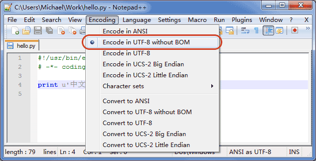

# 语法和杂七杂八

## _xx、xx__ 区别

```
_xx、__xx、__xx__ 区别
_xx：表示变量波保护，不希望外部访问，但可以访问到
__xx：表示变量私有，只有内部能访问到
__xx__：
类似 __xx__ 或 __xx__() 这种前后都有 2 个下划线的变量或方法，通常是Python中内置的特殊变量属性或方法的标识，我们应尽量避免使用该方式来自定义变量或方法
一般情况下，Python代码执行时会自动调用到这些内置属性或方法，比如当一个类对象实例化时，就会自动调用 __new__() 和 __init__() 来完成构造和初始化。
```


## 空语句

**pass**


## 中文

加u，例如：

```
print(u"=======当前路径：" + os.getcwd())
```


# pip遇到的问题

## 出现：  ERROR: Failed building wheel for pysilk-mod

前提说明：

```
  Stored in directory: /home/orangepi/.cache/pip/wheels/de/bd/bd/4aca667b1b66ffdc66ec328ca3510b1d7470ed5c1da4e1ce85
  Building wheel for pysilk-mod (PEP 517) ... error
  ERROR: Command errored out with exit status 1:
   command: /usr/bin/python3 /tmp/tmphi0rgjds build_wheel /tmp/tmp55zglwv3
       cwd: /tmp/pip-install-7is1l2di/pysilk-mod
  Complete output (31 lines):
  running bdist_wheel
  running build
  running build_py
  creating build
  creating build/lib.linux-aarch64-cpython-38
  creating build/lib.linux-aarch64-cpython-38/pysilk
  copying src/pysilk/wav.py -> build/lib.linux-aarch64-cpython-38/pysilk
  copying src/pysilk/utils.py -> build/lib.linux-aarch64-cpython-38/pysilk
  copying src/pysilk/pysilk.py -> build/lib.linux-aarch64-cpython-38/pysilk
  copying src/pysilk/__main__.py -> build/lib.linux-aarch64-cpython-38/pysilk
  copying src/pysilk/__init__.py -> build/lib.linux-aarch64-cpython-38/pysilk
  running egg_info
  writing src/pysilk_mod.egg-info/PKG-INFO
  writing dependency_links to src/pysilk_mod.egg-info/dependency_links.txt
  writing top-level names to src/pysilk_mod.egg-info/top_level.txt
  reading manifest file 'src/pysilk_mod.egg-info/SOURCES.txt'
  adding license file 'LICENSE'
  writing manifest file 'src/pysilk_mod.egg-info/SOURCES.txt'
  running build_ext
  aarch64-linux-gnu-gcc -pthread -Wno-unused-result -Wsign-compare -DNDEBUG -g -fwrapv -O2 -Wall -g -fstack-protector-strong -Wformat -Werror=format-security -g -fwrapv -O2 -fPIC -I/usr/include/python3.8 -c flagcheck.cpp -o flagcheck.o -std=c++17
  building 'pysilk.coder' extension
  creating build/temp.linux-aarch64-cpython-38
  creating build/temp.linux-aarch64-cpython-38/src
  creating build/temp.linux-aarch64-cpython-38/src/silk
  creating build/temp.linux-aarch64-cpython-38/src/silk/src
  aarch64-linux-gnu-gcc -pthread -Wno-unused-result -Wsign-compare -DNDEBUG -g -fwrapv -O2 -Wall -g -fstack-protector-strong -Wformat -Werror=format-security -g -fwrapv -O2 -fPIC -DVERSION_INFO=1.6.2 -Isrc/silk/interface -I/tmp/pip-build-env-qqgovn4b/overlay/lib/python3.8/site-packages/pybind11/include -I/usr/include/python3.8 -c src/silk/src/SKP_Silk_warped_autocorrelation_FIX.c -o build/temp.linux-aarch64-cpython-38/src/silk/src/SKP_Silk_warped_autocorrelation_FIX.o -fvisibility=hidden -g0
  src/silk/src/SKP_Silk_warped_autocorrelation_FIX.c:28:10: fatal error: SKP_Silk_main_FIX.h: No such file or directory
     28 | #include "SKP_Silk_main_FIX.h"
        |          ^~~~~~~~~~~~~~~~~~~~~
  compilation terminated.
  error: command '/usr/bin/aarch64-linux-gnu-gcc' failed with exit code 1
  ----------------------------------------
  ERROR: Failed building wheel for pysilk-mod

```

很显然，他是在构建时发现没有SKP_Silk_main_FIX.h这个文件然后停下的。

试去是来没作用，然后在lssues下网友提议，使用：

```
pip uninstall silk-python && pip install git+https://github.com/DCZYewen/Python-Silk-Module
```

这句命令表示执行以下操作：

1. 首先，使用`pip uninstall`命令卸载名为`silk-python`的软件包。
2. 然后，使用`pip install`命令从GitHub上安装一个名为`Python-Silk-Module`的软件包。它是从指定的GitHub仓库（https://github.com/DCZYewen/Python-Silk-Module）中安装的。

完美解决这个包构建问题


# 教程学习

## python基础

## 数据类型和变量

最后更新: 2019/4/25 14:43 / 阅读: 2115633303

计算机顾名思义就是可以做数学计算的机器，因此，计算机程序理所当然地可以处理各种数值。但是，计算机能处理的远不止数值，还可以处理文本、图形、音频、视频、网页等各种各样的数据，不同的数据，需要定义不同的数据类型。在Python中，能够直接处理的数据类型有以下几种：

#### 整数

Python可以处理任意大小的整数，当然包括负整数，在程序中的表示方法和数学上的写法一模一样，例如：`1`，`100`，`-8080`，`0`，等等。

计算机由于使用二进制，所以，有时候用十六进制表示整数比较方便，十六进制用`0x`前缀和0-9，a-f表示，例如：`0xff00`，`0xa5b4c3d2`，等等。

对于很大的数，例如`10000000000`，很难数清楚0的个数。**Python允许在数字中间以`_`分隔**，因此，写成`10_000_000_000`和`10000000000`是完全一样的。十六进制数也可以写成`0xa1b2_c3d4`。

#### 浮点数

浮点数也就是小数，之所以称为浮点数，是因为按照科学记数法表示时，一个浮点数的小数点位置是可变的，比如，1.23x109和12.3x108是完全相等的。浮点数可以用数学写法，如`1.23`，`3.14`，`-9.01`，等等。但是对于很大或很小的浮点数，就必须用科学计数法表示，把10用e替代，1.23x109就是`1.23e9`，或者`12.3e8`，0.000012可以写成`1.2e-5`，等等。

整数和浮点数在计算机内部存储的方式是不同的，整数运算永远是精确的（除法难道也是精确的？是的！注：整数除整数得整数），而浮点数运算则可能会有四舍五入的误差。

#### 字符串

字符串是以单引号`'`或双引号`"`括起来的任意文本，比如`'abc'`，`"xyz"`等等。请注意，`''`或`""`本身只是一种表示方式，不是字符串的一部分，因此，字符串`'abc'`只有`a`，`b`，`c`这3个字符。如果`'`本身也是一个字符，那就可以用`""`括起来，比如`"I'm OK"`包含的字符是`I`，`'`，`m`，空格，`O`，`K`这6个字符。

如果字符串内部既包含`'`又包含`"`怎么办？可以用转义字符`\`来标识，比如：

```
'I\'m \"OK\"!'
```

表示的字符串内容是：

```
I'm "OK"!
```

转义字符`\`可以转义很多字符，比如`\n`表示换行，`\t`表示制表符，字符`\`本身也要转义，所以`\\`表示的字符就是`\`，可以在Python的交互式命令行用`print()`打印字符串看看：

```
>>> print('I\'m ok.')
I'm ok.
>>> print('I\'m learning\nPython.')
I'm learning
Python.
>>> print('\\\n\\')
\
\
```

如果字符串里面有很多字符都需要转义，就需要加很多`\`，为了简化，Python还允许用`r''`表示`''`内部的字符串默认不转义，可以自己试试：

```
>>> print('\\\t\\')
\       \
>>> print(r'\\\t\\')
\\\t\\
```

如果字符串内部有很多换行，用`\n`写在一行里不好阅读，为了简化，Python允许用`'''...'''`的格式表示多行内容，可以自己试试：

```
>>> print('''line1
... line2
... line3''')
line1
line2
line3
```

上面是在交互式命令行内输入，注意在输入多行内容时，提示符由`>>>`变为`...`，提示你可以接着上一行输入，注意`...`是提示符，不是代码的一部分：

```ascii
┌────────────────────────────────────────────────────────┐
│Command Prompt - python                           _ □ x │
├────────────────────────────────────────────────────────┤
│>>> print('''line1                                      │
│... line2                                               │
│... line3''')                                           │
│line1                                                   │
│line2                                                   │
│line3                                                   │
│                                                        │
│>>> _                                                   │
│                                                        │
│                                                        │
│                                                        │
└────────────────────────────────────────────────────────┘
```

当输入完结束符`````和括号`)`后，执行该语句并打印结果。

如果写成程序并存为`.py`文件，就是：

```
print('''line1
line2
line3''')
```

多行字符串`'''...'''`还可以在前面加上`r`使用，请自行测试：

```
# -*- coding: utf-8 -*-
```

 Run

#### 布尔值

布尔值和布尔代数的表示完全一致，一个布尔值只有`True`、`False`两种值，要么是`True`，要么是`False`，在Python中，可以直接用`True`、`False`表示布尔值（请注意大小写），也可以通过布尔运算计算出来：

```
>>> True
True
>>> False
False
>>> 3 > 2
True
>>> 3 > 5
False
```

布尔值可以用`and`、`or`和`not`运算。

`and`运算是与运算，只有所有都为`True`，`and`运算结果才是`True`：

```
>>> True and True
True
>>> True and False
False
>>> False and False
False
>>> 5 > 3 and 3 > 1
True
```

`or`运算是或运算，只要其中有一个为`True`，`or`运算结果就是`True`：

```
>>> True or True
True
>>> True or False
True
>>> False or False
False
>>> 5 > 3 or 1 > 3
True
```

`not`运算是非运算，它是一个单目运算符，把`True`变成`False`，`False`变成`True`：

```
>>> not True
False
>>> not False
True
>>> not 1 > 2
True
```

布尔值经常用在条件判断中，比如：

```
if age >= 18:
    print('adult')
else:
    print('teenager')
```

#### 空值

空值是Python里一个特殊的值，用`None`表示。`None`不能理解为`0`，因为`0`是有意义的，而`None`是一个特殊的空值。

此外，Python还提供了列表、字典等多种数据类型，还允许创建自定义数据类型，我们后面会继续讲到。

### 变量

变量的概念基本上和初中代数的方程变量是一致的，只是在计算机程序中，变量不仅可以是数字，还可以是任意数据类型。

变量在程序中就是用一个变量名表示了，变量名必须是大小写英文、数字和`_`的组合，且不能用数字开头，比如：

```
a = 1
```

变量`a`是一个整数。

```
t_007 = 'T007'
```

变量`t_007`是一个字符串。

```
Answer = True
```

变量`Answer`是一个布尔值`True`。

在Python中，等号`=`是赋值语句，可以把任意数据类型赋值给变量，同一个变量可以反复赋值，而且可以是不同类型的变量，例如：

```
# -*- coding: utf-8 -*-
```

 Run

这种变量本身类型不固定的语言称之为*动态语言*，与之对应的是*静态语言*。静态语言在定义变量时必须指定变量类型，如果赋值的时候类型不匹配，就会报错。例如Java是静态语言，赋值语句如下（// 表示注释）：

```
int a = 123; // a是整数类型变量
a = "ABC"; // 错误：不能把字符串赋给整型变量
```

和静态语言相比，动态语言更灵活，就是这个原因。

请不要把赋值语句的等号等同于数学的等号。比如下面的代码：

```
x = 10
x = x + 2
```

如果从数学上理解`x = x + 2`那无论如何是不成立的，在程序中，赋值语句先计算右侧的表达式`x + 2`，得到结果`12`，再赋给变量`x`。由于`x`之前的值是`10`，重新赋值后，`x`的值变成`12`。

最后，理解变量在计算机内存中的表示也非常重要。当我们写：

```
a = 'ABC'
```

时，Python解释器干了两件事情：

1. 在内存中创建了一个`'ABC'`的字符串；
2. 在内存中创建了一个名为`a`的变量，并把它指向`'ABC'`。

也可以把一个变量`a`赋值给另一个变量`b`，这个操作实际上是把变量`b`指向变量`a`所指向的数据，例如下面的代码：

```
# -*- coding: utf-8 -*-
```

 Run

最后一行打印出变量`b`的内容到底是`'ABC'`呢还是`'XYZ'`？如果从数学意义上理解，就会错误地得出`b`和`a`相同，也应该是`'XYZ'`，但实际上`b`的值是`'ABC'`，让我们一行一行地执行代码，就可以看到到底发生了什么事：

执行`a = 'ABC'`，解释器创建了字符串`'ABC'`和变量`a`，并把`a`指向`'ABC'`：


执行`b = a`，解释器创建了变量`b`，并把`b`指向`a`指向的字符串`'ABC'`：


执行`a = 'XYZ'`，解释器创建了字符串'XYZ'，并把`a`的指向改为`'XYZ'`，但`b`并没有更改：


所以，最后打印变量`b`的结果自然是`'ABC'`了。

### 常量

所谓常量就是不能变的变量，比如常用的数学常数π就是一个常量。在Python中，**通常用全部大写的变量名表示常量**：

```
PI = 3.14159265359
```

但事实上`PI`仍然是一个变量，Python根本没有任何机制保证`PI`不会被改变，所以，用全部大写的变量名表示常量只是一个习惯上的用法，如果你一定要改变变量`PI`的值，也没人能拦住你。

最后解释一下整数的除法为什么也是精确的。在Python中，有两种除法，一种除法是`/`：

```
>>> 10 / 3
3.3333333333333335
```

`/`除法计算结果是浮点数，即使是两个整数恰好整除，结果也是浮点数：

```
>>> 9 / 3
3.0
```

还有一种除法是`//`，称为地板除，两个整数的除法仍然是整数：

```
>>> 10 // 3
3
```

你没有看错，整数的地板除`//`永远是整数，即使除不尽。要做精确的除法，使用`/`就可以。

因为`//`除法只取结果的整数部分，所以Python还提供一个余数运算，可以得到两个整数相除的余数：

```
>>> 10 % 3
1
```

无论整数做`//`除法还是取余数，结果永远是整数，所以，整数运算结果永远是精确的。

### 练习

请打印出以下变量的值：

```
# -*- coding: utf-8 -*-
n = 123
f = 456.789
s1 = 'Hello, world'
s2 = 'Hello, \'Adam\''
s3 = r'Hello, "Bart"'
s4 = r'''Hello,
Lisa!'''
```

 Run

### 小结

Python支持多种数据类型，在计算机内部，可以把任何数据都看成一个“对象”，而变量就是在程序中用来指向这些数据对象的，对变量赋值就是把数据和变量给关联起来。

对变量赋值`x = y`是把变量`x`指向真正的对象，该对象是变量`y`所指向的。随后对变量`y`的赋值*不影响*变量`x`的指向。

注意：Python的整数没有大小限制，而某些语言的整数根据其存储长度是有大小限制的，例如Java对32位整数的范围限制在`-2147483648`-`2147483647`。

Python的浮点数也没有大小限制，但是超出一定范围就直接表示为`inf`（无限大）。

## 字符串和编码

最后更新: 2019/4/2 10:33 / 阅读: 1240215209

------

### 字符编码

我们已经讲过了，字符串也是一种数据类型，但是，字符串比较特殊的是还有一个编码问题。

因为计算机只能处理数字，如果要处理文本，就必须先把文本转换为数字才能处理。最早的计算机在设计时采用8个比特（bit）作为一个字节（byte），所以，一个字节能表示的最大的整数就是255（二进制11111111=十进制255），如果要表示更大的整数，就必须用更多的字节。比如两个字节可以表示的最大整数是`65535`，4个字节可以表示的最大整数是`4294967295`。

由于计算机是美国人发明的，因此，最早只有127个字符被编码到计算机里，也就是大小写英文字母、数字和一些符号，这个编码表被称为`ASCII`编码，比如大写字母`A`的编码是`65`，小写字母`z`的编码是`122`。

但是要处理中文显然一个字节是不够的，至少需要两个字节，而且还不能和ASCII编码冲突，所以，中国制定了`GB2312`编码，用来把中文编进去。

你可以想得到的是，全世界有上百种语言，日本把日文编到`Shift_JIS`里，韩国把韩文编到`Euc-kr`里，各国有各国的标准，就会不可避免地出现冲突，结果就是，在多语言混合的文本中，显示出来会有乱码。


因此，Unicode字符集应运而生。Unicode把所有语言都统一到一套编码里，这样就不会再有乱码问题了。

Unicode标准也在不断发展，但最常用的是UCS-16编码，用两个字节表示一个字符（如果要用到非常偏僻的字符，就需要4个字节）。现代操作系统和大多数编程语言都直接支持Unicode。

现在，捋一捋ASCII编码和Unicode编码的区别：ASCII编码是1个字节，而Unicode编码通常是2个字节。

字母`A`用ASCII编码是十进制的`65`，二进制的`01000001`；

字符`0`用ASCII编码是十进制的`48`，二进制的`00110000`，注意字符`'0'`和整数`0`是不同的；

汉字`中`已经超出了ASCII编码的范围，用Unicode编码是十进制的`20013`，二进制的`01001110 00101101`。

你可以猜测，如果把ASCII编码的`A`用Unicode编码，只需要在前面补0就可以，因此，`A`的Unicode编码是`00000000 01000001`。

新的问题又出现了：如果统一成Unicode编码，乱码问题从此消失了。但是，如果你写的文本基本上全部是英文的话，用Unicode编码比ASCII编码需要多一倍的存储空间，在存储和传输上就十分不划算。

所以，本着节约的精神，又出现了把Unicode编码转化为“可变长编码”的`UTF-8`编码。UTF-8编码把一个Unicode字符根据不同的数字大小编码成1-6个字节，常用的英文字母被编码成1个字节，汉字通常是3个字节，只有很生僻的字符才会被编码成4-6个字节。如果你要传输的文本包含大量英文字符，用UTF-8编码就能节省空间：

| 字符 | ASCII    | Unicode           | UTF-8                      |
| :--- | :------- | :---------------- | :------------------------- |
| A    | 01000001 | 00000000 01000001 | 01000001                   |
| 中   | x        | 01001110 00101101 | 11100100 10111000 10101101 |

从上面的表格还可以发现，UTF-8编码有一个额外的好处，就是ASCII编码实际上可以被看成是UTF-8编码的一部分，所以，大量只支持ASCII编码的历史遗留软件可以在UTF-8编码下继续工作。

搞清楚了ASCII、Unicode和UTF-8的关系，我们就可以总结一下现在计算机系统通用的字符编码工作方式：

在计算机内存中，统一使用Unicode编码，当需要保存到硬盘或者需要传输的时候，就转换为UTF-8编码。

用记事本编辑的时候，从文件读取的UTF-8字符被转换为Unicode字符到内存里，编辑完成后，保存的时候再把Unicode转换为UTF-8保存到文件：


浏览网页的时候，服务器会把动态生成的Unicode内容转换为UTF-8再传输到浏览器：


所以你看到很多网页的源码上会有类似`<meta charset="UTF-8" />`的信息，表示该网页正是用的UTF-8编码。

### Python的字符串

搞清楚了令人头疼的字符编码问题后，我们再来研究Python的字符串。

在最新的Python 3版本中，字符串是以Unicode编码的，也就是说，Python的字符串支持多语言，例如：

```
>>> print('包含中文的str')
包含中文的str
```

对于单个字符的编码，Python提供了`ord()`函数获取字符的整数表示，`chr()`函数把编码转换为对应的字符：

```
>>> ord('A')
65
>>> ord('中')
20013
>>> chr(66)
'B'
>>> chr(25991)
'文'
```

如果知道字符的整数编码，还可以用十六进制这么写`str`：

```
>>> '\u4e2d\u6587'
'中文'
```

两种写法完全是等价的。

由于Python的字符串类型是`str`，在内存中以Unicode表示，一个字符对应若干个字节。如果要在网络上传输，或者保存到磁盘上，就需要把`str`变为以字节为单位的`bytes`。

Python对`bytes`类型的数据用带`b`前缀的单引号或双引号表示：

```
x = b'ABC'
```

要注意区分`'ABC'`和`b'ABC'`，前者是`str`，后者虽然内容显示得和前者一样，但`bytes`的每个字符都只占用一个字节。

以Unicode表示的`str`通过`encode()`方法可以编码为指定的`bytes`，例如：

```
>>> 'ABC'.encode('ascii')
b'ABC'
>>> '中文'.encode('utf-8')
b'\xe4\xb8\xad\xe6\x96\x87'
>>> '中文'.encode('ascii')
Traceback (most recent call last):
  File "<stdin>", line 1, in <module>
UnicodeEncodeError: 'ascii' codec can't encode characters in position 0-1: ordinal not in range(128)
```

纯英文的`str`可以用`ASCII`编码为`bytes`，内容是一样的，含有中文的`str`可以用`UTF-8`编码为`bytes`。含有中文的`str`无法用`ASCII`编码，因为中文编码的范围超过了`ASCII`编码的范围，Python会报错。

在`bytes`中，无法显示为ASCII字符的字节，用`\x##`显示。

反过来，如果我们从网络或磁盘上读取了字节流，那么读到的数据就是`bytes`。要把`bytes`变为`str`，就需要用`decode()`方法：

```
>>> b'ABC'.decode('ascii')
'ABC'
>>> b'\xe4\xb8\xad\xe6\x96\x87'.decode('utf-8')
'中文'
```

如果`bytes`中包含无法解码的字节，`decode()`方法会报错：

```
>>> b'\xe4\xb8\xad\xff'.decode('utf-8')
Traceback (most recent call last):
  ...
UnicodeDecodeError: 'utf-8' codec can't decode byte 0xff in position 3: invalid start byte
```

如果`bytes`中只有一小部分无效的字节，可以传入`errors='ignore'`忽略错误的字节：

```
>>> b'\xe4\xb8\xad\xff'.decode('utf-8', errors='ignore')
'中'
```

要计算`str`包含多少个字符，可以用`len()`函数：

```
>>> len('ABC')
3
>>> len('中文')
2
```

`len()`函数计算的是`str`的字符数，如果换成`bytes`，`len()`函数就计算字节数：

```
>>> len(b'ABC')
3
>>> len(b'\xe4\xb8\xad\xe6\x96\x87')
6
>>> len('中文'.encode('utf-8'))
6
```

可见，1个中文字符经过UTF-8编码后通常会占用3个字节，而1个英文字符只占用1个字节。

在操作字符串时，我们经常遇到`str`和`bytes`的互相转换。为了避免乱码问题，应当始终坚持使用UTF-8编码对`str`和`bytes`进行转换。

由于Python源代码也是一个文本文件，所以，当你的源代码中包含中文的时候，在保存源代码时，就需要务必指定保存为UTF-8编码。当Python解释器读取源代码时，为了让它按UTF-8编码读取，我们通常在文件开头写上这两行：

```
#!/usr/bin/env python3
# -*- coding: utf-8 -*-
```

第一行注释是为了告诉Linux/OS X系统，这是一个Python可执行程序，Windows系统会忽略这个注释；

第二行注释是为了告诉Python解释器，按照UTF-8编码读取源代码，否则，你在源代码中写的中文输出可能会有乱码。

申明了UTF-8编码并不意味着你的`.py`文件就是UTF-8编码的，必须并且要确保文本编辑器正在使用UTF-8 without BOM编码：



如果`.py`文件本身使用UTF-8编码，并且也申明了`# -*- coding: utf-8 -*-`，打开命令提示符测试就可以正常显示中文：


### 格式化

最后一个常见的问题是如何输出格式化的字符串。我们经常会输出类似`'亲爱的xxx你好！你xx月的话费是xx，余额是xx'`之类的字符串，而xxx的内容都是根据变量变化的，所以，需要一种简便的格式化字符串的方式。


在Python中，采用的格式化方式和C语言是一致的，用`%`实现，举例如下：

```
>>> 'Hello, %s' % 'world'
'Hello, world'
>>> 'Hi, %s, you have $%d.' % ('Michael', 1000000)
'Hi, Michael, you have $1000000.'
```

你可能猜到了，`%`运算符就是用来格式化字符串的。在字符串内部，`%s`表示用字符串替换，`%d`表示用整数替换，有几个`%?`占位符，后面就跟几个变量或者值，顺序要对应好。如果只有一个`%?`，括号可以省略。

常见的占位符有：

| 占位符 | 替换内容     |
| :----- | :----------- |
| %d     | 整数         |
| %f     | 浮点数       |
| %s     | 字符串       |
| %x     | 十六进制整数 |

其中，格式化整数和浮点数还可以指定是否补0和整数与小数的位数：

```
# -*- coding: utf-8 -*-
```

 Run

如果你不太确定应该用什么，`%s`永远起作用，它会把任何数据类型转换为字符串：

```
>>> 'Age: %s. Gender: %s' % (25, True)
'Age: 25. Gender: True'
```

有些时候，字符串里面的`%`是一个普通字符怎么办？这个时候就需要转义，用`%%`来表示一个`%`：

```
>>> 'growth rate: %d %%' % 7
'growth rate: 7 %'
```

### format()

另一种格式化字符串的方法是使用字符串的`format()`方法，它会用传入的参数依次替换字符串内的占位符`{0}`、`{1}`……，不过这种方式写起来比%要麻烦得多：

```
>>> 'Hello, {0}, 成绩提升了 {1:.1f}%'.format('小明', 17.125)
'Hello, 小明, 成绩提升了 17.1%'
```

### f-string

最后一种格式化字符串的方法是使用以`f`开头的字符串，称之为`f-string`，它和普通字符串不同之处在于，字符串如果包含`{xxx}`，就会以对应的变量替换：

```
>>> r = 2.5
>>> s = 3.14 * r ** 2
>>> print(f'The area of a circle with radius {r} is {s:.2f}')
The area of a circle with radius 2.5 is 19.62
```

上述代码中，`{r}`被变量`r`的值替换，`{s:.2f}`被变量`s`的值替换，并且`:`后面的`.2f`指定了格式化参数（即保留两位小数），因此，`{s:.2f}`的替换结果是`19.62`。

### 练习

小明的成绩从去年的72分提升到了今年的85分，请计算小明成绩提升的百分点，并用字符串格式化显示出`'xx.x%'`，只保留小数点后1位：

```
# -*- coding: utf-8 -*-

s1 = 72
s2 = 85
```

 Run

### 小结

Python 3的字符串使用Unicode，直接支持多语言。

当`str`和`bytes`互相转换时，需要指定编码。最常用的编码是`UTF-8`。Python当然也支持其他编码方式，比如把Unicode编码成`GB2312`：

```
>>> '中文'.encode('gb2312')
b'\xd6\xd0\xce\xc4'
```

但这种方式纯属自找麻烦，如果没有特殊业务要求，请牢记仅使用`UTF-8`编码。

格式化字符串的时候，可以用Python的交互式环境测试，方便快捷。

### 参考源码

[the_string.py](https://github.com/michaelliao/learn-python3/blob/master/samples/basic/the_string.py)

## list和tuple

```
# 列表
list = ["list1", "list2", "list3"]
# 元组，初始化后元素就不可更改，单元素指向的数据可以改，只有一个元素时要注意加","
tuple = ("tuple", )
tuple2 = ("tuple2", ["list1", "list2"])
tuple2[1][1] = "list3"
```

#### 使用list和tuple

最后更新: 2019/4/14 09:59 / 阅读: 1106450676

------

### list

Python内置的一种数据类型是列表：list。list是一种有序的集合，可以随时添加和删除其中的元素。

比如，列出班里所有同学的名字，就可以用一个list表示：

```
>>> classmates = ['Michael', 'Bob', 'Tracy']
>>> classmates
['Michael', 'Bob', 'Tracy']
```

变量`classmates`就是一个list。用`len()`函数可以获得list元素的个数：

```
>>> len(classmates)
3
```

用索引来访问list中每一个位置的元素，记得索引是从`0`开始的：

```
>>> classmates[0]
'Michael'
>>> classmates[1]
'Bob'
>>> classmates[2]
'Tracy'
>>> classmates[3]
Traceback (most recent call last):
  File "<stdin>", line 1, in <module>
IndexError: list index out of range
```

当索引超出了范围时，Python会报一个`IndexError`错误，所以，要确保索引不要越界，记得最后一个元素的索引是`len(classmates) - 1`。

如果要取最后一个元素，除了计算索引位置外，还可以用`-1`做索引，直接获取最后一个元素：

```
>>> classmates[-1]
'Tracy'
```

以此类推，可以获取倒数第2个、倒数第3个：

```
>>> classmates[-2]
'Bob'
>>> classmates[-3]
'Michael'
>>> classmates[-4]
Traceback (most recent call last):
  File "<stdin>", line 1, in <module>
IndexError: list index out of range
```

当然，倒数第4个就越界了。

list是一个可变的有序表，所以，可以往list中追加元素到末尾：

```
>>> classmates.append('Adam')
>>> classmates
['Michael', 'Bob', 'Tracy', 'Adam']
```

也可以把元素插入到指定的位置，比如索引号为`1`的位置：

```
>>> classmates.insert(1, 'Jack')
>>> classmates
['Michael', 'Jack', 'Bob', 'Tracy', 'Adam']
```

要删除list末尾的元素，用`pop()`方法：

```
>>> classmates.pop()
'Adam'
>>> classmates
['Michael', 'Jack', 'Bob', 'Tracy']
```

要删除指定位置的元素，用`pop(i)`方法，其中`i`是索引位置：

```
>>> classmates.pop(1)
'Jack'
>>> classmates
['Michael', 'Bob', 'Tracy']
```

要把某个元素替换成别的元素，可以直接赋值给对应的索引位置：

```
>>> classmates[1] = 'Sarah'
>>> classmates
['Michael', 'Sarah', 'Tracy']
```

list里面的元素的数据类型也可以不同，比如：

```
>>> L = ['Apple', 123, True]
```

list元素也可以是另一个list，比如：

```
>>> s = ['python', 'java', ['asp', 'php'], 'scheme']
>>> len(s)
4
```

要注意`s`只有4个元素，其中`s[2]`又是一个list，如果拆开写就更容易理解了：

```
>>> p = ['asp', 'php']
>>> s = ['python', 'java', p, 'scheme']
```

要拿到`'php'`可以写`p[1]`或者`s[2][1]`，因此`s`可以看成是一个二维数组，类似的还有三维、四维……数组，不过很少用到。

如果一个list中一个元素也没有，就是一个空的list，它的长度为0：

```
>>> L = []
>>> len(L)
0
```

### tuple

另一种有序列表叫元组：tuple。tuple和list非常类似，但是tuple一旦初始化就不能修改，比如同样是列出同学的名字：

```
>>> classmates = ('Michael', 'Bob', 'Tracy')
```

现在，classmates这个tuple不能变了，它也没有append()，insert()这样的方法。其他获取元素的方法和list是一样的，你可以正常地使用`classmates[0]`，`classmates[-1]`，但不能赋值成另外的元素。

不可变的tuple有什么意义？因为tuple不可变，所以代码更安全。如果可能，能用tuple代替list就尽量用tuple。

tuple的陷阱：当你定义一个tuple时，在定义的时候，tuple的元素就必须被确定下来，比如：

```
>>> t = (1, 2)
>>> t
(1, 2)
```

如果要定义一个空的tuple，可以写成`()`：

```
>>> t = ()
>>> t
()
```

但是，要定义一个只有1个元素的tuple，如果你这么定义：

```
>>> t = (1)
>>> t
1
```

定义的不是tuple，是`1`这个数！这是因为括号`()`既可以表示tuple，又可以表示数学公式中的小括号，这就产生了歧义，因此，Python规定，这种情况下，按小括号进行计算，计算结果自然是`1`。

所以，只有1个元素的tuple定义时必须加一个逗号`,`，来消除歧义：

```
>>> t = (1,)
>>> t
(1,)
```

Python在显示只有1个元素的tuple时，也会加一个逗号`,`，以免你误解成数学计算意义上的括号。

最后来看一个“可变的”tuple：

```
>>> t = ('a', 'b', ['A', 'B'])
>>> t[2][0] = 'X'
>>> t[2][1] = 'Y'
>>> t
('a', 'b', ['X', 'Y'])
```

这个tuple定义的时候有3个元素，分别是`'a'`，`'b'`和一个list。不是说tuple一旦定义后就不可变了吗？怎么后来又变了？

别急，我们先看看定义的时候tuple包含的3个元素：


当我们把list的元素`'A'`和`'B'`修改为`'X'`和`'Y'`后，tuple变为：


表面上看，tuple的元素确实变了，但其实变的不是tuple的元素，而是list的元素。tuple一开始指向的list并没有改成别的list，所以，tuple所谓的“不变”是说，tuple的每个元素，指向永远不变。即指向`'a'`，就不能改成指向`'b'`，指向一个list，就不能改成指向其他对象，但指向的这个list本身是可变的！

理解了“指向不变”后，要创建一个内容也不变的tuple怎么做？那就必须保证tuple的每一个元素本身也不能变。

#### 模式匹配

最后更新: 2023/10/3 13:35 / 阅读: 563246

------

当我们用`if ... elif ... elif ... else ...`判断时，会写很长一串代码，可读性较差。

如果要针对某个变量匹配若干种情况，可以使用`match`语句。

例如，某个学生的成绩只能是`A`、`B`、`C`，用`if`语句编写如下：

```
score = 'B'
if score == 'A':
    print('score is A.')
elif score == 'B':
    print('score is B.')
elif score == 'C':
    print('score is C.')
else:
    print('invalid score.')
```

如果用`match`语句改写，则改写如下：

```
# -*- coding: utf-8 -*-
```

 Run

使用`match`语句时，我们依次用`case xxx`匹配，并且可以在最后（且仅能在最后）加一个`case _`表示“任意值”，代码较`if ... elif ... else ...`更易读。

### 复杂匹配

`match`语句除了可以匹配简单的单个值外，还可以匹配多个值、匹配一定范围，并且把匹配后的值绑定到变量：

```
# -*- coding: utf-8 -*-
```

 Run

在上面这个示例中，第一个`case x if x < 10`表示当`age < 10`成立时匹配，且赋值给变量`x`，第二个`case 10`仅匹配单个值，第三个`case 11|12|...|18`能匹配多个值，用`|`分隔。

可见，`match`语句的`case`匹配非常灵活。

### 匹配列表

`match`语句还可以匹配列表，功能非常强大。

我们假设用户输入了一个命令，用`args = ['gcc', 'hello.c']`存储，下面的代码演示了如何用`match`匹配来解析这个列表：

```
# -*- coding: utf-8 -*-
```

 Run

第一个`case ['gcc']`表示列表仅有`'gcc'`一个字符串，没有指定文件名，报错；

第二个`case ['gcc', file1, *files]`表示列表第一个字符串是`'gcc'`，第二个字符串绑定到变量`file1`，后面的任意个字符串绑定到`*files`（符号`*`的作用将在[函数的参数](https://www.liaoxuefeng.com/wiki/1016959663602400/1017261630425888)中讲解），它实际上表示至少指定一个文件；

第三个`case ['clean']`表示列表仅有`'clean'`一个字符串；

最后一个`case _`表示其他所有情况。

可见，`match`语句的匹配规则非常灵活，可以写出非常简洁的代码。

## dict

```
# dict（map），查找键对应值，这是一种高效的方法，以空间换时间，不会随着列表变长而变长
map = {"xiaoming":"daxia", "xiaohong":"caiji"}
# 直接提取时，当没有该键，就会报错
print(map["xiaoming"])
# 使用get方法，返回none，或指定为-1
print(map.get("caiji"))
print(map.get("caiji")==None)
print(map.get("caiji", -1))
```

## 函数

```
# ******函数
# 定义了一个函数，在函数定义时，默认参数L会实例化
def add_end(L=[]):
    L.append('END')
    return L

# 有一个list
func_list = [1, 2, 3]
# 添加进去，但是，函数add_end中的L指向了func_list
add_end(func_list)
print(func_list)

# 空参数，L就是定义时的L
func_list2 = add_end()

add_end(func_list)
print(func_list)

# L再次被添加'END'
func_list3 = add_end()
# func_list3填充为：['END', 'END']
print(func_list3)
```

注意：**默认参数**

```
# 用不变对象None，再返回，就不会产生
def add_end(L=None):
    if L==None:
        L = []
    L.append('END')
    return L

func_list2 = add_end()
func_list3 = add_end()
print(func_list2)
print(func_list3)
```


## 高级特性

简化代码数量，相当于语法糖

### 切片：":"

场景：取一个list或tuple的部分元素是非常常见的操作。这时，就可以使用切片。

例子：有一个list，对其切片

```
list_list = []
for num in range(0, 10):
    list_list.append(num)
print(list_list)
# 头一个到倒数第二个
print(list_list[:-1])
# 第三个到倒数第二个
print(list_list[2:-1])
```

输出得到

```
[0, 1, 2, 3, 4, 5, 6, 7, 8, 9]
[0, 1, 2, 3, 4, 5, 6, 7, 8]
[2, 3, 4, 5, 6, 7, 8]
```

### 迭代

注释：py的迭代就是从一个东西中不断拿东西出来给另一个变量

最后更新: 2023/2/2 21:08 / 阅读: 235327985

------

如果给定一个`list`或`tuple`，我们可以通过`for`循环来遍历这个`list`或`tuple`，这种遍历我们称为迭代（Iteration）。

在Python中，迭代是通过`for ... in`来完成的，而很多语言比如C语言，迭代`list`是通过下标完成的，比如C代码：

```
for (i=0; i<length; i++) {
    n = list[i];
}
```

可以看出，Python的`for`循环抽象程度要高于C的`for`循环，因为Python的`for`循环不仅可以用在`list`或`tuple`上，还可以作用在其他可迭代对象上。

`list`这种数据类型虽然有下标，但很多其他数据类型是没有下标的，但是，只要是可迭代对象，无论有无下标，都可以迭代，比如`dict`就可以迭代：

```
>>> d = {'a': 1, 'b': 2, 'c': 3}
>>> for key in d:
...     print(key)
...
a
c
b
```

因为`dict`的存储不是按照`list`的方式顺序排列，所以，迭代出的结果顺序很可能不一样。

默认情况下，`dict`迭代的是key。如果要迭代value，可以用`for value in d.values()`，如果要同时迭代key和value，可以用`for k, v in d.items()`。

由于字符串也是可迭代对象，因此，也可以作用于`for`循环：

```
>>> for ch in 'ABC':
...     print(ch)
...
A
B
C
```

所以，当我们使用`for`循环时，只要作用于一个可迭代对象，`for`循环就可以正常运行，而我们不太关心该对象究竟是`list`还是其他数据类型。

那么，如何判断一个对象是可迭代对象呢？方法是通过`collections.abc`模块的`Iterable`类型判断：

```
>>> from collections.abc import Iterable
>>> isinstance('abc', Iterable) # str是否可迭代
True
>>> isinstance([1,2,3], Iterable) # list是否可迭代
True
>>> isinstance(123, Iterable) # 整数是否可迭代
False
```

最后一个小问题，如果要对`list`实现类似Java那样的下标循环怎么办？Python内置的`enumerate`函数可以把一个`list`变成索引-元素对，这样就可以在`for`循环中同时迭代索引和元素本身：

```
>>> for i, value in enumerate(['A', 'B', 'C']):
...     print(i, value)
...
0 A
1 B
2 C
```

上面的`for`循环里，同时引用了两个变量，在Python里是很常见的，比如下面的代码：

```
>>> for x, y in [(1, 1), (2, 4), (3, 9)]:
...     print(x, y)
...
1 1
2 4
3 9
```

### 列表生成式

注释：列表生成器是py给的语法糖，形如：

```
>>> [x * x for x in range(1, 11)]
[1, 4, 9, 16, 25, 36, 49, 64, 81, 100]
```

最后更新: 2018/7/18 17:21 / 阅读: 264120005

------

列表生成式即List Comprehensions，是Python内置的非常简单却强大的可以用来创建list的生成式。

举个例子，要生成list `[1, 2, 3, 4, 5, 6, 7, 8, 9, 10]`可以用`list(range(1, 11))`：

```
>>> list(range(1, 11))
[1, 2, 3, 4, 5, 6, 7, 8, 9, 10]
```

但如果要生成`[1x1, 2x2, 3x3, ..., 10x10]`怎么做？方法一是循环：

```
>>> L = []
>>> for x in range(1, 11):
...    L.append(x * x)
...
>>> L
[1, 4, 9, 16, 25, 36, 49, 64, 81, 100]
```

但是循环太繁琐，而列表生成式则可以用一行语句代替循环生成上面的list：

```
>>> [x * x for x in range(1, 11)]
[1, 4, 9, 16, 25, 36, 49, 64, 81, 100]
```

写列表生成式时，把要生成的元素`x * x`放到前面，后面跟`for`循环，就可以把list创建出来，十分有用，多写几次，很快就可以熟悉这种语法。

for循环后面还可以加上if判断，这样我们就可以筛选出仅偶数的平方：

```
>>> [x * x for x in range(1, 11) if x % 2 == 0]
[4, 16, 36, 64, 100]
```

还可以使用两层循环，可以生成全排列：

```
>>> [m + n for m in 'ABC' for n in 'XYZ']
['AX', 'AY', 'AZ', 'BX', 'BY', 'BZ', 'CX', 'CY', 'CZ']
```

三层和三层以上的循环就很少用到了。

运用列表生成式，可以写出非常简洁的代码。例如，列出当前目录下的所有文件和目录名，可以通过一行代码实现：

```
>>> import os # 导入os模块，模块的概念后面讲到
>>> [d for d in os.listdir('.')] # os.listdir可以列出文件和目录
['.emacs.d', '.ssh', '.Trash', 'Adlm', 'Applications', 'Desktop', 'Documents', 'Downloads', 'Library', 'Movies', 'Music', 'Pictures', 'Public', 'VirtualBox VMs', 'Workspace', 'XCode']
```

`for`循环其实可以同时使用两个甚至多个变量，比如`dict`的`items()`可以同时迭代key和value：

```
>>> d = {'x': 'A', 'y': 'B', 'z': 'C' }
>>> for k, v in d.items():
...     print(k, '=', v)
...
y = B
x = A
z = C
```

因此，列表生成式也可以使用两个变量来生成list：

```
>>> d = {'x': 'A', 'y': 'B', 'z': 'C' }
>>> [k + '=' + v for k, v in d.items()]
['y=B', 'x=A', 'z=C']
```

最后把一个list中所有的字符串变成小写：

```
>>> L = ['Hello', 'World', 'IBM', 'Apple']
>>> [s.lower() for s in L]
['hello', 'world', 'ibm', 'apple']
```

#### if ... else

使用列表生成式的时候，有些童鞋经常搞不清楚`if...else`的用法。

例如，以下代码正常输出偶数：

```
>>> [x for x in range(1, 11) if x % 2 == 0]
[2, 4, 6, 8, 10]
```

但是，我们不能在最后的`if`加上`else`：

```
>>> [x for x in range(1, 11) if x % 2 == 0 else 0]
  File "<stdin>", line 1
    [x for x in range(1, 11) if x % 2 == 0 else 0]
                                              ^
SyntaxError: invalid syntax
```

这是因为跟在`for`后面的`if`是一个筛选条件，不能带`else`，否则如何筛选？

另一些童鞋发现把`if`写在`for`前面必须加`else`，否则报错：

```
>>> [x if x % 2 == 0 for x in range(1, 11)]
  File "<stdin>", line 1
    [x if x % 2 == 0 for x in range(1, 11)]
                       ^
SyntaxError: invalid syntax
```

这是因为`for`前面的部分是一个表达式，它必须根据`x`计算出一个结果。因此，考察表达式：`x if x % 2 == 0`，它无法根据`x`计算出结果，因为缺少`else`，必须加上`else`：

```
>>> [x if x % 2 == 0 else -x for x in range(1, 11)]
[-1, 2, -3, 4, -5, 6, -7, 8, -9, 10]
```

上述`for`前面的表达式`x if x % 2 == 0 else -x`才能根据`x`计算出确定的结果。

可见，在一个列表生成式中，`for`前面的`if ... else`是表达式，而`for`后面的`if`是过滤条件，不能带`else`。

#### 练习

如果list中既包含字符串，又包含整数，由于非字符串类型没有`lower()`方法，所以列表生成式会报错：

```
>>> L = ['Hello', 'World', 18, 'Apple', None]
>>> [s.lower() for s in L]
Traceback (most recent call last):
  File "<stdin>", line 1, in <module>
  File "<stdin>", line 1, in <listcomp>
AttributeError: 'int' object has no attribute 'lower'
```

使用内建的`isinstance`函数可以判断一个变量是不是字符串：

```
>>> x = 'abc'
>>> y = 123
>>> isinstance(x, str)
True
>>> isinstance(y, str)
False
```

请修改列表生成式，通过添加`if`语句保证列表生成式能正确地执行：

```
# -*- coding: utf-8 -*-
L1 = ['Hello', 'World', 18, 'Apple', None]
# 测试:
print(L2)
if L2 == ['hello', 'world', 'apple']:
    print('测试通过!')
else:
    print('测试失败!')
```

## 生成器


在Python中，生成器（Generator）是一种特殊的迭代器，它允许你按需产生值，而不是一次性生成所有值并将它们存储在内存中。生成器使用 `yield` 关键字来产生值，而不是使用 `return`，这使得生成器的状态在每次调用时都会被保留。

以下是关于Python生成器的基本信息和使用方法：

1. **生成器的创建：**

   - 使用函数定义生成器，其中包含 `yield` 语句。当生成器函数被调用时，它返回一个生成器对象，但不执行函数体。

   - 例如：

     ```
     pythonCopy codedef my_generator():
         yield 1
         yield 2
         yield 3
     
     gen = my_generator()
     ```

2. **生成器的调用：**

   - 生成器对象可以通过调用 `next()` 函数来逐步获取生成器的值。每次调用 `next()`，生成器函数将执行到下一个 `yield` 语句，并返回其值。

   - 例如：

     ```
     pythonCopy codeprint(next(gen))  # 输出: 1
     print(next(gen))  # 输出: 2
     print(next(gen))  # 输出: 3
     ```

3. **生成器表达式：**

   - 类似于列表推导式，Python也支持生成器表达式，但是使用圆括号而不是方括号。生成器表达式的语法更加简洁。

   - 例如：

     ```
     pythonCopy code
     gen_expr = (x for x in range(5))
     ```

4. **使用生成器进行循环：**

   - 生成器适用于处理大量数据时，可以节省内存。通过生成器，你可以逐个处理数据而无需一次性将它们全部加载到内存中。

   - 例如：

     ```
     pythonCopy codedef read_large_file(file_path):
         with open(file_path, 'r') as file:
             for line in file:
                 yield line
     ```

5. **生成器的状态保存：**

   - 生成器可以保持其局部变量的状态，使得每次调用 `next()` 时可以从上一次暂停的位置继续执行。

   - 例如：

     ```
     pythonCopy codedef counter():
         i = 0
         while True:
             yield i
             i += 1
     
     count = counter()
     print(next(count))  # 输出: 0
     print(next(count))  # 输出: 1
     ```

生成器是一种强大的工具，特别适用于需要按需处理大量数据或需要保存状态的情况。在实际编程中，生成器可以帮助提高性能和降低内存消耗。

## 迭代器

我们已经知道，可以直接作用于`for`循环的数据类型有以下几种：

一类是集合数据类型，如`list`、`tuple`、`dict`、`set`、`str`等；

一类是`generator`，包括生成器和带`yield`的generator function。

这些可以直接作用于`for`循环的对象统称为可迭代对象：`Iterable`。

可以使用`isinstance()`判断一个对象是否是`Iterable`对象：

```
>>> from collections.abc import Iterable
>>> isinstance([], Iterable)
True
>>> isinstance({}, Iterable)
True
>>> isinstance('abc', Iterable)
True
>>> isinstance((x for x in range(10)), Iterable)
True
>>> isinstance(100, Iterable)
False
```

而生成器不但可以作用于`for`循环，还可以被`next()`函数不断调用并返回下一个值，直到最后抛出`StopIteration`错误表示无法继续返回下一个值了。

可以被`next()`函数调用并不断返回下一个值的对象称为迭代器：`Iterator`。

可以使用`isinstance()`判断一个对象是否是`Iterator`对象：

```
>>> from collections.abc import Iterator
>>> isinstance((x for x in range(10)), Iterator)
True
>>> isinstance([], Iterator)
False
>>> isinstance({}, Iterator)
False
>>> isinstance('abc', Iterator)
False
```

生成器都是`Iterator`对象，但`list`、`dict`、`str`虽然是`Iterable`，却不是`Iterator`。

把`list`、`dict`、`str`等`Iterable`变成`Iterator`可以使用`iter()`函数：

```
>>> isinstance(iter([]), Iterator)
True
>>> isinstance(iter('abc'), Iterator)
True
```

你可能会问，为什么`list`、`dict`、`str`等数据类型不是`Iterator`？

这是因为Python的`Iterator`对象表示的是一个数据流，Iterator对象可以被`next()`函数调用并不断返回下一个数据，直到没有数据时抛出`StopIteration`错误。可以把这个数据流看做是一个有序序列，但我们却不能提前知道序列的长度，只能不断通过`next()`函数实现按需计算下一个数据，所以`Iterator`的计算是惰性的，只有在需要返回下一个数据时它才会计算。

`Iterator`甚至可以表示一个无限大的数据流，例如全体自然数。而使用list是永远不可能存储全体自然数的。

### 小结

凡是可作用于`for`循环的对象都是`Iterable`类型；

凡是可作用于`next()`函数的对象都是`Iterator`类型，它们表示一个惰性计算的序列；

集合数据类型如`list`、`dict`、`str`等是`Iterable`但不是`Iterator`，不过可以通过`iter()`函数获得一个`Iterator`对象。

Python的`for`循环本质上就是通过不断调用`next()`函数实现的，例如：

```
for x in [1, 2, 3, 4, 5]:
    pass
```

实际上完全等价于：

```
# 首先获得Iterator对象:
it = iter([1, 2, 3, 4, 5])
# 循环:
while True:
    try:
        # 获得下一个值:
        x = next(it)
    except StopIteration:
        # 遇到StopIteration就退出循环
        break
```

## 内建函数

### open

用于打开文件：一般使用方式为：

```
open(file_name, "r")
```

后面跟的字符串"r"，表示打开方式，常用打开方式有：

| r    | 以只读方式打开文件。文件的指针将会放在文件的开头。这是默认模式。 |
| ---- | ------------------------------------------------------------ |
| w    | 打开一个文件只用于写入。如果该文件已存在则打开文件，并从开头开始编辑，即原有内容会被删除。如果该文件不存在，创建新文件。 |
| a    | 追加写入，打开一个文件用于追加。如果该文件已存在，文件指针将会放在文件的结尾。也就是说，新的内容将会被写入到已有内容之后。如果该文件不存在，创建新文件进行写入。 |

详细可见：

[菜鸟教程]: https://www.runoob.com/python/python-func-open.html

#### 补充读写文件注意项

读写文件时，open文件后要记得关闭，在python中提供了相应的语法糖：**with**，一般使用方法为：

```python
# 打开一个文件，遍历文件每行，并输出
with open(file_new_name, "r+") as file:
    for line_file in file:
        print(line_file)
```

上述方式，在遇到文件比较大时，可能导致爆内存，大文件推荐使用临时文件读取

```py
input_filename = "file_name"
output_filename = "out_" + input_filename
with open(input_filename, "r") as input_file, open(output_filename, "a") as output_file:
    for line in input_file:
        # 在每一行前添加 "=="
        modified_line = "==\n" + line
        output_file.write(modified_line)
```

上述方式不仅读了大文件，还对大文件每行进行了写操作。

直接在原文件上遍历写的话，可能比较复杂，chatgpt没有给出完美的解决方案，可能干的人少，理由是：源文件直接写，中途的错误，可能会直接导致源文件数据的丢失和损坏。

以下有一种每行读并写入文本的错误操作方式：

```py
with open(file_new_name, "r+") as file:
    for line_file in file:
        print(line_file)
        # file.flush()
        file.write("test===")
        file.write("test2===")
```

运行后得到文件：

```
asdfsdf
asdfsdf
asdfsdfsdf
test===test2===
```

而且控制台输出只有第一行：asdfsdf，后面就直接运行结束了，出现这个想想的可能原因，chatgpt回答：

```
在Python中，您的代码片段试图在使用'r+'模式打开文件时，一边读取文件内容一边进行写入操作。然而，这种方法可能会导致问题，因为'r+'模式的文件操作并不是严格的“读取再写入”操作，它涉及了文件指针的位置和缓冲区的管理，这可能会导致意外的结果。

特别是在处理大文件时，同时进行读写操作可能会导致文件指针位置混乱，内容被覆盖，甚至文件损坏。此外，缓冲区的管理也可能会导致一些数据在写入之前仍然在内存中，而不会立即写入到文件中。
```

## 关于同步和异步的补充

同步就是现在发生，现在就要有，不然等也要等下去

异步就是现在发生，等未来结果，有结果了再通知


python中同步用yield，chatgpt解释说用了协程

```python
def sync_generator():
    for i in range(5):
        print(f"Producing: {i}")
        yield i

# 使用同步生成器
gen = sync_generator()

for value in gen:
    print(f"Consuming: {value}")

```

异步：

```python
import asyncio

async def async_generator():
    for i in range(5):
        print(f"Producing: {i}")
        await asyncio.sleep(1)  # 模拟异步操作
        yield i

# 使用异步生成器
async_gen = async_generator()

# 异步迭代
async def consume_async_generator():
    async for value in async_gen:
        print(f"Consuming: {value}")

# 运行异步函数
asyncio.run(consume_async_generator())

```


# 高级编程部分
