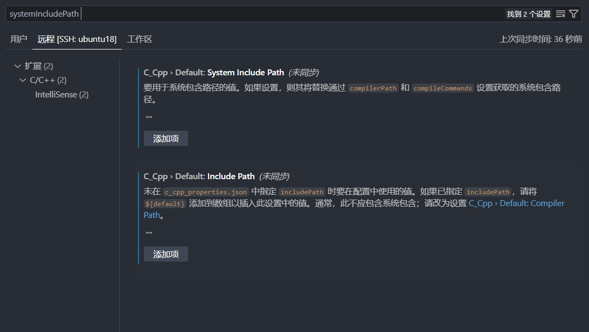

# 问vscode:如何忽略系统包含路径EN

Stack Overflow用户

提问于 2022-06-16 09:01:01

回答 1查看 90关注 0票数 1

在我的项目中，我使用由项目头文件(src/ include /rpc/svc.h)和系统包含路径(例如:/usr/include/include/rpc/svc.h)定义的结构类型。

当我想看到结构定义时，编辑器经常跳到系统包含路径文件，如何修改vscode设置，这样就可以忽略系统包含路径，谢谢。

[c](https://cloud.tencent.com/developer/search/ask-c)

[linux](https://cloud.tencent.com/developer/search/ask-linux)

[visual-studio-code](https://cloud.tencent.com/developer/search/ask-visual-studio-code)

[广告精选特惠 用云无忧2核2G3M云服务器82元/年，领劵最高省3150元，还有更多云产品低至0.02元](https://cloud.tencent.com/act/pro/bestselling?from=20187&from_column=20187#newuser)

关注问题分享

EN

### 回答 1

推荐最新

#### Stack Overflow用户

发布于 2022-10-23 14:01:11

参考文献：[自定义默认设置](https://cloud.tencent.com/developer/tools/blog-entry?target=https%3A%2F%2Fcode.visualstudio.com%2Fdocs%2Fcpp%2Fcustomize-default-settings-cpp&source=ask&objectId=107050189)

当你设置

代码语言：javascript

复制

```javascript
C_Cpp.default.systemIncludePath : string[]
```

系统包含将忽略

string[]非空

新版好像不同：

