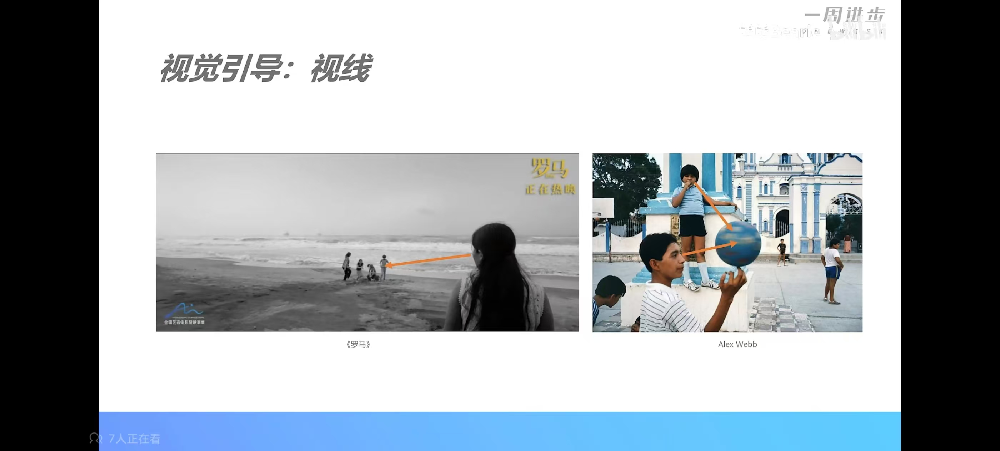
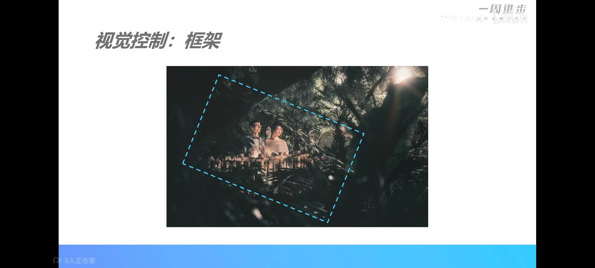
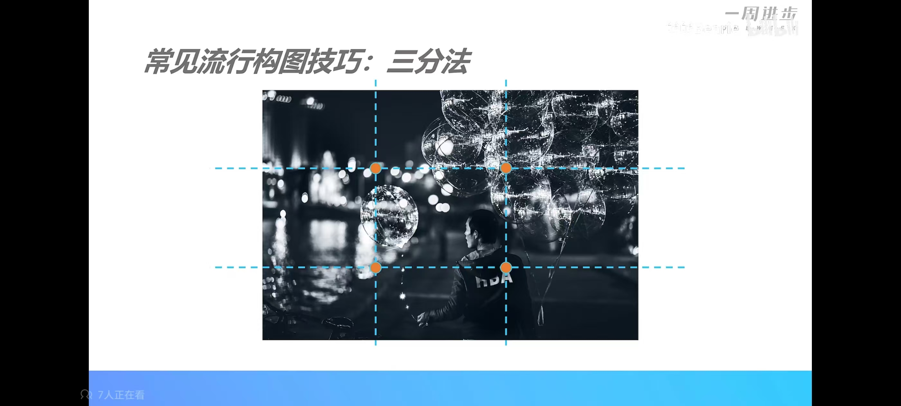
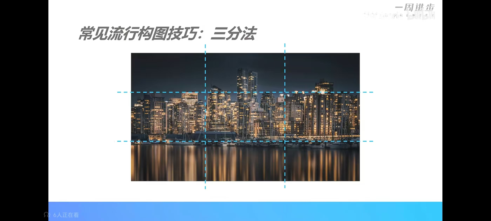
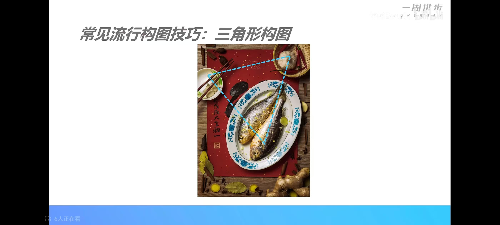
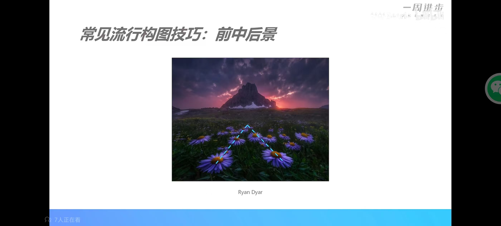
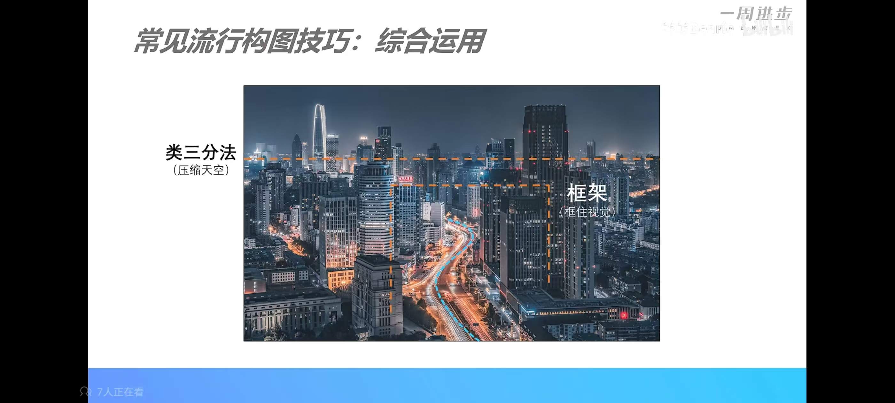
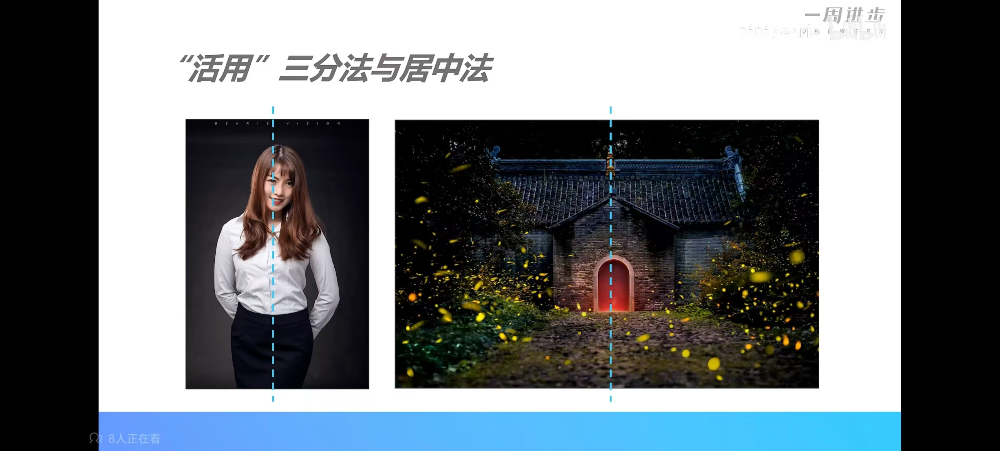
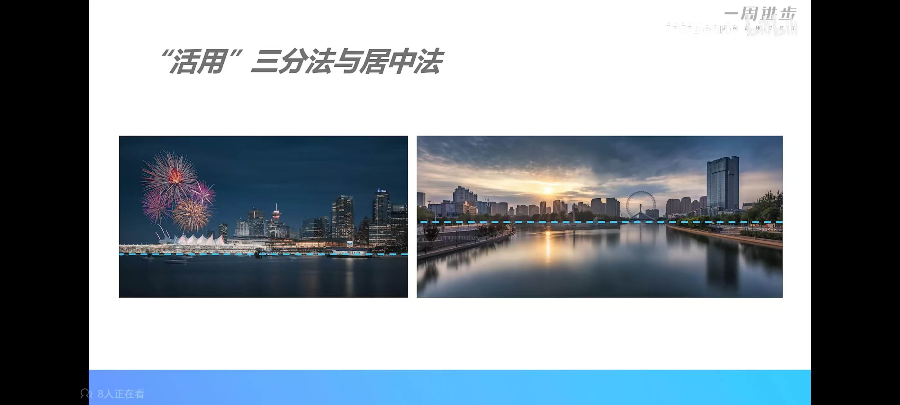
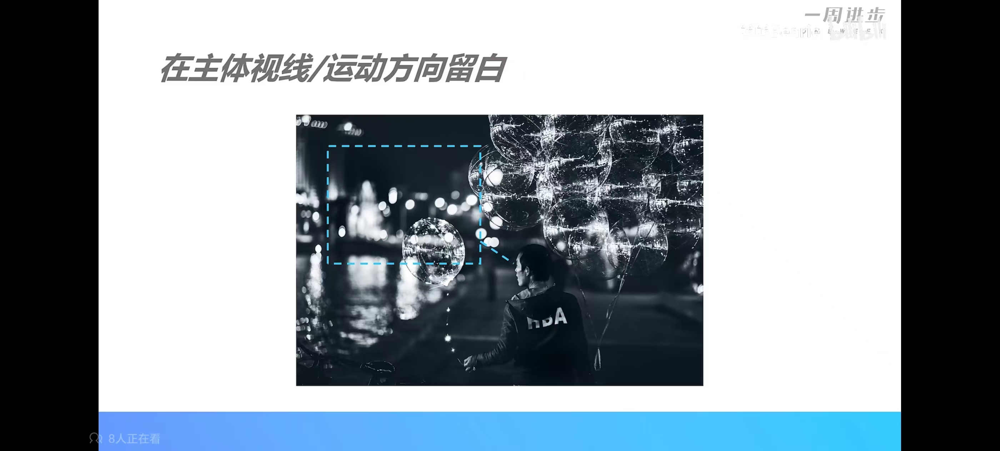

## 构图

### 概要

带脑子拍照

1. 确认主题/主题
2. 去掉无关元素
3. 加入突出主题或主体表达的元素并合理摆放
4. 成功传达想表达的内容

### 如何选择取景范围

看想表达的内容

### 人眼的视觉流动（抢眼）

#### 视觉凝聚

高饱和、高对比、高清晰、多重复

1. 明亮的部分吸引视觉
2. 鲜艳/对比色的部分吸引视觉
3. 清晰模糊部分吸引视觉
4. 重复元素

### 视觉引导

引导线

视线

​		人们会根据图片中人物的视线去观察

框架

下图周边树木形成了框架，将人物框在了里面

###  常见的构图技巧

#### 三分法

水、天、建筑

#### 居中法（对称）

常用于庄严肃穆的场景

#### 三角构图

#### 前中后景

形成了无形的引导线

#### 综合应用

### 画面平衡

活用三分法和居中法

图一水不是那么重要，想突出建筑，压缩了水， 图二水重要些想突出倒影，就上抬了水

#### 运动方向留白

人物看向的方向留白，使之产生**空间感**，不留白就会让图片看起来压抑

#### 在留白处点缀

留白太多显的画面空荡荡

函数的图形

f(x)在笛卡尔坐标系中，一般有两个点来作用，比如小学学的（x, y)即：（x， f(x)）