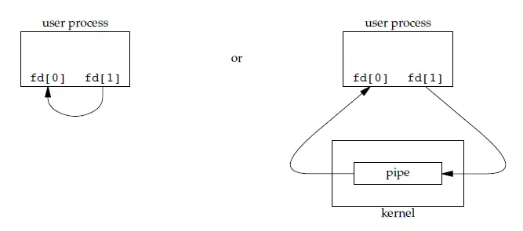
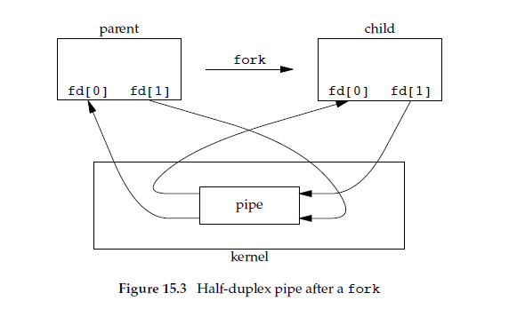
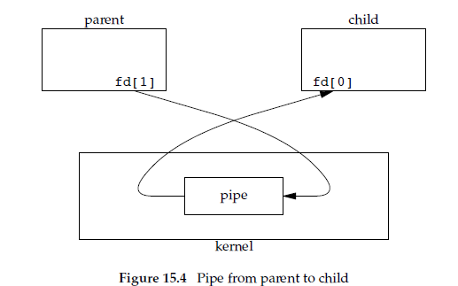

# 教程地址

野火：https://doc.embedfire.com/linux/imx6/base/zh/latest/index.html

```
https://doc.embedfire.com/linux/imx6/base/zh/latest/index.html
```

韦东山：

```

```


## Ubuntu 操作入门

### 学习路线

直接干驱动或者应用，boot工作一年改不了一次，裁剪厂家都做好了

### ubuntu分区和windows的差异：

命名sda1：a表示第一个磁盘，1表示一分区

linux是虚拟文件系统上挂在磁盘，windows是磁盘上挂在文件系统

注意：

​	

### FHS标准（约定俗成）

有些是系统启动必须有些不是

usr目录：unix software resource，不是用户目录😂

### 命令怎么看

用中括号[]括起来的表示可选，<>括起来的表示必选

## 使用nat，访问虚拟机ftp

前提，虚拟机需要有：

1. 安装ftp服务
2. 若使用sftp，则需要安装了ssh服务

教程

1. 虚拟机和物理机能ping通

2. 端口映射：找到虚拟机ip

   1. 

   2. 管理员运行虚拟网络编辑器

   3. 端口映射到虚拟机

      

   4. 找到本机ip

      

   5. 连接sftp

      

      

关于采用**MobaXterm_Portable_v23.2**去连接ubutun的步骤

首先得确定虚拟机linux和window是否连通

在win10cmd找到Linux ip


这里是

```
192.168.220.1
```

ping通，证明连接没有问题


去设置win10下的虚拟网络编辑器，要用管理员运行

这里直接参考韦东山的嵌入式linux应用开发完全手册即可

然后需要查看linux下是否已经启动ssh服务

一般需要先安装ssh服务

使用

```
sudo apt-get install openssh-server
```

有时这里会提示依赖问题，比如

```
The following packages have unmet dependencies:
 openssh-server : Depends: openssh-client (= 1:7.2p2-4ubuntu2.8)
                  Depends: openssh-sftp-server but it is not going to be installed
                  Recommends: ssh-import-id but it is not going to be installed
E: Unable to correct problems, you have held broken packages.
```

根据他的提示去解决即可

```
sudo apt-get install openssh-client=1:7.2p2-4ubuntu2.8
```

安装完成后，启用ssh服务

```
sudo /etc/init.d/ssh start
```

查看是否真的开启成功

```
ps -e|grep ssh 
```

返回，出现ssh表示启用成功

```
yzq-linux@ubuntu:/etc/ssh$ ps -e|grep ssh 
   1710 ?        00:00:00 ssh-agent
   9664 ?        00:00:00 sshd
  10196 ?        00:00:00 sshd
  10198 ?        00:00:00 sshd
  10321 ?        00:00:00 sshd
  10336 ?        00:00:00 sshd
  10582 ?        00:00:00 sshd
  10584 ?        00:00:00 sshd
  10680 ?        00:00:00 sshd
  10713 ?        00:00:00 sshd
```

后续怎么使用MobaXterm_Portable连接linux按部就班的按照韦东山的教程来即可

# 虚拟网络管理器恢复默认值后不见了怎么办

手动添加，形如：


子网地址随便设

然后就可以了


# 一些命令

## 不分页输出

```
--no-pager
```

如，在git中使用

```
git --no-pager diff
```


## 系统相关

```
systemctl

当使用systemctl命令打印服务状态时，输出的各项含义如下：

UNIT：显示服务单元的名称，即服务的标识符。

LOAD：显示服务单元文件的加载状态。可能的状态有：

loaded：服务单元文件已加载，但服务未运行。
not-found：未找到对应的服务单元文件。
disabled：服务单元文件存在，但被禁用。
ACTIVE：显示服务的活动状态。可能的状态有：

active：服务正在运行。
inactive：服务未运行。
activating：服务正在启动过程中。
deactivating：服务正在停止过程中。
failed：服务启动失败。
SUB：显示服务的子状态。子状态是活动状态的更详细描述。

DESCRIPTION：显示服务的描述，通常提供服务的简要说明。

VENDOR PRESET：显示服务是否由系统或软件包的供应商预设的启用或禁用状态。如果显示 "enabled" 或 "disabled"，则表示是预设的状态；如果显示 "-"，则表示没有预设状态。

总的来说，使用systemctl命令可以查看系统中所有服务的状态，包括服务是否加载、是否在运行、是否被禁用以及服务的简要说明。这些信息对于管理和监控系统的运行状态非常有用。
```

```

systemctl list-unit-files --type=service

各个项的含义如下：

UNIT FILE：这一列显示了服务的名称，即服务单元文件的名称。这些单元文件通常位于 /lib/systemd/system/ 和 /etc/systemd/system/ 目录下。

STATE：这一列表示服务的当前状态。可能的状态包括：

enabled：服务已启用，将在系统启动时自动启动。
disabled：服务已禁用，不会在系统启动时自动启动。
static：服务已启用，但不会自动启动，只能通过其他方式（例如依赖关系）启动。
masked：服务被掩盖，禁止启动。
generated：服务由系统动态生成。
VENDOR PRESET：这一列表示服务由系统或软件包的供应商预设的启用或禁用状态。如果显示 "enabled" 或 "disabled"，则表示是预设的状态；如果显示 "-"，则表示没有预设状态。

请注意，通过这个命令输出的列表，您可以看到当前系统中所有已安装服务的状态，其中包括自启动的服务。
```

### ls

```
ls -l		：打印文件信息
```

示例：

```
-rw-r--r-- 1 user users 12345 Jul 28 10:30 example.txt
```

解释：
第一段

```
-rw-r--r--
```

1. **文件类型和权限：** 第一个字符表示文件类型，其余九个字符表示文件的权限。每个权限字符对应一种操作权限，共有三种权限：读取（r）、写入（w）和执行（x）。如果文件有对应的权限，相应位置会显示对应的权限字符，否则显示 - 表示没有该权限。权限字符的位置分为三组，分别表示所有者权限、所属组权限和其他用户权限。

示例：

```
 -   rw-   r--   r--
```

第一个字符 - 表示这是一个普通文件。

第一个字符的类型分别解释：

- `-`：普通文件。例如：文本文件、图像文件等。
- `d`：目录。用于存放其他文件和目录的容器。
- `l`：符号链接（软链接）。类似于 Windows 系统的快捷方式，指向另一个文件或目录。
- `b`：块设备文件。代表块设备，例如硬盘、USB 设备等。
- `c`：字符设备文件。代表字符设备，例如串口、打印机等。
- `p`：命名管道（FIFO）。用于进程间通信的一种特殊文件类型。
- `s`：套接字（Socket）。用于进程间的网络通信。


rw- 表示所有者拥有读写权限。
r-- 表示所属组用户拥有读权限。
r-- 表示其他用户拥有读权限。

1. **硬链接计数：** 第二列是文件或目录的硬链接计数。一个硬链接是文件系统中对文件的另一个引用，硬链接计数表示有多少个硬链接指向此文件或目录。
2. **所有者和所属组：** 第三列和第四列分别是文件或目录的所有者用户名和所属组名称。这些信息用于标识哪些用户对该文件或目录具有特定的权限。
3. **文件大小：** 第五列是文件的大小，以字节为单位。对于目录，这个字段显示目录所占用的磁盘空间。
4. **修改时间：** 第六列是文件或目录的最近修改时间，表示文件内容最后一次被修改的时间。
5. **文件名或目录名：** 第七列是文件名或目录名，用于标识该项的名称。

## 虚拟机挂载开发板的nfs目录

目的：这样就可以直接在虚拟机上操作开发板的目录

步骤：

1. 首先确认虚拟机能ping通开发板

2. 确认nfs服务开启，两个linux都要开启

   通过查看：

   ```
   sudo systemctl status nfs-kernel-server
   ```

   如果服务没有运行，可以使用以下命令启动它：

   ```
   sudo systemctl start nfs-kernel-server
   ```

​		如果没有安装，通过使用`apt`命令进行安装：

```
sudo apt update
sudo apt install nfs-common       # NFS客户端
sudo apt install nfs-kernel-server  # NFS服务器
```

3. 创建挂载目录和被挂载目录

4. 查看nfs服务器被挂载目录的权限

   ```
   sudo vi /etc/exports
   ```

5. **配置正确的共享选项**：在 `/etc/exports` 文件中，确保已正确设置共享目录的配置。一个示例的配置可能是：（目录和权限），

   ```
   /home/orangepi/nfs_rootfs  192.168.3.2(rw,sync,no_subtree_check)
   #这句话的意思是：服务器文件夹地址	客户端的ip(访问权限)
   ```

如果挂载失败，可以通过

```
sudo cat /var/log/syslog | grep nfs
```

查看日志


## 怎么挂载？

sudo mount 服务器ip地址:被挂载的文件夹 用于本机访问的文件夹

```
sudo mount 192.168.3.2:/home/orangepi/nfs_rootfs /home/yzq-linux/Desktop/mnt
```


# 系统编程

## ps命令详解


在Linux系统中，`ps`命令是一个非常有用的工具，用于查看当前系统中正在运行的进程的信息。`ps`代表“process status”，它能够显示出各种关于进程的详细数据，如进程ID（PID）、正在使用的CPU时间、所属用户、进程启动后的命令行参数等。

### 常用选项

`ps`命令有许多选项，可以根据需要显示不同的进程信息。这里列举一些常用的选项：

- **`ps -e`** 或 **`ps -A`**：显示所有进程。
- **`ps -u <用户名>`**：显示指定用户的进程。
- **`ps -f`**：显示完整格式的输出，增加了更多详细信息，如父进程ID（PPID）、终端号等。
- **`ps aux`**：显示所有进程的详细信息，其中包括CPU和内存的使用率。这是最常用的选项之一。
- **`ps -l`**：显示长列表格式，提供更详细的信息。
- **`ps -p <进程ID>`**：显示指定PID的进程信息。

### 输出解释

当你运行`ps aux`命令时，你可能会看到如下列的信息：

- **USER**：进程的拥有者。
- **PID**：进程的ID。
- **%CPU**：进程使用的CPU百分比。
- **%MEM**：进程使用的内存百分比。
- **VSZ**：Virtual Memory Size（虚拟内存大小），以KB为单位。
- **RSS**：Resident Set Size（常驻内存集大小），表示实际使用物理内存的大小，以KB为单位。
- **TTY**：与进程关联的终端（如果有的话）。
- **STAT**：进程的状态码，比如R（运行中）、S（休眠中）、Z（僵尸状态）等。
- **START**：进程启动时间。
- **TIME**：进程占用CPU的累计时间。
- **COMMAND**：启动进程的命令行。

这些信息对于系统管理员来说特别重要，可以帮助他们监控系统运行状态和调优性能。

## 进程的状态


在Linux系统中，每个进程都有一个特定的状态，这个状态描述了进程在系统中的当前活动或非活动状况。`ps`命令输出中的“STAT”列提供了进程的状态信息。下面是一些常见的进程状态代码及其含义：

1. **R (running)**：进程正在运行或在运行队列中等待。
2. **S (sleeping)**：进程处于睡眠状态，通常是在等待某个事件发生，如等待用户输入或文件读写操作的完成。
3. **T (stopped)**：进程已停止执行，通常是因为收到了停止信号。这种状态的进程可以通过某种形式的信号重启。
4. **Z (zombie)**：进程已完成执行，但仍在进程表中等待父进程读取其退出状态。这是一种“僵尸”状态，此时进程已结束，但仍占用系统资源。
5. **D (uninterruptible sleep)**：进程处于不可中断的睡眠状态，通常是在进行某些特别的等待，如磁盘I/O操作。在这种状态下，即使收到停止或杀死信号，进程也不会被唤醒。
6. **I (idle)**：这是一个较少见的状态，用于内核线程，在某些Linux版本中可见，表示进程处于空闲状态。
7. **W (paging)**：此状态较少见，表示进程正在等待页面调入，或者处于与内存交换相关的活动中。
8. **X (dead)**：此状态极为罕见，表示进程应该退出但仍有一些清理工作需要完成。

每个状态都反映了进程在操作系统中的行为和需求，了解这些状态有助于系统管理和性能调优。例如，通过监控系统中不可中断睡眠（D）和僵尸（Z）状态的进程，管理员可以识别和解决可能的系统瓶颈或配置问题。


僵尸进程（Zombie Process）和托孤进程（Orphan Process）是Linux和其他Unix-like系统中两种特殊的进程状态，它们在系统管理和维护中具有一定的重要性。这两种状态描述了进程在生命周期的不同阶段可能出现的特殊情况。

## 创建进程

fork

创建进程后调用其他进程

```
execl
```

退出进程

```
return
```

或者

```
exit // 刷新io缓冲
```

```
_exit // 直接退出
```

等待子进程退出

```
wait	// 使用一般不用他阻塞父进程，通常是子进程发一个信号通知父进程
```

## 进程组

在Unix和类Unix系统中，进程组（process group）是**一组相关联的进程的集合**。进程组中的进程共享一个组ID，并且可以由作业控制机制来管理。在这个概念下，可以将进程分为前台进程组（foreground process group）和后台进程组（background process group）。

1. **前台进程组：**
   - 前台进程组是当前用户正在与之交互的进程组。通常，当用户在终端中执行一个命令时，该命令及其相关的进程组被放置在前台。
   - 前台进程组的进程可以接收来自终端的输入，并将输出发送到终端。这些进程通常是与用户直接交互的进程，例如命令行程序或交互式应用程序。
   - 当前台进程组中的某个进程正在运行时，终端通常会被阻塞，直到该进程结束或被暂停。
2. **后台进程组：**
   - 后台进程组是在后台运行的进程组。通常，通过在命令末尾添加特殊字符（如`&`）来将命令放置在后台执行，这样相关的进程组就被置为后台进程组。
   - 后台进程组的进程不会占用用户的终端，用户可以继续在终端中执行其他操作，而不必等待后台任务完成。
   - 后台进程组通常用于执行需要长时间运行的任务或不需要用户交互的任务。

总的来说，前台进程组和后台进程组的区别在于它们是否与当前用户的终端交互。前台进程组是用户当前正在与之交互的进程组，而后台进程组是在后台运行的进程组，不会阻塞终端并且不会与用户直接交互。

## 会话

作用：管理进程

在Linux中，会话（session）是指用户登录到系统并且开始与系统交互的一段时间。会话可以包括用户在系统上执行的各种操作，例如运行程序、查看文件、修改设置等等。

### 会话诞生

终端正确登录后启动shell时linux系统会创建一个新的会话，shell进程会作为会话的首进程

会话id：会话首进程id

## 守护进程


Linux守护进程（Daemon）是在后台运行的一种特殊程序，它们通常在系统启动时启动，并且没有控制终端。守护进程主要用于处理系统级任务，如网络服务、系统监控、日志记录等。这些进程独立于用户和用户会话，因此它们不会阻塞用户的交互操作。

创建Linux守护进程涉及以下几个关键步骤：

1. **创建子进程并结束父进程**：这一步使得守护进程在后台运行，并且让它摆脱了任何可能的终端会话的控制。

2. **改变文件模式创建掩码（umask：执行可查看）**：设置守护进程创建新文件时的权限掩码，通常设为0，确保守护进程有最大的访问权限。

3. **创建新的会话**：通过调用`setsid()`函数使进程成为新的会话领导，这样可以摆脱原有的控制终端。

4. **改变工作目录**：通常将工作目录改变到根目录，防止守护进程“锁住”其他文件系统，使之不能被卸载。

   1. 在Linux中，如果一个进程的当前工作目录或其打开的文件位于某个文件系统上，那么该文件系统就不能被卸载，因为被视为正在使用中。进程的工作目录是进程进行文件操作的默认位置。如果守护进程的工作目录设在一个特定的文件系统上，而这个文件系统后来需要被卸载或重新挂载，就会出现问题，因为文件系统被进程“锁住”了，即操作系统认为这个文件系统正在被使用，不能安全卸载。

5. **关闭文件描述符**：关闭继承自父进程的文件描述符，这包括标准输入、标准输出和标准错误输出。

   1. 文件描述符在Linux和其他UNIX-like系统中是一个非常重要的概念，用于指代由操作系统管理的打开的文件、套接字（sockets）、管道（pipes）等资源的一个抽象指标。每当一个进程打开或创建一个文件、套接字或其他可进行I/O操作的资源时，操作系统会为该资源分配一个整数型的标识符，即文件描述符。

      文件描述符的主要用途包括：

      1. **唯一标识**：文件描述符为系统内部提供了一种方式来唯一标识和操作打开的文件和其他资源。
      2. **I/O操作**：通过文件描述符，进程可以进行读取、写入、关闭等I/O操作。系统调用如`read()`, `write()`, 和`close()`等都需要文件描述符来指定操作的对象。
      3. **资源管理**：文件描述符还帮助操作系统管理和跟踪每个进程所使用的资源。

      在Linux中，有三个特殊的文件描述符通常自动被每个进程打开：

      - **0**：标准输入（stdin），用于读取输入。
      - **1**：标凈输出（stdout），用于输出信息。
      - **2**：标准错误（stderr），用于报告错误信息。

      守护进程在后台运行时，通常会关闭这些标准文件描述符或将它们重定向到`/dev/null`，以防止它们占用不必要的资源或影响其他进程。这是因为守护进程通常不与终端直接交互，因此不需要保持这些标准输入输出通道开放。

6. **处理信号**：配置处理信号的方式，比如忽略终止信号SIGHUP。

守护进程可以通过编写服务脚本并使用系统的服务管理工具（如systemd或init）来管理。例如，在使用systemd的系统中，可以创建一个服务文件描述守护进程的配置和行为，然后使用`systemctl`命令来启动、停止或查询其状态。

### 普通进程伪装守护进程

nohub：不会真正变成守护进程，有细微差别

## 僵尸进程

僵尸进程是指已经完成执行（终止）但仍然保留在系统进程表中的进程。这种状态的进程已经停止运行，不占用除了进程表条目外的任何资源，不进行任何操作。僵尸进程存在的原因是其父进程尚未通过`wait()`系统调用来读取子进程的退出状态。这是一种暂时的状态，理应在父进程读取了子进程状态后被清除。如果父进程没有正确地进行这一步，僵尸进程会一直存在，可能导致资源泄漏。

## 托孤进程

托孤进程是指父进程已经结束，而其子进程还在运行的进程。当一个进程的父进程结束时，其子进程会被`init`进程（PID为1）或其他特定的服务进程领养。这种领养机制保证了没有父进程的子进程不会无控制地运行，因为`init`进程会定期调用`wait()`来清理已结束的子进程，防止它们变成僵尸进程。

### 相关命令与处理

为了查找系统中的僵尸进程，可以使用如下命令：

```
bash
Copy code
ps aux | grep 'Z'
```

这会列出所有处于僵尸状态的进程。

如果系统中存在大量的僵尸进程，需要查找它们的父进程，并确定为什么这些父进程没有调用`wait()`。如果父进程已经不存在，可能需要重启或进行更深入的系统维护。

对于托孤进程，通常不需要手动干预，因为它们已经被`init`或其他系统进程领养，这些系统进程会正确管理它们的生命周期。

## 进程间的通信


进程间通信（Interprocess Communication，简称IPC）是指在同一台计算机上的不同进程之间传递数据或信号的机制。这些机制使得进程能够**协调工作，共享数据，以及同步执行**。在现代操作系统中，有多种IPC机制可供使用，每种机制都适用于不同的应用场景。

### 主要的IPC机制包括：

1. **管道 (Pipes)**：
   - **匿名管道**：通常用于父子进程间的通信，是单向的，数据只能单向流动。
   - **命名管道 (FIFOs)**：与匿名管道类似，但它们可以在无关的进程之间进行通信，因为它们具有文件系统中的路径名。
2. **信号 (Signals)**：
   - 信号是一种由操作系统提供的简单消息系统，用于通知接收进程某个事件已经发生，例如：终止信号（SIGTERM）、中断信号（SIGINT）等。
3. **消息队列**：
   - 消息队列允许一个或多个进程向队列写入消息，并由一个或多个进程读取这些消息。这是一种异步通信机制。
4. **共享内存**：
   - 共享内存允许两个或多个进程共享一个给定的存储区，进程可以直接读写这块内存。共享内存是最快的IPC形式，因为数据不需要在进程之间复制。
5. **信号量 (Semaphores)**：
   - 信号量主要用于进程间的同步，尤其是控制多个进程访问共享资源的数量。
6. **套接字 (Sockets)**：
   - 套接字可以用于不同机器间的进程通信（通过网络进行数据交换），也可以用于同一机器上的进程间通信。
7. **内存映射文件 (Memory-mapped files)**：
   - 通过将磁盘上的文件内容映射到进程的地址空间，多个进程可以通过读写文件的方式来共享数据。

### 使用场景

进程间通信的选择取决于具体的应用需求：

- 如果需要简单的通知或状态改变，信号可能是最直接的方式。
- 对于需要持续交换数据的场景，管道或套接字可能更适用。
- 当多个进程需要频繁且快速地共享大量数据时，共享内存可能是最有效的选择。

每种IPC机制都有其特点和适用场景，选择合适的IPC机制可以优化应用程序的性能和资源使用效率。


## 管道

- [](https://www.zhihu.com/org/teng-xun-yun-ji-zhu-she-qu)

- [腾讯云开发者](https://www.zhihu.com/org/teng-xun-yun-ji-zhu-she-qu)[](https://www.zhihu.com/question/48509984)

- 人工智能话题下的优秀答主

- 关注

- 265 人赞同了该文章

- 

- > 本文由云+社区发表
  > 作者：邹立巍

- ```js
  版权声明：
  
  本文章内容在非商业使用前提下可无需授权任意转载、发布。
  
  转载、发布请务必注明作者和其微博、微信公众号地址，以便读者询问问题和甄误反馈，共同进步。
  
  微博ID：orroz
  
  微信公众号：Linux系统技术
  ```

- ## **前言**

- 管道是UNIX环境中历史最悠久的进程间通信方式。本文主要说明在Linux环境上如何使用管道。阅读本文可以帮你解决以下问题：

- 1. 什么是管道和为什么要有管道？
  2. 管道怎么分类？
  3. 管道的实现是什么样的？
  4. 管道有多大？
  5. 管道的大小是不是可以调整？如何调整？

- ## **什么是管道？**

- 管道，英文为pipe。这是一个我们在学习Linux命令行的时候就会引入的一个很重要的概念。它的发明人是道格拉斯.麦克罗伊，这位也是UNIX上早期shell的发明人。他在发明了shell之后，发现系统操作执行命令的时候，经常有需求要将一个程序的输出交给另一个程序进行处理，这种操作可以使用输入输出重定向加文件搞定，比如：

- ```js
  [zorro@zorro-pc pipe]$ ls  -l /etc/ > etc.txt
  [zorro@zorro-pc pipe]$ wc -l etc.txt 
  183 etc.txt
  ```

- 但是这样未免显得太麻烦了。所以，管道的概念应运而生。目前在任何一个shell中，都可以使用“|”连接两个命令，shell会将前后两个进程的输入输出用一个管道相连，以便达到进程间通信的目的：

- ```js
  [zorro@zorro-pc pipe]$ ls -l /etc/ | wc -l
  183
  ```

- 对比以上两种方法，我们也可以理解为，管道本质上就是一个文件，前面的进程以写方式打开文件，后面的进程以读方式打开。这样前面写完后面读，于是就实现了通信。实际上管道的设计也是遵循UNIX的“一切皆文件”设计原则的，它本质上就是一个文件。Linux系统直接把管道实现成了一种文件系统，借助VFS给应用程序提供操作接口。

- 虽然实现形态上是文件，但是管道本身并不占用磁盘或者其他外部存储的空间。在Linux的实现上，它占用的是内存空间。所以，Linux上的管道就是一个操作方式为文件的内存缓冲区。

- ## **管道的分类和使用**

- Linux上的管道分两种类型：

- 1. 匿名管道
  2. 命名管道

- 这两种管道也叫做有名或无名管道。匿名管道最常见的形态就是我们在shell操作中最常用的”|”。它的特点是只能在父子进程中使用，父进程在产生子进程前必须打开一个管道文件，然后fork产生子进程，这样子进程通过拷贝父进程的进程地址空间获得同一个管道文件的描述符，以达到使用同一个管道通信的目的。此时除了父子进程外，没人知道这个管道文件的描述符，所以通过这个管道中的信息无法传递给其他进程。这保证了传输数据的安全性，当然也降低了管道了通用性，于是系统还提供了命名管道。

- 我们可以使用mkfifo或mknod命令来创建一个命名管道，这跟创建一个文件没有什么区别：

- ```js
  [zorro@zorro-pc pipe]$ mkfifo pipe
  [zorro@zorro-pc pipe]$ ls -l pipe 
  prw-r--r-- 1 zorro zorro 0 Jul 14 10:44 pipe
  ```

- 可以看到创建出来的文件类型比较特殊，是p类型。表示这是一个管道文件。有了这个管道文件，系统中就有了对一个管道的全局名称，于是任何两个不相关的进程都可以通过这个管道文件进行通信了。比如我们现在让一个进程写这个管道文件：

- ```js
  [zorro@zorro-pc pipe]$ echo xxxxxxxxxxxxxx > pipe 
  ```

- 此时这个写操作会阻塞，因为管道另一端没有人读。这是内核对管道文件定义的默认行为。此时如果有进程读这个管道，那么这个写操作的阻塞才会解除：

- ```js
  [zorro@zorro-pc pipe]$ cat pipe 
  xxxxxxxxxxxxxx
  ```

- 大家可以观察到，当我们cat完这个文件之后，另一端的echo命令也返回了。这就是命名管道。

- Linux系统无论对于命名管道和匿名管道，底层都用的是同一种文件系统的操作行为，这种文件系统叫pipefs。大家可以在/etc/proc/filesystems文件中找到你的系统是不是支持这种文件系统：

- ```js
  [zorro@zorro-pc pipe]$ cat /proc/filesystems |grep pipefs
  nodev    pipefs
  ```

- 观察完了如何在命令行中使用管道之后，我们再来看看如何在系统编程中使用管道。

- ## **PIPE**

- 我们可以把匿名管道和命名管道分别叫做PIPE和FIFO。这主要因为在系统编程中，创建匿名管道的系统调用是pipe()，而创建命名管道的函数是mkfifo()。使用mknod()系统调用并指定文件类型为为S_IFIFO也可以创建一个FIFO。

- 使用pipe()系统调用可以创建一个匿名管道，这个系统调用的原型为：

- ```js
  #include <unistd.h>
  
  int pipe(int pipefd[2]);
  ```

- 这个方法将会创建出两个文件描述符，可以使用pipefd这个数组来引用这两个描述符进行文件操作。pipefd[0]是读方式打开，作为管道的读描述符。pipefd[1]是写方式打开，作为管道的写描述符。从管道写端写入的数据会被内核缓存直到有人从另一端读取为止。我们来看一下如何在一个进程中使用管道，虽然这个例子并没有什么意义：

- ```js
  [zorro@zorro-pc pipe]$ cat pipe.c
  #include <stdlib.h>
  #include <stdio.h>
  #include <unistd.h>
  #include <string.h>
  
  #define STRING "hello world!"
  
  int main()
  {
      int pipefd[2];
      char buf[BUFSIZ];
  
      if (pipe(pipefd) == -1) {
          perror("pipe()");
          exit(1);
      }
  
      if (write(pipefd[1], STRING, strlen(STRING)) < 0) {
          perror("write()");
          exit(1);
      }
  
      if (read(pipefd[0], buf, BUFSIZ) < 0) {
          perror("write()");
          exit(1);
      }
  
      printf("%s\n", buf);
  
      exit(0);
  }
  ```

- 这个程序创建了一个管道，并且对管道写了一个字符串之后从管道读取，并打印在标准输出上。用一个图来说明这个程序的状态就是这样的：

- 

- 

- 

- 

- 一个进程自己给自己发送消息这当然不叫进程间通信，所以实际情况中我们不会在单个进程中使用管道。进程在pipe创建完管道之后，往往都要fork产生子进程，成为如下图表示的样子：

- 

- 

- 

- 

- 如图中描述，fork产生的子进程会继承父进程对应的文件描述符。利用这个特性，父进程先pipe创建管道之后，子进程也会得到同一个管道的读写文件描述符。从而实现了父子两个进程使用一个管道可以完成半双工通信。此时，父进程可以通过fd[1]给子进程发消息，子进程通过fd[0]读。子进程也可以通过fd[1]给父进程发消息，父进程用fd[0]读。程序实例如下：

- ```js
  [zorro@zorro-pc pipe]$ cat pipe_parent_child.c
  #include <stdlib.h>
  #include <stdio.h>
  #include <unistd.h>
  #include <string.h>
  #include <sys/types.h>
  #include <sys/wait.h>
  
  #define STRING "hello world!"
  
  int main()
  {
      int pipefd[2];
      pid_t pid;
      char buf[BUFSIZ];
  
      if (pipe(pipefd) == -1) {
          perror("pipe()");
          exit(1);
      }
  
      pid = fork();
      if (pid == -1) {
          perror("fork()");
          exit(1);
      }
  
      if (pid == 0) {
          /* this is child. */
          printf("Child pid is: %d\n", getpid());
          if (read(pipefd[0], buf, BUFSIZ) < 0) {
              perror("write()");
              exit(1);
          }
  
          printf("%s\n", buf);
  
          bzero(buf, BUFSIZ);
          snprintf(buf, BUFSIZ, "Message from child: My pid is: %d", getpid());
          if (write(pipefd[1], buf, strlen(buf)) < 0) {
              perror("write()");
              exit(1);
          }
  
      } else {
          /* this is parent */
          printf("Parent pid is: %d\n", getpid());
  
          snprintf(buf, BUFSIZ, "Message from parent: My pid is: %d", getpid());
          if (write(pipefd[1], buf, strlen(buf)) < 0) {
              perror("write()");
              exit(1);
          }
  
          sleep(1);
  
          bzero(buf, BUFSIZ);
          if (read(pipefd[0], buf, BUFSIZ) < 0) {
              perror("write()");
              exit(1);
          }
  
          printf("%s\n", buf);
  
          wait(NULL);
      }
  
  
      exit(0);
  }
  ```

- 父进程先给子进程发一个消息，子进程接收到之后打印消息，之后再给父进程发消息，父进程再打印从子进程接收到的消息。程序执行效果：

- ```js
  [zorro@zorro-pc pipe]$ ./pipe_parent_child 
  Parent pid is: 8309
  Child pid is: 8310
  Message from parent: My pid is: 8309
  Message from child: My pid is: 8310
  ```

- 从这个程序中我们可以看到，管道实际上可以实现一个半双工通信的机制。使用同一个管道的父子进程可以分时给对方发送消息。我们也可以看到对管道读写的一些特点，即：

- 在管道中没有数据的情况下，对管道的读操作会阻塞，直到管道内有数据为止。当一次写的数据量不超过管道容量的时候，对管道的写操作一般不会阻塞，直接将要写的数据写入管道缓冲区即可。

- 当然写操作也不会再所有情况下都不阻塞。这里我们要先来了解一下管道的内核实现。上文说过，管道实际上就是内核控制的一个内存缓冲区，既然是缓冲区，就有容量上限。我们把管道一次最多可以缓存的数据量大小叫做PIPESIZE。内核在处理管道数据的时候，底层也要调用类似read和write这样的方法进行数据拷贝，这种内核操作每次可以操作的数据量也是有限的，一般的操作长度为一个page，即默认为4k字节。我们把每次可以操作的数据量长度叫做PIPEBUF。POSIX标准中，对PIPEBUF有长度限制，要求其最小长度不得低于512字节。PIPEBUF的作用是，内核在处理管道的时候，如果每次读写操作的数据长度不大于PIPEBUF时，保证其操作是原子的。而PIPESIZE的影响是，大于其长度的写操作会被阻塞，直到当前管道中的数据被读取为止。

- 在Linux 2.6.11之前，PIPESIZE和PIPEBUF实际上是一样的。在这之后，Linux重新实现了一个管道缓存，并将它与写操作的PIPEBUF实现成了不同的概念，形成了一个默认长度为65536字节的PIPESIZE，而PIPEBUF只影响相关读写操作的原子性。从Linux 2.6.35之后，在fcntl系统调用方法中实现了F_GETPIPE_SZ和F_SETPIPE_SZ操作，来分别查看当前管道容量和设置管道容量。管道容量容量上限可以在/proc/sys/fs/pipe-max-size进行设置。

- ```js
  #define BUFSIZE 65536
  
  ......
  
  ret = fcntl(pipefd[1], F_GETPIPE_SZ);
  if (ret < 0) {
      perror("fcntl()");
      exit(1);
  }
  
  printf("PIPESIZE: %d\n", ret);
  
  ret = fcntl(pipefd[1], F_SETPIPE_SZ, BUFSIZE);
  if (ret < 0) {
      perror("fcntl()");
      exit(1);
  }
  
  ......
  ```

- PIPEBUF和PIPESIZE对管道操作的影响会因为管道描述符是否被设置为非阻塞方式而有行为变化，n为要写入的数据量时具体为：

- O_NONBLOCK关闭，n <= PIPE_BUF：

- n个字节的写入操作是原子操作，write系统调用可能会因为管道容量(PIPESIZE)没有足够的空间存放n字节长度而阻塞。

- O_NONBLOCK打开，n <= PIPE_BUF：

- 如果有足够的空间存放n字节长度，write调用会立即返回成功，并且对数据进行写操作。空间不够则立即报错返回，并且errno被设置为EAGAIN。

- O_NONBLOCK关闭，n > PIPE_BUF：

- 对n字节的写入操作不保证是原子的，就是说这次写入操作的数据可能会跟其他进程写这个管道的数据进行交叉。当管道容量长度低于要写的数据长度的时候write操作会被阻塞。

- O_NONBLOCK打开，n > PIPE_BUF：

- 如果管道空间已满。write调用报错返回并且errno被设置为EAGAIN。如果没满，则可能会写入从1到n个字节长度，这取决于当前管道的剩余空间长度，并且这些数据可能跟别的进程的数据有交叉。

- 以上是在使用半双工管道的时候要注意的事情，因为在这种情况下，管道的两端都可能有多个进程进行读写处理。如果再加上线程，则事情可能变得更复杂。实际上，我们在使用管道的时候，并不推荐这样来用。管道推荐的使用方法是其单工模式：即只有两个进程通信，一个进程只写管道，另一个进程只读管道。实现为：

- ```js
  [zorro@zorro-pc pipe]$ cat pipe_parent_child2.c
  #include <stdlib.h>
  #include <stdio.h>
  #include <unistd.h>
  #include <string.h>
  #include <sys/types.h>
  #include <sys/wait.h>
  
  #define STRING "hello world!"
  
  int main()
  {
      int pipefd[2];
      pid_t pid;
      char buf[BUFSIZ];
  
      if (pipe(pipefd) == -1) {
          perror("pipe()");
          exit(1);
      }
  
      pid = fork();
      if (pid == -1) {
          perror("fork()");
          exit(1);
      }
  
      if (pid == 0) {
          /* this is child. */
          close(pipefd[1]);
  
          printf("Child pid is: %d\n", getpid());
          if (read(pipefd[0], buf, BUFSIZ) < 0) {
              perror("write()");
              exit(1);
          }
  
          printf("%s\n", buf);
  
      } else {
          /* this is parent */
          close(pipefd[0]);
  
          printf("Parent pid is: %d\n", getpid());
  
          snprintf(buf, BUFSIZ, "Message from parent: My pid is: %d", getpid());
          if (write(pipefd[1], buf, strlen(buf)) < 0) {
              perror("write()");
              exit(1);
          }
  
          wait(NULL);
      }
  
  
      exit(0);
  }
  ```

- 这个程序实际上比上一个要简单，父进程关闭管道的读端，只写管道。子进程关闭管道的写端，只读管道。整个管道的打开效果最后成为下图所示：

- 

- 

- 

- 

- 此时两个进程就只用管道实现了一个单工通信，并且这种状态下不用考虑多个进程同时对管道写产生的数据交叉的问题，这是最经典的管道打开方式，也是我们推荐的管道使用方式。另外，作为一个程序员，即使我们了解了Linux管道的实现，我们的代码也不能依赖其特性，所以处理管道时该越界判断还是要判断，该错误检查还是要检查，这样代码才能更健壮。

- ## **FIFO**

- 命名管道在底层的实现跟匿名管道完全一致，区别只是命名管道会有一个全局可见的文件名以供别人open打开使用。再程序中创建一个命名管道文件的方法有两种，一种是使用mkfifo函数。另一种是使用mknod系统调用，例子如下：

- ```js
  [zorro@zorro-pc pipe]$ cat mymkfifo.c
  #include <stdio.h>
  #include <sys/types.h>
  #include <sys/stat.h>
  #include <stdlib.h>
  
  int main(int argc, char *argv[])
  {
  
      if (argc != 2) {
          fprintf(stderr, "Argument error!\n");
          exit(1);
      }
  
  /*
      if (mkfifo(argv[1], 0600) < 0) {
          perror("mkfifo()");
          exit(1);
      }
  */
      if (mknod(argv[1], 0600|S_IFIFO, 0) < 0) {
          perror("mknod()");
          exit(1);
      }
  
      exit(0);
  }
  ```

- 我们使用第一个参数作为创建的文件路径。创建完之后，其他进程就可以使用open()、read()、write()标准文件操作等方法进行使用了。其余所有的操作跟匿名管道使用类似。需要注意的是，无论命名还是匿名管道，它的文件描述都没有偏移量的概念，所以不能用lseek进行偏移量调整。

- 关于管道的其它议题，比如popen、pclose的使用等话题，《UNIX环境高级编程》中的相关章节已经讲的很清楚了。如果想学习补充这些知识，请参见此书。

- **此文已由腾讯云+社区在各渠道发布**

- **获取更多新鲜技术干货，可以关注我们[腾讯云技术社区-云加社区官方号及知乎机构号](https://www.zhihu.com/org/teng-xun-yun-ji-zhu-she-qu/activities)**

