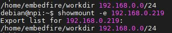
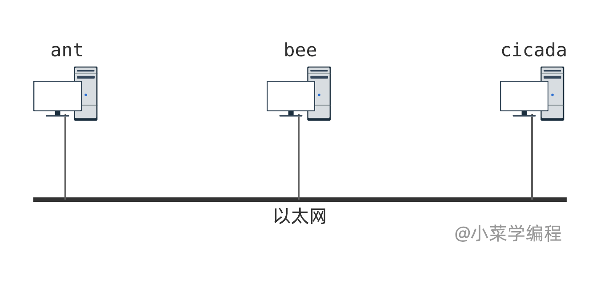
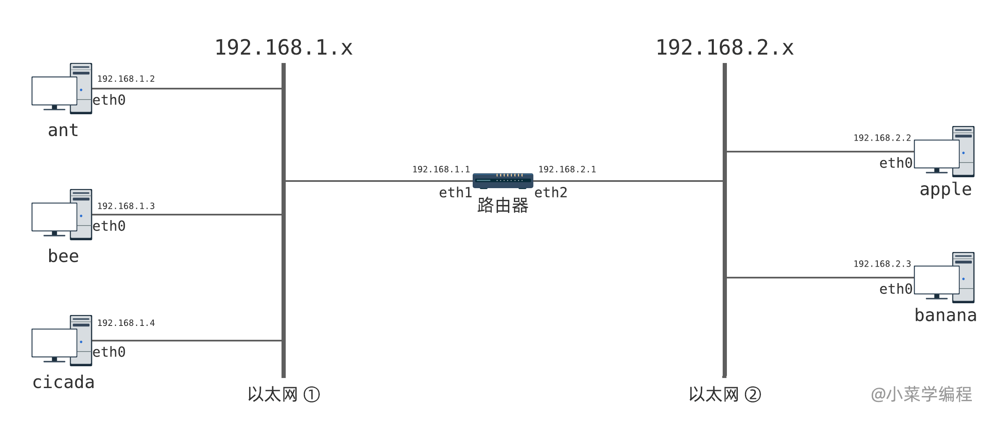
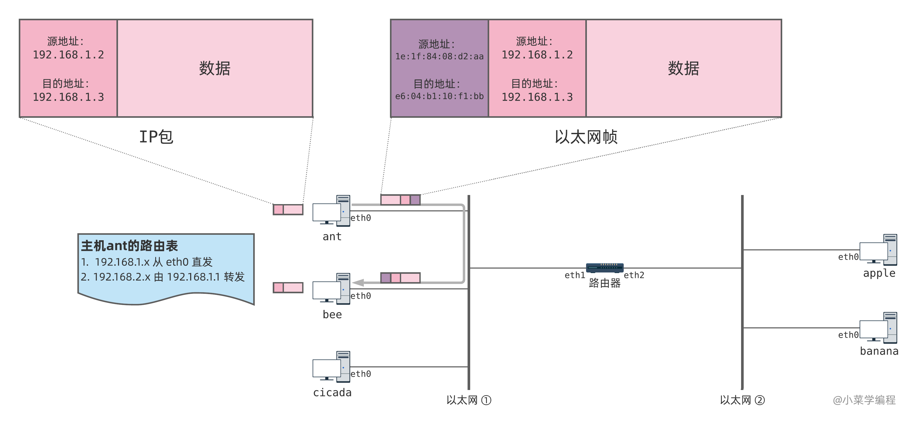
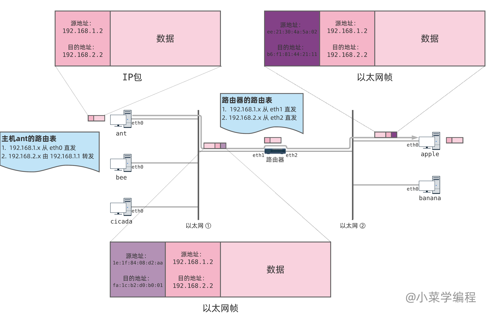
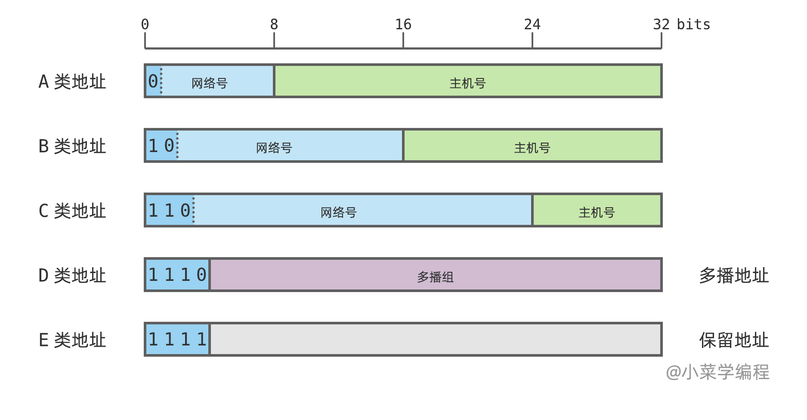
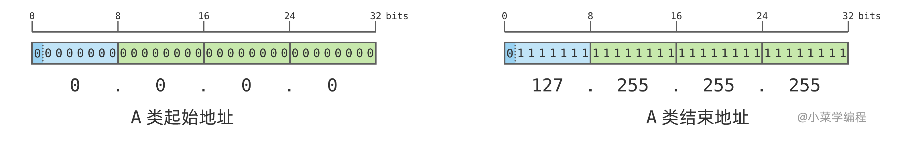
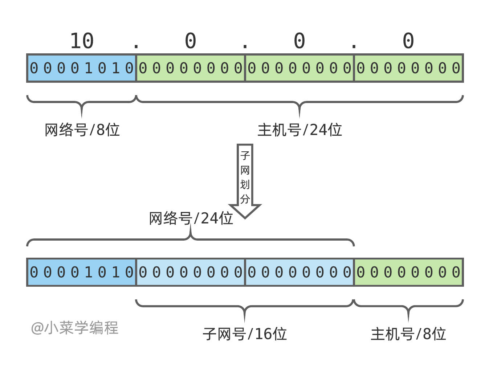

重启网络服务

```
sudo systemctl restart networking
```

更新列表

```
sudo apt update
```


# 教程地址

野火：https://doc.embedfire.com/linux/imx6/base/zh/latest/index.html

```
https://doc.embedfire.com/linux/imx6/base/zh/latest/index.html
```

韦东山：

```

```


## Ubuntu 操作入门

### 学习路线

直接干驱动或者应用，boot工作一年改不了一次，裁剪厂家都做好了

### ubuntu分区和windows的差异：

命名sda1：a表示第一个磁盘，1表示一分区

linux是虚拟文件系统上挂在磁盘，windows是磁盘上挂在文件系统

注意：

​	

### FHS标准（约定俗成）

有些是系统启动必须有些不是

usr目录：unix software resource，不是用户目录😂

### 命令怎么看

用中括号[]括起来的表示可选，<>括起来的表示必选

## 使用nat，访问虚拟机ftp

前提，虚拟机需要有：

1. 安装ftp服务
2. 若使用sftp，则需要安装了ssh服务

教程

1. 虚拟机和物理机能ping通

2. 端口映射：找到虚拟机ip

   1. 

   2. 管理员运行虚拟网络编辑器

   3. 端口映射到虚拟机

      

   4. 找到本机ip

      

   5. 连接sftp

      

      

关于采用**MobaXterm_Portable_v23.2**去连接ubutun的步骤

首先得确定虚拟机linux和window是否连通

在win10cmd找到Linux ip


这里是

```
192.168.220.1
```

ping通，证明连接没有问题


去设置win10下的虚拟网络编辑器，要用管理员运行

这里直接参考韦东山的嵌入式linux应用开发完全手册即可

然后需要查看linux下是否已经启动ssh服务

一般需要先安装ssh服务

使用

```
sudo apt-get install openssh-server
```

有时这里会提示依赖问题，比如

```
The following packages have unmet dependencies:
 openssh-server : Depends: openssh-client (= 1:7.2p2-4ubuntu2.8)
                  Depends: openssh-sftp-server but it is not going to be installed
                  Recommends: ssh-import-id but it is not going to be installed
E: Unable to correct problems, you have held broken packages.
```

根据他的提示去解决即可

```
sudo apt-get install openssh-client=1:7.2p2-4ubuntu2.8
```

安装完成后，启用ssh服务

```
sudo /etc/init.d/ssh start
```

查看是否真的开启成功

```
ps -e|grep ssh 
```

返回，出现ssh表示启用成功

```
yzq-linux@ubuntu:/etc/ssh$ ps -e|grep ssh 
   1710 ?        00:00:00 ssh-agent
   9664 ?        00:00:00 sshd
  10196 ?        00:00:00 sshd
  10198 ?        00:00:00 sshd
  10321 ?        00:00:00 sshd
  10336 ?        00:00:00 sshd
  10582 ?        00:00:00 sshd
  10584 ?        00:00:00 sshd
  10680 ?        00:00:00 sshd
  10713 ?        00:00:00 sshd
```

后续怎么使用MobaXterm_Portable连接linux按部就班的按照韦东山的教程来即可

# 虚拟网络管理器恢复默认值后不见了怎么办

手动添加，形如：


子网地址随便设

然后就可以了

# 挂载共享文件夹

## 问题集

### 主机开发板不能互相ping通

有时候主机能ping通板子，但是板子不能ping通主机，是因为主机是虚拟机，和主板分配的ip网段不是一样的，所以ping不通，这个时候要在虚拟机的设置里面新增桥接网卡，注意是新增，和网络虚拟管理器没什么关系

## 开始挂在共享文件夹

**主机开启nfs服务**

**安装nfs服务**

```
#以下命令在主机上运行
sudo apt install nfs-kernel-server
```

 **查看用户id**

```
#以下命令在主机上运行
id
```


这个id后面要用

**配置NFS让主板的ip能够访问主机**

安装**NFS**服务后，会新增一个/etc/exports文件（即/etc目录下名字为exports的文件），NFS服务根 据它的配置来运行

**修改配置文件**

```
sudo nano /etc/exports
```


```
#把以下内容添加至/etc/exports文件末尾，注意以下内容处于同一行
#以下内容的IP地址和uid，gid需要根据自己的环境进行修改
#第一个为主机共享文件夹，第二个为允许访问的ip
#192.168.100.0，表示这个网段，
/home/embedfire/workdir 192.168.100.0/24(rw,sync,all_squash,anonuid=998,anongid=998,no_subtree_check)
```

**创建共享目录**

```
#以下命令在主机上运行
mkdir /home/embedfire/workdir
```

```
mkdir ~/mnt
```

**exportfs命令更新配置**

```
#以下命令在主机上运行
sudo exportfs -arv
```

该命令的参数说明如下：

- -a：全部mount或umount文件/etc/exports中的内容。
- -r：重新mount文件/etc/exports中的共享内容。
- -u：umount目录。
- -v：在exportfs的时候，将详细的信息输出到屏幕上

若配置正常，该命令执行后会列出共享的目录项，本示例的执行结果见下图。


开发板安装nfs客户端

```
sudo apt install nfs-common -y
```

查看**NFS**服务器共享目录

在开发板上执行“showmount -e +“**NFS**服务器IP””命令。**注意在不同网络环境下，NFS服务器IP可能不一样，以实际情况为准。**

```
showmount -e 192.168.7.107
```

如下图：



### **临时挂载NFS文件系统**

```
#以下命令在开发板上运行
sudo mount -t nfs 192.168.0.219:/home/embedfire/workdir /mnt
```

```
sudo mount -t nfs 192.168.7.107:/home/yzq-linux/mnt ~/mnt
```

```
sudo cp ~/mnt/imx6ull-mmc-npi.dtb /usr/lib/linux-image-4.19.35-imx6/
```

```
 sudo ./setup_ip.sh
```

以上命令使用的各个参数如下：

- -t **nfs**：指定挂载的文件系统格式为nfs。
- 192.168.0.219：指定**NFS**服务器的IP地址。
- /home/embedfire/workdir：指定**NFS**服务器的共享目录。
- /mnt：本地挂载目录，即要把**NFS**服务器的共享目录映射到开发板的/mnt目录下。

若挂载成功，终端不会有输出，Linux的哲学思想是“没有消息便是好消息”。

挂载完成后就可以测试了，比如在主机新建一个文件test.c，开发板重新进入共享文件夹就可以看到test.c

####  取消挂载

当客户机在网络上无法找到**NFS**共享的目录时，如开发主机关机时，在NFS的客户机 的终端常常会输出一些提示，或在使用ls命令查看共享目录会导致长时间等待，这时可以对目录使用umount命令取消挂载，示例如下：

```
#以下命令在开发板上运行
sudo umount /mnt
```

使用该命令时以要取消挂载的目录作为参数即可，没有输出表示执行正常。如果 在当前挂载的目录进行umount操作，会提示“device is busy”。建议取消挂 载时，先切换到家目录“~”，在进行umount操作。

### 永久挂载

### 1. **编辑 `/etc/fstab` 文件**

使用文本编辑器（如 `nano` 或 `vim`）打开 `/etc/fstab` 文件：

```
Bash
sudo nano /etc/fstab
```

### 2. **添加 NFS 挂载条目**

在 `/etc/fstab` 文件中添加一行，定义 NFS 文件系统的挂载信息。格式如下：

```
 <NFS服务器地址>:<NFS共享目录> <本地挂载点> nfs <挂载选项> 0 0
```

例如，如果你想将 `192.168.0.219:/home/embedfire/workdir` 永久挂载到 `/mnt`，可以添加以下内容：

```
 192.168.0.219:/home/embedfire/workdir /mnt nfs defaults 0 0
```

### 3. **挂载选项说明**

- `nfs`：文件系统类型，表示 NFS 文件系统。
- `defaults`：默认挂载选项，包括 `rw`（读写）、`suid`（允许 SUID）、`dev`（允许设备文件）、`exec`（允许执行文件）、`auto`（自动挂载）、`nouser`（禁止普通用户挂载）、`async`（异步 I/O）。
- `0 0`：dump 和 fsck 选项，通常设置为 `0 0`。

### 4. **保存并退出编辑器**

保存文件并退出编辑器（在 `nano` 中按 `Ctrl+O` 保存，按 `Ctrl+X` 退出）。

### 5. **测试挂载**

在修改 `/etc/fstab` 后，可以使用以下命令测试挂载是否成功：

```
Bash

sudo mount -a
```

该命令会挂载 `/etc/fstab` 中定义的所有文件系统。如果没有报错，说明挂载成功。

### 6. **重启系统**

野火的imx6u debian测试不重启也行

重启系统，验证 NFS 文件系统是否自动挂载：

```
Bash
sudo reboot
```

重启后，检查挂载点是否已挂载：

```
Bash

df -h
```

## 可能不成功的原因：		

### 权限不够

```
mount.nfs: access denied by server while mounting 192.168.100.247:/home/ubuntu18/Desktop/mnt

```

/etc/exports文件夹中没有添加访问权限

# 一些命令

## ls

### -l

输出的内容为，eg：

```
-rw-r--r-- 1 alice developers 4096 Mar 30 10:00 example.txt
```

- **所有者**：`alice`
- **所属组**：`developers`

`ls -l` 输出的第一项由 **10 个字符**组成，例如：

```
drwxr-xr-x
```

它的涵义如下：

1. **第 1 位**：文件类型

- `d`：目录
- `-`：普通文件
- `l`：符号链接（软链接）
- `b`/`c`：块设备/字符设备文件
- `s`/`p`：套接字/管道文件

1. **第 2-4 位**：所有者（User）权限

2. **第 5-7 位**：所属组（Group）权限
3. **第 8-10 位**：其他用户（Others）权限
4. 第

每组的权限字符由 `r`（读）、`w`（写）、`x`（执行）组成，未赋予权限时用 `-` 表示 

## chmod

`chmod` 是 Linux/Unix 系统中用于修改文件或目录权限的核心命令，其名称源自 "change mode"。通过权限管理，可控制不同用户对资源的访问级别，从而保障系统安全。以下是 `chmod` 的详细用法及关键知识点：

### **一、权限基础概念**

1. **权限分类**

   - 用户类型：
     - **u**（user）：文件所有者
     - **g**（group）：所属组用户
     - **o**（others）：其他用户
     - **a**（all）：所有用户（等同于ugo）
   - 权限类型：
     - **r**（read）：读取文件内容或目录列表（数字 `4`）
     - **w**（write）：修改文件或目录内容（数字 `2`）
     - **x**（execute）：执行文件或进入目录（数字1）
   - 特殊权限：
     - **s**：SUID/SGID，使执行文件时继承所有者或组权限
     - t：粘滞位，限制目录下文件的删除权限（仅所有者或 root 可操作）

2. **权限表示方法**

   - 符号模式：通过

     ```
     [用户类型][操作符][权限]
     ```

     组合设置，例如

     ```
     u+x
     ```

     （给所有者添加执行权限）

   - 数字模式：三位八进制数分别表示所有者、组、其他用户的权限，如

     ```
     755（rwxr-xr-x）
     ```

**语法与选项**

```
chmod [选项] [模式] 文件/目录...
```

- 常用选项：
  - **-R**：递归修改目录及其子内容权限（如 `chmod -R 755 dir/`）
  - **-v**：显示详细操作过程
  - **-c**：仅显示被修改权限的文件信息
  - **-f**：忽略错误信息

### **三、权限设置方法**

#### **1. 符号模式**

- 操作符：

  - **+**：添加权限（如 `g+w` 给组添加写权限）

  - **-**：移除权限（如 `o-r` 移除其他用户的读权限）

  - =：直接设置权限（如

    ```
    u=rwx
    ```

    设置所有者权限为读写执行）

    

**示例**：

```
Bashchmod u+x file.txt       # 所有者添加执行权限
chmod a-w,o+r file.txt  # 所有用户移除写权限，其他用户添加读权限
chmod go=rx dir/        # 组和其他用户设为读+执行
```

#### **2. 数字模式**

- 数值组合：

  | 数值 | 权限        | 符号表示 |
  | ---- | ----------- | -------- |
  | 7    | rwx (4+2+1) | `rwx`    |
  | 6    | rw- (4+2)   | `rw`     |
  | 5    | r-x (4+1)   | `r-x`    |
  | 4    | r--         | `r`      |

**示例**：

```

```

## chown

将文件所有者改为 `bob`

```
sudo chown bob myfile.txt
```

## source

`source` 是 Shell 中的一个内置命令，其核心作用是**在当前 Shell 会话中直接执行指定脚本**（而非启动新的子 Shell）。以下是其关键作用和特点：

### 1. **作用原理**

- **直接加载到当前 Shell**： 通过 `source script.sh` 或 `. script.sh`（`.` 是 `source` 的简写）执行的脚本中的命令（如 `export`、`alias`），会直接影响当前 Shell 的环境变量或配置。
- **对比直接运行脚本**： 若直接通过 `./script.sh` 或 `bash script.sh` 运行脚本，系统会启动一个子 Shell，脚本中的环境变量仅在子 Shell 中生效，退出后父 Shell（当前终端）**不会保留这些变更**。

### linux中>>和>区别

重定向输出，会清空之前内容

```
>
```

追加内容

```
>>
```


## 不分页输出

```
--no-pager
```

如，在git中使用

```
git --no-pager diff
```


## 系统相关

```
systemctl

当使用systemctl命令打印服务状态时，输出的各项含义如下：

UNIT：显示服务单元的名称，即服务的标识符。

LOAD：显示服务单元文件的加载状态。可能的状态有：

loaded：服务单元文件已加载，但服务未运行。
not-found：未找到对应的服务单元文件。
disabled：服务单元文件存在，但被禁用。
ACTIVE：显示服务的活动状态。可能的状态有：

active：服务正在运行。
inactive：服务未运行。
activating：服务正在启动过程中。
deactivating：服务正在停止过程中。
failed：服务启动失败。
SUB：显示服务的子状态。子状态是活动状态的更详细描述。

DESCRIPTION：显示服务的描述，通常提供服务的简要说明。

VENDOR PRESET：显示服务是否由系统或软件包的供应商预设的启用或禁用状态。如果显示 "enabled" 或 "disabled"，则表示是预设的状态；如果显示 "-"，则表示没有预设状态。

总的来说，使用systemctl命令可以查看系统中所有服务的状态，包括服务是否加载、是否在运行、是否被禁用以及服务的简要说明。这些信息对于管理和监控系统的运行状态非常有用。
```

```

systemctl list-unit-files --type=service

各个项的含义如下：

UNIT FILE：这一列显示了服务的名称，即服务单元文件的名称。这些单元文件通常位于 /lib/systemd/system/ 和 /etc/systemd/system/ 目录下。

STATE：这一列表示服务的当前状态。可能的状态包括：

enabled：服务已启用，将在系统启动时自动启动。
disabled：服务已禁用，不会在系统启动时自动启动。
static：服务已启用，但不会自动启动，只能通过其他方式（例如依赖关系）启动。
masked：服务被掩盖，禁止启动。
generated：服务由系统动态生成。
VENDOR PRESET：这一列表示服务由系统或软件包的供应商预设的启用或禁用状态。如果显示 "enabled" 或 "disabled"，则表示是预设的状态；如果显示 "-"，则表示没有预设状态。

请注意，通过这个命令输出的列表，您可以看到当前系统中所有已安装服务的状态，其中包括自启动的服务。
```

### ls

```
ls -l		：打印文件信息
```

示例：

```
-rw-r--r-- 1 user users 12345 Jul 28 10:30 example.txt
```

解释：
第一段

```
-rw-r--r--
```

1. **文件类型和权限：** 第一个字符表示文件类型，其余九个字符表示文件的权限。每个权限字符对应一种操作权限，共有三种权限：读取（r）、写入（w）和执行（x）。如果文件有对应的权限，相应位置会显示对应的权限字符，否则显示 - 表示没有该权限。权限字符的位置分为三组，分别表示所有者权限、所属组权限和其他用户权限。

示例：

```
 -   rw-   r--   r--
```

第一个字符 - 表示这是一个普通文件。

第一个字符的类型分别解释：

- `-`：普通文件。例如：文本文件、图像文件等。
- `d`：目录。用于存放其他文件和目录的容器。
- `l`：符号链接（软链接）。类似于 Windows 系统的快捷方式，指向另一个文件或目录。
- `b`：块设备文件。代表块设备，例如硬盘、USB 设备等。
- `c`：字符设备文件。代表字符设备，例如串口、打印机等。
- `p`：命名管道（FIFO）。用于进程间通信的一种特殊文件类型。
- `s`：套接字（Socket）。用于进程间的网络通信。


rw- 表示所有者拥有读写权限。
r-- 表示所属组用户拥有读权限。
r-- 表示其他用户拥有读权限。

1. **硬链接计数：** 第二列是文件或目录的硬链接计数。一个硬链接是文件系统中对文件的另一个引用，硬链接计数表示有多少个硬链接指向此文件或目录。
2. **所有者和所属组：** 第三列和第四列分别是文件或目录的所有者用户名和所属组名称。这些信息用于标识哪些用户对该文件或目录具有特定的权限。
3. **文件大小：** 第五列是文件的大小，以字节为单位。对于目录，这个字段显示目录所占用的磁盘空间。
4. **修改时间：** 第六列是文件或目录的最近修改时间，表示文件内容最后一次被修改的时间。
5. **文件名或目录名：** 第七列是文件名或目录名，用于标识该项的名称。

## 虚拟机挂载开发板的nfs目录

目的：这样就可以直接在虚拟机上操作开发板的目录

步骤：

1. 首先确认虚拟机能ping通开发板

2. 确认nfs服务开启，两个linux都要开启

   通过查看：

   ```
   sudo systemctl status nfs-kernel-server
   ```

   如果服务没有运行，可以使用以下命令启动它：

   ```
   sudo systemctl start nfs-kernel-server
   ```

​		如果没有安装，通过使用`apt`命令进行安装：

```
sudo apt update
sudo apt install nfs-common       # NFS客户端
sudo apt install nfs-kernel-server  # NFS服务器
```

3. 创建挂载目录和被挂载目录

4. 查看nfs服务器被挂载目录的权限

   ```
   sudo vi /etc/exports
   ```

5. **配置正确的共享选项**：在 `/etc/exports` 文件中，确保已正确设置共享目录的配置。一个示例的配置可能是：（目录和权限），

   ```
   /home/orangepi/nfs_rootfs  192.168.3.2(rw,sync,no_subtree_check)
   #这句话的意思是：服务器文件夹地址	客户端的ip(访问权限)
   ```

如果挂载失败，可以通过

```
sudo cat /var/log/syslog | grep nfs
```

查看日志


## 怎么挂载？

sudo mount 服务器ip地址:被挂载的文件夹 用于本机访问的文件夹

```
sudo mount 192.168.3.2:/home/orangepi/nfs_rootfs /home/yzq-linux/Desktop/mnt
```


# 系统编程

## ps命令详解


在Linux系统中，`ps`命令是一个非常有用的工具，用于查看当前系统中正在运行的进程的信息。`ps`代表“process status”，它能够显示出各种关于进程的详细数据，如进程ID（PID）、正在使用的CPU时间、所属用户、进程启动后的命令行参数等。

### 常用选项

`ps`命令有许多选项，可以根据需要显示不同的进程信息。这里列举一些常用的选项：

- **`ps -e`** 或 **`ps -A`**：显示所有进程。
- **`ps -u <用户名>`**：显示指定用户的进程。
- **`ps -f`**：显示完整格式的输出，增加了更多详细信息，如父进程ID（PPID）、终端号等。
- **`ps aux`**：显示所有进程的详细信息，其中包括CPU和内存的使用率。这是最常用的选项之一。
- **`ps -l`**：显示长列表格式，提供更详细的信息。
- **`ps -p <进程ID>`**：显示指定PID的进程信息。

### 输出解释

当你运行`ps aux`命令时，你可能会看到如下列的信息：

- **USER**：进程的拥有者。
- **PID**：进程的ID。
- **%CPU**：进程使用的CPU百分比。
- **%MEM**：进程使用的内存百分比。
- **VSZ**：Virtual Memory Size（虚拟内存大小），以KB为单位。
- **RSS**：Resident Set Size（常驻内存集大小），表示实际使用物理内存的大小，以KB为单位。
- **TTY**：与进程关联的终端（如果有的话）。
- **STAT**：进程的状态码，比如R（运行中）、S（休眠中）、Z（僵尸状态）等。
- **START**：进程启动时间。
- **TIME**：进程占用CPU的累计时间。
- **COMMAND**：启动进程的命令行。

这些信息对于系统管理员来说特别重要，可以帮助他们监控系统运行状态和调优性能。

## 进程的状态


在Linux系统中，每个进程都有一个特定的状态，这个状态描述了进程在系统中的当前活动或非活动状况。`ps`命令输出中的“STAT”列提供了进程的状态信息。下面是一些常见的进程状态代码及其含义：

1. **R (running)**：进程正在运行或在运行队列中等待。
2. **S (sleeping)**：进程处于睡眠状态，通常是在等待某个事件发生，如等待用户输入或文件读写操作的完成。
3. **T (stopped)**：进程已停止执行，通常是因为收到了停止信号。这种状态的进程可以通过某种形式的信号重启。
4. **Z (zombie)**：进程已完成执行，但仍在进程表中等待父进程读取其退出状态。这是一种“僵尸”状态，此时进程已结束，但仍占用系统资源。
5. **D (uninterruptible sleep)**：进程处于不可中断的睡眠状态，通常是在进行某些特别的等待，如磁盘I/O操作。在这种状态下，即使收到停止或杀死信号，进程也不会被唤醒。
6. **I (idle)**：这是一个较少见的状态，用于内核线程，在某些Linux版本中可见，表示进程处于空闲状态。
7. **W (paging)**：此状态较少见，表示进程正在等待页面调入，或者处于与内存交换相关的活动中。
8. **X (dead)**：此状态极为罕见，表示进程应该退出但仍有一些清理工作需要完成。

每个状态都反映了进程在操作系统中的行为和需求，了解这些状态有助于系统管理和性能调优。例如，通过监控系统中不可中断睡眠（D）和僵尸（Z）状态的进程，管理员可以识别和解决可能的系统瓶颈或配置问题。


僵尸进程（Zombie Process）和托孤进程（Orphan Process）是Linux和其他Unix-like系统中两种特殊的进程状态，它们在系统管理和维护中具有一定的重要性。这两种状态描述了进程在生命周期的不同阶段可能出现的特殊情况。

## 创建进程

fork

创建进程后调用其他进程

```
execl
```

退出进程

```
return
```

或者

```
exit // 刷新io缓冲
```

```
_exit // 直接退出
```

等待子进程退出

```
wait	// 使用一般不用他阻塞父进程，通常是子进程发一个信号通知父进程
```

## 进程组

在Unix和类Unix系统中，进程组（process group）是**一组相关联的进程的集合**。进程组中的进程共享一个组ID，并且可以由作业控制机制来管理。在这个概念下，可以将进程分为前台进程组（foreground process group）和后台进程组（background process group）。

1. **前台进程组：**
   - 前台进程组是当前用户正在与之交互的进程组。通常，当用户在终端中执行一个命令时，该命令及其相关的进程组被放置在前台。
   - 前台进程组的进程可以接收来自终端的输入，并将输出发送到终端。这些进程通常是与用户直接交互的进程，例如命令行程序或交互式应用程序。
   - 当前台进程组中的某个进程正在运行时，终端通常会被阻塞，直到该进程结束或被暂停。
2. **后台进程组：**
   - 后台进程组是在后台运行的进程组。通常，通过在命令末尾添加特殊字符（如`&`）来将命令放置在后台执行，这样相关的进程组就被置为后台进程组。
   - 后台进程组的进程不会占用用户的终端，用户可以继续在终端中执行其他操作，而不必等待后台任务完成。
   - 后台进程组通常用于执行需要长时间运行的任务或不需要用户交互的任务。

总的来说，前台进程组和后台进程组的区别在于它们是否与当前用户的终端交互。前台进程组是用户当前正在与之交互的进程组，而后台进程组是在后台运行的进程组，不会阻塞终端并且不会与用户直接交互。

## 会话

作用：管理进程

在Linux中，会话（session）是指用户登录到系统并且开始与系统交互的一段时间。会话可以包括用户在系统上执行的各种操作，例如运行程序、查看文件、修改设置等等。

### 会话诞生

终端正确登录后启动shell时linux系统会创建一个新的会话，shell进程会作为会话的首进程

会话id：会话首进程id

## 守护进程


Linux守护进程（Daemon）是在后台运行的一种特殊程序，它们通常在系统启动时启动，并且没有控制终端。守护进程主要用于处理系统级任务，如网络服务、系统监控、日志记录等。这些进程独立于用户和用户会话，因此它们不会阻塞用户的交互操作。

创建Linux守护进程涉及以下几个关键步骤：

1. **创建子进程并结束父进程**：这一步使得守护进程在后台运行，并且让它摆脱了任何可能的终端会话的控制。

2. **改变文件模式创建掩码（umask：执行可查看）**：设置守护进程创建新文件时的权限掩码，通常设为0，确保守护进程有最大的访问权限。

3. **创建新的会话**：通过调用`setsid()`函数使进程成为新的会话领导，这样可以摆脱原有的控制终端。

4. **改变工作目录**：通常将工作目录改变到根目录，防止守护进程“锁住”其他文件系统，使之不能被卸载。

   1. 在Linux中，如果一个进程的当前工作目录或其打开的文件位于某个文件系统上，那么该文件系统就不能被卸载，因为被视为正在使用中。进程的工作目录是进程进行文件操作的默认位置。如果守护进程的工作目录设在一个特定的文件系统上，而这个文件系统后来需要被卸载或重新挂载，就会出现问题，因为文件系统被进程“锁住”了，即操作系统认为这个文件系统正在被使用，不能安全卸载。

5. **关闭文件描述符**：关闭继承自父进程的文件描述符，这包括标准输入、标准输出和标准错误输出。

   1. 文件描述符在Linux和其他UNIX-like系统中是一个非常重要的概念，用于指代由操作系统管理的打开的文件、套接字（sockets）、管道（pipes）等资源的一个抽象指标。每当一个进程打开或创建一个文件、套接字或其他可进行I/O操作的资源时，操作系统会为该资源分配一个整数型的标识符，即文件描述符。

      文件描述符的主要用途包括：

      1. **唯一标识**：文件描述符为系统内部提供了一种方式来唯一标识和操作打开的文件和其他资源。
      2. **I/O操作**：通过文件描述符，进程可以进行读取、写入、关闭等I/O操作。系统调用如`read()`, `write()`, 和`close()`等都需要文件描述符来指定操作的对象。
      3. **资源管理**：文件描述符还帮助操作系统管理和跟踪每个进程所使用的资源。

      在Linux中，有三个特殊的文件描述符通常自动被每个进程打开：

      - **0**：标准输入（stdin），用于读取输入。
      - **1**：标凈输出（stdout），用于输出信息。
      - **2**：标准错误（stderr），用于报告错误信息。

      守护进程在后台运行时，通常会关闭这些标准文件描述符或将它们重定向到`/dev/null`，以防止它们占用不必要的资源或影响其他进程。这是因为守护进程通常不与终端直接交互，因此不需要保持这些标准输入输出通道开放。

6. **处理信号**：配置处理信号的方式，比如忽略终止信号SIGHUP。

守护进程可以通过编写服务脚本并使用系统的服务管理工具（如systemd或init）来管理。例如，在使用systemd的系统中，可以创建一个服务文件描述守护进程的配置和行为，然后使用`systemctl`命令来启动、停止或查询其状态。

### 普通进程伪装守护进程

nohub：不会真正变成守护进程，有细微差别

## 僵尸进程

僵尸进程是指已经完成执行（终止）但仍然保留在系统进程表中的进程。这种状态的进程已经停止运行，不占用除了进程表条目外的任何资源，不进行任何操作。僵尸进程存在的原因是其父进程尚未通过`wait()`系统调用来读取子进程的退出状态。这是一种暂时的状态，理应在父进程读取了子进程状态后被清除。如果父进程没有正确地进行这一步，僵尸进程会一直存在，可能导致资源泄漏。

## 托孤进程

托孤进程是指父进程已经结束，而其子进程还在运行的进程。当一个进程的父进程结束时，其子进程会被`init`进程（PID为1）或其他特定的服务进程领养。这种领养机制保证了没有父进程的子进程不会无控制地运行，因为`init`进程会定期调用`wait()`来清理已结束的子进程，防止它们变成僵尸进程。

### 相关命令与处理

为了查找系统中的僵尸进程，可以使用如下命令：

```
bash
Copy code
ps aux | grep 'Z'
```

这会列出所有处于僵尸状态的进程。

如果系统中存在大量的僵尸进程，需要查找它们的父进程，并确定为什么这些父进程没有调用`wait()`。如果父进程已经不存在，可能需要重启或进行更深入的系统维护。

对于托孤进程，通常不需要手动干预，因为它们已经被`init`或其他系统进程领养，这些系统进程会正确管理它们的生命周期。

## 进程间的通信


进程间通信（Interprocess Communication，简称IPC）是指在同一台计算机上的不同进程之间传递数据或信号的机制。这些机制使得进程能够**协调工作，共享数据，以及同步执行**。在现代操作系统中，有多种IPC机制可供使用，每种机制都适用于不同的应用场景。

### 主要的IPC机制包括：

1. **管道 (Pipes)**：
   - **匿名管道**：通常用于父子进程间的通信，是单向的，数据只能单向流动。
   - **命名管道 (FIFOs)**：与匿名管道类似，但它们可以在无关的进程之间进行通信，因为它们具有文件系统中的路径名。
2. **信号 (Signals)**：
   - 信号是一种由操作系统提供的简单消息系统，用于通知接收进程某个事件已经发生，例如：终止信号（SIGTERM）、中断信号（SIGINT）等。
3. **消息队列**：
   - 消息队列允许一个或多个进程向队列写入消息，并由一个或多个进程读取这些消息。这是一种异步通信机制。
4. **共享内存**：
   - 共享内存允许两个或多个进程共享一个给定的存储区，进程可以直接读写这块内存。共享内存是最快的IPC形式，因为数据不需要在进程之间复制。
5. **信号量 (Semaphores)**：
   - 信号量主要用于进程间的同步，尤其是控制多个进程访问共享资源的数量。
6. **套接字 (Sockets)**：
   - 套接字可以用于不同机器间的进程通信（通过网络进行数据交换），也可以用于同一机器上的进程间通信。
7. **内存映射文件 (Memory-mapped files)**：
   - 通过将磁盘上的文件内容映射到进程的地址空间，多个进程可以通过读写文件的方式来共享数据。

### 使用场景

进程间通信的选择取决于具体的应用需求：

- 如果需要简单的通知或状态改变，信号可能是最直接的方式。
- 对于需要持续交换数据的场景，管道或套接字可能更适用。
- 当多个进程需要频繁且快速地共享大量数据时，共享内存可能是最有效的选择。

每种IPC机制都有其特点和适用场景，选择合适的IPC机制可以优化应用程序的性能和资源使用效率。


## 管道

- [](https://www.zhihu.com/org/teng-xun-yun-ji-zhu-she-qu)

- [腾讯云开发者](https://www.zhihu.com/org/teng-xun-yun-ji-zhu-she-qu)[](https://www.zhihu.com/question/48509984)

- 人工智能话题下的优秀答主

- 关注

- 265 人赞同了该文章

- 

- > 本文由云+社区发表
  > 作者：邹立巍

- ```js
  版权声明：
  
  本文章内容在非商业使用前提下可无需授权任意转载、发布。
  
  转载、发布请务必注明作者和其微博、微信公众号地址，以便读者询问问题和甄误反馈，共同进步。
  
  微博ID：orroz
  
  微信公众号：Linux系统技术
  ```

- ## **前言**

- 管道是UNIX环境中历史最悠久的进程间通信方式。本文主要说明在Linux环境上如何使用管道。阅读本文可以帮你解决以下问题：

- 1. 什么是管道和为什么要有管道？
  2. 管道怎么分类？
  3. 管道的实现是什么样的？
  4. 管道有多大？
  5. 管道的大小是不是可以调整？如何调整？

- ## **什么是管道？**

- 管道，英文为pipe。这是一个我们在学习Linux命令行的时候就会引入的一个很重要的概念。它的发明人是道格拉斯.麦克罗伊，这位也是UNIX上早期shell的发明人。他在发明了shell之后，发现系统操作执行命令的时候，经常有需求要将一个程序的输出交给另一个程序进行处理，这种操作可以使用输入输出重定向加文件搞定，比如：

- ```js
  [zorro@zorro-pc pipe]$ ls  -l /etc/ > etc.txt
  [zorro@zorro-pc pipe]$ wc -l etc.txt 
  183 etc.txt
  ```

- 但是这样未免显得太麻烦了。所以，管道的概念应运而生。目前在任何一个shell中，都可以使用“|”连接两个命令，shell会将前后两个进程的输入输出用一个管道相连，以便达到进程间通信的目的：

- ```js
  [zorro@zorro-pc pipe]$ ls -l /etc/ | wc -l
  183
  ```

- 对比以上两种方法，我们也可以理解为，管道本质上就是一个文件，前面的进程以写方式打开文件，后面的进程以读方式打开。这样前面写完后面读，于是就实现了通信。实际上管道的设计也是遵循UNIX的“一切皆文件”设计原则的，它本质上就是一个文件。Linux系统直接把管道实现成了一种文件系统，借助VFS给应用程序提供操作接口。

- 虽然实现形态上是文件，但是管道本身并不占用磁盘或者其他外部存储的空间。在Linux的实现上，它占用的是内存空间。所以，Linux上的管道就是一个操作方式为文件的内存缓冲区。

- ## **管道的分类和使用**

- Linux上的管道分两种类型：

- 1. 匿名管道
  2. 命名管道

- 这两种管道也叫做有名或无名管道。匿名管道最常见的形态就是我们在shell操作中最常用的”|”。它的特点是只能在父子进程中使用，父进程在产生子进程前必须打开一个管道文件，然后fork产生子进程，这样子进程通过拷贝父进程的进程地址空间获得同一个管道文件的描述符，以达到使用同一个管道通信的目的。此时除了父子进程外，没人知道这个管道文件的描述符，所以通过这个管道中的信息无法传递给其他进程。这保证了传输数据的安全性，当然也降低了管道了通用性，于是系统还提供了命名管道。

- 我们可以使用mkfifo或mknod命令来创建一个命名管道，这跟创建一个文件没有什么区别：

- ```js
  [zorro@zorro-pc pipe]$ mkfifo pipe
  [zorro@zorro-pc pipe]$ ls -l pipe 
  prw-r--r-- 1 zorro zorro 0 Jul 14 10:44 pipe
  ```

- 可以看到创建出来的文件类型比较特殊，是p类型。表示这是一个管道文件。有了这个管道文件，系统中就有了对一个管道的全局名称，于是任何两个不相关的进程都可以通过这个管道文件进行通信了。比如我们现在让一个进程写这个管道文件：

- ```js
  [zorro@zorro-pc pipe]$ echo xxxxxxxxxxxxxx > pipe 
  ```

- 此时这个写操作会阻塞，因为管道另一端没有人读。这是内核对管道文件定义的默认行为。此时如果有进程读这个管道，那么这个写操作的阻塞才会解除：

- ```js
  [zorro@zorro-pc pipe]$ cat pipe 
  xxxxxxxxxxxxxx
  ```

- 大家可以观察到，当我们cat完这个文件之后，另一端的echo命令也返回了。这就是命名管道。

- Linux系统无论对于命名管道和匿名管道，底层都用的是同一种文件系统的操作行为，这种文件系统叫pipefs。大家可以在/etc/proc/filesystems文件中找到你的系统是不是支持这种文件系统：

- ```js
  [zorro@zorro-pc pipe]$ cat /proc/filesystems |grep pipefs
  nodev    pipefs
  ```

- 观察完了如何在命令行中使用管道之后，我们再来看看如何在系统编程中使用管道。

- ## **PIPE**

- 我们可以把匿名管道和命名管道分别叫做PIPE和FIFO。这主要因为在系统编程中，创建匿名管道的系统调用是pipe()，而创建命名管道的函数是mkfifo()。使用mknod()系统调用并指定文件类型为为S_IFIFO也可以创建一个FIFO。

- 使用pipe()系统调用可以创建一个匿名管道，这个系统调用的原型为：

- ```js
  #include <unistd.h>
  
  int pipe(int pipefd[2]);
  ```

- 这个方法将会创建出两个文件描述符，可以使用pipefd这个数组来引用这两个描述符进行文件操作。pipefd[0]是读方式打开，作为管道的读描述符。pipefd[1]是写方式打开，作为管道的写描述符。从管道写端写入的数据会被内核缓存直到有人从另一端读取为止。我们来看一下如何在一个进程中使用管道，虽然这个例子并没有什么意义：

- ```js
  [zorro@zorro-pc pipe]$ cat pipe.c
  #include <stdlib.h>
  #include <stdio.h>
  #include <unistd.h>
  #include <string.h>
  
  #define STRING "hello world!"
  
  int main()
  {
      int pipefd[2];
      char buf[BUFSIZ];
  
      if (pipe(pipefd) == -1) {
          perror("pipe()");
          exit(1);
      }
  
      if (write(pipefd[1], STRING, strlen(STRING)) < 0) {
          perror("write()");
          exit(1);
      }
  
      if (read(pipefd[0], buf, BUFSIZ) < 0) {
          perror("write()");
          exit(1);
      }
  
      printf("%s\n", buf);
  
      exit(0);
  }
  ```

- 这个程序创建了一个管道，并且对管道写了一个字符串之后从管道读取，并打印在标准输出上。用一个图来说明这个程序的状态就是这样的：

- 

- 

- 

- 

- 一个进程自己给自己发送消息这当然不叫进程间通信，所以实际情况中我们不会在单个进程中使用管道。进程在pipe创建完管道之后，往往都要fork产生子进程，成为如下图表示的样子：

- 

- 

- 

- 

- 如图中描述，fork产生的子进程会继承父进程对应的文件描述符。利用这个特性，父进程先pipe创建管道之后，子进程也会得到同一个管道的读写文件描述符。从而实现了父子两个进程使用一个管道可以完成半双工通信。此时，父进程可以通过fd[1]给子进程发消息，子进程通过fd[0]读。子进程也可以通过fd[1]给父进程发消息，父进程用fd[0]读。程序实例如下：

- ```js
  [zorro@zorro-pc pipe]$ cat pipe_parent_child.c
  #include <stdlib.h>
  #include <stdio.h>
  #include <unistd.h>
  #include <string.h>
  #include <sys/types.h>
  #include <sys/wait.h>
  
  #define STRING "hello world!"
  
  int main()
  {
      int pipefd[2];
      pid_t pid;
      char buf[BUFSIZ];
  
      if (pipe(pipefd) == -1) {
          perror("pipe()");
          exit(1);
      }
  
      pid = fork();
      if (pid == -1) {
          perror("fork()");
          exit(1);
      }
  
      if (pid == 0) {
          /* this is child. */
          printf("Child pid is: %d\n", getpid());
          if (read(pipefd[0], buf, BUFSIZ) < 0) {
              perror("write()");
              exit(1);
          }
  
          printf("%s\n", buf);
  
          bzero(buf, BUFSIZ);
          snprintf(buf, BUFSIZ, "Message from child: My pid is: %d", getpid());
          if (write(pipefd[1], buf, strlen(buf)) < 0) {
              perror("write()");
              exit(1);
          }
  
      } else {
          /* this is parent */
          printf("Parent pid is: %d\n", getpid());
  
          snprintf(buf, BUFSIZ, "Message from parent: My pid is: %d", getpid());
          if (write(pipefd[1], buf, strlen(buf)) < 0) {
              perror("write()");
              exit(1);
          }
  
          sleep(1);
  
          bzero(buf, BUFSIZ);
          if (read(pipefd[0], buf, BUFSIZ) < 0) {
              perror("write()");
              exit(1);
          }
  
          printf("%s\n", buf);
  
          wait(NULL);
      }
  
  
      exit(0);
  }
  ```

- 父进程先给子进程发一个消息，子进程接收到之后打印消息，之后再给父进程发消息，父进程再打印从子进程接收到的消息。程序执行效果：

- ```js
  [zorro@zorro-pc pipe]$ ./pipe_parent_child 
  Parent pid is: 8309
  Child pid is: 8310
  Message from parent: My pid is: 8309
  Message from child: My pid is: 8310
  ```

- 从这个程序中我们可以看到，管道实际上可以实现一个半双工通信的机制。使用同一个管道的父子进程可以分时给对方发送消息。我们也可以看到对管道读写的一些特点，即：

- 在管道中没有数据的情况下，对管道的读操作会阻塞，直到管道内有数据为止。当一次写的数据量不超过管道容量的时候，对管道的写操作一般不会阻塞，直接将要写的数据写入管道缓冲区即可。

- 当然写操作也不会再所有情况下都不阻塞。这里我们要先来了解一下管道的内核实现。上文说过，管道实际上就是内核控制的一个内存缓冲区，既然是缓冲区，就有容量上限。我们把管道一次最多可以缓存的数据量大小叫做PIPESIZE。内核在处理管道数据的时候，底层也要调用类似read和write这样的方法进行数据拷贝，这种内核操作每次可以操作的数据量也是有限的，一般的操作长度为一个page，即默认为4k字节。我们把每次可以操作的数据量长度叫做PIPEBUF。POSIX标准中，对PIPEBUF有长度限制，要求其最小长度不得低于512字节。PIPEBUF的作用是，内核在处理管道的时候，如果每次读写操作的数据长度不大于PIPEBUF时，保证其操作是原子的。而PIPESIZE的影响是，大于其长度的写操作会被阻塞，直到当前管道中的数据被读取为止。

- 在Linux 2.6.11之前，PIPESIZE和PIPEBUF实际上是一样的。在这之后，Linux重新实现了一个管道缓存，并将它与写操作的PIPEBUF实现成了不同的概念，形成了一个默认长度为65536字节的PIPESIZE，而PIPEBUF只影响相关读写操作的原子性。从Linux 2.6.35之后，在fcntl系统调用方法中实现了F_GETPIPE_SZ和F_SETPIPE_SZ操作，来分别查看当前管道容量和设置管道容量。管道容量容量上限可以在/proc/sys/fs/pipe-max-size进行设置。

- ```js
  #define BUFSIZE 65536
  
  ......
  
  ret = fcntl(pipefd[1], F_GETPIPE_SZ);
  if (ret < 0) {
      perror("fcntl()");
      exit(1);
  }
  
  printf("PIPESIZE: %d\n", ret);
  
  ret = fcntl(pipefd[1], F_SETPIPE_SZ, BUFSIZE);
  if (ret < 0) {
      perror("fcntl()");
      exit(1);
  }
  
  ......
  ```

- PIPEBUF和PIPESIZE对管道操作的影响会因为管道描述符是否被设置为非阻塞方式而有行为变化，n为要写入的数据量时具体为：

- O_NONBLOCK关闭，n <= PIPE_BUF：

- n个字节的写入操作是原子操作，write系统调用可能会因为管道容量(PIPESIZE)没有足够的空间存放n字节长度而阻塞。

- O_NONBLOCK打开，n <= PIPE_BUF：

- 如果有足够的空间存放n字节长度，write调用会立即返回成功，并且对数据进行写操作。空间不够则立即报错返回，并且errno被设置为EAGAIN。

- O_NONBLOCK关闭，n > PIPE_BUF：

- 对n字节的写入操作不保证是原子的，就是说这次写入操作的数据可能会跟其他进程写这个管道的数据进行交叉。当管道容量长度低于要写的数据长度的时候write操作会被阻塞。

- O_NONBLOCK打开，n > PIPE_BUF：

- 如果管道空间已满。write调用报错返回并且errno被设置为EAGAIN。如果没满，则可能会写入从1到n个字节长度，这取决于当前管道的剩余空间长度，并且这些数据可能跟别的进程的数据有交叉。

- 以上是在使用半双工管道的时候要注意的事情，因为在这种情况下，管道的两端都可能有多个进程进行读写处理。如果再加上线程，则事情可能变得更复杂。实际上，我们在使用管道的时候，并不推荐这样来用。管道推荐的使用方法是其单工模式：即只有两个进程通信，一个进程只写管道，另一个进程只读管道。实现为：

- ```js
  [zorro@zorro-pc pipe]$ cat pipe_parent_child2.c
  #include <stdlib.h>
  #include <stdio.h>
  #include <unistd.h>
  #include <string.h>
  #include <sys/types.h>
  #include <sys/wait.h>
  
  #define STRING "hello world!"
  
  int main()
  {
      int pipefd[2];
      pid_t pid;
      char buf[BUFSIZ];
  
      if (pipe(pipefd) == -1) {
          perror("pipe()");
          exit(1);
      }
  
      pid = fork();
      if (pid == -1) {
          perror("fork()");
          exit(1);
      }
  
      if (pid == 0) {
          /* this is child. */
          close(pipefd[1]);
  
          printf("Child pid is: %d\n", getpid());
          if (read(pipefd[0], buf, BUFSIZ) < 0) {
              perror("write()");
              exit(1);
          }
  
          printf("%s\n", buf);
  
      } else {
          /* this is parent */
          close(pipefd[0]);
  
          printf("Parent pid is: %d\n", getpid());
  
          snprintf(buf, BUFSIZ, "Message from parent: My pid is: %d", getpid());
          if (write(pipefd[1], buf, strlen(buf)) < 0) {
              perror("write()");
              exit(1);
          }
  
          wait(NULL);
      }
  
  
      exit(0);
  }
  ```

- 这个程序实际上比上一个要简单，父进程关闭管道的读端，只写管道。子进程关闭管道的写端，只读管道。整个管道的打开效果最后成为下图所示：

- 

- 

- 

- 

- 此时两个进程就只用管道实现了一个单工通信，并且这种状态下不用考虑多个进程同时对管道写产生的数据交叉的问题，这是最经典的管道打开方式，也是我们推荐的管道使用方式。另外，作为一个程序员，即使我们了解了Linux管道的实现，我们的代码也不能依赖其特性，所以处理管道时该越界判断还是要判断，该错误检查还是要检查，这样代码才能更健壮。

- ## **FIFO**

- 命名管道在底层的实现跟匿名管道完全一致，区别只是命名管道会有一个全局可见的文件名以供别人open打开使用。再程序中创建一个命名管道文件的方法有两种，一种是使用mkfifo函数。另一种是使用mknod系统调用，例子如下：

- ```js
  [zorro@zorro-pc pipe]$ cat mymkfifo.c
  #include <stdio.h>
  #include <sys/types.h>
  #include <sys/stat.h>
  #include <stdlib.h>
  
  int main(int argc, char *argv[])
  {
  
      if (argc != 2) {
          fprintf(stderr, "Argument error!\n");
          exit(1);
      }
  
  /*
      if (mkfifo(argv[1], 0600) < 0) {
          perror("mkfifo()");
          exit(1);
      }
  */
      if (mknod(argv[1], 0600|S_IFIFO, 0) < 0) {
          perror("mknod()");
          exit(1);
      }
  
      exit(0);
  }
  ```

- 我们使用第一个参数作为创建的文件路径。创建完之后，其他进程就可以使用open()、read()、write()标准文件操作等方法进行使用了。其余所有的操作跟匿名管道使用类似。需要注意的是，无论命名还是匿名管道，它的文件描述都没有偏移量的概念，所以不能用lseek进行偏移量调整。

- 关于管道的其它议题，比如popen、pclose的使用等话题，《UNIX环境高级编程》中的相关章节已经讲的很清楚了。如果想学习补充这些知识，请参见此书。

- **此文已由腾讯云+社区在各渠道发布**

- **获取更多新鲜技术干货，可以关注我们[腾讯云技术社区-云加社区官方号及知乎机构号](https://www.zhihu.com/org/teng-xun-yun-ji-zhu-she-qu/activities)**


# 网络编程

## 网络分层

## IP协议

### 路由原理

数据链路层实现了链路接入功能，负责将数据从一个节点传输到相邻的节点。

数据链路层的协议很多，以太网是其中最为流行的一个。通过以太网通信的主机，需要连接到同一个以太网网络。不管采用何种设备，以何种方式连接，以太网从逻辑上都可以抽象成这样：



以太网中的主机都是邻居关系，任何主机都可以通过以太网帧与其他主机进行直接通信。

> 当然了，设备和连接方式会影响通信的效率，但不会改变通信逻辑。

单个以太网的规模是非常有限的，但我们可以用网络层设备—— **路由器** ，将多个以太网组织成更大的网络。大网络内的所有主机，都可以通过网络层协议—— **IP协议** ，进行通信。

为了彻底理解网络层、IP协议以及路由器的工作原理，我们构建一个极简网络拓扑，深入研究：



图中有两个以太网络，分别是以太网①和以太网②。以太网①中有三台主机，分别是 *ant* 、*bee* 和 *cicada* ；以太网②中有两台主机，*apple* 和 *banana* ；中间的路由器，同时接入这两个以太网。

我们给以太网①中的通信实体，分配一个 *192.168.1.x* 段的 *IP* 地址：

| **通信实体** | **网卡** | **MAC地址**       | **IP地址**  |
| :----------- | :------- | :---------------- | :---------- |
| 路由器       | eth1     | fa:1c:b2:d0:b0:01 | 192.168.1.1 |
| ant          | eth0     | 1e:1f:84:08:d2:aa | 192.168.1.2 |
| bee          | eth0     | e6:04:b1:10:f1:bb | 192.168.1.3 |
| cicada       | eth0     | ce:ba:ec:ff:fd:cc | 192.168.1.4 |

同样，给以太网②中的通信实体，分配一个 *192.168.2.x* 段的 *IP* 地址：

| **通信实体** | **网卡** | **MAC地址**       | **IP地址**  |
| :----------- | :------- | :---------------- | :---------- |
| 路由器       | eth2     | ee:21:30:4a:5a:02 | 192.168.2.1 |
| apple        | eth0     | b6:f1:81:44:21:11 | 192.168.2.2 |
| banana       | eth0     | 22:5b:7c:b3:d6:22 | 192.168.2.3 |

此外，每个通信实体还需要配置路由表，我们列举几个例子：

| **通信实体** | **规则**                                                     |
| :----------- | :----------------------------------------------------------- |
| ant          | 192.168.1.x 直接从eth0网卡发出去；192.168.2.x 先发给192.168.1.1，由它负责转发 |
| bee          | 192.168.1.x 直接从eth0网卡发出去；192.168.2.x 先发给192.168.1.1，由它负责转发 |
| apple        | 192.168.2.x 直接从eth0网卡发出去；192.168.1.x 先发给192.168.2.1，由它负责转发 |
| 路由器       | 192.168.1.x 直接从eth1网卡发出去；192.168.2.x 直接从eth2网卡发出去 |

路由表准备好后，主机就可以互相通信了，分为两种不同场景：

- 本地网通信，例如 *ant-bee* ；
- 网际通信，例如 *ant-apple* ；

#### 本地网通信

主机 *ant* 和 *bee* 接入同一个以太网络，它们的 *IP* 地址也在同一段，这样与主机直接连接的网络称为 **本地网** 。同一网络内的主机可以直接通信，无须借助第三方。具体如何进行呢？

假设主机 *ant* 通过 *IP* 协议向主机 *bee* 发送数据，数据封装成 *IP* 包，其中：

- **源地址** 是 *ant* 的 *IP* 地址，即： *192.168.1.2*
- **目的地址** 是 *bee* 的 *IP* 地址，即： *192.168.1.3*

*IP* 包封装好后，主机查询路由表：去往 *192.168.1.x* 网段的 *IP* 包，可以直接从 *eth0* 网卡发出去。这表明：目标网络就是 *eth0* 网卡接入的本地网络，该 *IP* 包可以通过以太网帧直接发给目标主机。

接着，主机将 *IP* 包封装到以太网帧中，从 *eth0* 网卡发送出去，其中：

- **源地址** 是 *ant* 主机 *eth0* 网卡的 *MAC* 地址，即： *1e:1f:84:08:d2:aa*
- **目的地址** 是 *bee* 主机 *eth0* 网卡的 *MAC* 地址， *e6:04:b1:10:f1:bb*

那么，主机 *ant* 怎么知道 *192.168.1.3* 这台主机( *bee* )的 *MAC* 地址呢？实际上，主机 *ant* 内部需要维护一张映射表，记录本地网主机 *IP* 到 *MAC* 地址的映射关系：

| **IP地址**  | **MAC地址**       | **备注** |
| :---------- | :---------------- | :------- |
| 192.168.1.1 | fa:1c:b2:d0:b0:01 | 路由器   |
| 192.168.1.3 | e6:04:b1:10:f1:bb | bee      |
| 192.168.1.4 | ce:ba:ec:ff:fd:cc | cicada   |

至于这个映射表是如何获得的，谜底将在 *ARP* 协议一章揭晓。

主机 *bee* 接到以太网帧后，即可取出 *IP* 包，进而取出封装在其中的数据。

这就是本地网主机通过 *IP* 协议通信的全过程，请结合下图理解，重点体会 *IP* 包和以太网帧的地址：



#### 网际通信

主机 *ant* 和 *apple* 位于不同的网络中，*IP* 地址也不在同一段，无法直接通信。这种跨网络通信称为 **网际通信** ，需要借助 **路由器** 来实现。具体步骤又是怎样的呢？

假设主机 *ant* 通过 *IP* 协议向主机 *apple* 发送数据，数据封装成 *IP* 包，其中：

- **源地址** 是 *ant* 的 *IP* 地址，即： *192.168.1.2*
- **目的地址** 是 *apple* 的 *IP* 地址，即： *192.168.2.2*

*IP* 包封装好后，主机查询路由表：去往 *192.168.2.x* 网段的 *IP* 包，需要先发给路由器 *192.168.1.1* ，由它负责转发。由于路由器 *192.168.1.1* 位于本地网，主机可以将 *IP* 包搭载在以太网帧中，通过 *eth0* 网卡发给它。

主机先根据路由 *IP* 地址从映射表中取出路由的 *MAC* 地址，然后完成以太网帧封装，其中：

- **源地址** 是 *ant* 主机 *eth0* 网卡的 *MAC* 地址，即： *1e:1f:84:08:d2:aa*
- **目的地址** 是路由器 *eth1* 网卡的 *MAC* 地址， *fa:1c:b2:d0:b0:01*

当路由器接到以太网帧后，从中取出 *IP* 包，发现它是发往 *192.168.2.2* 的。路由器同样查询路由表，发现： *192.168.2.x* 是个直连的本地网络，可以通过 *eth2* 网卡直接通信。

路由器从内部映射表中查到 *192.168.2.2* 对应的 *MAC* 地址，并将 *IP* 封装在以太网帧中从 *eth2* 网卡发出去：

- **源地址** 是路由器 *eth2* 网卡的 *MAC* 地址，即： *ee:21:30:4a:5a:02*
- **目的地址** 是 *apple* 主机 *eth0* 网卡的 *MAC* 地址，即 *b6:f1:81:44:21:11*

主机 *apple* 接到以太网帧后，即可取出 *IP* 包，进而得到 *ant* 发给它的数据。

这就是网际主机通过 *IP* 协议通信的全过程，请结合下图理解，重点体会 *IP* 包和以太网帧封装和转发步骤：




### ip地址详解

每个使用 IP 协议进行通信的实体，都需要分配一个地址，这就是我们所熟知的 IP 地址。

IP 地址由 4 个字节组成，共 32 位，理论上可以表示 232=4294967296 ，即超过 42 亿台主机。这个数字虽然很大，如果为地球上每个人都分配一个，也还不够。

#### 点分十进制表示法

我们熟悉的 IP 地址 `172.16.254.1` 由多个字符构成，而不是 4 个字节，这是为什么呢？为回答这个问题，我们需要深入考察 IP 地址结构，理解 **点分十进制表示法** ( *dotted decimal notation* )。

IP 地址由 4 个字节构成，但不是每个字节都能用 ASCII 来显示。下面这个 IP 地址如果用 ASCII 来解读，有 2 个字节是非法字符，另外 2 个是 ASCII 中的控制字符，没一个能直接显示：


我们知道，一个字节有 8 位，可以表示从 0 到 255 的整数。因此，一个 IP 地址可以用 4 个十进制数来表示，每个数字各代表一个字节：


我们可以用若干个 ASCII 数字字符来表示一个十进制数，每个数之间额外插入一个英文句点，进一步增强可读性，这就是我们常用的 **点分十进制表示法** ：


注意到，原 IP 地址中的一个字节，可能需要多个 ASCII 数字字符来表示。此外，还要插入 3 个英文句点来分隔，总长度膨胀不少。因此，点分十进制存储效率和处理效率都不高，底层网络通信还是采用原本的二进制格式。

那么，如何将点分十进制法表示的 IP 地址，换算成二进制形式呢？我们只需将每个数字都换算成 8 个二进制位，再将所有的二进制位连接起来即可：


#### 网络号和主机号

同一个网络中的主机，IP 地址都有相同的前缀。以上节讨论的网络拓扑为例：


左边网络的主机，IP 地址前缀都是 `192.168.1` ；右边网络的主机，IP 地址前缀都是 `192.168.2` 。根据这个特性，一个 IP 地址可以分为两部分：


- **网络号** ，即公共前缀部分，用于表示一个网络；
- **主机号** ，即剩余部分，用于表示该网络内的一台主机；

这个例子中，IP 地址前 3 个字节（ 24 位 ）为网络号，最后一个字节（ 8 位 ）为主机号。主机号长度为 8 比特的网络，理论上可以接入 28=256 台主机。实际上，每个网络都有两个特殊的地址，不能分配：


- 主机号比特全为 0 ，是网络的起始地址，用于表示网络本身，一般称为 **网络地址** ；
- 主机号比特全为 1 ，是网络的结束地址，用于向网络内的所有主机进行广播，一般称为 **广播地址** ；

因此，一个主机号长度为 n 比特的网络，最多可以接入 2𝑛−2 台主机。

#### IP地址分类

那么，是不是所有的 IP 地址，网络号都是 3 字节，主机号都是 1 字节呢？

答案肯定是否定的。不同的网络，规模有大有小。因此，网络号和主机号的长度，需要根据网络规模来确定。试想，如果主机号总是 1 字节，当一个网络内的主机超过 254 台时，该怎么办呢？

在网络技术兴起的早期，科学家们将 IP 地址划分为若干类：



##### A类地址

A 类地址第一位总是为 0 ，网络号总是 1 字节，主机号总是 3 字节，一般分配给 **大型网络** 。

- 前缀：`0`
- 网络号可变位数：7
- 网络个数：27=128
- 每个网络支持的主机数：224−2=16777214 ，超过一千六百万；
- 地址范围：`0.0.0.0` ~ `127.255.255.255`



##### B类地址

B 类地址前两位总是 `10` ，网络号总是 2 字节，主机号总是 2 字节，一般分配给 **中型网络** 。

- 前缀：`10`
- 网络号可变位数：14
- 网络个数：214=16384
- 每个网络支持的主机数：216−2=65534 ，超过六万五千；
- 地址范围：`128.0.0.0` ~ `191.255.255.255`

##### C类地址

C 类地址前三位总是 `110` ，网络号总是 3 字节，主机号总是 1 字节，一般分配给 **小型网络** 。

- 前缀：`110`
- 网络号可变位数：21
- 网络个数：221=2097152
- 每个网络支持的主机数：28−2=254 ；
- 地址范围：`192.0.0.0` ~ `223.255.255.255`

##### D类地址

D 类地址前四位总是 `1110` ，用于 **多播通信** （后续章节介绍）。

- 前缀：`1110`
- 地址范围：`224.0.0.0` ~ `239.255.255.255`

##### E类地址

E 类地址前四位总是 `1111` ，保留未用 。

- 前缀：`1111`
- 地址范围：`240.0.0.0` ~ `255.255.255.255`

| 分类    | 前缀码 | 网络号位数 | 主机号位数 | 网络个数 | 每个网络的主机数 | 开始地址  | 结束地址        |
| :------ | :----- | :--------- | :--------- | :------- | :--------------- | :-------- | :-------------- |
| A类地址 | 0      | 8          | 24         | 128      | 16777214         | 0.0.0.0   | 127.255.255.255 |
| B类地址 | 10     | 16         | 16         | 16384    | 65534            | 128.0.0.0 | 191.255.255.255 |
| C类地址 | 110    | 24         | 8          | 2097152  | 254              | 192.0.0.0 | 223.255.255.255 |
| D类地址 | 1110   | -          | -          | -        | -                | 224.0.0.0 | 239.255.255.255 |
| E类地址 | 1111   | -          | -          | -        | -                | 240.0.0.0 | 255.255.255.255 |

打赏小菜

[微信订阅](https://mp.weixin.qq.com/mp/appmsgalbum?__biz=MzA5NjQ4OTgyNg==&action=getalbum&album_id=1578494069675229186#wechat_redirect&__biz=MzA5NjQ4OTgyNg==#wechat_redirect)

### 子网掩码

IP 地址分门别类后，除去特殊的 D 、 E 两类，只有 3 种规格，灵活性仍然非常有限：

- A 类地址，用于大型网络，网络主机数可达 1600 万以上；
- B 类地址，用于中型网络，网络主机数可达 65000 以上；
- C 类地址，用于小型网络，网络主机数只有 254 ；

#### 子网划分

A 类地址每个网络可以容纳多大 1600 万的主机，但哪个组织会有这么多主机呢？那么，能否将一个 A 类网络，划分成若干个更小的网络，分给更多的组织来使用呢？

以 `10.0.0.0` 这个网络为例，它是一个 A 类网络：第一个字节是网络号，其余字节是主机号，可以容纳超过 1600 万台主机。由于不可能有这么大的网络，为避免地址浪费，我们需要将它划分更小的子网来使用：



如上图，我们可以将主机号中的前两个字节拎出来作为 **子网号** ，从而将其划分为多个子网。子网号长度决定子网个数，16 位的子网号意味着子网数达到 216=65536 个。

| 子网号           | 子网首地址（主机号全为0） | 子网末地址（主机号全为1） |
| :--------------- | :------------------------ | :------------------------ |
| 0000000000000000 | 10.0.0.0                  | 10.0.0.255                |
| 0000000000000001 | 10.0.1.0                  | 10.0.1.255                |
| …                | …                         | …                         |
| 1111111111111111 | 10.255.255.0              | 10.255.255.255            |

子网号长度可以根据实际情况，灵活调整。那么，主机和网络设备，怎么知道一个 IP 地址，是否划分了子网呢？怎么知道一个 IP 地址实际的网络号呢？

我们可以用一个掩码，来记录 IP 地址中的网络号部分：


掩码位数与 IP 地址一样，`1` 表示该位属于网络号，`0` 表示该位属于主机号。如果你学过 C 语言，应该知道通过按位与操作 `&` ，掩码可以快速取出一个 IP 地址的网络号。

这就是所谓的 **子网掩码** ，它也可以用 **点分十进制表示法** 来表示，用来描述 IP 地址的网络号部分。因此，子网 `10.0.0.x` 可以表示成 `10.0.0.0/255.255.255.0` ；A 类网络 `10.x.x.x`可以表示成 `10.0.0.0/255.0.0.0` 。

实际上，描述网络号还有更简洁的方法：在 IP 地址后面加上斜杆和网络号的位数。例如：

- `10.0.0.0/255.255.255.0` 可以表示成 `10.0.0.0/24` ；
- `10.0.0.0/255.0.0.0` 可以表示成 `10.0.0.0/8` ；

第二种表示法其实更容易理解，因此也更为常用。试想，为确定 `10.0.0.0/255.255.255.192` 的网络号，需要先将子网掩码换算出二进制形式，再数一下 `1` 的位数，未免太繁琐了：


`10.0.0.0/26` 则明明白白告诉我们，这个地址网络号长度为 26 位。

#### 超网合并

通过子网掩码，我们既能对大型网络进行划分，也能对若干小型网络进行合并，使其组成更大的网络。

假设我们有两个 C 类网段，`192.168.0.0/24` 和 `192.168.1.0/24` ，但我们想组建一个可以容纳 500 台主机的网络，而不是两个只能容纳 250 台主机的网络，该怎么办呢？

| 网络（合并前） | 网络号长度 | 主机号长度 | 容纳主机数 | 开始地址    | 结束地址      |
| :------------- | :--------- | :--------- | :--------- | :---------- | :------------ |
| 192.168.0.0/24 | 24         | 8          | 254        | 192.168.0.0 | 192.168.0.255 |
| 192.168.1.0/24 | 24         | 8          | 254        | 192.168.1.0 | 192.168.1.255 |

我们观察这两个网络，网络号的前 23 位都是一样的，只有最后一位不一样。因此，我们可以将网络号的最后一位挪出来，成为新网络主机号的一部分：


新网络的网络号长度少了 1 位；共 23 位；主机号多了 1 位，共 9 位，可以容纳 29−2=510 台主机。

| 网络（合并后） | 网络号长度 | 主机号长度 | 容纳主机 | 开始地址    | 结束地址      |
| :------------- | :--------- | :--------- | :------- | :---------- | :------------ |
| 192.168.0.0/23 | 23         | 9          | 510      | 192.168.0.0 | 192.168.1.255 |

你可能已经注意到了，只有前缀相同的网络，才能进一步合并成更大的超网。

**根据 IP 地址分类确定网络号长度，是互联网初期的做法，早已不用了。尽管如此，诸如 A 类、B 类、C 类这样的术语，仍沿用至今。我们能理解其中的意思即可。**

现在 IP 地址可以根据实际网络拓扑灵活分配，需要子网掩码辅助确定网络号。掌握网络号、主机号、子网掩码这些概念，是进一步学习的前提。


## 文件系统和虚拟文件系统的区别

在Linux中，虚拟文件系统（Virtual File System，VFS）和文件系统是两个相关但不同的概念。

1. **文件系统**： 文件系统是指操作系统用来管理和存储文件的一种方法或结构。它负责将数据组织成文件和目录的形式，并提供对这些文件和目录的访问。常见的文件系统包括ext4、NTFS、FAT32等。文件系统的设计通常依赖于底层存储设备的特性和操作系统的需求。
2. **虚拟文件系统**： 虚拟文件系统是操作系统内核中的一个抽象层，它隐藏了不同文件系统之间的差异，使得用户和应用程序可以统一地访问各种文件系统，而不需要关心底层文件系统的细节。VFS允许文件系统的可插拔性，使得不同类型的文件系统可以被挂载并在同一目录结构下协同工作。

区别在于：

- 文件系统是实际存储和组织数据的系统，而虚拟文件系统是操作系统提供的抽象层，用于统一管理和访问不同文件系统。
- 文件系统的设计侧重于数据的存储和管理，而虚拟文件系统的设计侧重于提供一个统一的接口，使得不同文件系统能够协同工作。

虚拟文件系统之所以称为“虚拟”，是因为它并不是一个实际存在的文件系统，而是一个在操作系统内核中的抽象概念。它的作用是虚拟化底层文件系统的细节，为用户和应用程序提供一个统一的文件访问接口。


# 内存分配

## kmalloc	kzalloc

小于128kb内存时使用kmalloc，kzalloc和kmalloc差不多，不过用内存会先清零

分配机制：

kmalloc的处理方式是：内核先为其分配一系列不同大小（32B、64B、128B、… 、128KB）的内存池，当需要分配内存时，系统会分配大于等于所需内存的最小一个内存池给它。即kmalloc分配的内存，最小为32字节，最大为128KB。


# 一些高频率使用的函数

## dup:文件句柄的复制

dup: 复制的文件描述符共享同一文件偏移量，改变一个描述符的读写位置会影响另一个。zq注：相当于static

dup2：

- 将 `oldfd` 复制到 `newfd`。
- 如果 `newfd` 已经打开，则先关闭它。
- 如果 `oldfd` 和 `newfd` 相同，则什么也不做。
- 成功时返回 `newfd`，失败时返回 `-1`。


## **`dup` 和 `dup2` 的区别**

| 特点              | `dup`                          | `dup2`                              |
| ----------------- | ------------------------------ | ----------------------------------- |
| **新文件描述符**  | 返回当前最小的未使用文件描述符 | 明确指定新的文件描述符              |
| **自动关闭**      | 不会自动关闭任何文件描述符     | 如果 `newfd` 已打开，则先关闭       |
| **操作相同的 FD** | 不支持                         | 如果 `oldfd == newfd`，则不做任何事 |
| **常用场景**      | 简单复制                       | 更精确的重定向（如标准输入/输出）   |

查看elf文件：

```
arm-linux-gnueabi-readelf ledtest -a >> test.elf
```

elf文件中信息解释：

# 链接器和动态库

### **动态链接器**

Program Headers 中：INTERP项会说明需要链接器和路径：

```
[Requesting program interpreter: /lib/xxx]
```

#### 指定动态链接器

ld-musl-armhf.so.1：一种动态连接器

```
xxx-gcc -Wl,--dynamic-linker=/lib/ld-musl-armhf.so.1 xxx.c -o xxx
```

#### 不同动态链接库之间的差别

- **`ld-linux.so.3`**： 属于 **glibc**（GNU C Library），是 Linux 系统中广泛使用的标准库实现，功能全面但体积较大，支持多种扩展和动态加载机制（如延迟绑定）。常见于桌面和服务器环境 

  **库搜索路径**：依赖 `/etc/ld.so.cache` 缓存文件加速库查找，支持通过 `LD_LIBRARY_PATH` 环境变量扩展路径

  **线程模型**：使用 **Native POSIX Thread Library (NPTL)**，支持复杂的线程安全机制。

  **设计目标和兼容性：**

  - glibc 使用 **Native POSIX Thread Library (NPTL)**，支持复杂的线程安全机制。

  - 支持丰富的扩展功能（如 `glibc` 特有的线程模型和错误处理机制）。
  - 动态加载支持**延迟绑定**（Lazy Binding），允许库按需加载，减少内存占用。
  - 兼容性强，广泛应用于主流 Linux 发行版

- **`ld-musl-armhf.so.1`**： 属于 **musl libc**，专为嵌入式系统设计，强调轻量、高效和严格遵循 POSIX 标准。musl 动态链接器体积更小，启动更快，适用于资源受限的环境（如 IoT 设备或嵌入式 Linux 发行版） 

  **库搜索路径**：直接搜索预设路径（如 `/lib`、`/usr/lib`），不依赖缓存文件，配置更简单但灵活性较低 

  **线程模型:**线程模型更简化，某些情况下可能在高并发场景中出现性能问题 

  **资源占用与性能:**

  - **体积**

    musl 的动态链接器通常比 glibc 小 50% 以上，适合存储空间有限的设备

  - **内存占用**

  - musl 在静态链接和内存分配优化上表现更好，而 glibc 的malloc实现在多线程环境下更高效

  - **启动速度**： 

  - musl 的启动时间更短，适合需要快速启动的嵌入式应用

  **设计目标和兼容性：**

  - 严格遵循 POSIX 标准，避免非标准扩展，代码简洁且内存占用低。
  - 不支持延迟绑定，所有依赖库在程序启动时**一次性加载**，可能增加启动时间但提高确定性。
  - 在嵌入式场景（如 OpenWrt、Alpine Linux）中表现优异，但对部分 glibc 扩展功能的兼容性有限


### 需要什么动态库

Dynamic section 中：NEEDED项目会说明需要的链接库：

```
Shared library: [xxx]
```

# linux驱动开发

## 主次设备号

**驱动与设备的解耦**

- **驱动复用**：同一驱动可服务多个设备实例（如多个U盘共用USB存储驱动，主设备号相同，次设备号不同）。

## 字符设备

### register_chrdev

`register_chrdev` 是 Linux 内核中用于注册字符设备驱动的函数，其核心作用是为字符设备分配主设备号并将其操作函数（`file_operations`）关联到内核中，从而使用户空间程序能够通过设备文件与硬件设备交互。以下是其具体作用及实现机制的详细分析：

#### 一、核心功能

1. **设备号与驱动关联** `register_chrdev` 的主要功能是向内核注册一个字符设备，使其主设备号与用户定义的 `file_operations` 结构体绑定。当用户程序通过 `open`、`read`、`write` 等系统调用访问设备文件时，内核会根据主设备号找到对应的驱动操作函数
2. **动态或静态分配主设备号**
   - **静态分配**：若指定非零的主设备号（如 `major=240`），则直接使用该主设备号。
   - **动态分配**：若 `major=0`，内核会自动分配一个未使用的主设备号
3. **次设备号管理** 该函数默认会将主设备号下的 **0~255 次设备号全部占用**，即使实际仅需少量次设备号，这可能导致资源浪费。因此在新内核中，逐渐被更灵活的 `alloc_chrdev_region` 和 `register_chrdev_region` 取代 

#### 二、实现机制

1. **内核数据结构操作**

   - 调用 

     ```
     __register_chrdev_region
     ```

      函数，向内核的字符设备表（

     ```
     chrdevs
     ```

      哈希数组）注册设备号范围，并分配 

     ```
     char_device_struct
     ```

      结构体 

   - 分配并初始化 `cdev` 结构体，将 `file_operations` 函数指针存入 `cdev->ops` 中

     **设备注册流程**

     - 通过 `cdev_add` 将 `cdev` 结构体添加到内核的字符设备列表中，使设备操作函数对用户可见。
     - 最终在 `/proc/devices` 中显示设备名称及主设备号

#### 三、典型应用场景

1. 简单字符设备驱动

   适用于快速开发原型或小型设备驱动，代码示例如下：

   ```
   Cstatic struct file_operations fops = {
       .owner = THIS_MODULE,
       .open = my_open,
       .read = my_read,
       .write = my_write,
   };
   
   int major = register_chrdev(0, "mydev", &fops); // 动态分配主设备号
   ```

   加载驱动后需手动创建设备节点：

   ```
   Bashmknod /dev/mydev c 240 0  # 假设 major=240
   ``` [71](@ref) [118](@ref)
   ```

2. 兼容性支持

   在旧版内核（如 2.4 及更早）中广泛使用，新版内核（如 2.6+）虽保留兼容性，但推荐拆分使用 

   ```
   cdev_init
   ```

   ```
   cdev_add
   ```

    组合以提升灵活性 

#### 四、局限性及替代方案

1. **缺点**

   - 资源浪费：强制占用 256 个次设备号，导致冗余
   - **灵活性不足**：无法精细控制次设备号范围，需手动管理多个设备实例。

2. **替代方案** 新内核推荐使用以下函数组合：

   - `alloc_chrdev_region`：动态分配设备号。

   - `cdev_init` + `cdev_add`：初始化并注册 `cdev` 结构体。

   - 示例：

     ```
     Cdev_t devid;
     alloc_chrdev_region(&devid, 0, 2, "mydev"); // 分配主设备号及 2 个次设备号
     cdev_init(&my_cdev, &fops);
     cdev_add(&my_cdev, devid, 2);
     ``` [93](@ref) [125](@ref)
     ```

## pinctrl子系统

几个查bug技巧，gpio子系统提示找不到设备：-2 检查pinctrl是否没有错误

```
dmesg | grep pinctrl
```

提示冲突：-16

```
gpioinfo
```

pinctrl分为：

controller和client，一般client有固定格式，controller每个厂家毫无统一格式

只管理pin脚（这个点还不是很明白）通常是配合gpio等其他子系统使用

添加pinctrl信息，在iomuxc节点下添加（这里MX6ULL_PAD_SNVS_TAMPER3__GPIO5_IO03中有snv所以是iomuxc_snvs节点 没有就是iomuxc节点），controller：

```
&iomuxc_snvs {
……
myled_for_gpio_subsys: myled_for_gpio_subsys{
fsl,pins = <
MX6ULL_PAD_SNVS_TAMPER3__GPIO5_IO03 0x000110A0
>;
};
```

设备节点信息，给gpio子系统用，client：

```
myled {
    compatible = "100ask,leddrv";
    pinctrl-names = "default";
    pinctrl-0 = <&myled_for_gpio_subsys>;
    led-gpios = <&gpio5 3 GPIO_ACTIVE_LOW>;
};
```

如果驱动程序使用，注意xxx-gpios：

```
/* 4.1 设备树中定义有: led-gpios=<...>;	*/
    led_gpio = gpiod_get(&pdev->dev, "my_led", 0);
```

### 注意：

## linux对中断的处理

arm crotx系列单片机中断由nvic处理，硬件支持功能多，软件简单些；linux中就是硬件中断简单，只触发下中断，其他基本上都有软件处理了
