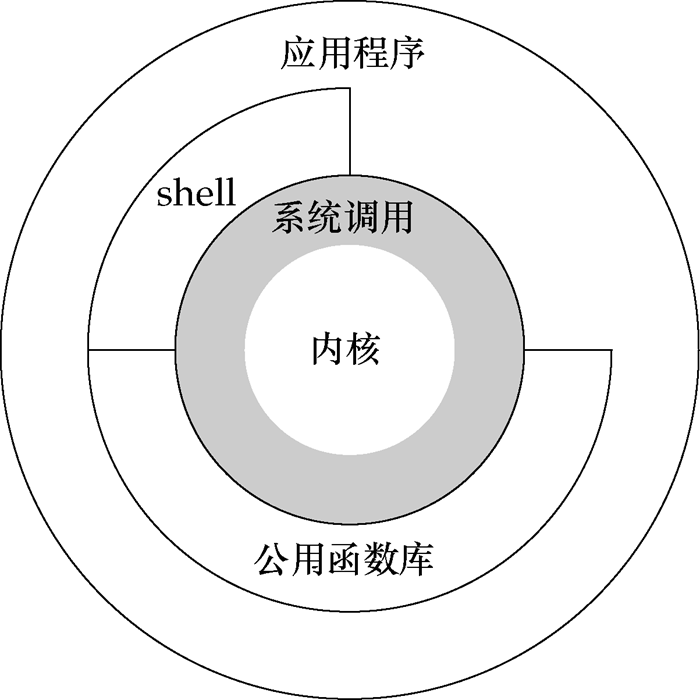
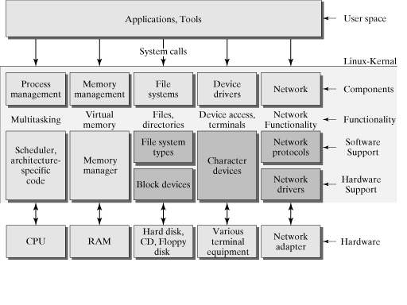
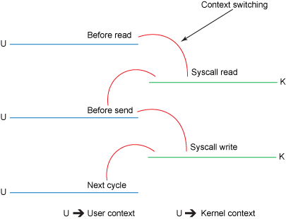
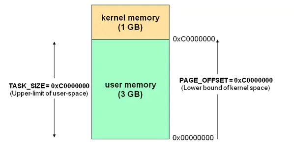
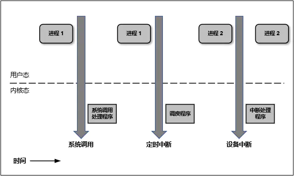
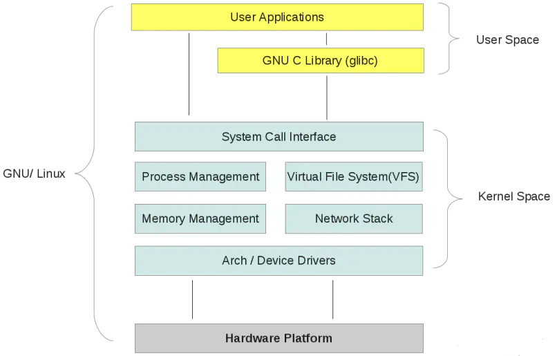

Linux的体系架构

如上图所示，从宏观上来看，Linux操作系统的体系架构分为用户态和内核态（或者用户空间和内核空间）。内核从本质上看是一种软件-----控制计算机的硬件资源，并提供上层应用程序运行的环境。

用户态即上层应用程序的活动空间，应用程序的执行必须依托于内核提供的资源，包括CPU资源、存储资源、I/O资源等。为了使上层应用能够访问到这些资源，内核必须为上层应用提供访问的接口:`系统调用`。

简单来说：
`内核态`：运行在内核空间的进程的状态
`用户态`：运行在用户空间的进程的状态

`系统调用`
系统调用是操作系统的最小功能单位，这些系统调用根据不同的应用场景可以进行扩展和裁剪，现在各种版本的Unix实现都提供了不同数量的系统调用，如Linux的不同版本提供了240-260个系统调用，FreeBSD大约提供了320个。
我们可以把系统调用看成是一种不能再化简的操作（类似于原子操作，但是不同概念），有人把它比作一个汉字的一个“笔画”，而一个“汉字”就代表一个上层应用，我觉得这个比喻非常贴切。一个汉字有很多笔画组成，因此有时候如果要实现一个完整的汉字就必须调用很多的系统调用。这有时是一件很崩溃的事情,比如说这个字，你可能认识，但是有几个人会写呢？

`系统库函数`：系统调用的封装
应用程序直接使用系统调用，这势必会加重程序员的负担，良好的程序设计方法是：重视上层的业务逻辑操作，而尽可能避免底层复杂的实现细节。那么有没有优化空间呢？库函数正是为了将程序员从复杂的细节中解脱出来而提出的一种有效方法。它实现对系统调用的封装，将简单的业务逻辑接口呈现给用户，方便用户调用，从这个角度上看，库函数就像是组成汉字的“偏旁”。这样的一种组成方式极大增强了程序设计的灵活性，
对于简单的操作，我们可以直接调用`系统调用`来访问资源，如“人”；对于复杂操作，我们借助于`库函数`来实现，如“仁”。库函数依据不同的标准也可以有不同的实现版本，如ISOC 标准库，POSIX标准库等。

`shell`：系统调用的封装
Shell是一个特殊的应用程序，俗称命令行，本质上是一个命令解释器，它下通系统调用，上通各种应用，通常充当着一种“胶水”的角色，来连接各个小功能程序，让不同程序能够以一个清晰的接口协同工作，从而增强各个程序的功能。同时，Shell是可编程的，它可以执行符合Shell语法的文本，这样的文本称为Shell脚本，通常短短的几行Shell脚本就可以实现一个非常大的功能，原因就是这些Shell语句通常都对系统调用做了一层封装。为了方便用户和系统交互，一般，一个Shell对应一个终端，终端是一个硬件设备，呈现给用户的是一个图形化窗口。我们可以通过这个窗口输入或者输出文本。这个文本直接传递给shell进行分析解释，然后执行。

总结一下，用户态的应用程序可以通过三种方式来访问内核态的资源：
1）系统调用
2）库函数
3）Shell脚本

下图是对上图的一个细分结构，从这个图上可以更进一步对内核所做的事有一个“全景式”的印象。主要表现为：向下控制硬件资源，向内管理操作系统资源：包括进程的调度和管理、内存的管理、文件系统的管理、设备驱动程序的管理以及网络资源的管理，向上则向应用程序提供系统调用的接口。
从整体上来看，整个操作系统分为两层：用户态和内核态，这种分层的架构极大地提高了资源管理的可扩展性和灵活性，而且方便用户对资源的调用和集中式的管理，带来一定的安全性。

***1\***|***1\*****用户态和内核态的切换**

因为操作系统的资源是有限的，如果访问资源的操作过多，必然会消耗过多的资源，而且如果不对这些操作加以区分，很可能造成资源访问的冲突。所以，为了减少有限资源的访问和使用冲突，Unix/Linux的设计哲学之一就是：对不同的操作赋予不同的执行等级，就是所谓特权的概念。简单说就是有多大能力做多大的事，与系统相关的一些特别关键的操作必须由最高特权的程序来完成。

Intel的X86架构的CPU提供了0到3四个特权级，数字越小，特权越高，Linux操作系统中主要采用了0和3两个特权级，分别对应的就是内核态和用户态。
运行于用户态的进程可以执行的操作和访问的资源都会受到极大的限制，而运行在内核态的进程则可以执行任何操作并且在资源的使用上没有限制。很多程序开始时运行于用户态，但在执行的过程中，一些操作需要在内核权限下才能执行，这就涉及到一个从用户态切换到内核态的过程。比如C函数库中的内存分配函数malloc()，它具体是使用sbrk()系统调用来分配内存，当malloc调用sbrk()的时候就涉及一次从用户态到内核态的切换，类似的函数还有printf()，调用的是wirte()系统调用来输出字符串，等等。

到底在什么情况下会发生从用户态到内核态的切换，一般存在以下三种情况：

1）当然就是系统调用：原因如上的分析。
2）异常事件： 当CPU正在执行运行在用户态的程序时，突然发生某些预先不可知的异常事件，这个时候就会触发从当前用户态执行的进程转向内核态执行相关的异常事件，典型的如缺页异常。
3）外围设备的中断：当外围设备完成用户的请求操作后，会像CPU发出中断信号，此时，CPU就会暂停执行下一条即将要执行的指令，转而去执行中断信号对应的处理程序，如果先前执行的指令是在用户态下，则自然就发生从用户态到内核态的转换。

注意：系统调用的本质其实也是中断，相对于外围设备的硬中断，这种中断称为软中断，这是操作系统为用户特别开放的一种中断，如Linux int 80h中断。所以，从触发方式和效果上来看，这三种切换方式是完全一样的，都相当于是执行了一个中断响应的过程。但是从触发的对象来看，系统调用是进程主动请求切换的，而异常和硬中断则是被动的。

***1\***|***2\*****三、总结**

本文仅是从宏观的角度去理解Linux用户态和内核态的设计，并没有去深究它们的具体实现方式。从实现上来看，必须要考虑到的一点我想就是性能问题，因为用户态和内核态之间的切换也会消耗大量资源。关于实现的细节，目前学艺不精不敢乱说，等日后补上。但知道了这一点，我相信对很多问题也就很容易理解了，比如说基于缓冲区的IO和无缓冲的IO，用户进程和内核进程之间的切换，IO复用中的读写内核事件表，等等，这些知识之后会一一补上。

------

***2\***|***0\*****内核空间和用户空间**

对 32 位操作系统而言，它的寻址空间（虚拟地址空间，或叫线性地址空间）为 4G（2的32次方）。也就是说一个进程的最大地址空间为 4G。操作系统的核心是内核(kernel)，它独立于普通的应用程序，可以访问受保护的内存空间，也有访问底层硬件设备的所有权限。为了保证内核的安全，现在的操作系统一般都强制用户进程不能直接操作内核。具体的实现方式基本都是由操作系统将虚拟地址空间划分为两部分，一部分为内核空间，另一部分为用户空间。

针对 Linux 操作系统而言，最高的 1G 字节(从虚拟地址 0xC0000000 到 0xFFFFFFFF)由内核使用，称为`内核空间`。而较低的 3G 字节(从虚拟地址 0x00000000 到 0xBFFFFFFF)由各个进程使用，称为`用户空间`。

对上面这段内容我们可以这样理解：
每个进程的`4G`地址空间中，最高`1G`都是一样的，即内核空间。只有剩余的`3G`才归进程自己使用。
换句话说就是， 最高 1G 的内核空间是被所有进程共享的！
下图描述了每个进程 4G 地址空间的分配情况(此图来自互联网)：

***2\***|***1\*****为什么需要区分内核空间与用户空间**

在 CPU 的所有指令中，有些指令是非常危险的，如果错用，将导致系统崩溃，比如清内存、设置时钟等。如果允许所有的程序都可以使用这些指令，那么系统崩溃的概率将大大增加。
所以，CPU 将指令分为特权指令和非特权指令，对于那些危险的指令，只允许操作系统及其相关模块使用，普通应用程序只能使用那些不会造成灾难的指令。比如 Intel 的 CPU 将特权等级分为 4 个级别：Ring0~Ring3。
其实 Linux 系统只使用了 Ring0 和 Ring3 两个运行级别(Windows 系统也是一样的)。当进程运行在 Ring3 级别时被称为运行在用户态，而运行在 Ring0 级别时被称为运行在内核态。

***2\***|***2\*****内核态与用户态**

好了我们现在需要再解释一下什么是内核态、用户态：
`当进程运行在内核空间时就处于内核态，而进程运行在用户空间时则处于用户态。`
在内核态下，进程运行在内核地址空间中，此时 CPU 可以执行任何指令。运行的代码也不受任何的限制，可以自由地访问任何有效地址，也可以直接进行端口的访问。
在用户态下，进程运行在用户地址空间中，被执行的代码要受到 CPU 的诸多检查，它们只能访问映射其地址空间的页表项中规定的在用户态下可访问页面的虚拟地址，且只能对任务状态段(TSS)中 I/O 许可位图(I/O Permission Bitmap)中规定的可访问端口进行直接访问。

对于以前的 DOS 操作系统来说，是没有内核空间、用户空间以及内核态、用户态这些概念的。可以认为所有的代码都是运行在内核态的，因而用户编写的应用程序代码可以很容易的让操作系统崩溃掉。
对于 Linux 来说，通过区分内核空间和用户空间的设计，隔离了操作系统代码(操作系统的代码要比应用程序的代码健壮很多)与应用程序代码。即便是单个应用程序出现错误也不会影响到操作系统的稳定性，这样其它的程序还可以正常的运行(Linux 可是个多任务系统啊！)。

所以，区分内核空间和用户空间本质上是要提高操作系统的稳定性及可用性。

***2\***|***3\*****如何从用户空间进入内核空间**

其实所有的系统资源管理都是在内核空间中完成的。比如读写磁盘文件，分配回收内存，从网络接口读写数据等等。我们的应用程序是无法直接进行这样的操作的。但是我们可以通过内核提供的接口来完成这样的任务。
比如应用程序要读取磁盘上的一个文件，它可以向内核发起一个 "系统调用" 告诉内核："我要读取磁盘上的某某文件"。其实就是通过一个特殊的指令让进程从用户态进入到内核态(到了内核空间)，在内核空间中，CPU 可以执行任何的指令，当然也包括从磁盘上读取数据。具体过程是`先把数据读取到内核空间中，然后再把数据拷贝到用户空间并从内核态切换到用户态`。此时应用程序已经从系统调用中返回并且拿到了想要的数据，可以开开心心的往下执行了。
简单说就是应用程序把高科技的事情(从磁盘读取文件)外包给了系统内核，系统内核做这些事情既专业又高效。

对于一个进程来讲，从用户空间进入内核空间并最终返回到用户空间，这个过程是十分复杂的。举个例子，比如我们经常接触的概念 "堆栈"，其实进程在内核态和用户态各有一个堆栈。运行在用户空间时进程使用的是用户空间中的堆栈，而运行在内核空间时，进程使用的是内核空间中的堆栈。所以说，Linux 中每个进程有两个栈，分别用于用户态和内核态。

下图简明的描述了用户态与内核态之间的转换：

既然用户态的进程必须切换成内核态才能使用系统的资源，那么我们接下来就看看进程一共有多少种方式可以从用户态进入到内核态。概括的说，有三种方式：系统调用、软中断和硬件中断。这三种方式每一种都涉及到大量的操作系统知识，所以这里不做展开。

***2\***|***4\*****整体结构**

接下来我们从内核空间和用户空间的角度看一看整个 Linux 系统的结构。它大体可以分为三个部分，从下往上依次为：硬件 -> 内核空间 -> 用户空间。如下图所示(此图来自互联网)：

在硬件之上，内核空间中的代码控制了硬件资源的使用权，用户空间中的代码只有通过内核暴露的系统调用接口(System Call Interface)才能使用到系统中的硬件资源。其实，不光是 Linux，Windows 操作系统的设计也是大同小异。

总结
现代的操作系统大都通过内核空间和用户空间的设计来保护操作系统自身的安全性和稳定性。所以在我们阅读有关操作系统的资料时经常遇到内核空间、用户空间和内核态、用户态等概念，希望本文能够帮助您理解这些基本的概念。

------

**转载文章，转载至：**
https://www.cnblogs.com/bakari/p/5520860.html
https://www.jianshu.com/p/a77613045601