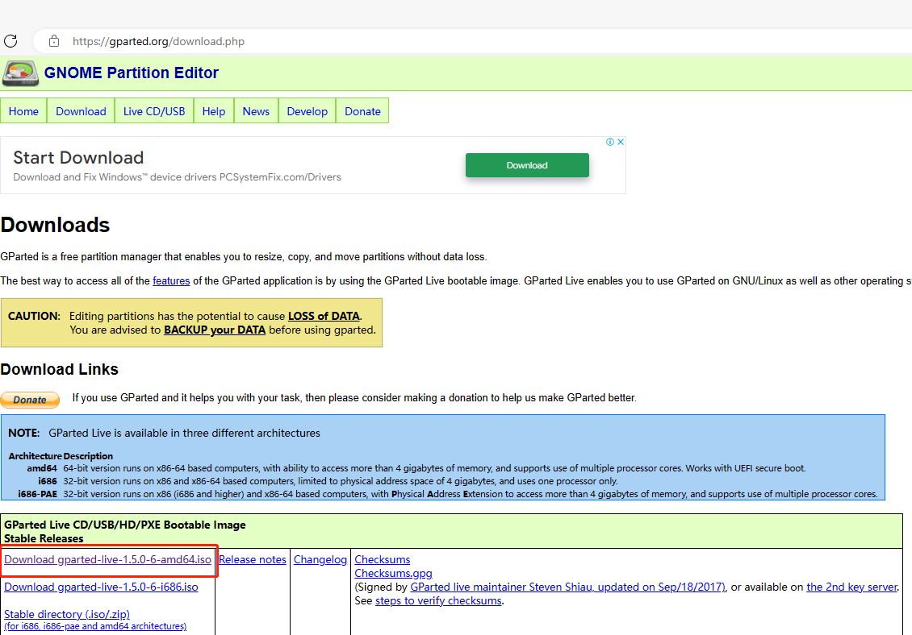
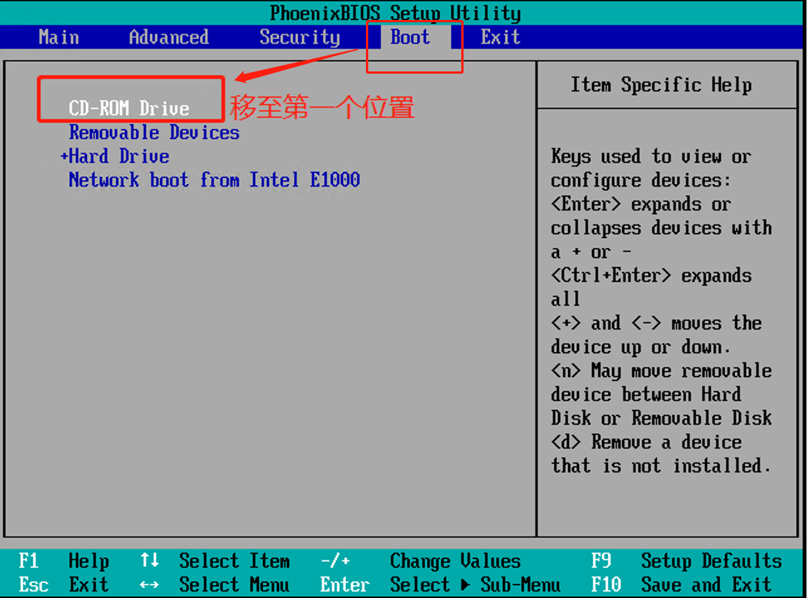

# [Ubuntu分区大小调整](https://www.cnblogs.com/learningendless/p/17718003.html)

如何调整Ubuntu各个目录的分区大小呢？如下图，/ 根目录分配了217G太大了，而家目录/home则分配了265G又觉得不够，如何将/根目录分多点空间给到/home目录？

 

 

网上搜到的大部分是说命令行下输入gparted，回车后运行gparted软件，然后进行分区调整。这里我试了一下，发现显示的分区都带小锁头，无法对其卸载，部分分区（如/根目录）也无法调整大小：

 

 

其实使用gparted的想法是对的，只不过用错了方法。这里需要将gparted当作启动盘去启动，然后才能获得权限来调整ubuntu的分区大小。接下来介绍具体方法：

 

 

1、首先，下载gparted的iso镜像，到时候要当做启动盘来用。我用的是 gparted-live-1.5.0-6-amd64.iso, 下载地址：https://gparted.org/download.php

 

 

2、新建一个CD/DVD硬件，浏览的时候选择刚刚下载的gpart的iso镜像：

一开始连接的cddvd 选择启动时不连接

3、虚拟机开机，开机的同时迅速按下F2键进入bios，如下图所示。如果没有进入下图的BIOS，那就是自己在开机的瞬间按F2不够快，只需关机后重新启动虚拟机再快速按F2即可：

 

 

4、使用键盘“”←“，”→” 键切换到"Boot"菜单栏，使用“↑”，“↓” 键选中"CD-ROM Drive”选项卡，然后再使用“+”，“-” 键进行选项卡的移动，将其移动到第一位置，这样开机的时候就会按顺序先从CD-ROM这个硬件启动，也就是选择从gparted iso镜像启动。

 

5、使用键盘“”←“，”→” 键切换到"Exit"菜单栏，选择“Exit Saving Changes”选择卡进行保存，退出，继续后续的流程。

 

 

6、成功从gparted镜像启动，如下图：

 

 

7、选择第一项进行常规配置默认项启动，回车：

 

 

8、选择"Don't touch keymap", 回车：

 

 

9、选择语言33，回车：

 

 

10、选择模式，这里我用的是0，回车即可：

 

 

11、成功进入到桌面系统，如下图：

 

 

12、把/dev/sda1调小（即根目录/），然后/dev/sda2（挂载在/boot目录）往前挪，大小不要调整它， 同理swap分区也往前挪，大小不改它，最后就会挪出来一大片空间，把它全部分配给/dev/sda4，即/home家目录，如下图：

 

 补充一点，这里分区的调整跟相邻分区有关，也就是必须要保证空间的连续性。这话什么意思呢，就是说A和B分区在一起，想要调大B分区，必须先把相邻的A分区调小，然后把B分区的free space preceding调为0，这样B分区就紧挨着过去。如下：

 

 

13、上述调整分区大小完毕后，还没生效，必须点这个绿色✓进行apply生效：

 

 

14、虚拟机关机。

 

 

15、移除这个gparted的CD/DVD硬件选项卡，这样下次虚拟机开机时只能从ubuntu启动。

 

 

16、虚拟机重新开机，如果开机后碰到ubuntu进入recovery 模式，选择正常启动即可。

 

 

17、使用df -h命令再次查看各目录分配内存空间大小，很明显确实完成了我们的目标：

 