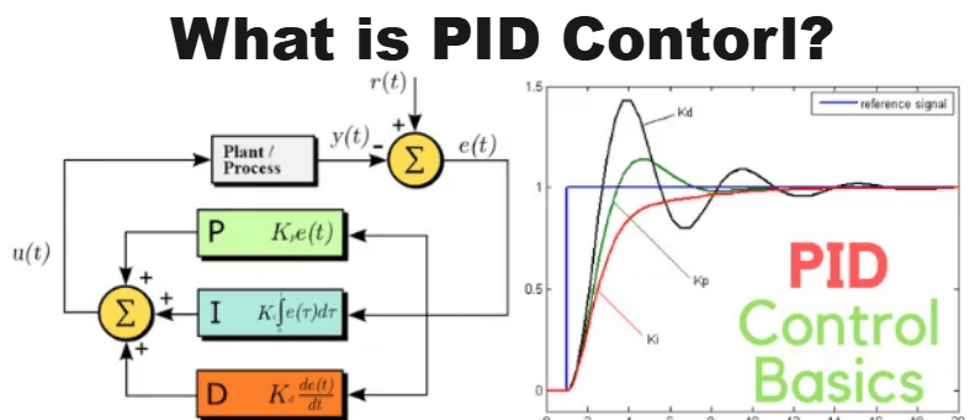

# [深入浅出PID算法](https://segmentfault.com/a/1190000041819928)

[](https://segmentfault.com/u/stone0090)

[**劼哥stone**](https://segmentfault.com/u/stone0090)[**1.5k**1213](https://segmentfault.com/u/stone0090)

[发布于2022-05-10](https://segmentfault.com/a/1190000041819928/revision)

[English](https://segmentfault.com/a/1190000041819928/en)

 


### 前言

博主是工业互联网行码农一枚，虽然不是算法工程师和自动化方向的，但经常参加同事介绍控制算法原理的培训，慢慢的对小部分控制算法有一定了解，其中使用频率最高的控制算法非PID莫属。很多同学在学习PID的时候，会被繁杂的数学公式吓倒，今天我们就抛开数学公式，用逻辑和例子给大家讲明白“到底什么是PID”？

### PID算法简介

PID是一种控制算法，是 Proportional（比例）、Integral（积分）、Differential（微分）的缩写。它是连续系统中技术最为成熟、应用最为广泛的一种控制算法。

PID控制器主要适用于基本上线性，且动态特性不随时间变化的系统。简单来说就是：类似于需要将某一个物理量“保持稳定”的场合，PID基本都能派上用场。

工业中PID典型的应用场景有：温度控制、流量控制、液位控制等。


生活中PID的应用也很常见：自来水的压力控制、空调的温度控制、平衡车的平衡控制、汽车的定速巡航控制、无人机的悬停控制、火箭飞机的姿态调整等。


实际运行经验和理论分析都表明，运用PID控制算法对许多工业过程进行控制都能得到比较满意的效果。

### PID的概念及公式

PID的基本思路是根据偏差量的大小，运用比例、积分、微分计算出一个控制量，将这个控制量输入被控制的系统，系统接收到该输入量后会输出一个相应的输出量，PID控制器再检测该输出量，并再计算偏差，然后再循环以上过程。

原始公式如下：
$u(t)=K_p \Bigg( e(t)+\frac{1}{T_i}\int^t_0e(t)dt+T_d\frac{de(t)}{dt}\Bigg)$

- $K_p$ —— 控制器的比例系数；
- $T_i$ —— 积分时间常数；
- $T_d$ —— 微分时间常数；
- $u(t)$ —— PID控制器的输出信号；
- $e(t)$ —— 给定值$r(t)$与测量值之差。

公式可简化为：
$u(t)=K_p * e(t) + K_i * \sum_{n=0}^t e(t) + K_d * (e(t) - e(t-1))$

- $K_p$ —— 控制器的比例系数；
- $K_i$ —— 控制器的积分系数；
- $K_d$ —— 控制器的微分系数；
- $u(t)$ —— PID控制器的输出信号；
- $e(t)$ —— 给定值$r(t)$与测量值之差。
- $e(t-1)$ —— 上一次给定值$r(t)$与测量值之差。

很多同学可能会被上面数学公式整懵了，没关系，我们先看完下面例子，再回头看来公式，相信你能对以上公式有新的认识。

在学习PID之前，我们需要先了解什么是 **开环控制** 和 **闭环控制**，这2个概念能够帮助我们更好的理解PID。

### 开放回路控制系统

开环控制（Open Loop Control System）：不将控制的结果反馈回来影响当前控制的系统。例如：

- 开关——按下开关后的一瞬间，控制活动已经结束，灯是否亮起已对按开关的这个活动没有影响；
- 投篮——篮球出手后就无法再继续对其控制，无论球进与否，球出手的一瞬间控制活动即结束。

### 闭环回路控制系统

闭环控制（Closed Loop Control System）：需要将控制的结果反馈回来与希望值比较，并根据它们的误差调整控制作用的系统。例如：

- 调节水龙头——首先在头脑中对水流有一个期望的流量，水龙头打开后由眼睛观察现有的流量大小与期望值进行比较，并不断的用手进行调节形成一个反馈闭环控制；
- 骑自行车——同理，需要不断的修正行进的方向与速度形成闭环控制。

闭环控制系统通常会由以下6个环节组成。

我们拿“维持水缸水位高度在1米”为例，来详解闭环控制中的每个环节：

- `传感器`：人工测量当前水位高度
- `目标量`：维持水缸水位高度在1米
- `偏差量`：`目标量` - 当前水位高度
- `控制器`：根据`偏差量`计算出`执行量`
- `执行量`：传给`执行器`的入参
- `执行器`：人工用水桶向水缸中加水

其中`传感器`、`目标量`、`偏差量`、`执行量`、`执行器` 这5个环节都比较简单，一眼就能看明白意思。最关键的环节`控制器`相对复杂一些，在`控制器`环节选择不同的控制算法，根据`偏差量`计算出`执行量`也不同，今天我们就具体看看PID的控制效果。

### PID之`比例P`

前面有说到PID的基本思路是根据`偏差量`的大小，运用`比例P`、`积分I`、`微分D`计算出一个控制量。但PID的3个参数，并不是非要一起使用，可以单用`比例P`来控制，也可以两两联合用`比例P`+`积分I`或`比例P`+`微分D`来控制。

我们先看看仅用`比例P`能带来什么样的控制效果？继续上面的“水缸”例子：

- `传感器`：人工测量水缸初始水位高度是0.2米
- `目标量`：维持水缸水位高度在1米
- `偏差量`：1米 - 0.2米 = 0.8米
- `控制器`：使用PID算法的比例控制，根据`偏差量`计算出`执行量`
- `执行量`：传给`执行器`的入参
- `执行器`：人工用水桶向水缸中加水

通常情况`偏差量`和`执行量`之间的单位不同，在当前例子里`偏差量`的单位是水缸，而`执行量`的单位是水桶，他们的容积不一样，所以我们需要一个系数，来放大或者缩小两者的关系。具体公式可抽象为：

> ```
> 执行量` = `比例P` = `偏差量` * `比例P系数
> ```

这个时候，假设水缸旁边站着一个人，用水桶往水缸里加水来控制水位的高度。如果单纯的用比例控制算法，假设`比例P系数`是0.5（相当于`两桶水的容量`等于`一缸水的容量`），我们开始模拟加水实验：

如上图结果所示，人工用水桶向水缸中加水8次，就能把水缸水位加到1米高度。把当前水位转换成曲线，大概效果如下。


上述例子比较简单，单靠`比例P`就能完成任务，但现实情况往往只有`比例P`是不够的，我们再来看一个更复杂的情况，假设`比例P系数`仍然是0.5，但在每次加水的间隔，水缸都会漏掉0.1米高度的水。我们再从头模拟加水实验，看看具体结果会怎样？

如上图结果所示，当水位达到0.8之后，水位就不会继续增加了。因为，当水位等于0.8时，`偏差量`是0.2，每次往水缸中加水的量为`执行量`= `比例P`= 0.2 * 0.5 = 0.1，而每次加水的间隔，水缸都会漏掉0.1米高度的水，所以加入的水和流出的水相抵消。

虽然，此时控制系统已达稳定状态，但`实际值`与`目标量`之间的会存在一个稳定差值，这个差值叫`稳态误差`。`稳态误差`非常常见，比如：控制空调温度会因为空气温差而降温、控制无人机固定高度会受重力影响往下掉、控制汽车定速巡航会有空气阻力和摩擦力的影响而减速，这些场景都会产生`稳态误差`。

单单只用`比例P`控制闭环回路，是无法避免`稳态误差`问题的，因为`比例P系数`无法根据时间或次数累加，当存在外界干扰因素时，`比例P系数`无法动态调整大小，那么`稳态误差`就会一直存在。

假如我们引入时间的维度，就能获得2个神器 `增幅器-积分I` 和 `抑制器-微分D`，他们分别解决`比例P`过小和过大的情况，`比例P`过小的话由`增幅器-积分I` 补充即可解决`稳态误差`问题，`比例P`过大由`抑制器-微分D`消减来防止过度震荡。

### PID之`积分I`（增幅器）

我们先来看看增幅器`积分I`，它也可以理解为累加经验，当`比例P`过小，可以由`积分I`补充，它的原理是利用过去的时间不断累加。具体公式可抽象为：

> ```
> 比例P` = `偏差量` * `比例P系数`
> `积分I` = `上一次积分I` + `偏差量` * `积分I系数`
> `执行量` = `比例P` + `积分I
> ```

想象一下，如果用只`比例P`控制存在`稳态误差`，说明`比例P`过小，这时`积分I`就会不断累加到一个很大的值，来补充`比例P`，从而影响`执行量`。

如果最终控制效果在`目标量`附近抖动，我们就能得到一个正负交替的`偏差量`，会在目标附近不断产生正负数累加到`积分I`，`积分I`就会不断趋近于零，最终使控制效果趋于稳定。

我们继续用上面“水缸加水”的例子，假设`目标量`是1，每次漏水0.1，`比例P系数`为0.5，`积分I系数`为0.2，我们再从头模拟加水实验，具体数值如下。

把当前水位转换成曲线，大概效果如下。

上一轮实验只用`比例P`控制存在`稳态误差`。本轮实验加入了`积分I`之后就有了累加效果，在未达到控制效果之前`积分I`会持续累加，在达到`目标量`之后`积分I`因为惯性会继续过量控制 ，同时`偏差量`会由正转负再转正，`积分I`也会由正转负再转正，最终`积分I`会持续抵消掉每次漏水0.1，控制效果趋于稳定 。

增幅器有他的危险性，如果系统出现意外或错误，增幅器可能会被累加到无限大，导致系统不可用，所以增幅器需要有一定的限制。

- 1、限制幅度，在任意时刻都给`积分I`设定最大值和最小值。
- 2、不运行时清零，当系统判断没有运行时，主动将`积分I`清零。

### PID之`微分D`（抑制器）

我继续再看看抑制器`微分D`，它也可以理解为预测未来，用当前的`偏差量`减`上一次偏差量`，得到的结果就可能是`下一次偏差量`，用`下一次偏差量`提前参与到计算中，就可以防止`执行量`过大，产生超出`目标量`的问题。具体公式可抽象为：

> ```
> 比例P` = `偏差量` * `比例P系数`
> `积分I` = `上一次积分I` + `偏差量` * `积分I系数`
> `微分D` = (`偏差量` - `上一次偏差量`) * `微分D系数`
> `执行量` = `比例P` + `积分I` + `微分D
> ```

换个“汽车刹车”的例子，平稳驾驶的车辆，当发现前面有红灯时，为了使得行车平稳，基本上提前几十米就松油门踩刹车。当车辆离停车线非常近的时候，则使劲踩刹车使车辆停下来，整个过程可以看做一个加入`微分D`的控制策略。

可以看到，在刹车过程中，因为`偏差量`是越来越小的，所以 `微分D`= (`偏差量`-`上一次偏差量`)*`微分D系数`一定是负数，在控制中加入一个负数项，他存在的作用就是为了防止汽车由于刹车不及时而闯过停车线。

从常识上理解，越靠近停车线，就越应该踩深刹车，不能让车过线，所以这个 `微分D`的作用，可以理解为刹车。当车离停车线很近，并且车速还很快时，这个 `微分D`的绝对值（实际上是一个负数）就会很大，表示应该大力踩刹车尽快让车停下来。

再回到上面“水缸加水”的例子，当发现水缸里的水快要接近`目标量`时，加入 `微分D`可以减少过量加水的幅度，说白了就是减少控制过程中的震荡。假设`目标量`是1，每次漏水0.1，`比例P系数`为0.5，`积分I系数`为0.2，`微分D系数`为0.2，我们再从头模拟加水实验，具体数值如下。

上一轮实验使用`比例P`和`积分I`联合控制，最高水位达到1.3，超过`目标量`之后，水位最低回落至0.83。本轮实验加入了抑制器`微分D`之后，最高水位仅达到1.23，超过`目标量`之后，水位最低回落至0.88，相比上一轮实验，本轮震荡幅度明显减小，这就是`微分D`的抑制作用。

分享一个动图，很好的展示了`比例P`、`积分I`、`微分D`的控制效果，其中红色虚线是`目标量`，曲线是用`当前值`的变化趋势。结合这个动图，大家再回想一下“水缸加水”的例子，控制效果是不是很相似呀~


### PID原理总结

我们用了“水缸加水”的例子，详细解释了PID的`比例P`、`积分I`、`微分D`三个参数的控制原理，相信小伙伴们已经明白什么是PID了。大家再回过头看这个公式，是不是也觉得挺亲切的。
$u(t)=K_p * e(t) + K_i * \sum_{n=0}^t e(t) + K_d * (e(t) - e(t-1))$

- $K_p$ —— 控制器的比例系数；
- $K_i$ —— 控制器的积分系数；
- $K_d$ —— 控制器的微分系数；
- $u(t)$ —— PID控制器的输出信号；
- $e(t)$ —— 给定值$r(t)$与测量值之差（偏差量）；
- $e(t-1)$ —— 上一次给定值$r(t)$与测量值之差。

最后再总结一下：

- `比例P`、`积分I`、`微分D`都跟`偏差量`有关
- `比例P`取决于当前的`偏差量`
- `积分I`累计过去所有`偏差量`之和
- `微分D`预测下一时刻`偏差量`

所以，经常有人说`比例P`是现在，`积分I`是过去，`微分D`是未来，是不是有一种哲学的感觉，哈哈~

### PID调参口诀

最后分享个PID调参口诀，写得挺好还挺押韵的~

> 参数整定找最佳，从小到大顺序查；
> 先是比例后积分，最后再把微分加；
> 曲线振荡很频繁，比例度盘要放大；
> 曲线漂浮绕大湾，比例度盘往小扳；
> 曲线偏离回复慢，积分时间往下降；
> 曲线波动周期长，积分时间再加长；
> 曲线振荡频率快，先把微分降下来；
> 动差大来波动慢。微分时间应加长；
> 理想曲线两个波，前高后低4比1；
> 一看二调多分析，调节质量不会低；
> 若要反应增快，增大P减小I;
> 若要反应减慢，减小P增大I；
> 如果比例太大，会引起系统振荡；
> 如果积分太大，会引起系统迟钝。

### 参考引用

- [百度百科-PID算法](https://link.segmentfault.com/?enc=CASDXLUR%2FstWntzNPmVkmw%3D%3D.OFIrwPqz%2FC75ilPb4m%2BPjDULmwcTgjg4y4X7Hrp5kI33rJJxMor5V11WK4JX%2BfLn7xXIpV674Se%2F71KlIYmdPeEfTQ6EEp%2Fb5msK02LyNNA%3D)
- [百度百科-开环控制](https://link.segmentfault.com/?enc=jMnMmO8fAwyDvvPPIYzhOQ%3D%3D.cAYmErdAKBZPVhP8YaC%2FhLLN4DtwE7sgmRaZ28%2BUEgjLUbEq6FiyoaxdIvHC4Wt2%2FFjqw%2BfZ9E9444CJVUD0DNIHgjXsN8viUN4S13KvxG2%2BrzUntfUHP2SGhXlC7pGT)
- PID控制入门原理：[https://zhuanlan.zhihu.com/p/197927959](https://link.segmentfault.com/?enc=A8z17fkt15LjqScc3Hfm9g%3D%3D.y4E3ADtzCetJzpwnG%2BuD335%2BjxET3RQq%2FSFo%2BpMdi40GPl%2BwowmrQ5AJLgZ0%2BAWZ)
- PID控制算法原理：[https://zhuanlan.zhihu.com/p/39573490](https://link.segmentfault.com/?enc=1bgI7WdT27NDZE89LjmTMw%3D%3D.CXKVpLkvA09WjbIpmDm4O%2B9muErjqRSckybXkcsIBI6GETUiM3BMkxlFz%2Bczu2Ci)
- PID控制原理及控制框图说明：[https://www.dgzj.com/zidonghua/96044.html](https://link.segmentfault.com/?enc=CNcfhioECcJPjHHUsGYIpQ%3D%3D.sRqW4yqmgysEH9ZO6Us01nluVyZwww1VBg2lvVe8OtPnSvog7gzIX4SlCoiRytx5)
- PID参数调整，个人经验：[https://blog.csdn.net/weixin_44407238/article/details/119255699](https://link.segmentfault.com/?enc=jtmcSNfJYZr3G6AJUAEQwg%3D%3D.3ClBx5o9ORsgrbfSrRZlL%2FXr6%2BNYcF6bjOdeCKe%2Fc1HPE73zOZiO8Dp3dYowpB3ZKqEYQiI67d%2Fn54Cs6nu%2FRw%3D%3D)
- 学会PID-基于板球平衡系统：[https://www.bilibili.com/video/BV1xL4y147ea](https://www.bilibili.com/video/BV1xL4y147ea?spm_id_from=333.999.0.0)

> 如有任何问题或建议，欢迎前往公众号【劼哥舍】留言~