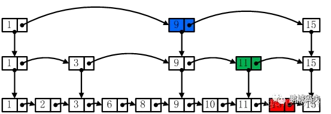

所谓skiplist，就是跳表法，是时间复杂度为logn的算法，以空间换时间

形如以下



最底下是最原始的链表，通过建立多层愈来愈疏的表，查表时，不断定位区间，最后确立到最底层链表，可以达到二分法一样的效果


在rtt中的链表：

```
rt_err_t rt_timer_start(rt_timer_t timer)
{
    unsigned int row_lvl;
    rt_list_t *timer_list;
    register rt_base_t level;
    rt_list_t *row_head[RT_TIMER_SKIP_LIST_LEVEL];
    unsigned int tst_nr;
    static unsigned int random_nr;

    /* timer check */
    RT_ASSERT(timer != RT_NULL);
    RT_ASSERT(rt_object_get_type(&timer->parent) == RT_Object_Class_Timer);

    /* stop timer firstly */
    level = rt_hw_interrupt_disable();
    /* remove timer from list */
    _rt_timer_remove(timer);
    /* change status of timer */
    timer->parent.flag &= ~RT_TIMER_FLAG_ACTIVATED;

    RT_OBJECT_HOOK_CALL(rt_object_take_hook, (&(timer->parent)));

    /*
     * get timeout tick,
     * the max timeout tick shall not great than RT_TICK_MAX/2
     */
    RT_ASSERT(timer->init_tick < RT_TICK_MAX / 2);
    timer->timeout_tick = rt_tick_get() + timer->init_tick;

#ifdef RT_USING_TIMER_SOFT
    if (timer->parent.flag & RT_TIMER_FLAG_SOFT_TIMER)
    {
        /* insert timer to soft timer list */
        timer_list = rt_soft_timer_list;
    }
    else
#endif
    {
        /* insert timer to system timer list */
        timer_list = rt_timer_list;
    }

    row_head[0]  = &timer_list[0];
    /*
    timer_list[0]是最疏的表，p指针记录next节点，用现在插入的timer与下个节点比较，当下个节点超时时间高于传入timer的超时时间时，就递归到更加密集的层表，递归到最开始的也是最密的表时，完成插入
    */ 
    for (row_lvl = 0; row_lvl < RT_TIMER_SKIP_LIST_LEVEL; row_lvl++)
    {
        for (; row_head[row_lvl] != timer_list[row_lvl].prev;
             row_head[row_lvl]  = row_head[row_lvl]->next)
        {
            struct rt_timer *t;
            rt_list_t *p = row_head[row_lvl]->next;

            /* fix up the entry pointer */
            t = rt_list_entry(p, struct rt_timer, row[row_lvl]);

            /* If we have two timers that timeout at the same time, it's
             * preferred that the timer inserted early get called early.
             * So insert the new timer to the end the the some-timeout timer
             * list.
             */
            if ((t->timeout_tick - timer->timeout_tick) == 0)
            {
                continue;
            }
            else if ((t->timeout_tick - timer->timeout_tick) < RT_TICK_MAX / 2)
            {
                break;
            }
        }
        这里的row_head[value]指向的是timer_list这个指针，row_head[value]+1指向的就是timer_list[value+1]，所以可以达到疏的表向密的表跳转
        if (row_lvl != RT_TIMER_SKIP_LIST_LEVEL - 1)
            row_head[row_lvl + 1] = row_head[row_lvl] + 1;
    }

    /* Interestingly, this super simple timer insert counter works very very
     * well on distributing the list height uniformly. By means of "very very
     * well", I mean it beats the randomness of timer->timeout_tick very easily
     * (actually, the timeout_tick is not random and easy to be attacked). */
     /*
     这里似乎是使用一个算法，随机的生成各层表节点，没研究透
     */
    random_nr++;
    tst_nr = random_nr;

    rt_list_insert_after(row_head[RT_TIMER_SKIP_LIST_LEVEL - 1],
                         &(timer->row[RT_TIMER_SKIP_LIST_LEVEL - 1]));
    for (row_lvl = 2; row_lvl <= RT_TIMER_SKIP_LIST_LEVEL; row_lvl++)
    {
        if (!(tst_nr & RT_TIMER_SKIP_LIST_MASK))
            rt_list_insert_after(row_head[RT_TIMER_SKIP_LIST_LEVEL - row_lvl],
                                 &(timer->row[RT_TIMER_SKIP_LIST_LEVEL - row_lvl]));
        else
            break;
        /* Shift over the bits we have tested. Works well with 1 bit and 2
         * bits. */
        tst_nr >>= (RT_TIMER_SKIP_LIST_MASK + 1) >> 1;
    }

    timer->parent.flag |= RT_TIMER_FLAG_ACTIVATED;

    /* enable interrupt */
    rt_hw_interrupt_enable(level);

#ifdef RT_USING_TIMER_SOFT
    if (timer->parent.flag & RT_TIMER_FLAG_SOFT_TIMER)
    {
        /* check whether timer thread is ready */
        if ((soft_timer_status == RT_SOFT_TIMER_IDLE) &&
           ((timer_thread.stat & RT_THREAD_STAT_MASK) == RT_THREAD_SUSPEND))
        {
            /* resume timer thread to check soft timer */
            rt_thread_resume(&timer_thread);
            rt_schedule();
        }
    }
#endif

    return RT_EOK;
}

```

