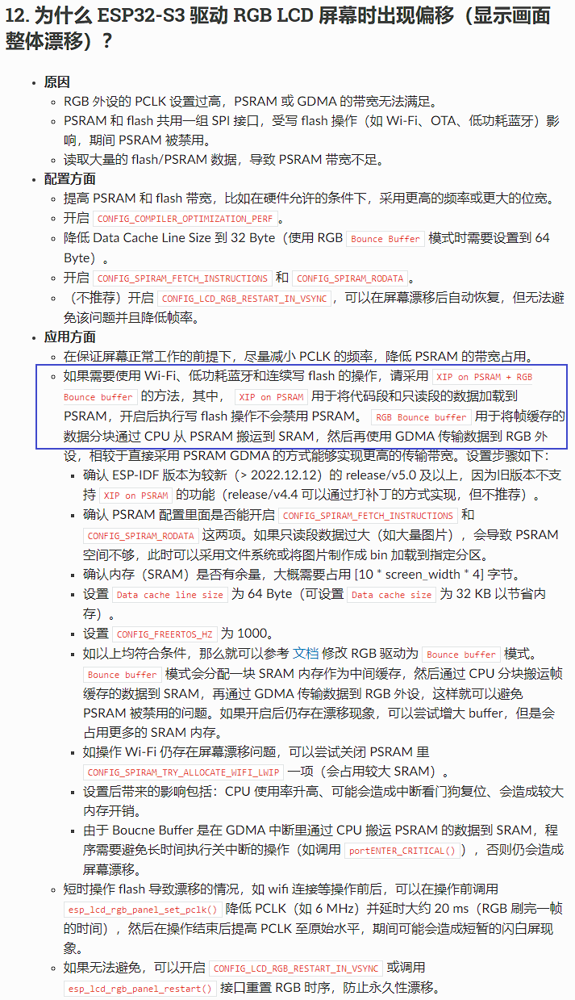

### esp32s3驱动rgb屏

首次上电时的整屏显示内容漂移bug，后续上电都不会出现

查官方文档：

https://docs.espressif.com/projects/esp-faq/zh_CN/latest/software-framework/peripherals/lcd.html

但是因为dachi 245项目上ui占用flash太大，只读数据段无法加载到ram里，所以这里禁用掉了，所以，当操作flash时（期间禁用spram），可能会影响到屏显，这里定位到蓝牙后，**等蓝牙初始化完毕后再初始化rgb接口就解决了这个问题**